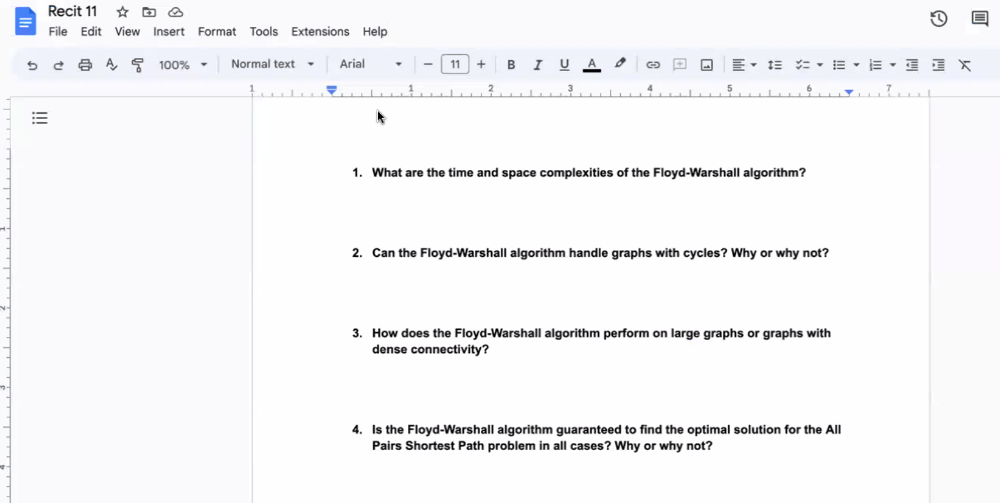
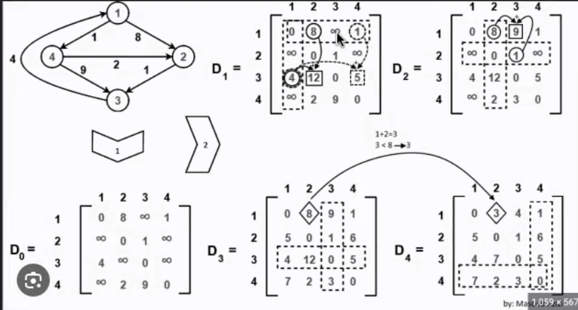
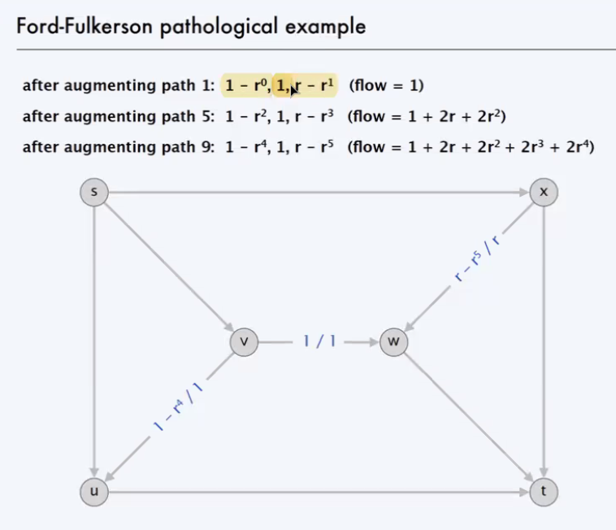
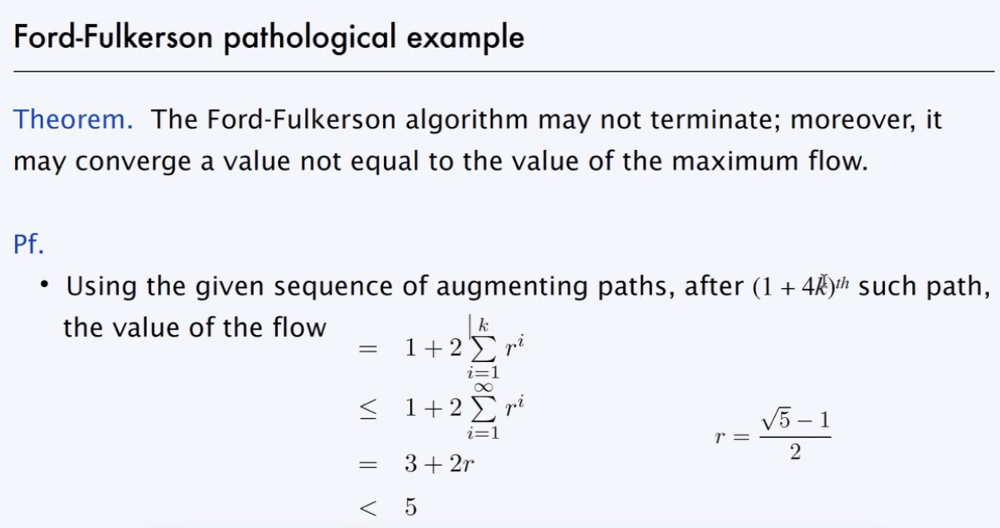
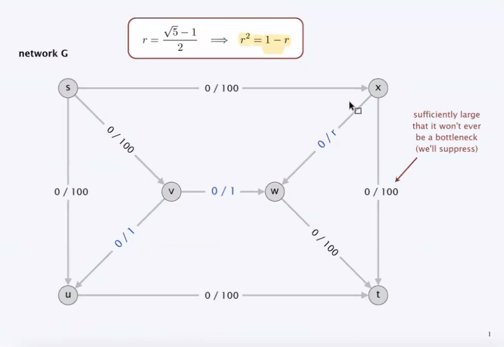
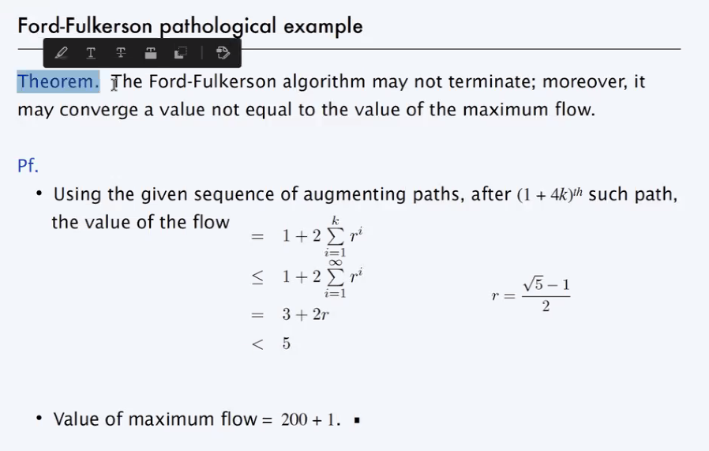
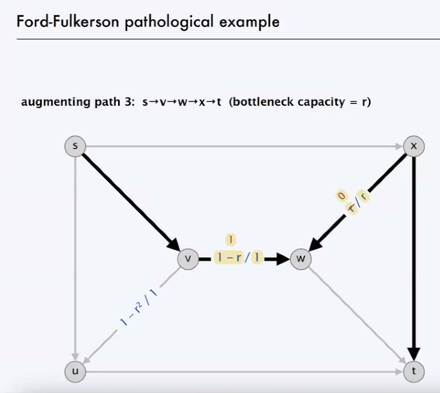

> 
> 1. Time and space complexity for Floyd-Warshall algorithm?
> 
> Finding the shortest path but among all the pairs in a graph. Works in a dynamic programming manner. Looking at every pair of the edges and vertices, such that you find the shortest path among all pairs.
>
> Time complexity was Ο(V³) = Ο(V²) * V 
>
> Space complexity was Ο(V²), we were creating a matrix for the algorithm, and look for all pairs:
> : 
>
> 2. Yes it can with positive cycles since we check every possible pair and path in order to find the shortest path, but it cannot handle the graphs with negative cycles because it might lead to infinite loops that keep getting smaller.
>
> If we somehow get to the algorithm to detect  negative cycles, we can make use of it in such cases.
>
> 3. Large graphs would mean that we will have lots of pairs to consider. Dense connectivity means that we will have lots of paths. This may lead to an increased complexity that would give hard time for our limitations. If we don't have any limitations or the graph is not extremely large, we can still use the algorithm.
>
> 4. Yes it can, when the graph doesn't have any negative cycles, since it looks at every possiblity of shortest paths between all pairs.
>
> 
>
> 
>
> 
>
> 
>
> 