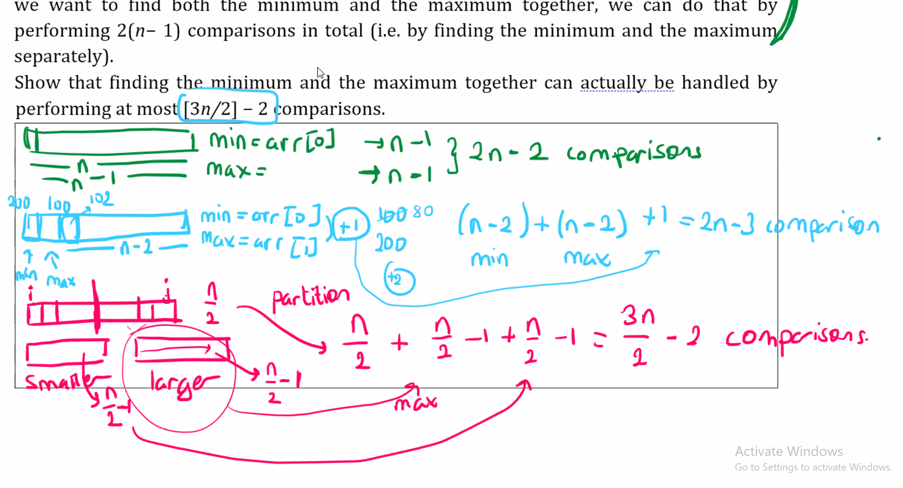

# Recit 4

## 1. Answer following questions.
## (a) Some clever(!) person suggests that he/she found an algorithm to find the minimumelement in an (unsorted) array in O(lg n) time. What would be your answer to this person?
> $$\large\text{Since it does not say that we'll have a balanced binary tree structured, we can assume we've an unsorted list. We have to go through every n element in the list, which would take Ω(n) time. Answer is best you can do without specifying a data structure, and we have to go through each element in the unsorted array, answer is Ω(n).}$$

## (b) Given an unsorted array, we can find the minimum by using a linear search which willneed n − 1 comparisons. Similarly, the maximum can be found in n − 1 comparisons.Therefore if we want to find both the minimum and the maximum together, we can dothat by performing 2(n − 1) comparisons in total (i.e. by finding the minimum and themaximum separately).Show that finding the minimum and the maximum together can actually be handled byperforming at most [3n/2] − 2 comparisons
> Instead of traversing the same array twice, lets traverse it once. First approach could be:
> : ⟶ Say `dmin=arr[0]` and `max=arr[1]`.
> : ⟶ Say arr[0]=200 and arr[1]=100.
> : So for finding min, and max, we'll make n-2 comparisons for each which will be 4n-4, and 1 additional comparison to compare min and max, resulting in 2n-3 comparison.
> : ⟶ 