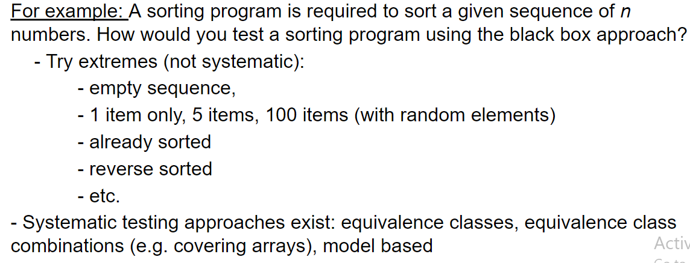
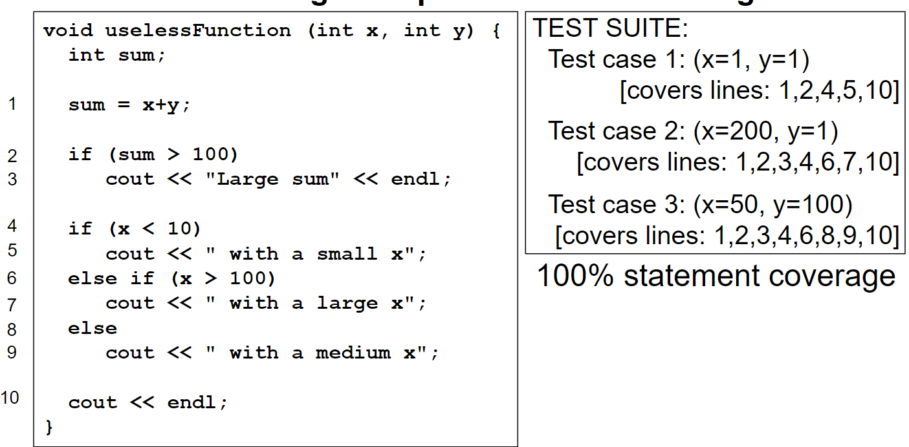
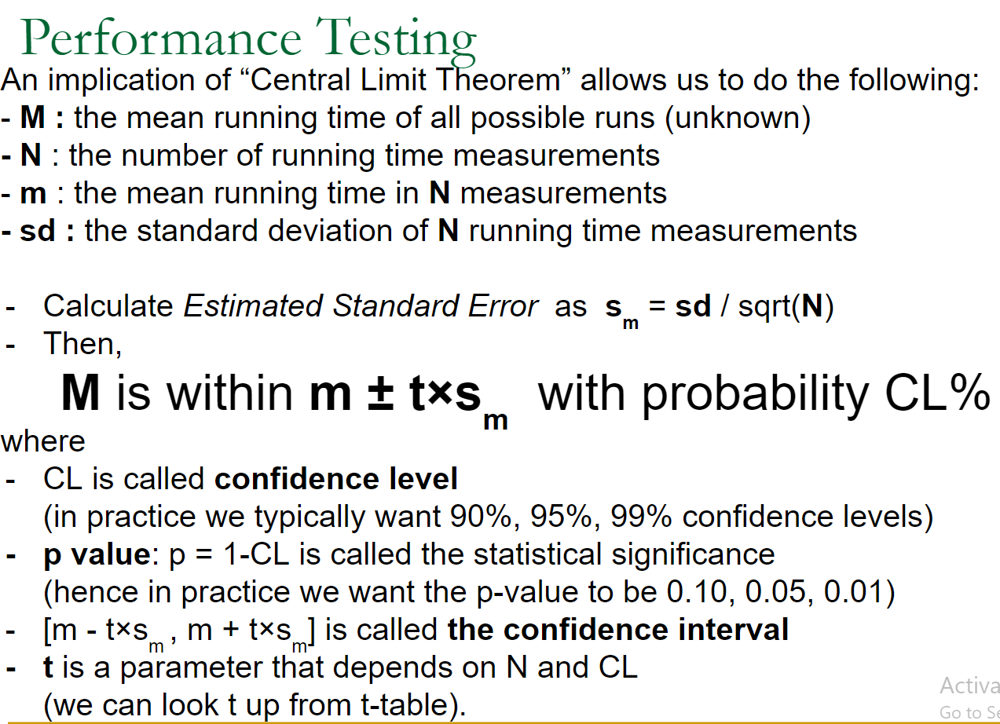

# Test Design

# Testing
## Functional Testing
> Testing a program for its correctness:
> : Does the program function correctly?
>
> **Exhaustive Testing**
> : Exhaustive testing is trying out all possible instances and inputs, and is not feasible in general. There are way too many combinations of input so its simply impractical, or impossible.

## Performance Testing
> Testing a program to find out the performance in practice. 
> : Note that having Ο(n²) worst case running time does not necessarily mean that the running time will grow quadratically in practice as well.

# Functional Testing: Black Box vs White Box
## Black Box Testing
> Black Box testing is testing without having a look at the internal structures or workings. 
> 1. We don't have any knowledge of internal workings. We only care about whether it's doing what it's supposed to do.
> 2. We don't care about the source code.
> 3. We don't care about any of the design documentation describing the system's internals.
>
> An example for **Black Box Testing**
> : 

## White Box Testing
> Testers have access to the system design.
>
> They can:
> - Examine the design documents
> - View the code
> - Observe at run time the steps taken by the algorithm and the internal data
>
> **Coverage Criteria**
> - Statement coverage (try test cases that will run every statement in the code)
> - Decision coverage (try test cases that will exercise every decision)
> - Path coverage (try test cases that will exercise every test path)
>
> **Example for White Box Testing: Statement Coverage**
> : 

## Performance Testing
> Measure the running time of the program
> - Try vairous/growing input sizes
>
> Collect the running time and fit a line, if running time is not linear, try **log-log plot**

## Central Limit Theorem
> Given a `sufficiently large` sample size from a population with a finite level of variance, the man of all samples from the same populaiton will be `approximately` equal to the mean of the population.
>
> - **`How many measurements are sufficiently large?`**
> 
> - **`How approximate the mean of samples will be to the actual mean?`**
>
> 
>
> 