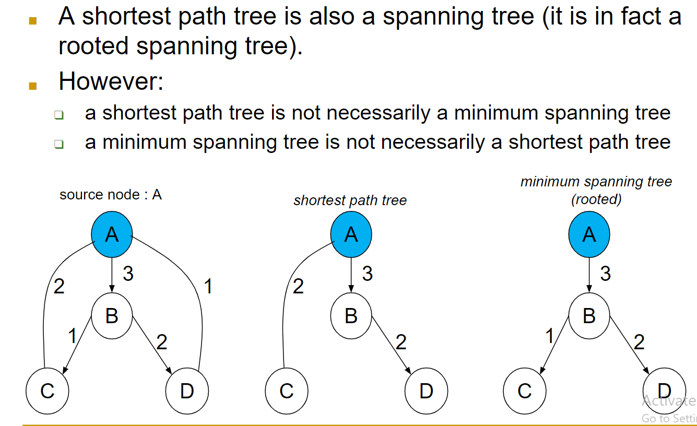
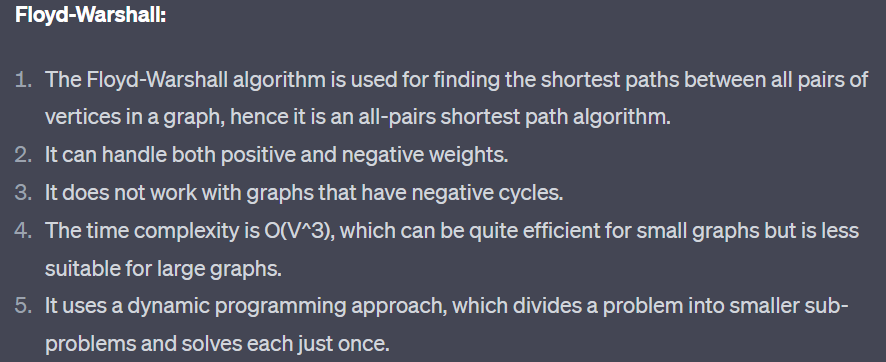
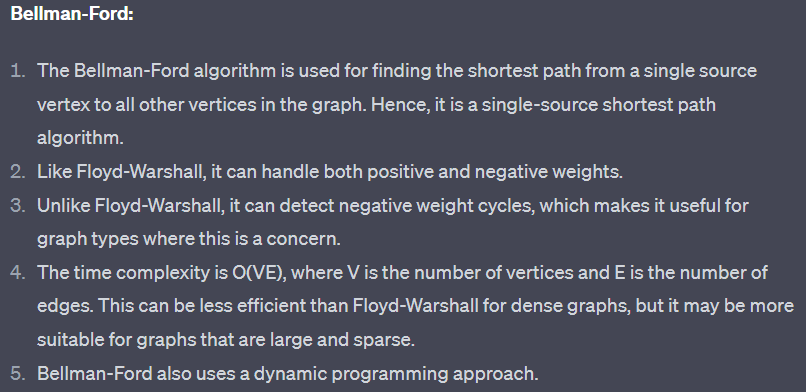
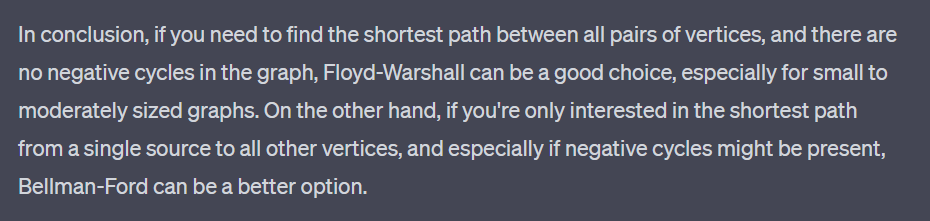

# Shortest Path Problems
> **`Simple path`** means a path that does not contain any cycles in it.

## Shortest Paht Trees vs Minimum Spanning Trees
> 

## Relaxation Over an Edge
> An edge is said to be relaxed if there is a shorter way than it that leads to the same destination.

## Bellman-Ford Algorithm
> It is used to find the shortest path between a source vertex and all other vertices in a weighted directed graph. 
>
> It's capable of handling negative edge weights, unlike Djakstra, Kruskal and Prim.
>
> **How does Bellman-Ford Algorithm Work?**
> : It works by iteratively relaxing the edges of the graph.
> 1. ___`Initialize the distances:`___ Set the distance of the source vertex to 0 and distances of all vertexes to the infinity.
> 2. ___`Relax the edges iteratively:`___ Repeat the relaxation process |V|-1 times, |V| is the number of Vertices in the graph. 
>       - In each iteration, go through all the edges in the graph and update the distance to each destination vertex if a shorter path is found. 
> 3. ___`Detect negative cycles:`___ After |V|-1 iterations, perform one additional iteration to check for negative cycles. If this iteration finds a shorter path for any vertex, it means that the graph contains a negative cycle.

## Comparison of Bellman-Ford and Dijkstra
> **Bellman-Ford**
> - Running time is O(VE)
> - Can be applied to general graphs
>
> **Dijkstra**
> - Running time is O(VlgV+E) by using Fibonacci Heaps
> - Can be only applied to non-negative graphs

## Shortest Path Problem on DAGs
> DAG means a Directed Acyclic Graph.

## How To Check If There Exists a Feasible Solution and How To Find a Feasible Solution
> We'll solve these questions by a graph algorithm.

## Floyd-Warshall Algorithm
> 

## Bellman-Ford vs Floyd-Warshall 
> 

## When To Use Which
> 