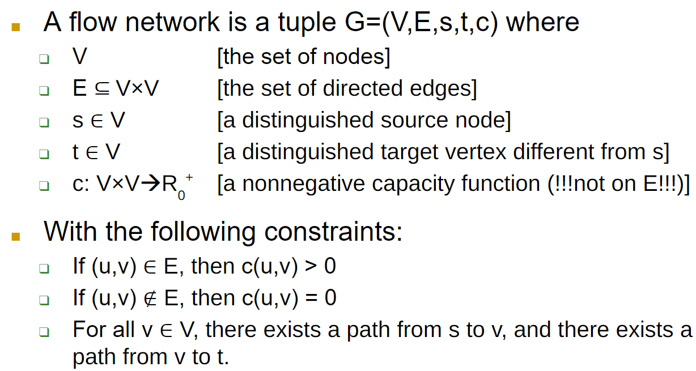
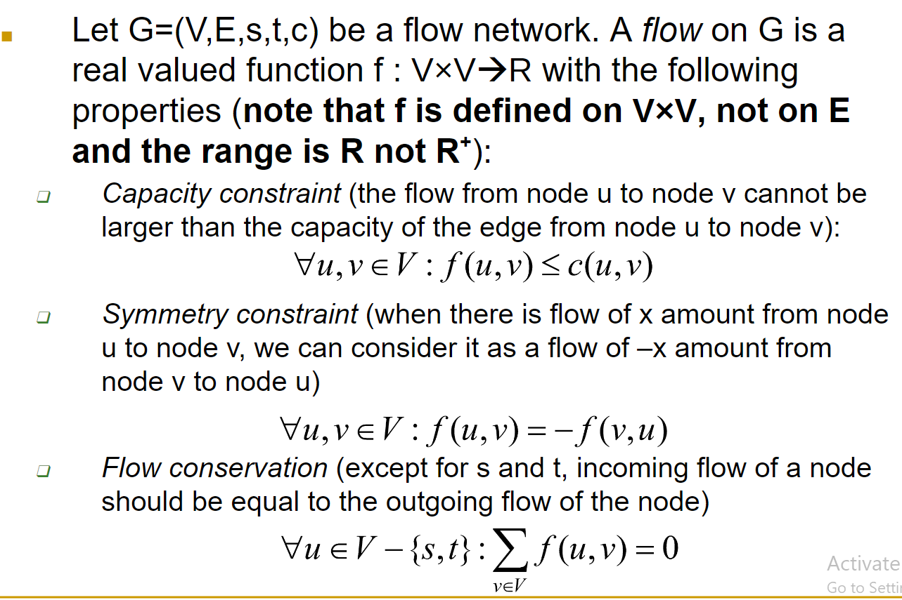
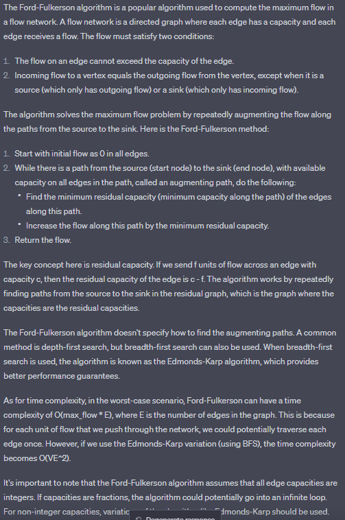
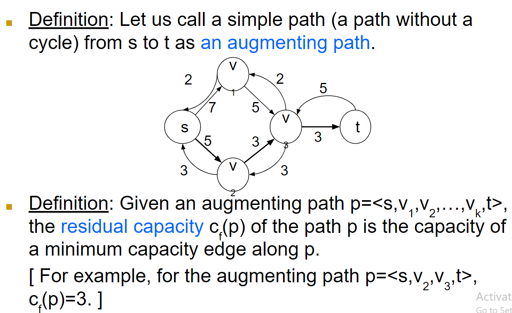
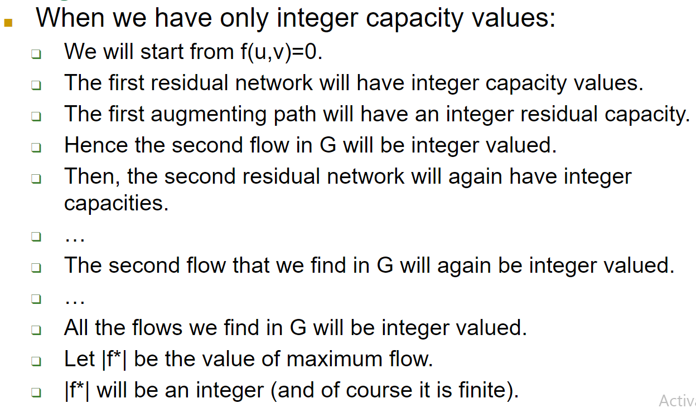

# Maximum Flow In Networks
> We've a source node `s` and a target node `t`
> : There's more than one network of pipeline to use to carry water from `s` to `t`, and the pipelines have varying capacities, where no water is lost during flow.

# Definition Of a Flow Network
> 
> : `s` can have incoming edges and `t` can have outgoing edges.
>
> **Capacity Constraint**
> : Pipes have limited capacity
>
> **Symmetry Constraint**
> : When flow is from u to v with amount x, we can say there's a -x flow from v to u.
>
> **Flow Conservation**
> : Incoming flow from a pipeline must be equal to the outgoing flow.
>
> Overall:
> : 

## Definition Of Maximum Flow Problem
> Find a flow such that the flow is maximized.
> - Maximum flow path may not be unique but the maximum flow amount is unique.

## An Easy Flow Assignment
> Note that f(u,v)=0 is a legitimate flow assignment.
>
> If f(u,v) is 0:
> 1. _Capacity Constraint_
> 2. _Symmetry Constraint_
> 3. _Flow Conservation Constraint_ 
> 
>  All these properties (1, 2, and 3) are satisfied.

## Ford-Fulkerson Method
> Start with the flow f(u,v)=0
>
> Iteratively improve the flow (push more and more) until we reach to the maximum flow.
>
> 

## Residual Capacity
> It is what's remaining in the pipeline network.

## Incramental Flows
> Start with f(u,v)=0
>
> Then for each flow f we find in G, form the residual network Gf.
>
> Then we are guaranteed that f+f' is a better flow in G.
>
> Repeat this iteration until we can no longer improve f in G.
>
> We need to find out how to easily form a flow in Gf.

## Augmenting Path and Residual Capacity Of a Path
> 

## Analysis of Ford-Fulkerson
> We know that the value of the flow will increase by each iteration.

## Analysis of Ford-Fulkerson With Integer Capacity Rates
> 

...

## Maximum Bipartite Matching
> Bipartite matching is dividing a graph's vertices into two disjoint sets such that no to vertices with the same set share an edge.
>
> To solve the **`Maximum Bipartite Matching Problem:`**
> 1. Create a flow network, add a source node and connect it to all nodes in the first partition of the bipartite graph. Then, connect the nodes into the second partition of the bipartite graph to the sink node. Assign a capacity of 1 to every edge.
> 2. Find the maximum flow using Ford-Fulkerson algorithm. THe maximum flow is equal to the maximum bipartite matching.
>
> Time complexity is Ο(E * max_flow).

> Bottleneck capacity is the smallest capacity of an edge in a path.