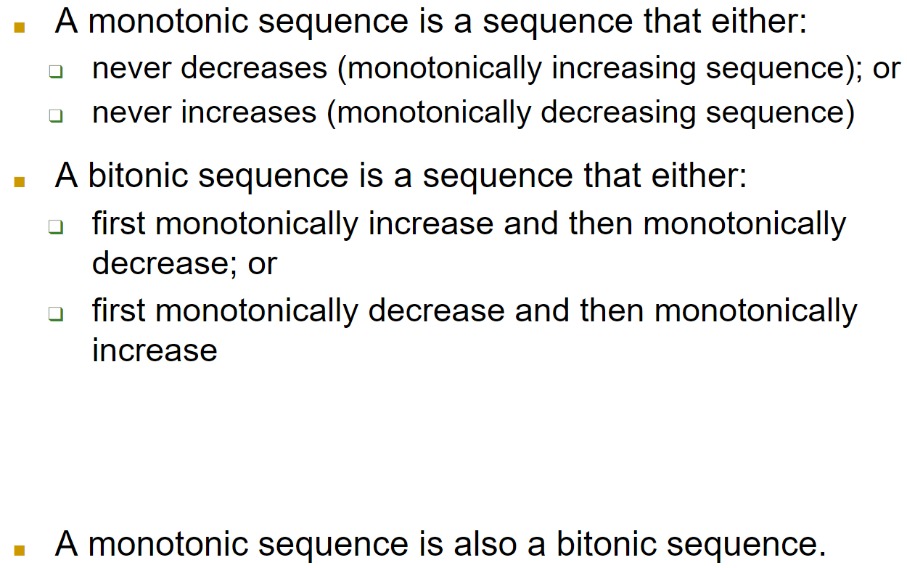
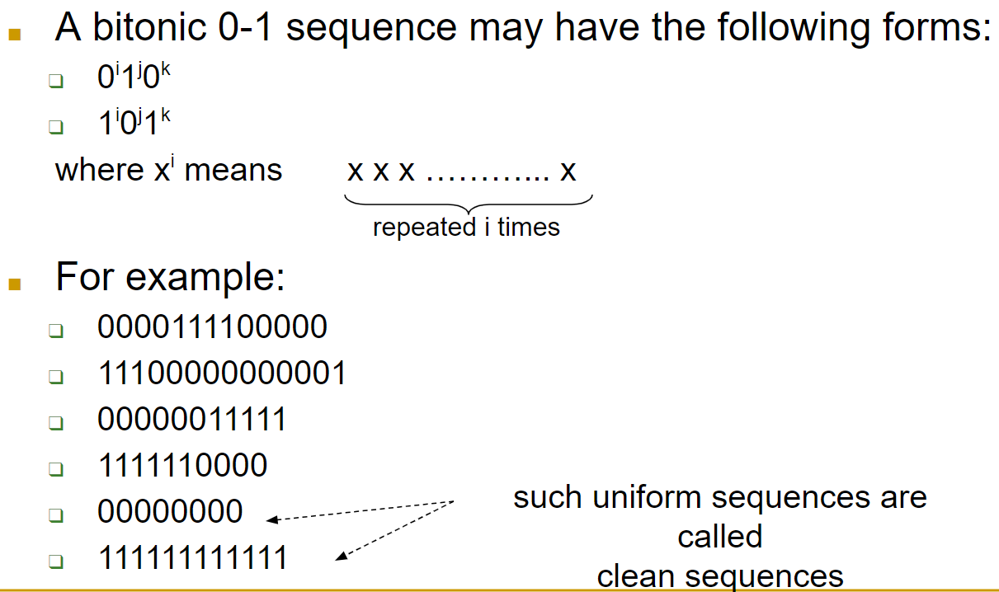
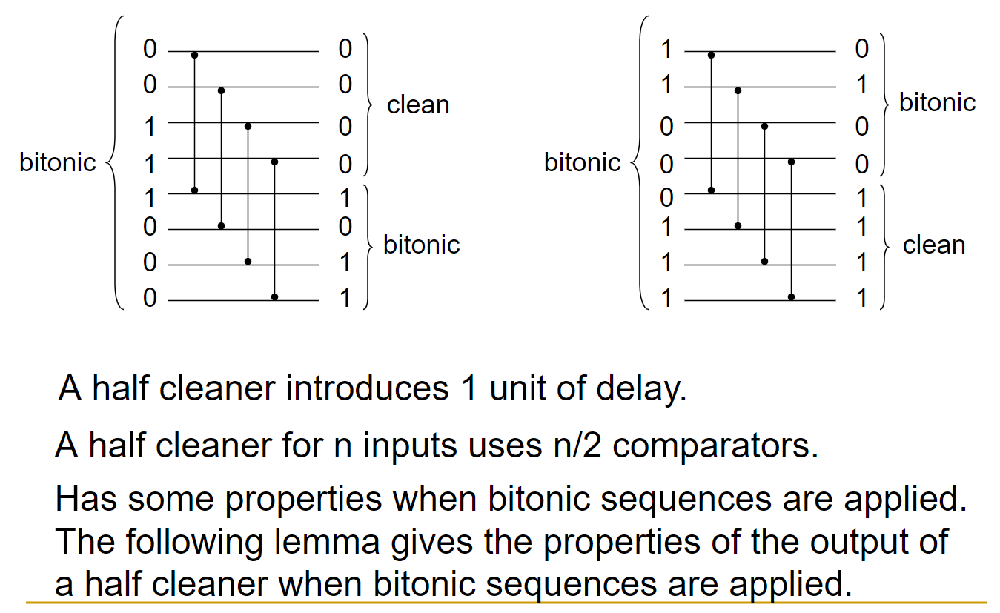
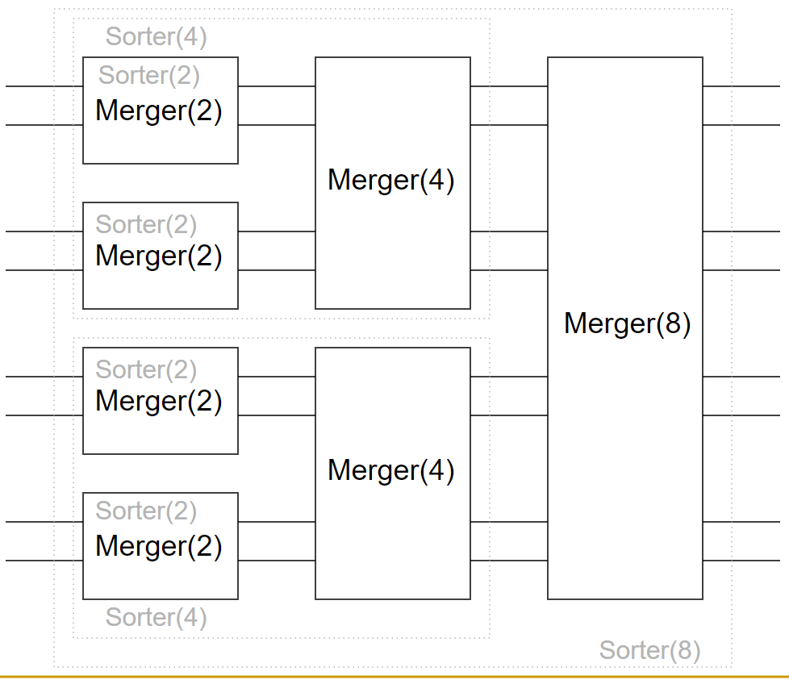
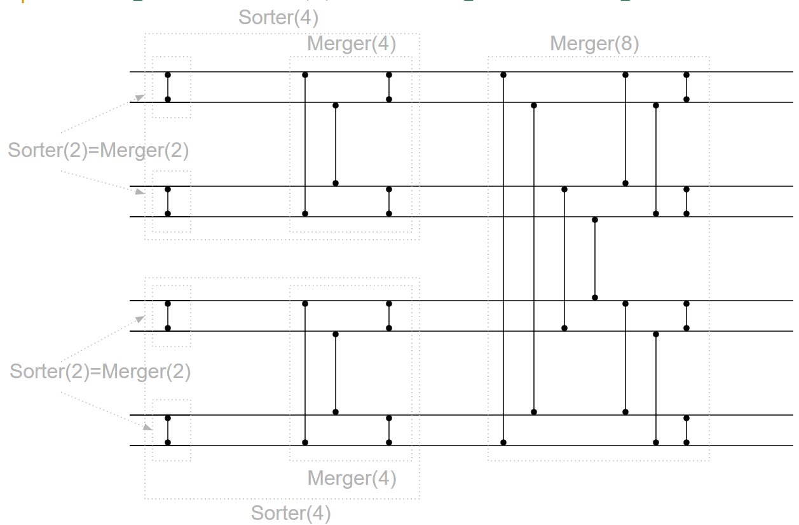

## Sorting Problem
> Θ(nlogn) lower bound is a comparison based sorting problem that is obtained by RAM. 
> : We can implement the sorting algorithms using hardware.

## Comparators
> Sorting networks are based on comparison networks, and comparison networks are based on comparators.
>
> **`Comparator is a function that gives max and min values of its input.`**
>
> **Recurrance formula for comparator based sorting is:** `C(n)=C(n-1)+n-1`

## Monotonic and Bitonic Sequences
> 

## Bitonic 0-1 Sequences
> 

## Half Cleaner (assuming n is even)
> A bitonic sorter is composed of several stages of each of which is called a half cleaner.

## Half Cleaner For 8 Inputs
> 

## Bitonic Sorter
> We can design a sorting network or bitonic sequences using half cleaners recursively.

## Bitonic Sorter Example for 8 Inputs
> 

## Sorter With 8 Inputs Using Merger Blocks
> 

## Sorter With 8 Inputs Using Explicit Comparators
> 