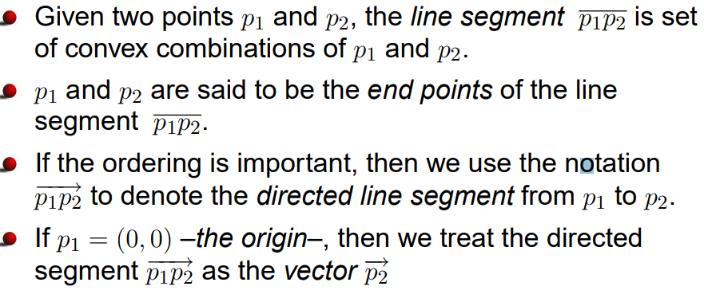
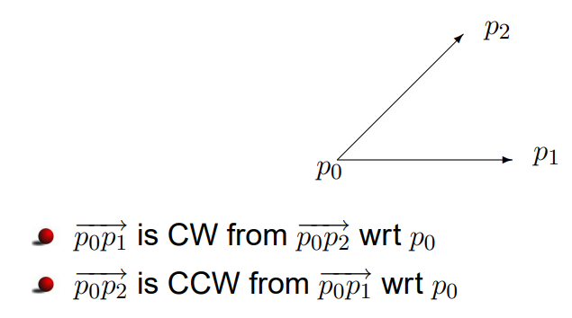

# Computational Geometry
## Algorithms For Geometric Problems
> Inputs are geometric objects such as a polygon and a triangle.

## Lines and Line Segments
> 

## CV and CCW Segments
> 

> **Collinear:** Doğrudaş

## Graham's Algorithm
> Uses the stack logic, if you can make a counter clockwise turn and cover all vertices, do so. If you cannot cover all vertices, pop them from the stack.

## Jarvis's March
> Always pick the one with the smallest counter clockwise degree.