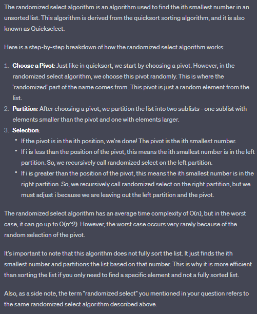

# Randomized Algorithm

## Randomized Select 
> 

## Deterministic Algorithm vs Randomized Algorithm
> **Deterministic Algorithm**
> - It will always produce the same output with the same input
> - Has a fixed set of instructions
>
> **Randomized Algorithms**
> - Typically uses a random number generator to decide what to do next.
> - The randomness of the algorithm allows it to explore more possbilities and it can often lead to a simpler, faster and robust (hatasız) 

## A Correct Randomized Algorithm: Randomized Select
> Randomized select is a correct algorithm because it always produces the correct result.
> : **The randomness affects its expected running time**

## Incorrect Randomized Algorithm 
> It does not always find the correct answer.

## Monte Carlo and Las Vegas Algorithms
> **`Monte Carlo Algorithms`**
> : Monte Carlo algorithms run fast and `find the correct answer with high probability`. 
> : - Simply, Monte Carlo algorithms do not always find the correct answer.
>
> **`Las Vegas Algorithms`**
> : Las Vegas algorithms `always find the correct answer` and have low expected running time.
> : - Expected running time is an average over all possible sequences of random choices (not over all possible inputs).

## Motivation For Randomized Algorithms
> Randomized algorithm for a problem is usually **simpler** and **more efficient** than its deterministic algorithm.
>
> **Sorting Problem**
> 1. Deterministic Algorithms: `Heap sort, Merge sort`
> 2. Randomized `Las Vegas` Algorithm: `Randomized Quick Sort`
>
> ___**`Randomized Quick sort almost always outperforms heap and merge sort.`**___