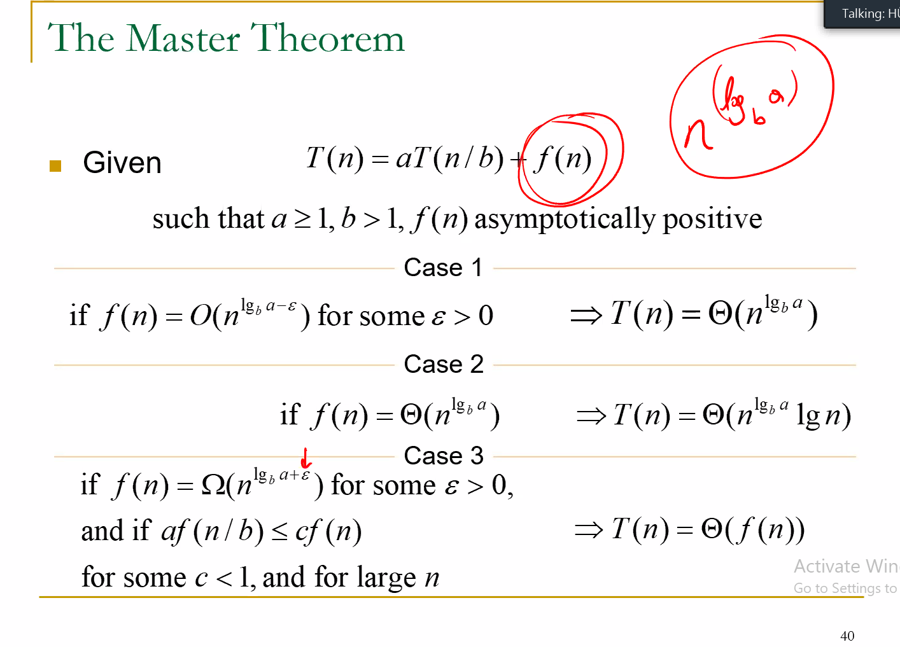

# Using Recursion Trees
> 
>
> Irregular Recursion Trees
> 

# The Master Method
> 
>
>

> **_In-Place Algorithm_**
> : In-Place Algorithm is an algorithm that operates directly on its input data structure without requiring extra space proportional to the size of the input. 
>   : The algorithm performs its operations in the memory location of the input data structure, without using any additional memory.
> * Used when the available memory is limited, or when the input data is too large and copying it would be inefficient. 
>   * It may be more difficult to implement the In-place algorithm than Out-of-place algorithm because In-place requires careful memory managemenet and index manipulation to avoid overwriting data. 
> 
> **_Out-of-Place Algorithm_**
> : Requires additional memory space proportional to the size of the input data structure.

# Basic Idea of QuickSort
## Partitioning 
> &emsp; &emsp; ==It moves the values according to if they are bigger or smaller compared to the pivot.==
>
# Pseudo for QuickSort
> 
>

# Pseudo for Partitioning
> 
> *Cost of parititoning is linear.*
>

# Analysis of Quick Sort
> 
> Best case is the upper one T(n) = T(n-1) + Θ(n)
> Worst case is the one written in red which is T(n) = Θ(n²) 

---
# Stability of Sorting Algorithms
> Counting sort cannot handle sorting by using a constant amount of additional memory because it requires another array of the same size in order to store the number of occurances of elements in the input array. 
> : It requires constant amount if additional memory. So counting sort is not an `In-Place` algorithm.
## `A Sorting Algorithm is stable iff the equal elements in the output sequence appear in the same order as they appear in the input sequence.`
> A ___stable___ sorting algorithm always preserves the relative orders of equal elements in the input.


<style>
    #important{
        font-family: "Lucida Console", "Courier New", monospace;
        color: red;
        weight: 500;
    }
</style>
---
# Counting Sort
> An unstable version implementation for ___Counting Sort___
```C++
Counting_Sort(A, k){
    for (int i = 0; i <= k; i++){ //* Init # of counters to 0
        times[i] = 0;
    }
    for (int j = 0; j <= length[A]; j++){ // Decide how many times each number appear in the input form of the sorted array
        int m = 1;
        for (int  i = 1; i<=k; i++){ // Consider each number in the range 
         for (int j = 1; k <= times[i]; j++) // Generate that number in the output as many times as it occurs in the input.
            A[m] = i;
            m++;
        }
    }
}
```
> Stable implementation for ___Counting Sort___
```C++
Counting_Sort(A, B, k){ //A is the input, B is output
    for (int i = 0; i <= k; i++){ //* Init # of counters to 0
        times[i] = 0;
    }
    for (int j = 0; j <= length[A]; j++){ // Decide how many times each number appear in the input form of the sorted array
        A[m] = i;
        m++;
    }
    first[1] = 1;
    for (int i = 2; i <= k; i++){  // Decide the correct place for first occurance of each number.
        first[i] = times[i-1] + first[i-1];
    }

    for (int j = 1; j <= length[A]; j++){
        // Generate the output array
        int val = A[j]; // the value to be placed in the output.
        pos = first[val]; // the position to be used in the output.
        B[pos] = val;// put the value in its correct position.
        first[val]++; // prepare for the next occurance of val
    }

}
```
# Radix Sort
> Seperate numbers based on their most significant bit. It places them into related bins, sort of works like a chained hash table. As a result the bins will be automatically in sorted form when compared to their MSB. LHS has the smallest and RHS has the largets number.
>
> To sort numbers in the same bin, we move to their $nᵗʰ$ bit and compare their values.

# Analysis of Radix Sort
> Running time of radix sort depends on `the intermediate sorting algorithm used.`
>
> : Assume `Counting Sort is used for sorting:`
>   : Suppose each digit is in the range [1, ... , k]
>   : Each call to Counting Sort costs Ο(k+n) time.
>       : It will be called d times ⟶ Ο(d(k+n))
---
# Medians and Order Statistics
> ## The Selection Problem
> ### ___Definition___
> Given a set of numbers: 
> $$iᵗʰ (1 ≤ i ≤ n) \small \text { order statics of the set of numbers is the iᵗʰ smallest number in the set.}  $$
> Yada yada
---

# Analysis of WCL Select
## WCL Select Finds the `kᵗʰ smallest element in an array.`
> Dividing the n elements into a group of 5 can be done in Ο(n) time.
> : Each group has constant amount of numbers and the cost of finding the median element takes Ο(n) time. We'll find the median of n/5 groups, and the total time needed to do so is of Ο(n) time.
>   : We'll use WCL Select recursively to find the median of n/5 elements so it will take T(n/5) time.
>   : Parititoning algorithm will take Ο(n) time. `The cost of the recursive calls at the end will depend on the partitions that will be generated.`

> Mₘ is the median of n/5 numbers. So n/10 numbers will be smaller than Mₘ. 
> > These n/10 medians are the medians of their corresponding group.
> >
> > Since each group has 5 elements, there are two or more elements in each group that are ≤ to their group's median.
>## `So in total, there are at least 3n/10 numbers in the input array that are ≤ Mₘ.`
> When we parititon our input array by taking Mₘ as the pivot, it is guaranteed that the left subarray will have at least 3n/10 elements.
> : We can also say the right subarray will have 7n/10 elements that are ≥ Mₘ.
>   : So 3n/10 is a lower bound on the number of elements in the left subarray, and 7n/10 is the upper bound on the elements in the  right subarray.
>       : There isnt' a limit on the number of elements in the left subarray, so the worst case is having n-1 elements there.
> # `As a result, WCL select has a linear worst case time.`