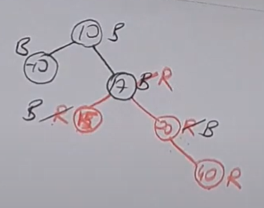

# Dynamic Sets
## Sets and Dynamic Sets
> Sets The kind of sets we are used to from mathematcs courses are static sets. 
> : Most of the algorithms require to insert new elements to and remove elements from the sets.
### Typical Operations of Dynamic Sets
> Membership Test
> : __Search(S, x)__
> 
> Adding a new element
> : **Insert(S, x)**
>
> Removing an element
> : **Delete(S, x)**
>
> Finding the smallest element
> : **Minimum(s)**
>
> Finding the maximum element
> : **Maximum(s)**
>
> Finding the smallest number greater than a given number
> : **Successor(S, x)**
>
> Finding the greatest number smaller than a given number:
> : **Predecessor(S, x)**

## Data Structures for Representing Dynamic Sets
> Queues, linked lists. hash tables and rooted trees are some examples of representing data structures.
>
> > Depending on the data structure, the implementation of basic operations of dynamic sets may have `different asymptotic running times.`
>

# Binary Search Trees
> BST is a data structure for representing dynamic sets. 
>
> BST can support all the basic operations of dynamic sets efficiently.
>
> For complete BST, all operations will have Θ(logn) time.
> : For some BST, `these operations may take linear time instead of logarithmic time.`

## What is a BST?
> * Each node has 2 at most two children. 
> * A node with no child is called a **leaf node.**
> * All nodes except the root node has exactly one parent node. 
> * Values in these nodesar e labeled by a data called the **key.**
> * All values smaller than the root are stored in the left subtree and greater are stored in the right subtree. 
> * Repeated keys may exist, we place them in the right subtree.


# Inorder walks over a BST 
> `Left, Current, Right`
```c++
InOrderWalk(x){
    if (x != NULL){
        InOrderWalk(left)[x]
    }
    ...
}
```

# Searching in a BST
> Given a BAST whose root is pointed by x, and a  number k, does *k* appear as a key in one of the nodes in thsis tree?
>
> x(k) ⟶ (α)
>      
> &emsp; &nbsp; ⟶ (β)
>
> If < key[x], then k can't be in right subtree, and vice versa.
>
## Searching in a BST
```C++
BST_Search(x, k){
    if (x == NULL)
        return NULL; // k not found
    if (k == key[x])
        return x; // return the pointer to the node with key k
    if (k < key[x]) // k can't be in RST
        return BST_search(left[x], k);
    else // k can't be in LST
        return BST_Search(right[x], k);
}
```
### Recursion vs Iteration
> It does not affect the asymptotic run time behavior, in practice iterative form of an algorithm runs faster than its recursive implementation.
>
> A tail recursive agorithm can be eaily converted into iterative form.
```C++
BST_Search_Iterative(x, k){
    while (x!= NULL and k!= key[x]){
        ...
    }
}
```
### Minimum Opeartion
> Say we want tp fond the minimum key stored in a given BST.
```C++
```
### Maximum Operation
>
```C++
BST_Maximum(x){
    ...
}
```
### Successor Operation
> The successor
> : Successor of a node x is defined as the next node x' that would follow x in the inorder traversal of the BST.
---
### GPT explanation of successor node
> A successor of a node is defined as the smallest key greater than the node's key. In other words, if you traverse the tree in-order (left subtree, node, right subtree), the successor is the node that comes immediately after the given node.
---
>
> Given a node x and its successor node y, key[u], is the smallest key value in the BST that is greater than or equal to key[x].
>
> > Consider a node x: What is the next node visited after x in an inorder traversal?

> What is the first node that will be visited in the right subtree? Answer is BST_Minumum.
>
> Consider a node x which does not have a right child.  
```C++
BST_Successor(x){
    if (right[x] != NULL)
        return (BST_minimum(right[x]));
        
    y = parent[x]; t = x;
    
    while (y != NULL && t=right[y]){
        t = y;
        y = parent[t];
    }

    
    return y;
}
```
> The result of the successor node function can have 2 meanings:
> 1. If the function returns a non-null value (a node 'y'), it means that 'y' is the successor of the given node 'x'. `Successor node has the smallest value greater than the value of the node x.` 
> 2. If the function returns NULL, it means that the given node 'x' has no successor in the BST. It happens when 'x' is the node with the maximum key in the tree.
> * By returning the successor node or NULL, the function helps us to navugate the BST in sorted order or perform various operations like deletion or insertion, as finding the successor is a common task in many tree-based algorithms.
## Insert Opeartion
> Give a BST T, and a number k, how can we insert k into *T* and for a new BST *T'* which includes all the keys in *T* and k?
>
> To preserve BST property, and implement Insert efficiently, we will always insert a new node as a leaf node. 
>
> Simplest case: inserting a new node into an empty BST.
> 
> A litte harder version is inserting a node to root node.
>
```C++
BST_Insert(T, x){ // Tree T, x to be inserted.
    if (root[T] == NULL)
        root[T] = x;
   else {
    y = root[T];
    
    while (y != NULL){
        z = y; // make y follow z, and go into the correct subtree  
        y = (key[x] < key[y] ? left[y] : right[y])

    }
    parent[x] = z;
    if (key[x]  < key[z]){
        left[z] = x;
    } else {
        right[z] = x;
    }
   }
}
// Completes in O(n) time.
```

### Delete Opearation
> This operation will change the BST, we need to check if the removal satisfies the BST tree format when its complete.
```c++
BST_Delete_LeafNode(T, x){
    if (parent[x] == NULL)
        root[T] = NULL;

    else {
        if (x == left[parent[x]])
            left[parent[x]] = NULL;
        else 
            right[parent[x]] = NULL;
    }
}
// Running time is Ο(1), constant time.
```
> A bit harder: Removing a node with a single child.
```c++
BST_Delete_SingleChildNode(T, x){
    child = (left[x] != NULL ) ? left[x] : right[x]; // The only child of x
    if (parent[x] == NULL){
        ...
    } 
    ...
}
```
> Most complex case is removing a node with two children.

> Pseudocode for complete Delete Opearation.
```c++
BST_delete(T, x) // T is tree and x is the node to be deleted
{
    if (left[x] == NULL && right[x] == NULL){
        BST_Delete_LeafNode(T, x);
    } 
    else if (left[x] == NULL || right[x] == NULL){
        BST_Delete_SingleChildNode(T, x);
    }
    ...
}
```

# All dynamic operations run in Ο(h) time
> All dynamic set operations can be implemented in Ο(h) time using BSTs.
>
> Running time of an algorithm must be described as a function of a measure of the size of the input.
>
> A tree has 2ⁿ-1 elements in total.

## Wht is the relationship between h (the height of the BST) and the number of nodes in the tree?
> In the best case, BST will be a complete binary tree.
> : Complete binary tree means every nonleaf node has exactly two children and all the leaves are at the same level. 
>   : `h = Ο(logn)`
>
> In the worst case, every nonleaf node has exactly one child, so it has a structure like a linked list. 

---
## My RBT Introduction
> Red-Black tree is a specific type of balanced BST.
### Rules for a RBT 
   1.  A node is either red or black. 
   2.  The root and leaves are always black.
   3.  If a node is red, then its children are black.
   4.  All paths from a node to its NIL descendants contain the same number of black nodes.

* What is NILL node?
  * They are considered black in color.
  * They do not store any data. (they don't have a key value)
  * They do not have any children.

* Why do we use NIL nodes?
  * ___Simplification of algorithms___:  
    : By treating NIL nodes as regular nodes with the color black, we can simplify the isnertion and deletion algorithms in Red-Black Trees, as well as the balancing opearations. `This reduces the need for special case handling when dealing with the end of a branch or an empty tree.`
  * ___Enforcement of black-height property:___
    : One of the key properties of Red-Black Trees is that every path from a node to a descendant NIL node must have the same number of black nodes. By considering NIL nodes as black, this property can be easily maintained.

## `ROOT AND LEAF NODES ARE NOT CALLED AS NIL NOPDES, THE CHILDREN OF LEAF NODES ARE CONSIDERED NIL NODES IN RED BLACK TREES.`
> These NIL nodes help simplify the implementation of Red-Black Tree algorithms and maintain the tree's balancing properties.

_Here is an example of a RBT_
>
1. The root and leaves are black. So are NIL.
2. If a node is red, then its children are black.
3. All paths from a node to its NIL descendants contain the same number of black nodes.
4. All newly added nodes are red.
   1. If a red node has a red child, it means we have RR conflict. We look at its uncle.
      1. If uncle is red, we change color of parents.
      2. Don't change the color of the root.

LL ⟶ R rotation

RL ⟶ LR rotation

RR ⟶ L rotation

LR ⟶ RL rotation

* Say we have an array [10, 20, -10, 15, 17, 40, 50, 60] 
  * **_Note_: While performing rotations, the shifted node gets the color of its new position, so we are not shifting colors. We onlys shift the values so the colors of the nodes can change.**

1.  

    We have an RR conflict and uncle is red too, we change color of parents to black.

2. 

    When we insert 17, we have RR conflict with 15. 17's uncle is NULL. 17 is at the right position, 15 is at left position. So the order is RL, `therefore we will perform LR rotation. Rotate Left first, then rotate Right. `

3. 

    So it should look something like this:

4. 

    Now we will insert 40 as red. We again have RR conflict. We look at 40's uncle which is 15 and is red, so we are changing the color of parents.

5. 

    So it looks like this:

6. 

    Now we will insert 50, it will be under 40 and right of it. We again have RR conflict, we look at 50's uncle, it is NULL. `The last 2 steps to 50 is RR so we will perform L rotation.`

7. 

    So it looks like this, and the step 8 has proper form of a RBT.

8. 

    Now we will insert 60, we're insertting it to the right of 50. It causes RR conflict. We look at 60's uncle which is 20 and has color red, so we are changing the color of parents and uncle. 

    After that, we again face with an RR conflict between 17 and 40 like the following:

9. 

    So now we are looking at 40 and its uncle because 40 is causing the RR conflict. Its uncle is -10 and is black. We have RR conflict so we will perform L rotation on 40.

    Here's a fresh view of the tree to see things better:

10. 

    After applying L rotation to 40, the tree looks something like this:

    17 becomes the new root with the color black. 10 shifts down and gets the color red. Result is as follows:

11. 


---

# Red-Black Trees
> RBTs will be used to keep the BST in an almost balanced form.
>
> In other words, we will always have h=Ο(logn) for an RBT.

# What is a RBT?
> A RBT is a BST, it must satisfy the BST property.
>
> In addition to this, it must also satisfy the ___RBT Properties___ given below.
>
> 1. Every node is red or black.
> 2. The root is black.
> 3. Every leaf node is black (automatically guaranteed by using the black RBT leaf nodes )
...

> A red node cannot have red children.


# What is special about RBT?
> Let's define the number of black nodes along a path from a node x to a leaf under in the subtree rooted at x as the black height of x [denoted by bh(x)]. 
>
> Black height is the # of black nodes in the path starting from the node x.
> : What it there are different number of black nodes on different paths starting at x?
>   : Using the RBT property 5, b₃ + b₁ = b₃ + b₂, Hence b₁ = b₂.
>
> Lets define the height of a node x as the length of the longest path from x to a leaf [ denoted by h(x) ].
>
---
## Lemma 1: For a RBT node x, bh(x) ≥ h(x)/2, at least half is black.
---
---
## Lemma 2: Fora  RBT node x, let #(X) denote the internal nodes (the nodes with a key value) in the subtree rooted at x. Then, #(x) ≥ 2^(bh(x))-1.
---
---
## Lemma 3: For a RBT tree T with n internal nodes, height of T is at most 2 × log(n+1).
---
> The result of Lemma 3 tells us what is special about RBTs.
> h(root[T]) ≤ 2log(n+1)

# Search, Min, Max, Successor, Predecessor
> These opeartions do not modify the tree.

# Insert and Delete Operations
> After inserting a new node into the tree, we must be able to find a suitable color for the new node such that the new tree satisfies RBT properties, and it may not always be straight forward.
> 

# Rotaton 
> Basic operation when we modify the structure of the tree. Performed in a BST or in a tree, around an edge.
>
> The parent on that edge becomes a child, and the child on that edge becomes the parent.
>

> Left rotation is the inverse of the right rotation. Child will move up, parent will move down.
>

# RBT Insert Operation
> Two step approach will be used for inserting into a RBT.
>
> Note that since the new node is red, the number of black nodes in the original and the new tree will be the same.
>
> Hence the RBT property 5 will still be satisfied.
>
> However, we may have a `red parent-red child` problem. If it occurs:
> : Solve it immidiately by performing either 1 or 2 rotations.
> 
> or 
> : push the `red parent - red child` pair problem up in the tree, and consider the problem at a level closer to the root.  

# Fix Coloring
## Case 1
> The uncle (these nodes are male) of the child in the red-red pair is also red, and x is the right child of p. Unclede dedigimiz su anda red olan bir node'un ayni seviyede baska bir node ile olan iliskisi. Ayni seviyedeki diger node da kirmiziysa diyoruzbu rda, uncle'dan kasit o.

## Case 1 (Symmetric): x is the left child of p.

## Case 3 
> Xi s the left child of p, p is the left child of g, u is black. p and u are in the same level but p and x are red but u and g is black. We right rotate on p-g edge to fix colors.

## Case 2 (Symmetric - Zig zag)
> x is the right child of p, p is the left child of g, uncle is black. g and u are black, p and x are red.

