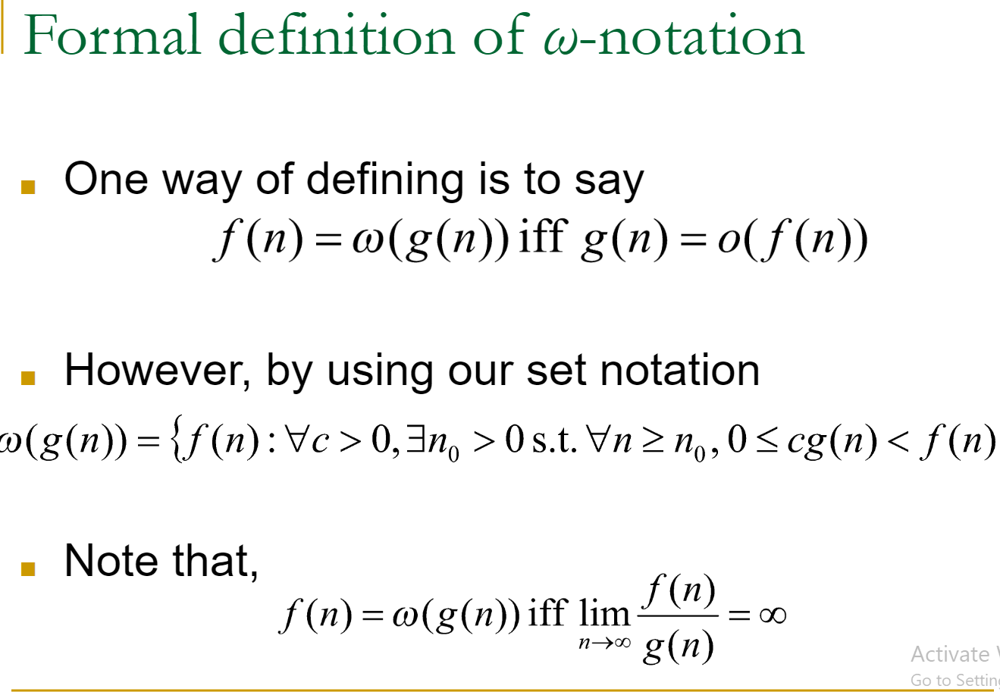
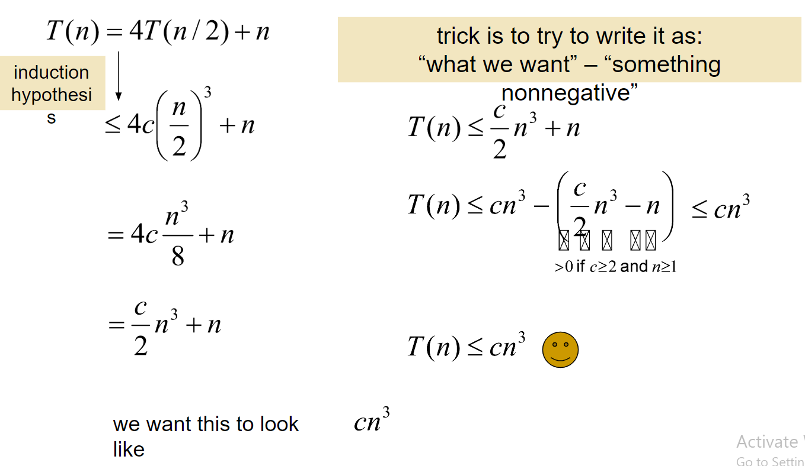

# ___`WEEK 1 BEGINS`___
## Loop Invariant
> Loop invariant is a statement that holds true during the exection of the loop.
>
> They are used in the process of reasoning about the correctness of the loop and determining whether the loop accomplishes its intended task.
>
> There are 3 properties of a loop invariant:
> 1. ___Initialization___
> : A loop variant must be initialized before the loop execution begins.
> 2. ___Maintenance___
> : Loop's body must preserve the truth value of the loop variant during the execution.
> 3. ___Termination___
> : When the loop terminates, the loop invariant should help prove that the loop has achieved its goal. Often the loop invariant is used to determine the exit condition.

## Asymptotic Analysis
> Look at the growth of ***T(n) s n ⟶ ∞***
> 
> Θ-notation:
> : Ignore lower order terms
> : Ignore leading constants
>
> For example:
> : $$T(n) = d_1n^2 + d_2n + d_3$$
> : $$T(n) = Θ(n^2)$$

## Divide and Conquer
> They are recursive in their nature
>
> There are 3 steps for a Divide and Conquer Algorithm:
> 1. **Divide:** The problem is divided into smaller subproblems.
> 2. **Conquer:** The subproblems are attacked recursively by the same algorithm. When the size of the subproblem gets small enough, the problem is solved in a starightforward manner.
> 3. **Combine:** The solutions of the recursions are combined to form the solution of the original problem.

## Analysis of Divine and Conquer Algorithms
> $$
T(n)=
\begin{cases}
Θ(1) & \quad \text{if n < c}\\ 
aT(n/b) + D(n) + C(n) & \quad \text{otherwise}
\end{cases} \\
\text{a: Number of subproblems} \\
\text{n/b: Size of each subproblem}\\
\text{T(n/b: Time required to solve each problem)}\\
\text{D(n): Work required for dividing into smaller subproblems}
\\
\\
> $$
>
> $$ \text{When the problem gets small enough, it takes Θ(1) time to solve it.}$$

## Running time of Merge Sort is Θ(nlogn)

## Comparison of Merge Sort and Insertion Sort
> Insertion Sort: Θ(n²)
>
> Merge Sort: Θ(nlogn)
>
> So, merge sort is asymptotically more efficient than Insertion Sort.
> : But we will pick which one to use depending on the cases we have.
> : 

## Growth of Functions
## *Ο-Notation* (`Provides may or may not tight  upper-bounds`)
> $$f(n) = Ο(g(n)) \text{such that, if there exists c and n₀ st.} \\
∀n ≥ n₀, 0 ≤ f(n) ≤ cg(n)$$
> $$ \text{For example 2n² = Ο(n³), where } c=1, n_0=2$$
>
> Formal definition of *Ο-Notation* 
> $$ O(g(n)) = {f(n): ∃c, n_0>0, } \text{ st. } ∀n≥n_0, 0 ≤ f(n) ≤ cg(n)$$
> So when we say 2n² = Ο(n³), we mean:
> :  2n² ∈ Ο(n³)
>
> $$\text{Example of a tight upper bound:}\\ 5n^2 = Ο(n^2) $$
> $$\text{Example of a loose upper bound:}\\ 3n = Ο(n^2) $$

## *ο-Notation* (provides not tight upper bounds)
> Which means, the rate of growth of f(n) is strictly less than the growth rate of g(n).
>
> 
>
> 

## *Ω-notation (provides asymptotic lower bounds, it bounds from below)*
> f(n) = Ω(g(n)) if there exists positive constants c and n₀ such that for all n≥n₀, 0 ≤ cg(n) ≤ f(n)
>
> $$Ω(g(n)) = f(n): ∃c, n_0 \text{ st. } ∀ n≥n_0, 0 ≤ cg(n) ≤ f(n)$$
> 

## *ω-notation* (provides lower bounds that are not tight)
> 

## *Θ-notation (provides tight bounds)*
> $$Θ(g(n)) = {f(n): ∃ c_1, c_2, n_0 > 0} \text{ st. } 0 ≤ c_1g(n) ≤ c_2g(n)$$
>
> 

## Properties of Asymptotic Functions
> 
>
> 

# ___`WEEk 1 ENDS`___
---

---
# ___`WEEk 2 BEGINS`___
## Recurrances
> A recurrance is an equation or inequality that describes a function in terms of itself, usually on smaller values.
>
> Its running time looks like:
$$
T(n)=
\begin{cases}
Θ(1) & \quad \text{if n=1}\\ 
2T(n/2)+θ(n) & \quad \text{otherwise}
\end{cases}
$$

## Solving Recurrances
## _Method 1_: `Substitution Method`
> 1. Guess the solution
> 2. Verify the solution by using induction

## Example for the `Substitution Method`
>$$T(n) = 4T(n/2) + n$$
> 1. _Guessing:_ Claim that T(n) = Θ(n³)
> 2. _Verification:_ Use induction to prove T(n) = Ο(n³)
>
> - Note that we would prove T(n) = Θ(n³) if we can show:
> $$∃ n_0≥0 \text{ st. } ∀n≥n_0: T(n)≤cn³$$
>
> 1. $$\text{Induction base: }T(1) ?≤ c1^3 ?≤ c$$
>
> 2. $$\text{Assume that: } $$
> $$T(k) ≤ ck^3, ∀k < n, \text { and show that:}$$
> $$T(n) ≤ cn^3$$
>
> 

## The Iteration Method
> Acip acip cozuyorsun, zor olabilecek bir sey bu.
>
> 
>
>   

## The Master Theorem
> 

## Sorting Algorithms Revisited
## Memory Usage of the Sorting Algorithms
> An `inplace` sorting algorithm requires a constant amonut of additional memory. (not considering the memory needed for the input istelf.)
>
## `INSERTION SORT IS AN INPLACE ALGORITHM (because numbers are simply shifted within the input array.)`

## `MERGE SORT IS NOT INPLACE (Merge operation needs Θ(n) additional memory)`

## Quick Sort (Average and best are Θ(nlogn))
> In-place
> : `An in-place algorithm is one that transforms its input data without using any additional data structures, only using a small, constant amount of extra memory for temporary storage or manipulation.`
>
> ___Worst Case___: Θ(n²)
> : When partitioning produces empty partition at each recursion.
> 
> ___Average Case___: Θ(nlogn)
>
> ___Best Case___: Θ(nlogn)
> : When partitioning produces balanced partitions at each recursion.
> 
> Just like Merge Sort and Insertion Sort, Quick Sort also uses the divide and conquer approach.

## Lower Bounds For the Sorting Problem
> Merge sort is the most efficient sorting algorithm because it has Θ(nlogn) worst case time complexity.
>
> `Sorting algorithms have to read every element in the input so all the sorting algorithms have Ω(n) lower bound.`

## Sorting In Linear Time
> Counting Sort (Its time complexity is Ω(k+n)).
> 

# ___`SLIDE 2 ENDS`___
---

---
# ___`SLIDE 3 BEGINS`___
# Stability of Sorting Algorithms
> A sorting algorithm is `stable` if and only if the elements in the output sequence are in the same order as they appear in the input sequence.

## Radix Sort
> Non-comparative sorting algorithm.
>
> It sorts integers or strings by processing their digits or characters one at a time.
> : Starts from the least significant digit or character, and moves toward the most significant one.
>   : It typically uses a stable sorting algorithm such as counting sort as a subroutine (as a helper algorithm).

## Medians and Order Statistics
## The Selection Problem
> ___Definition___: Given a set of n numbers, `iᵗʰ (1 ≤ i ≤ n) order statistics of the set of numbers` is the iᵗʰ smallest number in the set.

## Running Time For The Algorithm Select
> Recall that the parititoning algorithm has Ο(n) time complexity. In the worst case:
> : It will have Ο(n²) time complexity.

## Randomized Select
> Shuffle the elements of the input, the last elemen (which we use as pivot in the partitioning) is a ranodm element.
> : It's the same thing as picking a random element as the pivot.
>
> `It has linear` _`expected time`_.
> : `In the worst case, it's` _`Quadratic`_

## WCL_Select Analysis
> Dividing elements into groups of 5 elements can be performed in Ο(n) time.
>
> : Finding medians of each group takes O(1) time.
> : Finding medians of n/5 groups total time needed is Ο(n) time.
>
> We'll use WCL_Select recursively for n/5 groups to find median, so it will take T(n/5).
>
> Say mₘ is the median of n/5 numbers. 
> : So n/10 groups (half of the n/5 groups) will be ≤ mₘ.
>
> These n/10 medians are the medians of their own group.
>
> Every group has 5 elements, two are more are ≤ to their medians.
>
> In total, there are at least 3n/10 elements that are ≤ mₘ.
> : Or 7n/10 elements ≥ mₘ.
>
> 3n/10 is a lower bound on the number of elements ≤ mₘ and 7n/10 is the upper bound for the number of elements ≥ 3n/10.
# ___`SLIDE 3 ENDS`___
---
# ___`SLIDE 4 BEGINS`___
# Red-Black Trees
## What is a Red-Black Tree?
> RBT is a BST and nodes have an additional single bit information:
> : The color of the node.
> : Color can be red or black.

## Why Do We Use Red-Black Trees?
> RBTs are used to keep the BST in almost balanced form. 
> Height of an RBT is Ο(logn).

## Properties of RBT
> 1. Every node is red or black.
> 2. The root is black.
> 3. Every leaf node is black (automatically guaranteed by using the black RBT leaf nodes as the leaves.)
> 4. `A red node always has two black children.`
> 5. Every path from the root to a leaf has the same number of black nodes.
> : Root'tan leaf'e giden her yolda eşit sayıda siyah node var.
>
> 

## ___`NOT EVERY BST CAN BE COLORED TO FORM A RBT`___
> 

## Rotation
> In order to preserve the RBT properties, we may need to perform recoloring or rotation.
>
> A rotation is performed around an edge. 
> : The parent of an edge becomes a child, and the child on that edge becomes the parent.

## Right Rotate
> 

## Left Rotate
> 

## RBT Insert Operation
> Newly inserted nodes will be made red.
> : Then, we'll try and fix the coloring.   
>
> We may face with `red-parent-red-child problem`, to solve it:
> : 1. Perform 1 or 2 rotations
>   : OR
> : Push the `red-parent-red-child` problem up, and consider the problem at the closer level to the root.

## Fixing Coloring
> ___Case 1___
> : The uncle of the red-red pair is also red, and x is the right child of p.
> 
>
> 
>
> ___Case 3___
> : x is the left child of p, p is the left child of g, u is black.
>      
>
> ___Case 2___
> : x is the right child of p, p is the left child of g, u is black.
> :

> In the worst case, case 1 may keep applying, and we get pushed to the root and need O(h) time to resolve it.
> : `So the worst time complexity of this will be O(h) time.`

## RBT Delete
> Can be implemented in Ο(logn) time.
# ___`SLIDE 4 ENDS`___
---
# ___`SLIDE 5 BEGINS`___

## Augmenting Data Structures
> RBT is an Augmented Data structure of an BST.

## Finding Rank Of An Element In a RBT
> Basically the question is how many keys are smaller than key[ x ]? 
> : All the nodes in the left subtree of the node containing the value key[ x ] is guaranteed to have keys smaller than it.
>   : So, the number of elements smaller than the key[ x ] value is equal to the # of nodes in the left-subtree of it.
>
> In the worst case, the value we're looking at could be the smallest value, hence the worst-time complexity will be of Ο(n) time.

## A More Efficient Way Of Counting Nodes
> 

## Finding Rank In an Augmented RBT
> The only difference between it and a normal RBT and an augmented RBT is that:
> : `CountNodes` subroutine is replaced by references to size fields (hence reducing the time requirement for these calls to a **constant time.**)
> : The `CountNodes` algorithm will traverse its way up to the root, so we will be moving up in the tree.
>   : In the worst case, this path could be the longest path, and the **`Worst Case Running time will be Ο(h) = Ο(logn)`**

# `Order Statistics and Rank Operations Can Be Implemented In Ο(logn) time.`

## Augmented Fix Coloring
> 
>
> 

## Maintaining Size Fields After Right Rotation
> 

## Maintaining Size Fields After Left Rotation
> 

> Don't forget to change the size values after performing rotations.

## Running Time Of AugmentedRBT_Insert Is Ο(logn) time.

# `All basic set operations such as insert, delete, finding rank and order statistics, can be implemented in Augmented RBTs in Ο(logn) time.`

## Another Example For Augmenting RBTs
> 
> : The algorithm should return us the overlapping intervals, which means non-empty intersections.
> : Returns false if there is an empty intersection.

## Using RBTs For Keeping a Set Of Intervals
> 

## Dynamic Programming
> Dynamic Programming is a meta-technique used to design algortihms, such as Divide and Conquer.

## Divide and Conquer vs Dynamic Programming
> In both, we divide the algorithm into smaller subproblems.
> : If some subproblem turns out to be the same instance, then we'll have to perform the same operations over and over again.
>
> ___Dynamic Programming avoids unnecessary duplication of work by solving each subproblem only once.___

## Guide For Dynamic Programming Algorithms
> 1. Characterize the structure of an optimal solution
> : `Optimal substructure property`
> 2. Compute the value of an optimal solution
> : `Requires to set up a recurrance`
> 3. Compute the value of an optimal solution in a bottom-up fashion
> 4. If required,  construct an optimal solution from the computed information.

## Matrix Chain Multiplication Problem
> Let `A` be a matrix 2x3 and `B` 3x2, then the # of multiplications required will be 2x2x3 = 12. 
> : Number of dimensions of the resulting matrix will be: 2+2=4  

## Matrix Chain Multiplication Formula
> 

> 

# ___`SLIDE 5 ENDS`___
---

---
# ___`SLIDE 6 BEGINS`___

# Longest Common Subsequence
> See CS301_Week7.md.

## Greedy Algorithms
> Greedy algorithms make the choice that looks best at the moment.
> : They don't always yield optimal solutions.
> : For some cases, greedy's local optimal solution can lead to a globally optimal solution.

## Activity Selection Problem
> Two activities are compatible if they don't overlap with each other.
> : An example execution

## Correctness of Greedy Activity Selector 
> 

## Elements Of Greedy Algorithms
> A greedy algorithm obtains a solution for a problem by making a sequence of choices, just like the dynamic programming algorithms.
> : At each point, the greedy algorithm looks for the best choice at the moment.
>   : `This approach does not work for all the optimization problems but also works for some.`
> ____The problem must have two characteristics:___
> : 1. `It has to have the optimal substructure property, as in dynamic programming approach (1ˢᵗ step was to characterize an optimal solution.)`
>       : An optimal solution to the original problem can be based on an optimal solution for a subproblem.
> : 2. It needs to have a `greedy choice property`
>       : A globally optimal choice can be made by making a locally optimal greedy choice.

## Knapsack Problem
> `Maximize` ___`total value`___, `Minimize` ___`total weight.`___
>
> Room B:
> : Blocks of gold with varying K.
> : `0-1 Knapsack Problem`
> 
> Room D:
> : Dust of gold with varying gr.
> : `Fractional Knapsack Problem`
>
> Both rooms posesses the optimal substructure property:
> : If we have an optimal load, consider an item _j_ in our load with weight wⱼ kgs.
>   : When the item _j_ is removed from our load, we'll have W-wⱼ remaining weight in our load, where W is the maximum amount of load we can carry.

## Greedy Approach For 0 - 1 Kanpsack Problem Does Not Work
> It asks for a dynamic programming solution approach.
# ___`SLIDE 6 ENDS`___
---

---
# ___`SLIDE 7 BEGINS`___
# Amortized Analysis
> Instead of focusing on the worst case performance of individual operations, amortized analysis is a technique used to analyze the average-case performance of an algorithm over a sequence of operations.
> : Somehow this provides a more accurate representation of an algorithm's average case.
>
> Since it provides information about the average case of the algorithm instead of focusing on the worst-case, Amortized Analysis provides a more realistic running time complexity.
>
> **Steps In Amortized Analysis:**
> 1. ___`The Aggregate Method`___
>       : This method calculates the total cost of a series of operations, and divides the total cost by number of operations.
>       : By averaging the cost, it provides an amortized cost per operation.
>
> 2. ___`Accounting Method (or banker's method)`___
>       : This method assigns a charge at each operation cost, and it represents the amortized cost.
>           :  When operation's cost is actually lower than its assigned charge, the surplus is stored as `credit` to be used to offset future operations' costs. Conversely, when there is a deficit, its covered by the credit.
>       : `Here, the goal is to cover the cost of all operations.`
>  3. ___`Potential Method (Or physicist's method)`___
>       : This method assigns a potential value that represents the difference between the current state and some baseline state.
>       : The potential value changes as operations are applied on the data structure.
>       : The amortized cost of operations is   denoted by the sum of its actual cost and the change in potential.

---
# ___`SLIDE 7 ENDS`___

# ___ `SLIDE 8 BEGINS`___
## P vs. NP
> ___`P`___ is a class where every element in P can be solved in a reasonable amount of time. 
> : Such as multiplication, and alphabetizing a list of names.
>
> Around the P class, there is a covering set called ___`NP Class`___.
> : That's where if you are given a correct solution, you can at least check it in a resonable amount of time.
>
> ___`An NP problem is actually a part of P.`___
>
> ___P vs NP Question___:
> 1. Is every problem ∈ P a part of NP?
> 2. Or if there are some NP problems that were truly harder than the ones in P?
> 
> `The importance of the P vs NP Question is that if all the problems in NP are actually also a part of P, a lot of important puzzles turn out to be easy enough for computers to solve.`
>
> The problems that lie outside of NP, now they're the real deal. It's not really possible to give a right answer to them.
> : For example assume you're at a nᵗʰ move of a chess game and trying to figure out which move is the best. I may give you an answer but how can you be sure that.
>
> `Note that a problem that is in P is also in NP`
>
> **Does being able to quickly _recognize_ correct answers mean that there's also a quick way to find them?**
> : Here, being able to quickly recognize correct answers lie on the NP and:
> : A quick way to find them lies in P.

## P Stands For Polynomial Time
> Therefore the amount of time it takes, is some polynomial function of its size, where:
> : ___`S = f(N)`___, f is a polynomial function.
>
> It's the problems like mazes and multiplication problems, and the number of required steps to solve it doesn't seem so bad when compared to the size of the problem.

## NP Is All About Polynimal Time Checking
> NP means ___`Non-Deterministic Polynomial Time`___ 
> : If you have lots of computers that checks for all possible solutions at the same time:
> **You could find a correct solution in polynomial time.**

## NP-Complete Problem Set Covers NP
> This whole upper area of exponential problems such as finding the best move in a chess game is NP-Hard.

##  Decision Problems
> Has Yes or No as answer.

## Halting Problems
> Given a program _P_ and some input values for _P_ , determine if _P_ halts when these inputs are applied. 
> : No such algorithm can be found, this problem is not solvable. It's proof is really simple:
> : 

## The Problem SAT
> Determines whether there exists an implementation or assignment of truth values to propositonal variables that satisfies a given boolean formula.
>
> It's known to be NP-Complete.
> : It means that is computationally difficult to find a solution for large instances of the problem.
---
