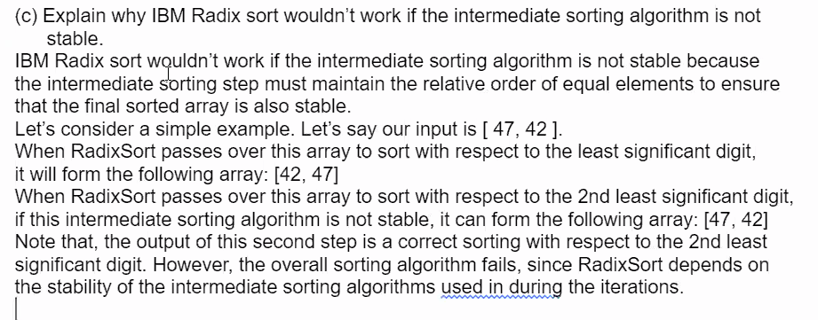

# 1. What is an in-place algorithm?
> There's a place where we alrady have the input and we'll use that space. Simply it uses the space provided.
>
> : An in-place algorithm is an algorithm that operates directly on its input, requiring only a constant amount of additional space (additional space requirement does not depend on the size of the input.)
>
> `The algorithm is not an in-place algorithm if size of the required space depends on the input size.`

# 2. Which of the following sorting algorithms are in place?
> Order is: 
> : Merge Sort ⟶ Can be designed as an in-place algorithm, but that's not very common. It's ok to say not in-place. In classic implementation, after we get sublists sorted, we merge them by using an additional array of size n. Therefore such an implementation will not be in-place.
> : Quick Sort ⟶ Is In-place ✓
> : Counting Sort ⟶  There is an array of counters we use to cunt the number of occurances of each value in the range of elements. Size of this array griws with the range of the elements, but also wiht the number of elements. Each counter needs to have logn bits.
> : Insertion Sort  Not in place.
>

# 3. Linear Running Time
> Couting sort, because of limited range of values.
>

# 4. Why is counting sort not widely used as a merge sort even though its a linear algorithm?
> Counting sort is not as widely used as merge sort because it requiers the input to have a limited range of values, and the additional space required for counting becomes prohibitive when the range is large.
> 

# 5. What is a stable algorithm?
> A stable sorting algorithm is an algorithm that maintains the relative order of equal elements in the input array after sorting. This means that if two elements in the input array are equal, and one comes before the other, then the sorted array will also havet he first element before the second element.
> 
> ==Example==
> 

# 6. Explain why IBM Radix Sort wouldn't work if the intermediate sorting algorithm is not stable.
> 
> 
> Intermediate sorting algorithm stores the digits. If our numbers is 123, we can first sort it by 3 then 2 and 1. At the end, it will be sorted in the correct way. We will divide the problem and use some intermediate sorting algorithms. They need to be stable because:
> : Take 47 and 42.
>   * Look at LSB, and form [42, 47]
>   * When it passes over this for second LSB, it not stable can form the following problems:
> 1. It will not know that it was according to the other digit, so they need to maintain the order. This intermediate sorting algorithm if a digit should come before or after the first digit, so it may be randomly sorted in the end.

> > Equal numbered values are probably constant if you compare them to the whole array and values. Having to sort a couple more values, it causes significantly more time but for the space we'll need more space too.
>

# 7. WCL Selection. Why don't we prefer groups with even numbers such as 6, 8, 10 in the WCL Select Algorithm?
> 
> We just go with the odd number because its easier to find the median. With 5, 
>

# 8. Recurrance shit

