# Graphs
> Graph is defined by a set of vertices, or nodes, and a set of edges.
>
> Formally, Graph is a tuple:
> $$G = (V,E) \text\large {\space where} \newline 
V = \{V₁, V₂, V₃, ..., Vₙ\} \newline
E  { ⊆ } V × V \text\large{\space is \space the \space set \space of \space edges \space between \space the \space vertices}
> $$
> A graph can be directed or undirected.
> 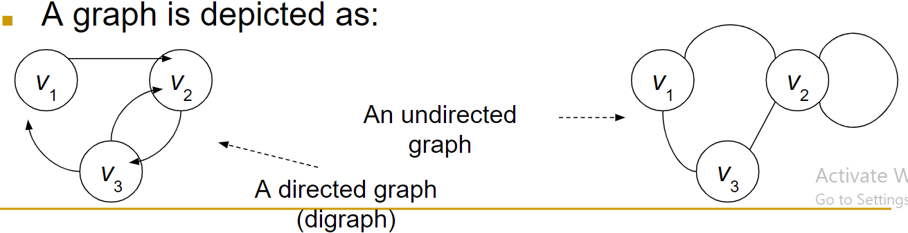
> Directed graphs have arrows on them and undirected graphs are nothing but plain lines.
>
> An example of directed graph
> : 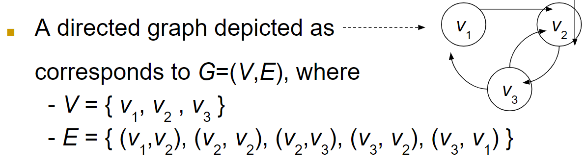
>
> An example of an undirected graph
> : 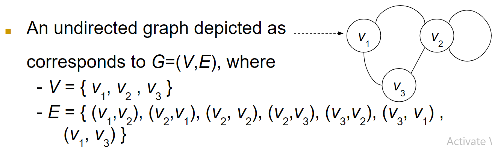

## Bound On The Number Of Edges
> **`Outdegree`** of a node is how many edges are going out of the node.
>
> **`Indegree`** of a node is how many edges are coming into the node.
>
> We can have at most |V| edges leaving a Vertex *v* in *V*, therefore |E| = Ο(|V²|)
> : On labeled graphs this does not hold, and a labeled graph is where we label each edge.
>
> This is a labeled Graph:
> 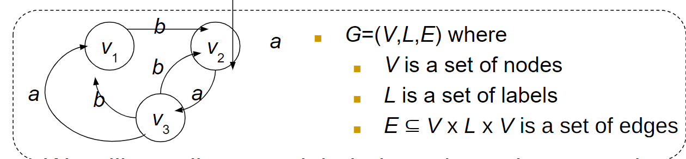
>
> **`Digraph`** means a Graph that is made up of vertices\nodes and edges\arcs, where each edge has a direction associated with it. In other words, each edge moves from one vertex to another, and not neccesarily in the other direction.

## Representations For Digraphs
> 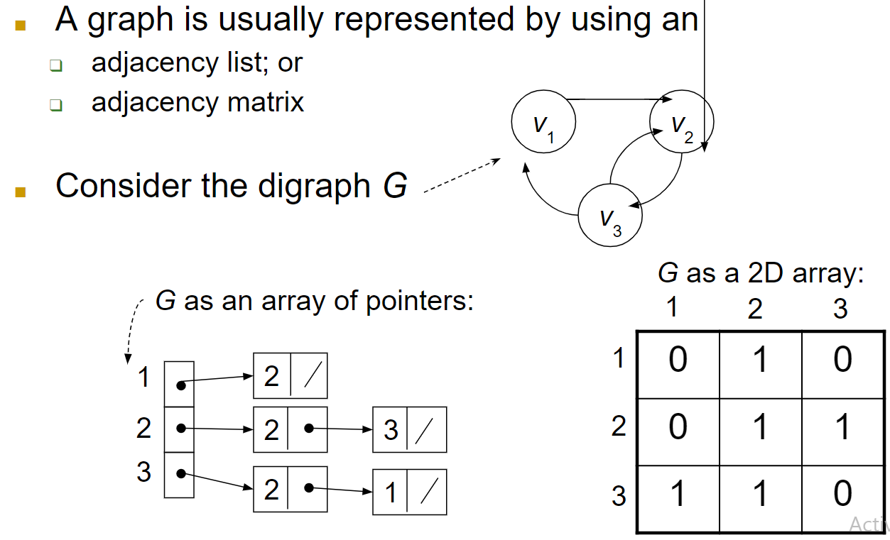

## Representation For Undirected Graphs
> 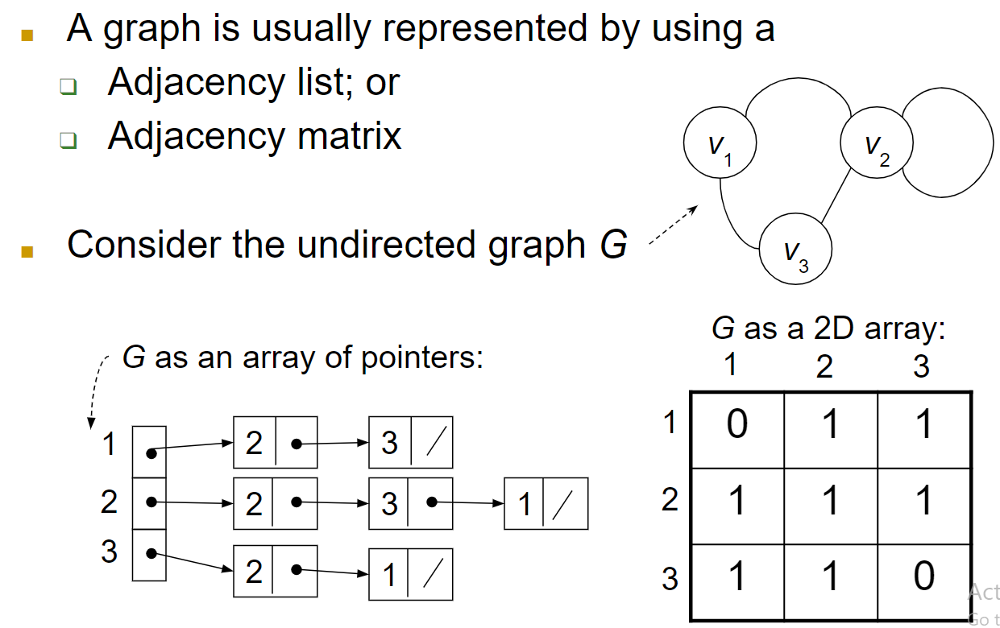

## Weighted Graphs
> Weighted Graphs are simply Graphs where edges have a weight associated with them.

## Subgrpahs
> Given two Graphs `G=(V,E)` and `G'=(V',E')`, G' is said to be a **`subgraph`** of G ⟺ V'⊆V and E'⊆E.
>
> Take this graph as an example
> 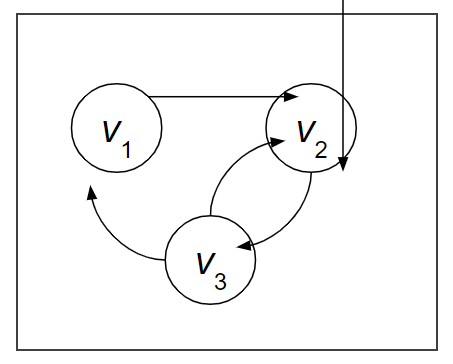
> : All these are Subgraphs of this Graph:
>   - 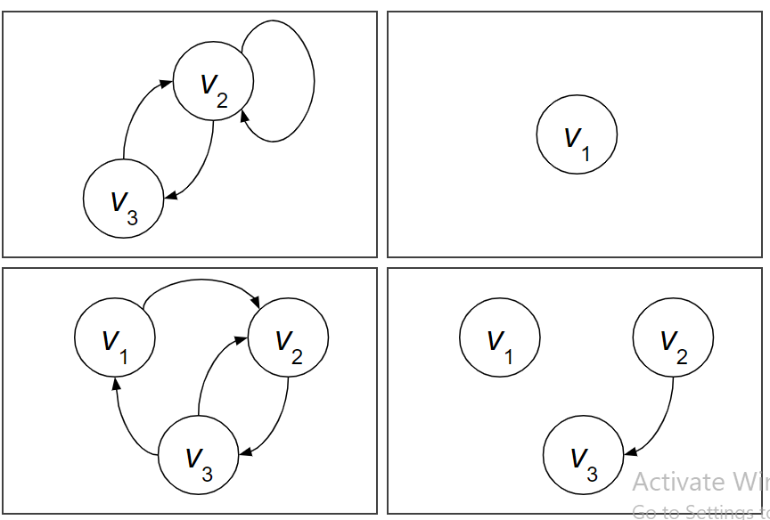

## Some Notations What The Hell Is This???
> 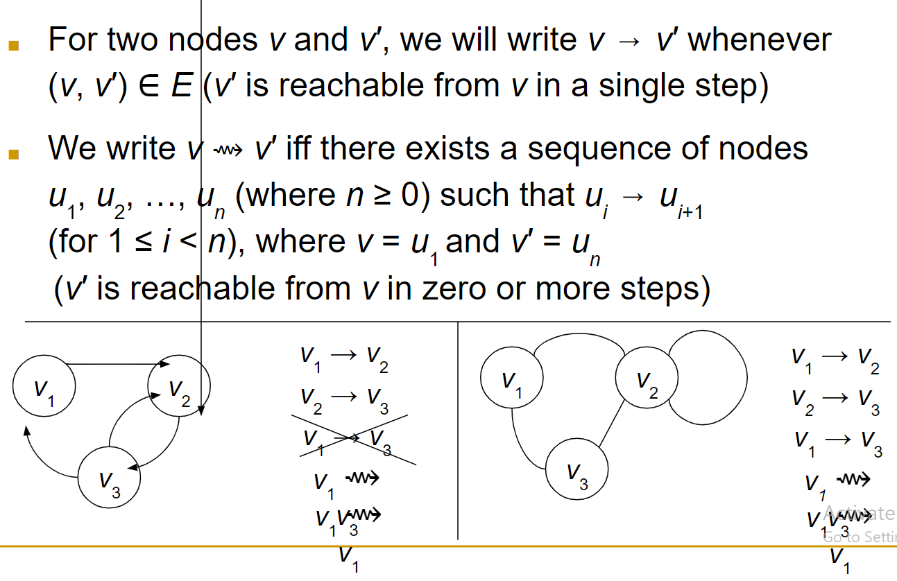

## Connected Undirected Graphs
> An **` Undirected Graph is said to be connected if ∀V u,v ∈ V: u⟶ v `**
> : 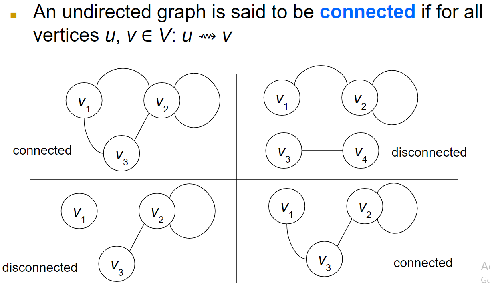

## Connected Components Of An Undirected Graph
> A **`connected component`** of an undirected Graph G is a subgraph G' of G, st. G' is connected.
> : Connected component simply means a Connected Subgraph of a Graph.
>
> 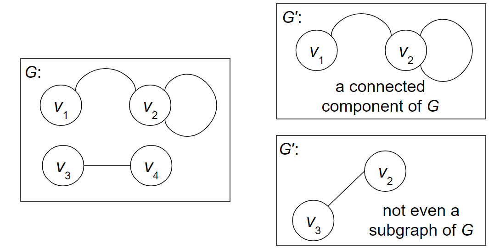

## Strongly Connected Digraphs
> A directed Graph is said to be **`strongly connected`** if for all vertices u,v ∈ V: u ⟶ v
> 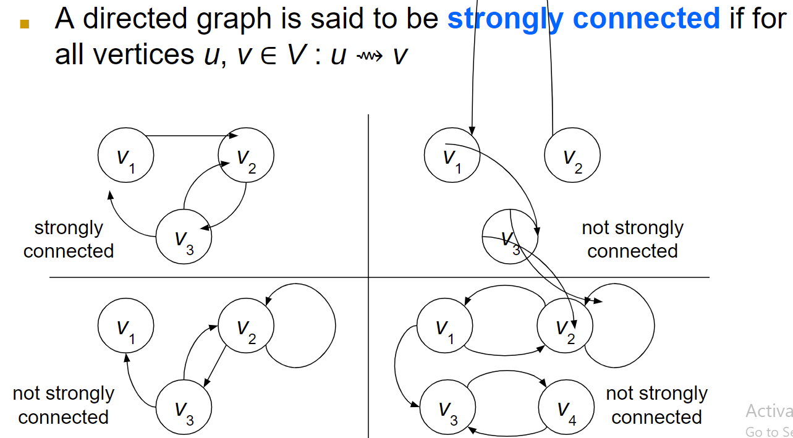
> - Strongly connected simply means all edges are connected to each other directly at in at least one direct way. 

## Strongly Connected Components Of a Digraph
> A **`strongly component of a digraph`** G is a subgraph G' of G, such that G' is strongly connected
> : 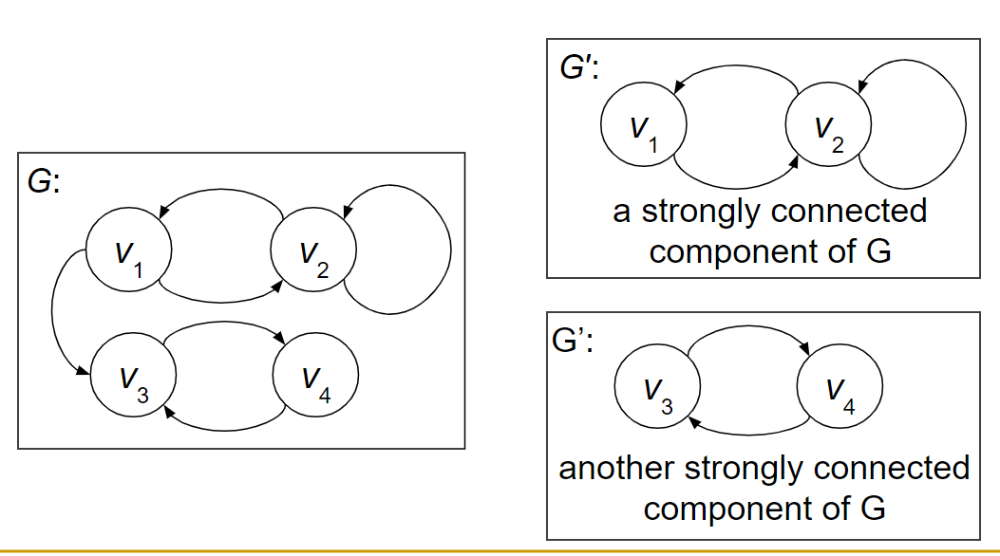

## Weakly Connected Digraphs
> A directed graph is said to be **`weakly connected`** if the underlying undirected graph is connected.
> : 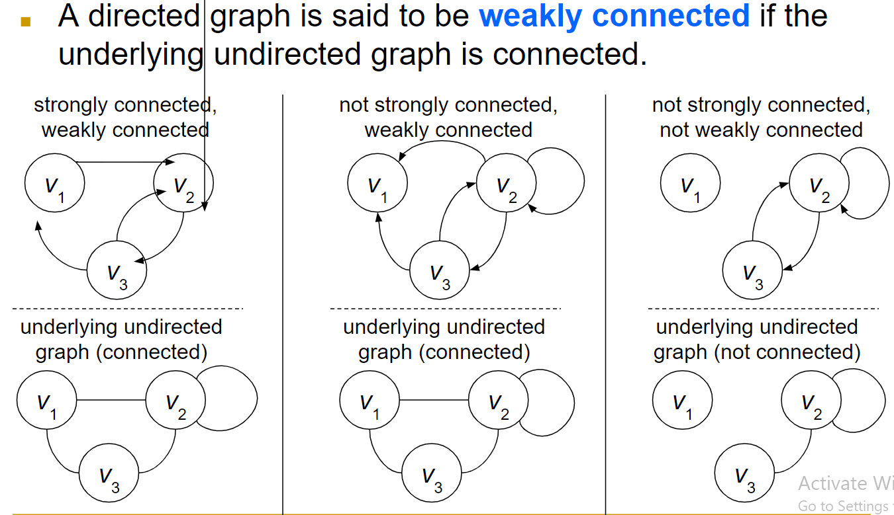
> : Simply remove the directed arrows from the Graph (this state is called as ___underlying undirected graph___) and see if edges are connected, if connected, the underlying undirected graph is weakly connected.

## Cyclic and Acyclic Graphs
> **`Cyclic`** is when a Graph has a cycle in it.
>
> **`Acyclic`** is when a Graph does not have a cycle in it.
>
> Example for cyclic and acyclic graphs
> 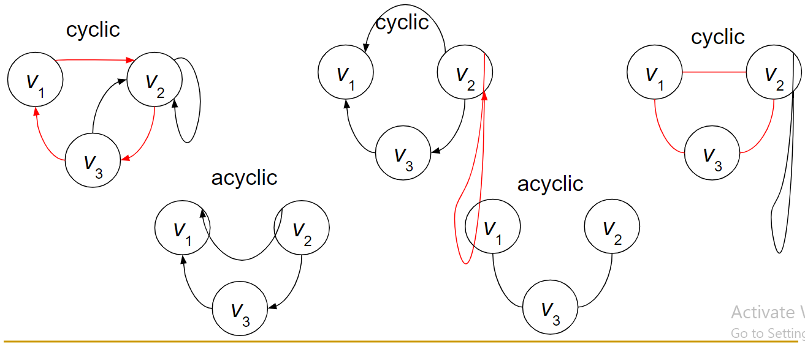 

## A Cut of An Undirected Graph
> A **`cut`** of an undirected G=V(V,E) is a partitioning of V into two subsets, i.e. given a subset of states S⊆V, (S,V-S) is a cut of G.
>
> **`Crosses the Cut and Respects the Cut`**
>
> 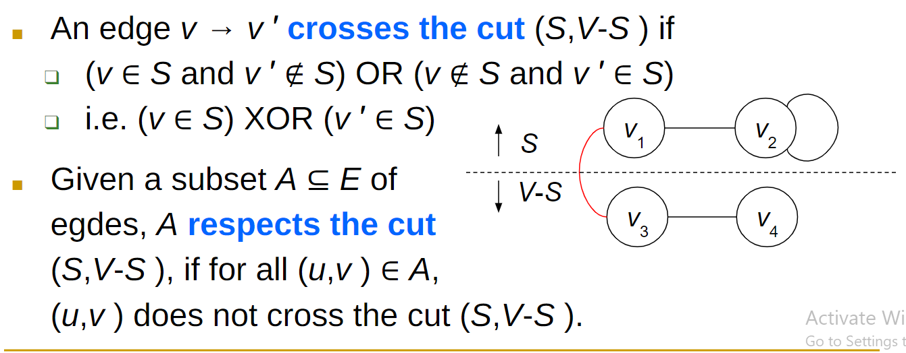 *here the red edge crosses the cut, and the other edges (v1,v2) and (v3,v4) simply respect the cut as they are not interfering with the cut.*

## Light Edge Of a Cut
> Given a Graph G=(V,E), a weight w:E⟶R on the edges of G, and a cut (S, V-S) of G, an edge (u,v) ∈ *E* that crosses the cut (S, V-S), (u,v) is a **`light edge`** if (u,v) has the smallest weight over all edges interfering with the cut.
> : Simply, the light edge of a cut is the edge with the smallest edge interfering with the cut.

# Spanning Tree
> ___`Spanning Tree`___ of an undirected and connected Graph G=(V,E) is a **connected acyclic subgraph** Gₜ=(V, Eₜ) with the same vertex set V.
> : 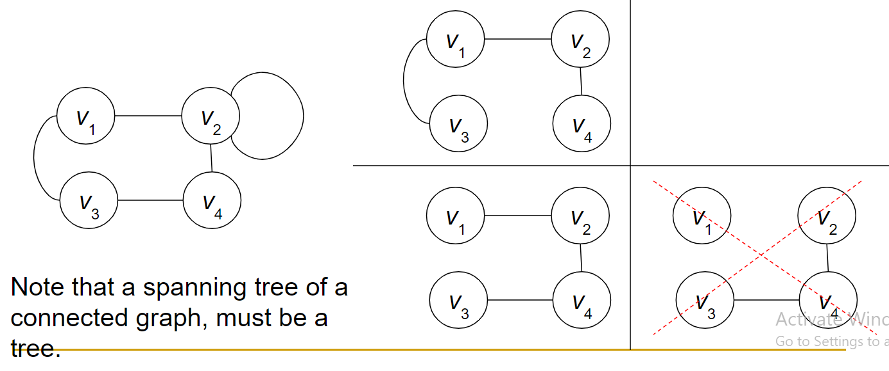

## Minimum Spanning Tree Of a Weighted Undirected Graph
> Minimum spanning tree is a tree that has the minimum weighted edges of a graph which are connected.
> : 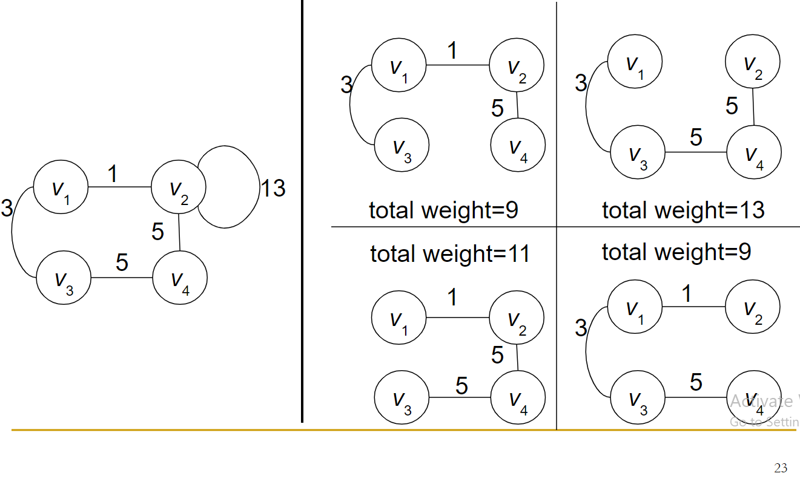

## Finding MST Based on Finding Safe Edges
>

## Prim's Algorithm For MST
> Start with some node, pick it randomly. Only this node is covered,
>
> At each step make a cut,  and take the ligthest edge, and say the set of these nodes is C and V is the set of all Vertexes. Repeat until C=V.
> 

## Kruskal's Algorithm For MST
> Sort the edges in increasing order,
>
> At each step take the smallest edge by creating forests,
>
> If the edge causes a loop skip it,
>
> Continue until a MST is formed.
> 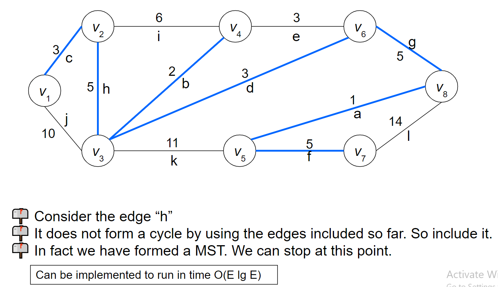