# 1. What are the key differences between the analysis of an iterative algorithm and the analysisof a divide and conquer algorithm?
> 1.1 An iterative algorithm works by repeatedly executing a sequence of instructions until a certain condition is met. 
> 
> 1.2 A divide-and-conquer algorithm works by breaking down a problem into smaller sub-problems, solving each sub-problem independently, and then combining the solutions to solve the original problem.
>
> 1.3 Iterative algorithms often make use of simple data structures like arrays, lists, or stacks, while divide-and-conquer algorithms often use more complex data structures like trees or graphs.
>
> Divide-and-conquer algorithms typically involve recursion, where a function calls itself to solve sub-problems. Iterative algorithms, on the other hand, do not usually involve recursion.
> 
> Divide-and-conquer algorithms may require more memory than iterative algorithms, due to the creation of sub-problems and the need to store their results.

# 2. Explain the differences between the o-Notation and the O-Notation.
> Both of them define upper bound. Small o-notation defines is a loose upper bound. ==It defines a bound that cannot be a tight bound==. 
>
> O notation defines a loose or tight bound.
>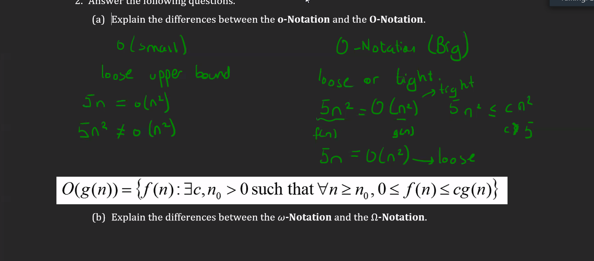

> Big omega -> Tight or loose lower bound
> Small omega -> Loose lower bound

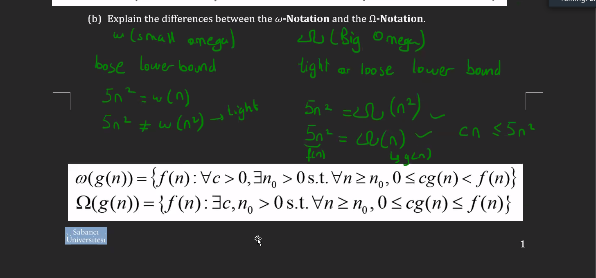

# 3.1 There is a divide–and–conquer algorithm which solves a problem by dividing the problem into 4 sub-problems each with half of the original problem size. It takes D(n) = 5n time to divide the problem into sub–problems and C(n) = 2n² time to combine the solutions from the sub–problems. Write down a recurrence (recursive formula) for the running time of this algorithm.

 > T(n) = [ 4 × T(n/2) ] + 5n + 2n²
 > 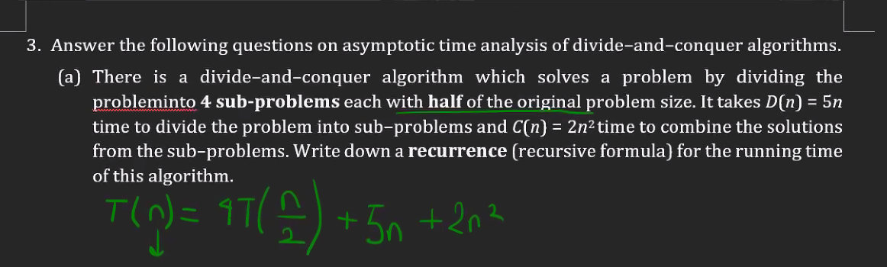
 > 

# 3.2  Write down the recurrence (recursive formula) for the running time of the following pseudo–code:
> 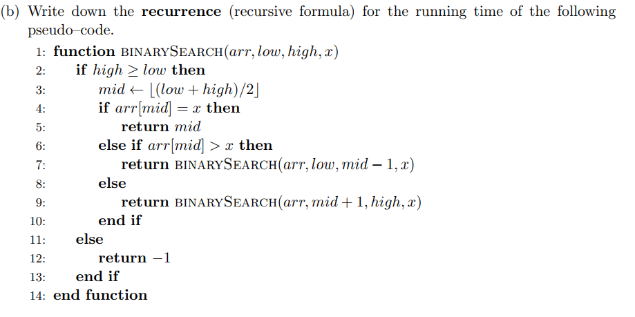
> *`Question 3's b part.`*
> 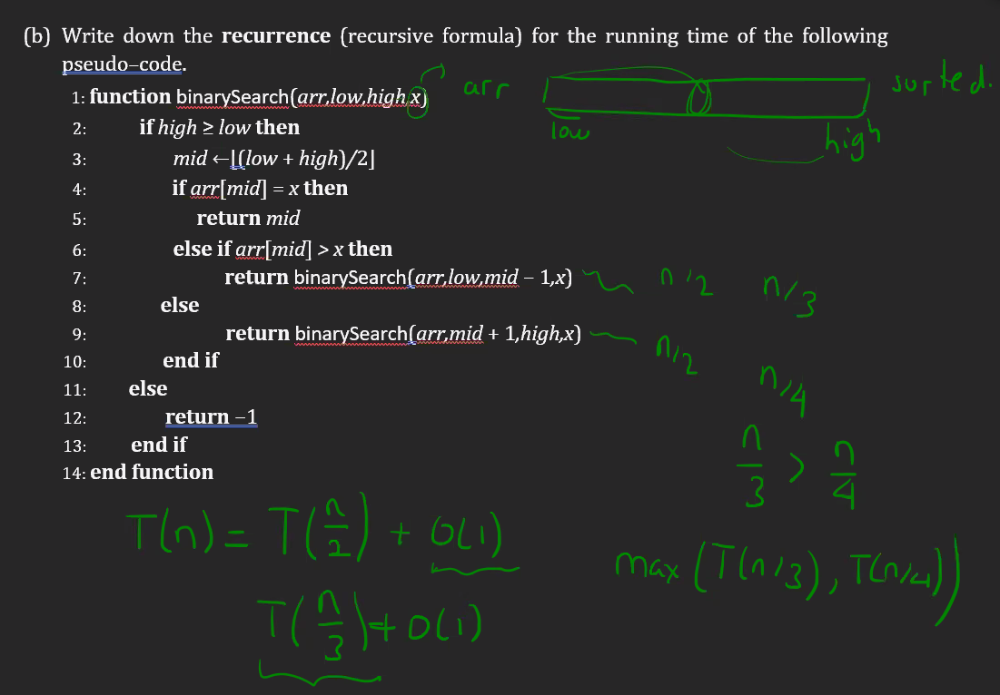
>

# 3.3 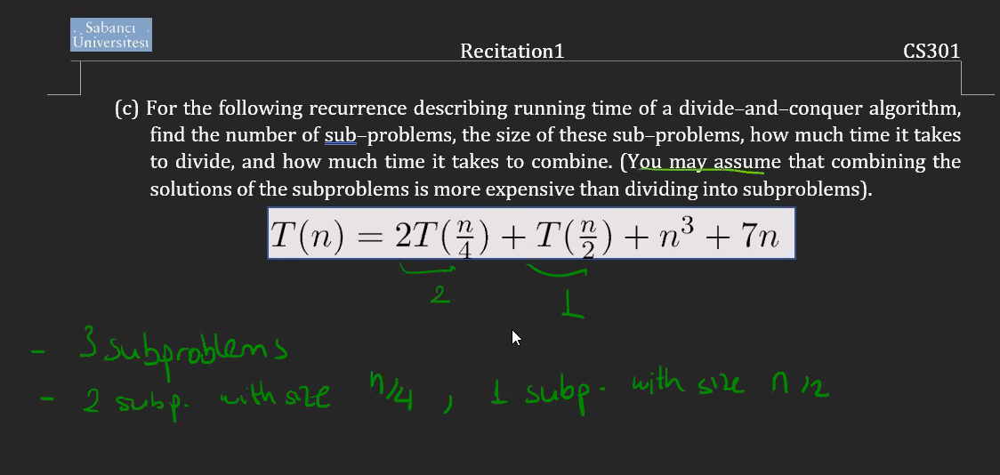
> Combining is more expensive. Can be assumed that combining takes N² time and dividing takes 7N time.
> 

# 4. Let f(n) and g(n) be asymptotically non–negative functions. Using the basic definition of Max of Θ − notation prove that max(f(n), g(n)) = Θ(f(n) + g(n)).
## LHS solution is the proof for the LHS of main written equaation. 
>  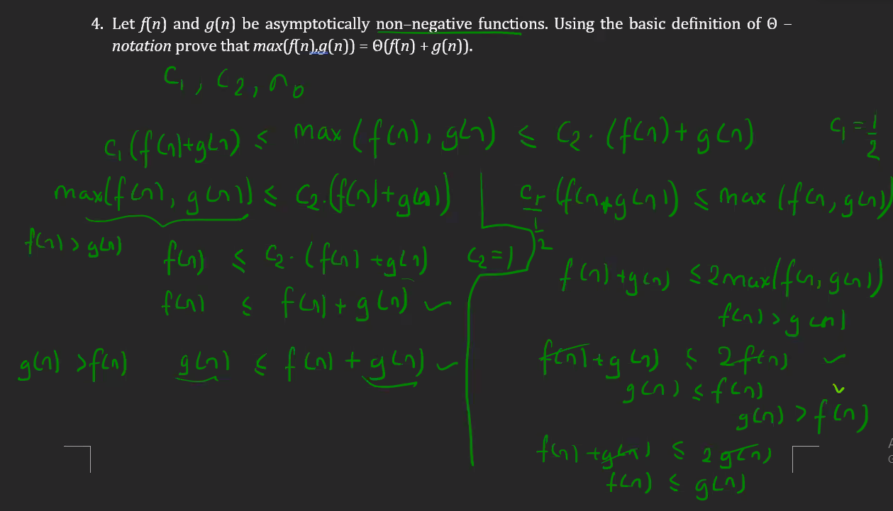
> 
>                               ---
> 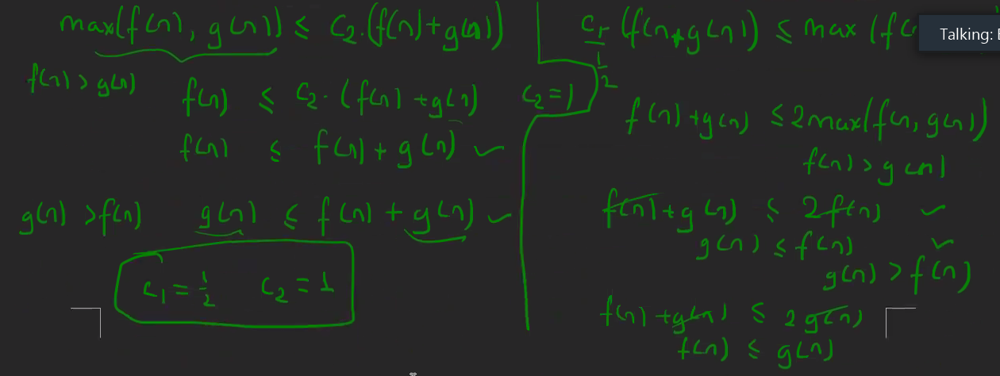

# 5. Are the following claims correct? Explain your answer.
# 5.1 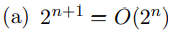
> This is true.
# 5.2 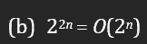
> 4ⁿ will grow faster than 2ⁿ, so this is false.
> 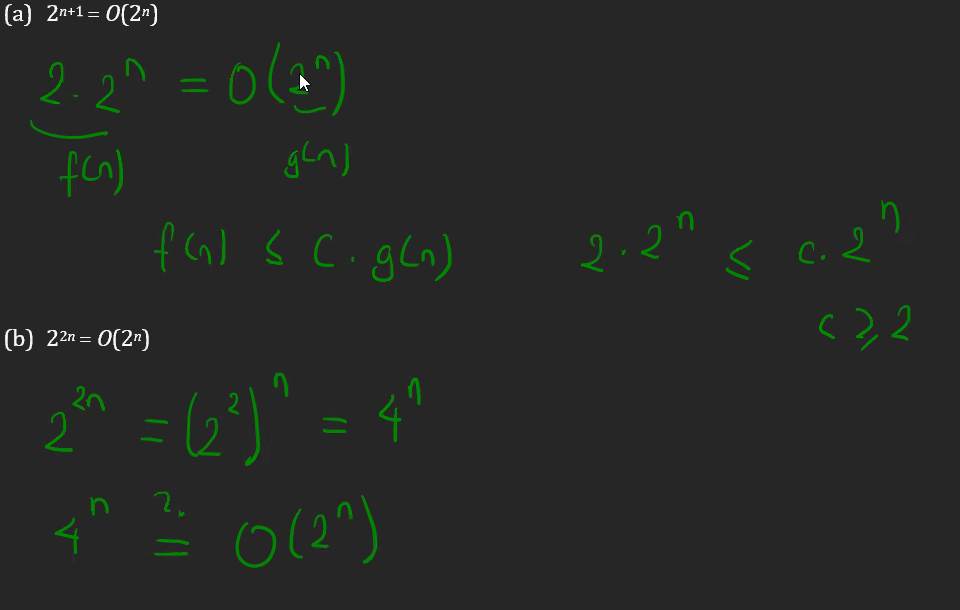

# 6. Show that (an + b)
p = Θ(n p ) by using the formal definition of Θ–notation, where a, b, p are real numbers with a, p > 0.
## Formal Definition of Theta Notation
### 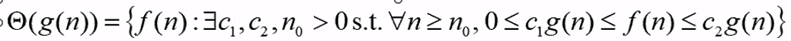
> 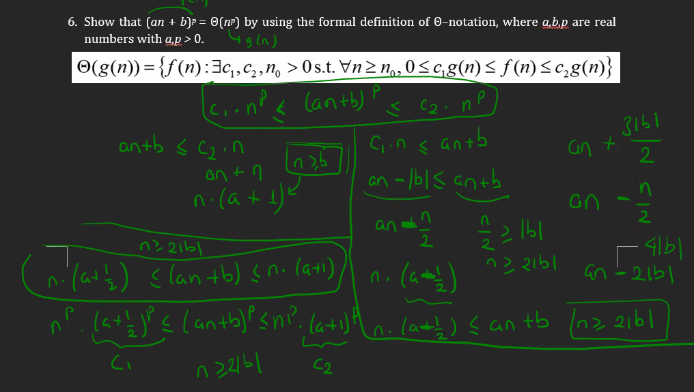
> ---                           ---
> 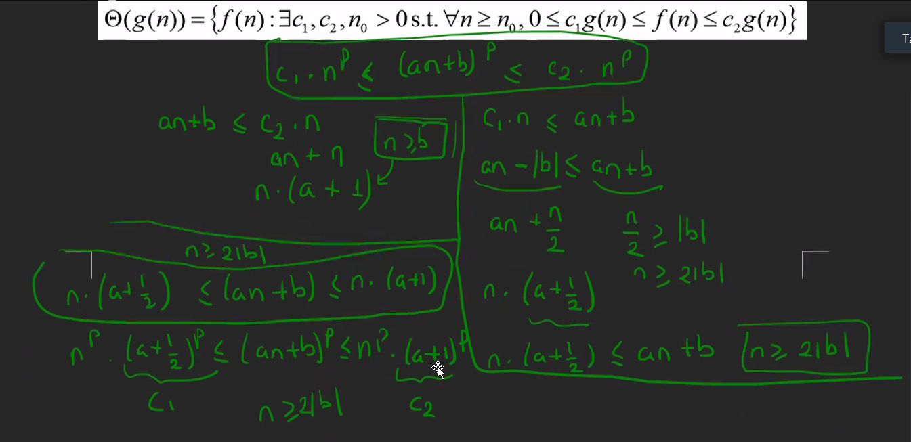
> ---
> 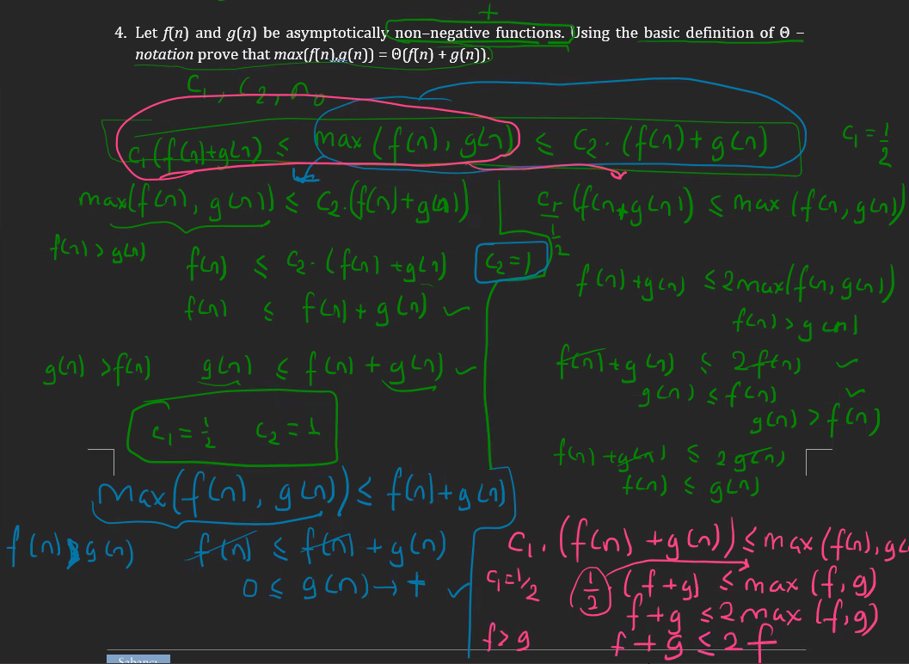
> ---
> 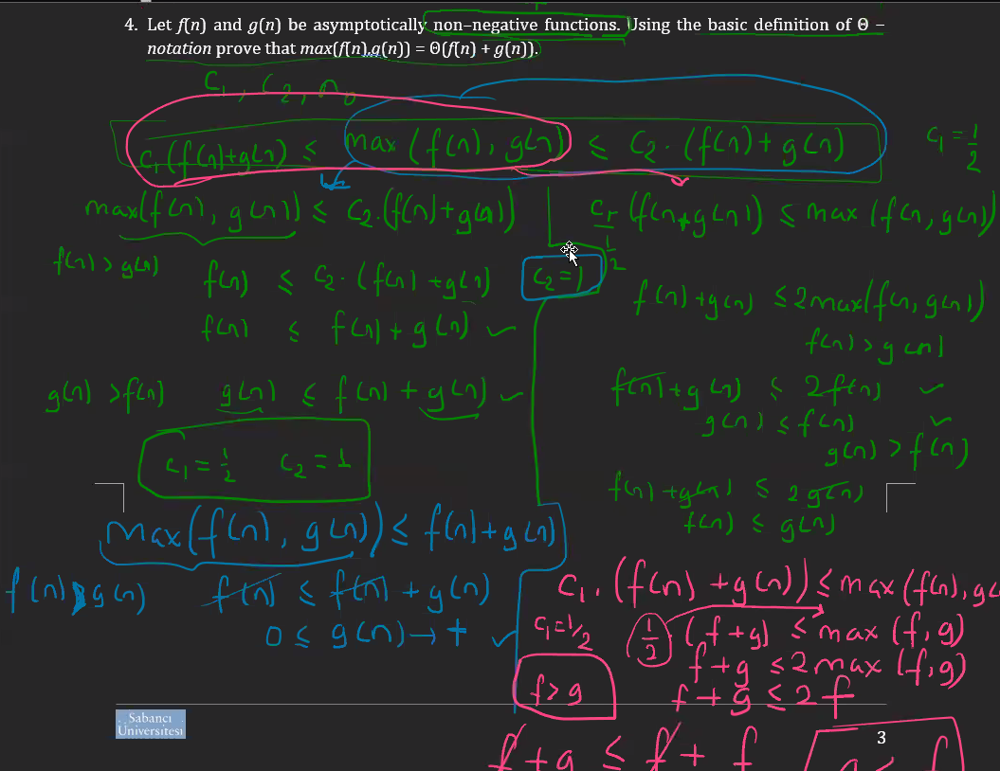

