# 1.
> 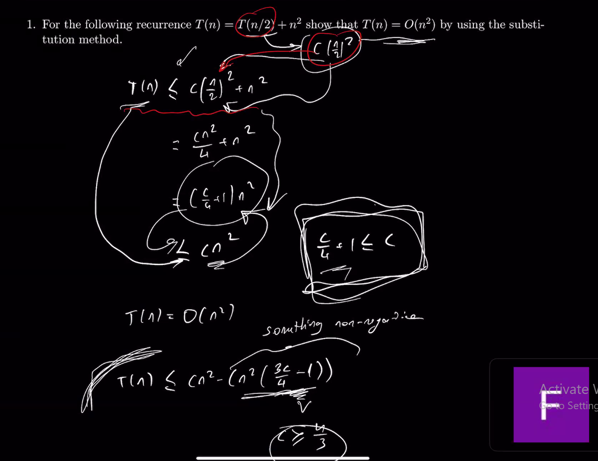
Yes, certainly! Here's the solution with TeX formatting and the corresponding rendering:

Assume that $T(n/2) \leq c(n/2)^2$ for some constant $c > 0$.

Then, we have:

$$T(n) = T(n/2) + n^2$$

$$\qquad \leq c(n/2)^2 + n^2 \qquad \qquad \qquad \qquad \qquad \text{(by our assumption)}$$

$$\qquad = \left(\frac{c}{4} + 1\right) n^2$$

Therefore, we can say that $T(n) \leq \left(\frac{c}{4} + 1\right) n^2$ for all $n \geq 1$. This means that $T(n)$ is $O(n^2)$ with a corresponding upper bound of $\left(\frac{c}{4} + 1\right) n^2$, where $c > 0$ is a constant. We can choose $c = 4$ to get a simpler upper bound of $\frac{5}{4} n^2$, which shows that $T(n)$ is $O(n^2)$.

Thus, we have shown that $T(n) = O(n^2)$ by using the substitution method.

Sure, here's the same solution displayed in a more visually appealing way using LaTeX:

To show that $T(n) = \Theta(n^2)$ using the iteration method, we need to prove two things:

$T(n) = O(n^2)$
$T(n) = \Omega(n^2)$
First, let's prove $T(n) = O(n^2)$ using the iteration method.

We start with the given recurrence relation:

$$T(n) = T(n/2) + n^2$$

Let's assume that $T(n/2) \leq c(n/2)^2$ for some constant $c > 0$ and all $n > 1$ (this is our induction hypothesis).

Substituting this into the recurrence relation, we get:

$$T(n) \leq c(n/2)^2 + n^2$$

Simplifying this inequality, we get:

$$T(n) \leq \left(\frac{c}{4}\right)n^2 + n^2$$

$$T(n) \leq \left(\frac{c}{4} + 1\right)n^2$$

Therefore, if we choose $c \geq 4$, then $T(n) \leq cn^2$ for all $n > 1$, which implies that $T(n) = O(n^2)$.

Next, let's prove $T(n) = \Omega(n^2)$ using the iteration method.

We again start with the given recurrence relation:

$$T(n) = T(n/2) + n^2$$

Let's assume that $T(n/2) \geq c(n/2)^2$ for some constant $c > 0$ and all $n > 1$ (this is our induction hypothesis).

Substituting this into the recurrence relation, we get:

$$T(n) \geq c(n/2)^2 + n^2$$

Simplifying this inequality, we get:

$$T(n) \geq \left(\frac{c}{4}\right)n^2 + n^2$$

$$T(n) \geq \left(\frac{c}{4} + 1\right)n^2$$

Therefore, if we choose $c \leq 4$, then $T(n) \geq cn^2$ for all $n > 1$, which implies that $T(n) = \Omega(n^2)$.
Since we have shown that $T(n) = O(n^2)$ and $T(n) = \Omega(n^2)$, we can conclude that $T(n) = \Theta(n^2)$.

>
>
>

Sure, here's the solution to the recurrence relation T(n) = T(n/2) + n^2 using the iteration method to prove that T(n) = Θ(n^2):

We begin by expanding the recurrence relation using the substitution method:

$$T(n) = T(n/2) + n^2$$
$$= T(n/4) + \frac{n^2}{2^2} + n^2$$
$$= T(n/8) + \frac{n^2}{2^3} + \frac{n^2}{2^2} + n^2$$
$$= \cdots$$
$$= T(1) + n^2\left(1 + \frac{1}{2^2} + \frac{1}{2^3} + \cdots + \frac{1}{2^k}\right)$$

where $k$ is the number of iterations needed to reach the base case $T(1)$. We can simplify the sum using the formula for an infinite geometric series with ratio $1/2$:

$$1 + \frac{1}{2^2} + \frac{1}{2^3} + \cdots + \frac{1}{2^k} = \frac{1}{1 - 1/2} - 1/2^k = 2 - \frac{1}{2^{k-1}}$$

Substituting this into the previous equation, we get:

$$T(n) = T(1) + n^2\left(2 - \frac{1}{2^{k-1}}\right)$$

Since $T(1)$ is a constant, we only need to determine the value of $k$ to determine the order of growth of $T(n)$. We have $n = 2^k$, which implies $k = \log_2 n$. Substituting this into the equation above, we get:

$$T(n) = T(1) + n^2\left(2 - \frac{1}{n}\right)$$

Now, we can see that as $n$ gets larger and larger, the $n^2$ term dominates and the constant term becomes insignificant. Therefore, we can say that $T(n) = \Theta(n^2)$.

Thus, we have shown that the solution to the recurrence relation T(n) = T(n/2) + n^2 using the iteration method is T(n) = Θ(n^2).
# 2.
>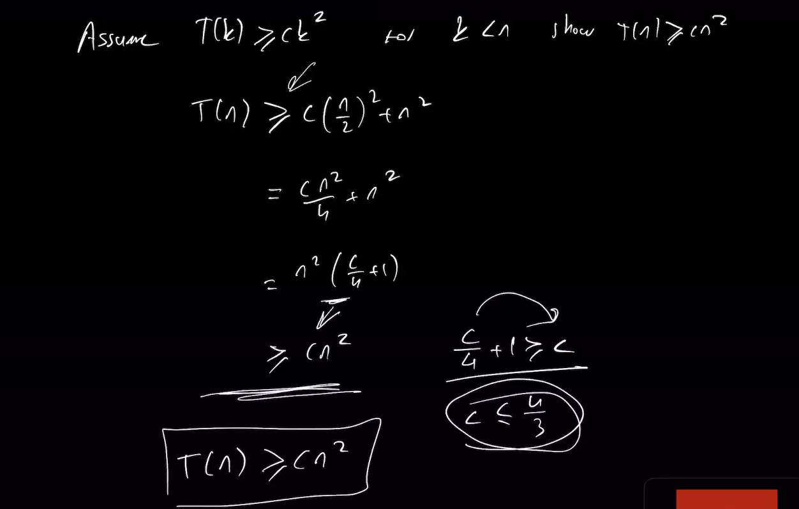
# 3.
> 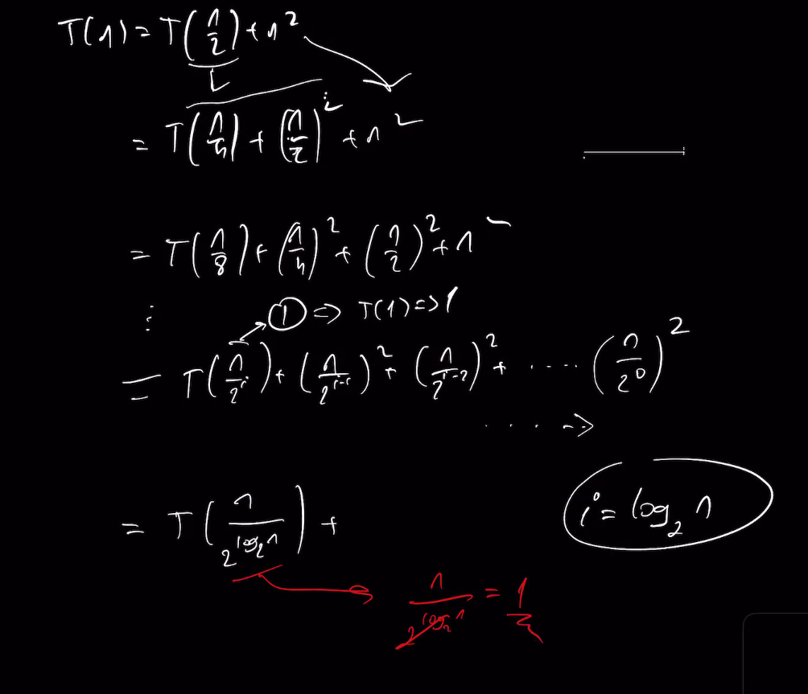
> 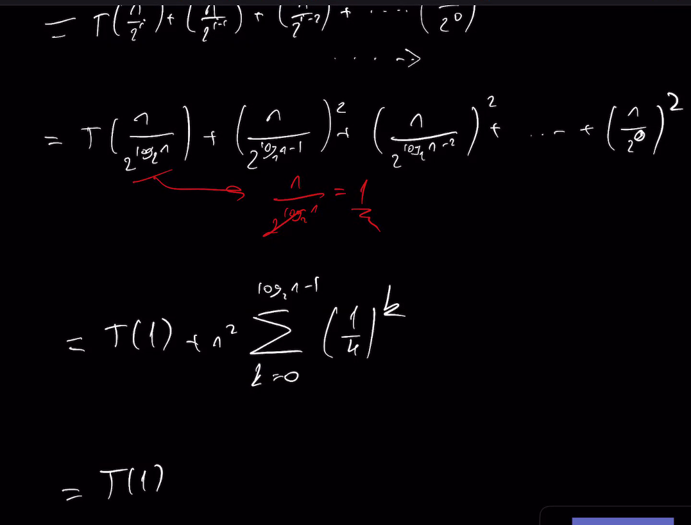
> 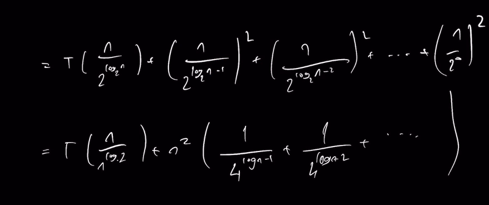
> 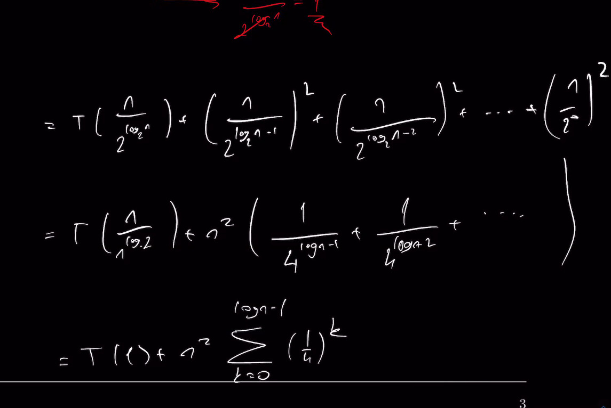
> 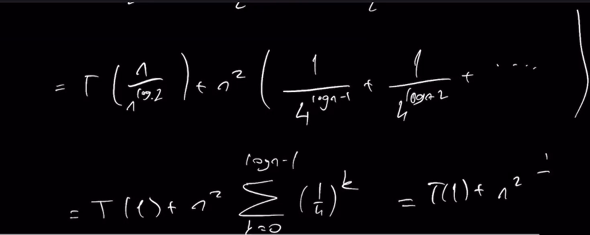
> 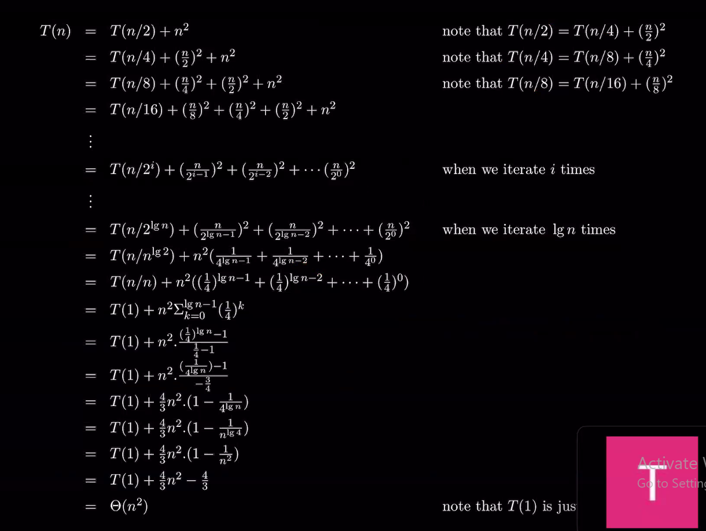
# 4.
> 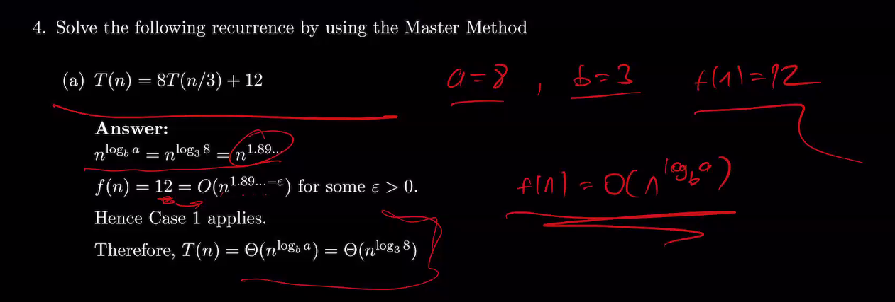
> 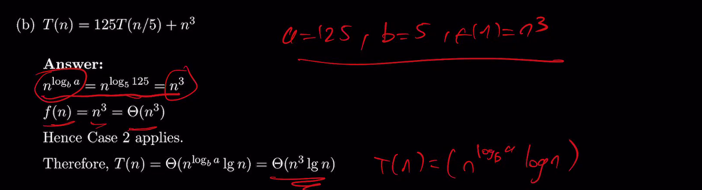
> 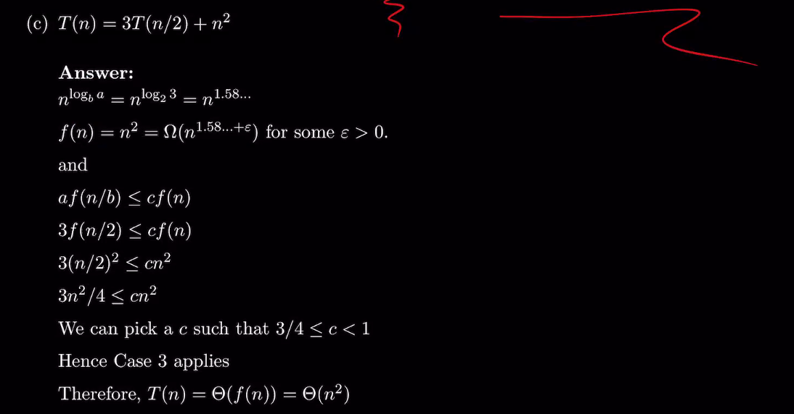
> 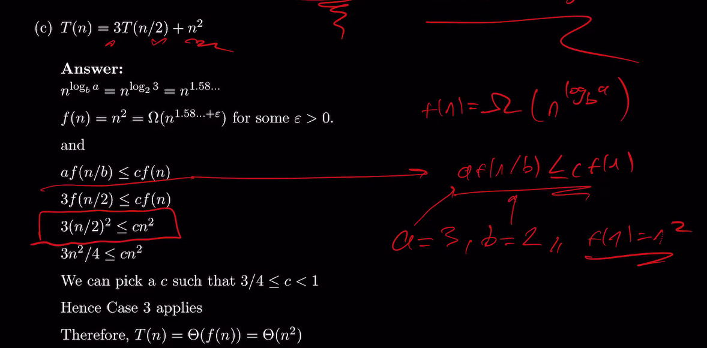
> 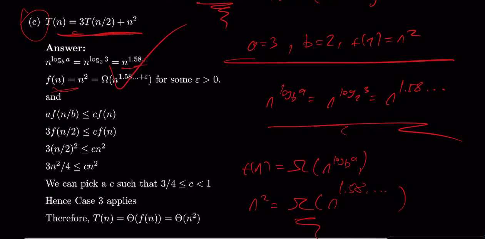
> 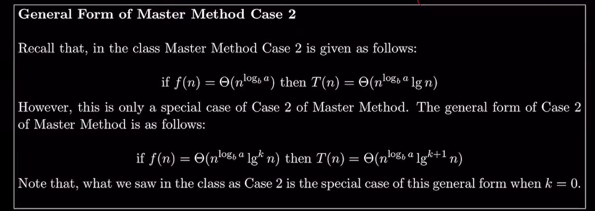
> 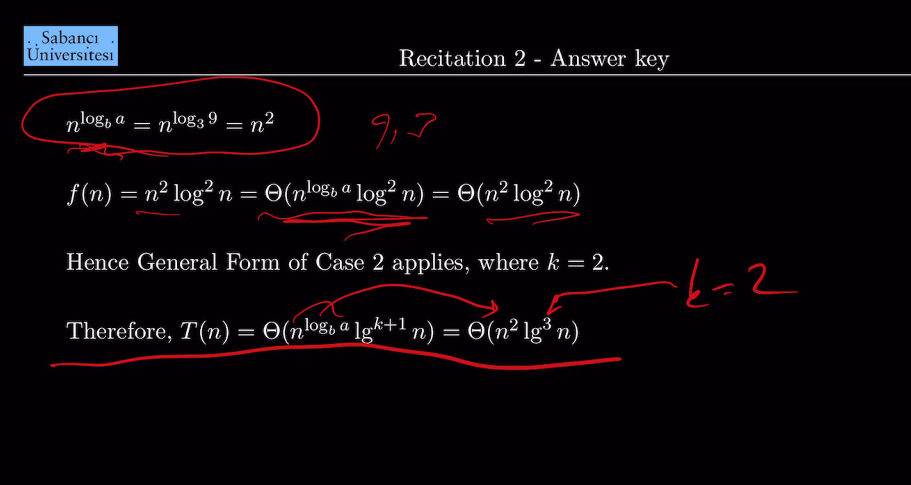
> 