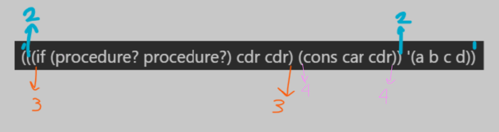

# Week 10 - Tuesday

##  Data Types
### Boolean: #t #f 
> : (boolean? 1) ⟶ #f
> : (boolean? #f) ⟶ #t
>
> Predicate statement is a statement that returns either true or false.
>
> (and #f  #f) ⟶ #f
> 
> (not #t)⟶ #f
> 
> (eq? #t #t) ⟶ #t
> 
> (eq? #f #t) ⟶ #f

### Number
> 1, -2 1.5, -173 are the literals for the numer data type.
>
> (number? -2.5) ⟶ #t
> 
> (number? #t) ⟶ #f
> 
> +, *, - and / are predefined proceduric values. 
>
> (eq? 2.5 -2.3) ⟶ #f
>
> (= 1 1.0) ⟶ #t
>
> > <, >, >=, <=

### Integer
> Any integer is a number but not all numbers are integers.
>
> (integer? #t)
> 
> (integer? 1) ⟶ #t
> 
> (integer? 2.3) ⟶ #f
>
> We also have the equality predicate

### Characters
> #\A ⟶ Capital A, characters have a strange syntax.
>
> #\space ⟶ Special characters are given by this notation
>
> (char ?) ⟶ The type predicate for characters
>
> eq?
>
> char=?

### Strings
> string?
>
> "hello world" ⟶ This is a string literal
>
> string-length
>
> (string-ref "hello" 1) ⟶You get #\e, the character in the specified index (1).
>
> (string #\h #\e #\l #\l #\o) ⟶ You can construct a sequence of values by using the constructor of the string.

### Symbol
> Used very frequently in functional programming languages.
>
> What is a Symbol?
> - Say we have this reference:
>   - (+ x + 1), where x is a variable. 
>   - (not y), complement the value of y, and here y is a variable reference  
>   - (quote y), this is a special, expectional syntax. When we have quote here, the value we get here will be yˢʸᵐᵇᴼˡ
>
> (defere x 1) ⟶
>
> (symbol ? 1 ) ⟶ #f
>
> (symbol ? x) ⟶ #f
>
> (symbol ? (quote x)) ⟶ #t, here quote x is symbol x
>
> (symbol ? 'x) ⟶#t
>
> (symbol 'y) ⟶ #t even if the y is not defined, we just check if y is a symbol.
>
> (symbol? '5) ⟶ f, Same thing as asking if 5 is a symbol

> We talked about type predicate and eq? predicate.
> - (eq? 'x 'y) ⟶ #f, these are two symbol values one is x xymbol and other s y symbol, 

### Lists
> Very important for functional programming languages. First programming language we have is called LISP because of the name `LIS`t `P`rocessing. The elements might have different data types, and we can have lists where each element has a different data type. 
> - Confusingly, lists use the smooth paranthesis notation.
>   - (1 #t hello) is a list with 3 elements.
>
> An element of a list can also be a list, we can have a list like: (1 (#t #f) ()). First element is number 1, second element is a list consisting of two boolean values and third element is an empty list.
>
> We have the type predicate for the list data type as well:
> - (list ? #t) ⟶ #f
>
> How do we generate list values? There are several ways:
> - Using the `quote` operator:
>   - '(1 2 3), this is a generated list value with 3 elements
>   - (list? '(1 2 3)) ⟶ #t
>   - (list? '(a b (cd))) ⟶ #t, The list is consisting of 2 symbol values and a list with 2 symbol values with 3 elements in total.
>
> (quote (a b 1 2)) will generate this list: (a b 1 2).
>
> - Another way of constructing a list is by using the constructor:
>   - (list ex1 ex2 ... exn). Say ex1 is evaluated to v1, ex2 to v2 and exn to vn. The list expression evaluation will evaluate to (v1 v2 ... vn).
>   - (list 1 (+2>) 'x) ⟶ (1 5 x), List is another procedure that we can use to construct the list data type.
>   - (list) ⟶ Having 0 elements is also possible 
>
> - Anohter way of generating lists is by using `cons` procedure. It takes two parameters only. So when we evaluate cons:
>   - (cons exp1 exp2), second expression should evaluate to a list value such as (v1 v2 ... vn), and exp1 should evaluate to a value. The evaluation of the cons will evaluate to ⟶ (v0 v1 v2 ... vn). There's an exception for this.
>   - Say we have (cons 'a '(bc)) ⟶ A list with 3 elements (a b c)
>   - (list 'a '(bc)) ⟶ We have two operands, so we have two elements to construct. ⟶ (a (bc)).
>   - (cons '(ab) '(cd)) ⟶ Value of the first expresson will be a list, and the rest of the list will come from the second operand ((a b) c d)
>   - (cons  '() '(c d)) ⟶ (() (c d))
>   - (cons '(cd) '()) ⟶ ((cd)) 
>
> What if exp2 is not a list for cons?
> - (cons 'a 'b), when we evaluate this we will see something like a list but with a . ⟶ (a . b), and the evaluated value is a pair. Pair is related to a list, and list is implemented by making use of list.


## Week 10 - Friday
### append
> `append` is a procedure used to append lists
> : (append '(1 2) '(3 4) '(5)) ⟶ (1 2 3 4 5)

> If you want to access the elements of a list, first element can be accessed easily with `car`, we have `cdr`. The first element is stored by itself, address register, and the rest is stored in a pointer. Accessing the content of address register is called `cdr` and accessing the content of decrement register is called `cdr`
>
> const gets the first element and a list and puts them together by placing the first element as the new element of the list.
>
>
> The `quote` procedure `'`, we get a list. So '(b c) evaluates to (b c).
>
> (cons 'a '(b c)) ⟶ (a b c), a list having three symbols named a, b and c.
> : ( car (cons 'a '(b c))) evaluates to ⟶ a
> : ( car (cons 'a '(b c))) evaluates to ⟶ (b c), `cdr` skips the first element and provides the rest of the list.
>
> (car (cdr '(a b c))) ⟶ '(a b c) evaluates to (a b c), 
> - cdr of (a b c ) is the list (b c) 
> - and the car of the (b c) is the symbol b.
>
> (cdr '(,)) ⟶ ()
> 
> (car '(a)) ⟶ a
>
> (car '()) and (cdr '()) ⟶ Error. It is not possible to perform car and cdr to empty lists.
>
> There are predefined compoisitions of car and cdr procedures such as:
> - (caddr '(a b c d)) ⟶ We read it from left to right
>   - It means (car (cdr ( cdr '(a b c d ))))
>       - First, we have (cdr '(a b c d)). The list will be (a b c d), the cdr of this list will be (b c d). 
>       - Secondly, the cdr of (b c d) will be (c d)
>       - Thirdly, the car of (c d) will evaluate to c.
>
> Another procedure that we need is empty list predicate: the null predicate.
> - (null? '(a b c d)) ⟶ #f Checks if a list is empty or not. Evaluates into a boolean value. 
>   - (null? '()) ⟶ #f
>   - (null? (cdr '(a))) ⟶ #t. The rest of the elements of list (a) is null.
>   - (null? (cdr (list 15))) ⟶ #tThis would create a list with one item only. That item is number 15. When we take the cdr of (15), the result will be false.
>
> null? returns true only if the parameter we provide is an empty list/an empty object. Anything other than an empty list will return false.
> - (null?  5) ⟶ #f
>
> We have cons to create to list values, and have car cdr to work on the available list values.


### Pairs
> Pair data type is used to implement a list. A list is actually a pair. It is implemented by keeping the first element in a cell and a reference to the rest of the list. (address register and decrement register. First element is located inside address register and the rest are stored inside the decrement register).
>
> For a pair, the second element doesn't have to be a list. It can be any element.
> - (cons 1 2) ⟶ (1 . 2). First item is placed into a cell and second item is placed into the second cell. First element is called as `car` and the second element is called as `cdr`. If you form a pair using cons, you can react the second element of the constructed pair by cdr:
> - (car (const (1 2))) ⟶ 1
> - (cdr (cons (1 2))) ⟶ 2
>
> The type predicate for pair is `pair?`. Checks if a data type is a pair or not.
>
> Every list is a pair but not every pair is a list.
>
> - (pair? (cons 'a 'b)) ⟶ #t
> - (cons 'a '(bc)) ⟶ This will construct a list (a b c). 
> - (pair? (cons 'a '(bc))) ⟶ #t
> - (list? (cons 'a 'b)) ⟶ #f. The second element is not a list so cons will produce a pair. Not every list is a pair so this evaluates to false.
> - (list? (cons 'a '(b c))) ⟶ #t
> - (pair? '()) ⟶ #f. Empty list is of null type.
>
> 
> - (cons 'a 'b) ⟶ (a . b). This is a pair of two symbols a and b.
>   - [a|b]
> - (list 'a 'b) ⟶ (a b). This is a list of two symbols a and b.
>   - [a|.] ⟷ [b|\\]. The second element here inside the first cell is a pointer to the rest of the list.
>
> The [] stuff is called as box diagrams.
> - (a . (b . ())) means [a|.] ⟷ [b|\\]
>
> If you construct a list having three values: (1 2 3), there will be three pair cells used to implement this list.
> - 1, 2 and 3 will each correspont to a pair value.
>   - [1|next cell] ⟷ [2| next cell] ⟷ [3|\\]. This is a linked list structure.
>
> (1 (2 3) 4) ⟶ (2 3) is a list. [2|next cell] ⟷ [3|\\]
> - [1|next cell] ⟷ [pointing to the expression above|next cell] ⟷[4|\\]
>
>
> [pointer to 1|next] ⟷ [2|next] ⟷ [3|4]
> - [1|\\]
> - At 4, the program says 4 is not a null object. The expression above is a pair. Put a dot for each vertical bar. Left of dot is a value. Right of dot is where it points to. For each bracket, we put paranthesis.
> - ( (1.\\) . ( 2 . (3.4)) )
>
>
> Every cell corresponds to a pair:
> - [a|b] ⟶ (a . b)
>
> (eq? 'a 'b) ⟶ For simple values such as integers, boolean, etc.

### define
> `define` helps bind to a value.
> - (define a (cons 3 '())) ⟶ cons construts a cons cell. [|].  
> - First argument is placed into car field. 
>   - Second argument is placed into the cdr field of this cons cell. 
>   - [3|\\]
>       - Now, a will point to the cell [3|\\].
>
> - (define b (cons 3 '())) ⟶ Every time a cons is evaluated, a cons cell is evaluated. 
>   - [3|\\]
>       - Now, b will point to the cell [3|\\].
>
> - (eq? a b) ⟶ #f
> - (eq? a a) ⟶ #t
> - (define c b)
>   - (eq? c b) ⟶ #t because they are the same object.
> - (define d (cons 2 b))
>   - Whenever you see a cons, create a cell. [2|b]. cdr field is the value b. cdr field will point to b.
> - (define e (cons 2 c))
>   - [2|c]. car field will be 2, cdr field will point to c.
> - d ⟶ (2 3)
> - e ⟶ (2 3)
> - (eq? d e) ⟶ #f
> - (eq? (cdr d) (cdr e)) ⟶ #t
>   - cdr of d is 3 and cdr of e is 3, so the statement evalates to true.

> - Boolean
> - Number
> - Integer
> - Char
> - String
> - Symbol
> - Lists
> - Pair
> - Vector ⟶ vector?
>   - (vector-ref (vector 1 2 3) 1) ⟶ #(1 2 3). `#` indicates that these values are in a vector, not a list. For 1, 0 based indexing is used.
>   - (vector 1 (+2 3)) ⟶ #(1 5)
>   - (vector-ref)
> - Procedure ⟶ Procedures are also data types.

### Procedures
> For all data types, we have type predicates.
> - For procedure, we have a type predicate as well
>   - (procedure? +) ⟶ #t
>   - (procedure? procedure?) ⟶  #t
>       - procedure procedure is itself indeed a procedure
>   - (procedure? 5) ⟶ #f, 5 is an integer, not a procedure
>   - (procedure? 'car) ⟶ #f, The value of car procedure is a symbol, so the expression evaluates to false.
>   - (procedure? vector?) ⟶ #t
>   - (((if (procedure? procedure?) cdr cdr) (cons 'car cdr)) '(a b c d))
>       - 
>       - First cdr is the then expression and cdr is the else.
>           - cdr will evaluate the result of if's result.
>               - cdr procedure, it will apply cdr procedure to (cons 'car cdr), which is the paranthesis 4.
>           - Whenever a cons is evaluated, a cons cell/pair is created.
>               - [symbol car|cdr procedure]. cdr procedure will be applied to this value.
>           - When we apply cdr procedure to [symbol car|cdr procedure] will be the value of the cdr field, which is the cdr procedure. Now, we know the value of the expression, it is the cdr procedure.
>           - The cdr procedure will be applied to the list of 4 symbols (a b c d). 
>           - cdr of (a b c d) is (b c d).
>
> Procedures are data types and we have a constructor for procedure.

### lambda
> Lambda is the constructor for procedures. Lambda is a keyword indicating that the following expression evaluates to a procedure.
> - After lambda, we give formal parameters. After formal parameters we provide the body expression. We can store procedure into variables.
>   - (lambda `formal parameters` body expression)
>   - (lambda (n) (+ n 1)) ⟶ There's a formal parameter n here. The expression to be written next to n will use the parameter n. Body of this is (+ n 1). The lambda expression will return the result of the body expression.
>   - This expression evaluates to a procedure value.
>   - (procedure? (lambda (n) (+ n 1))) ⟶ #t
>
> If you want to apply a procedure, we simply write it inside paranthesis.
> : ((lambda (n) (+ n 1) ) 7)
>   - When this expression is evaluated, notice that the value is hard-coded, the parameter value will be 7 and returned result will be 8. That's the semantics. When we perform a procedure without any assignment, we lose the returned value from the body expression. We don't need to have a variable to store the result actually.
>
> We can have procedures with multiple parameters.
>
> (define foo1 (lambda (n) (+ n 1))) ⟶ Once this expression is evaluated, the procedure value will be stored inside foo1. It's like giving a name to a procedure, but the approach is slightly different.
>  - (define foo2 lambda( () 5 )) ⟶ A lambda procedure that takes no parameters.
>  - foo1 ⟶ procedure value
>  - foo2 ⟶ procedure 
>
> - (foo1 7) ⟶ 8
> - (foo2 ) ⟶ 5
> - (foo1 (foo2) ) ⟶ foo2 will return 5, and foo1 will use the value 5 and return 6.
> 
```
( define myPair (cons 
    (lambda (x y) (+ x y))
    (lambda (x z) ( - x z))
    ))
```
> myPair is this: [The first lambda|The second lambda]
> - ((car myPair) 1 ((cdr myPair) 1 5))
>   - Second value comes from the cdr of myPair, and they are 1 and 5.       [-4|-3] 
>       - 1 - 5 = -4
>       - 1 + (-4) = -3
>
> - (define add2 (lambda(n) (+ n 2)))
>
> ```
> (define compose (lambda (f g) 
>     (lambda (x)
>         (f (g x)))
>     ))
> 
> ```
> We will return a procedure inside the second lambda expression.
> - (define add4 (compose [`add2 (f)`] [`add2 (g)`] ))
>   - (add4 7) ⟶ 11

## Week 11 Tuesday
> - (car '(1 2 3)) ⟶ 1
> - (cdr '(1 2 3)) ⟶ (2 3)

### subst
> Whenever we see a symbol in a list, replace it with a symbol.
> - (subst 'a 'b '(c a d a)) ⟶ Search for symbol a' and replace it with symbol b'. a' is the old symbol and b' is the new symbol.
> - (subst 'a 'b '()) ⟶ ()
>
> Defining subst with lambda:

```
(define subst (lambda (old new lst)
    (if (null? lst)
        '()
            (if (eq? old (car lst)
1               (cons new (subst old new (cdr lst)))
2                (cons (car lst) (subst old new (cdr lst))))))))
```
>   - Do not try to overwrite a list, simply create a new list. Use recusrion instead of a loop. Make sure to decide when will the recursion will terminate. Recursion will be on typically on the cdr of the list. 
>       - When will this recursive process terminate? Buranin cok ustunde durdu sinavda sorabilir.
>  
> The else part:
> - The car of the cdr is not the old symbol, in that case I'd like to keep it. Do not overwrite the list, construct a new list, where we keep the current car of our lst. 
>
> Say we called it with (subst 'a 'b '(d d d d))
> - Our procedure will return us (d d d d). The input list and output list will be different because the output will be newly created.
>
> Let's try to allow nested lists.
> - (subst 'a 'b '(a c (a c (a a) c d)))
>   - In this case, we want to get the same list where all the 'a symbols are replaced by 'b symbol. ⟶ (b c (b c (b b) c d))

```C
(define subst (old new lst)
    if (null? lst)
        `()      This is the termination condition of recursion
        (if (symbol? (car lst))
            (if (eq? old (car lst))
1                (cons new (subst old new (cdr lst)))
2                (cons (car lst) (subst old new (cdr lst))
3                (cons (subst old new (car lst)) (subst old new (cdr lst))))))
)
```
> Else part will be used when first element is a list. What do we do when we have a list?
> - We never try to overwrite the elements of the list, instead we copy them into a new list.
>
> - During the execution of the body, only one of them will be evaluated. It is not something we repeat.
>
> 1. Construct a new list using the rest of the input list
> 2. Construct a new list, where old symbol is the first element of the input list and list will be the result of the recursion.
> 3. Construct a new list where first element is the first element of input list and list is also the result of the recursion with the rest of the input list.

### let
> Each binding is in the form of a variable and then an expression. You can have as many bindings as you want.
>
> EXPRESSION OF SEMANTICS
>
> (let ((x1e1) (x2e2 ... (xn en) <body expr>)))
>
> - Sinav? Dikkatli dinleyin dedi.
> - When e's are evaluated and we get the values of them. Then, the result of e's are binded to variables x1, x2. After binding result of e1 to x1 and so on, we evaluate the body expression. The value we get from the body expression is the new value.
>
> - (let ((x 3) (* x 4))) ⟶ 12
> 
> - (define x 4) ⟶ x is 4
> - (let ( (x 3) ( * x 4))) ⟶ 12
>   - (x 3) is like a local variable binding which will be only effective during the body expression.
>   - Here, x will be still 4 due to the define statement.
>
> - (let (x 3) (y 4) (+ x y)) ⟶ 7 3
> - (let (x 3) (y x) (+ x y)) ⟶  Here, will the value of x be the local value or the global value? 
>   - It will come from the global scope.
>   - Expressions are evaluated first inside lets tatements. So, (x 3) will be evaluated first. Then, (y x) will be evaluated but the value of x will be coming from the global scope. (+ x y) will produce 3 + 4 = 7. 
>
> We said for programming languages, we have to explain two things, which are:
> 1. Syntax
> - We have formal notations
> 2. Semantics
> - We use natural language to explain
>
> There are other explanations for semantics, called `operational semantics`.
> - We currently know what it means to have a procedure:
>   - ((lambda (x y) (+ x y) 3 5)) ⟶ x is 3, y is 5, then body expression is evaluated which is 3 + 5 = 8.
>  
> It can be explained like this: 
> - (let ( (x1 e1) (x2 e2) ... (xn en) ) expr)
>   - ((lambda (x1 x2 ... xn) expr))         

## Week 11 - Caglar Yildirim Tuesday
### AI-Enabled Autonomy
> ...
> 
### AI and the Sorcerer's Autonomy
> Machine autonomy:
> - Intelligent agents take initiative because they know what your interest/intentions are
>
> Human agency/control:
> - Software designs that give users high level of understanding and control over their AI-...

### Sheridan-Verplant (1978) One0Dimensional Model
> Increased automation means less user control

### BenSchneiderman Human-Centered AI
> The HCAI Framework - Sheiderman
> - Schneiderman (2022) Two-Dimensional Model
>   - It is possible to ensure human control while increasing computer automation. We can increse and decrease their level indepentent from each other.