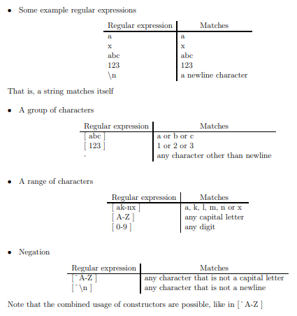
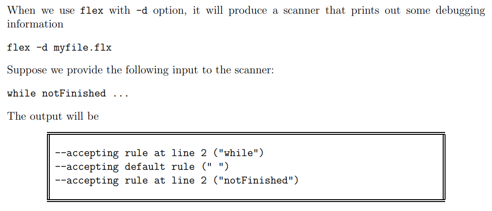

# 1. Programming Language Paradigms
## 1.1 Imperative (Mecburi)
Languages within the imperative paradigm are action oriented. They are influenced by and reflect how microprocessors work. A microprosessor performs computations by executing instructions one after another. Firs imperative programming language is FORTRAN, other famous languages that belong to the  family are Pascal and C. A fun fact about Pascal is that it was meant to be used for educational purposes in colleges, which turned out into one of the most influential programming languages. On the other hand, C was designed to be a language for implementing system programs for UNIX operation system.

## 1.2 Functional 
---

## 1.3 Object Oriented
The notion of class of objects first existed in Simula, a language originally designed to describe and program simulations. C++ is inspired from C.

## 1.4 Logic
Prolog is the most important representative of the logic programming paradigm. It was developed for natural language processing problems. It is actually composed of giving out facts and propositions to the computer, and then asking questions whose answers are supposed to be derieved from these facts and propositions.

## 1.5 Parallel
A parallel programming language posesses the concepts and provides the primiatives to describe a set of components that are running simultaneously to acoomplish a certain common goal/job.

# 1.5 Programming Domains
Winnie toy example

## 1.5.1 Scientific Applications
First computers were solely developed for the purpose of scientific computation. Mainly, floating point operations were needed and most common data types used in the machines were arrays and matrices. Most common structures were loops and condidtionals. The high level programming languages invented to meet these needs. Then came the first high level programming language: FORTRAN (Which stands for FORmula TRANslation)

## 1.5.2 Business Applications
The first successful language for business application was COBOL (COmmon Business Oriented Language).

## 1.5.3 Artificial Intelligence
This area of applications is characterized by the use of symbolic computations (rather than numberic computations). Numberic computations are performed using arrays. However, symbolic computations are better at computations using linked lists. The first widely used language for AI was the functional language LISP (1959). Many dialects of LISP appeared later on such as Scheme and ML. Another paradigm, logic programming, is also used for AI. Prolog appears as the most successful logic programming language. 

## 1.5.4 System Programming
C became almost a standard for system programming, and UNIX is completely written in C. Then, several control structures were added,  *awk* began as a language for generating reports, and then expanded into a more general language later. *Perl* started as a combination of *sh* and *awk* and then became a powerful but simple language. *Javascript* by Netscape is used for scripting purposes both in web servers and browsers.

## 1.5.6 Special Purpose Programming Languages
There are languages designed and use for specific purposes. They provide necessary features required by their specific application domain. They excel in their field, but it is hard to compare them with any other more general purpose languages.

# 1.6 Evaluation Criteria
We use **readability-writability, reliability** and **cost** measures to judge the values of programming languages.

## 1.6.1 Readablity-Writability
One of the most important factor for judging a programming language is the ease of with which programs can be read and understood. Before 1970, software development was largely thought in terms of writing code. Nowadays coding is only a small part of software development. Major part of the development goes to maintenance, which implies reviewing a code, finding bugs, etc. which all requires the understanding of a previously written code. There are several factors affecting the **readability of a language** such as:
- A language that has a **large number of basic structs** is harder to read, and the programmers tend to learn and use a subset of the language. If a person reading the program is different from  the person who has written the code, there will be difficulty when they are used to different subsets of the language.
- **Feature multiplicity**, which means multiple ways of doing the same thing, is another feature that reduces the readability of the program.
```c++
i = i + 1
1 += 1
1++
```
- **Operator Overloading**, single symbol, multiple meaning, is a potential danger for readability. It is actually a useful feature for increasing readability (such as the + operator for integer and real addition)
- **Orthogonality** is a small number of control data structures, and a small number of ways to combine them,
- **Control Structures:** Structured programming yields in much more readable programs than ones with pure *goto* jump statements. In fact, structured programmingw as born as a reaction to poor readability of the programming languages in 50s and 60s that allowed liberal use of goto statements.
- The main observation and claim of structured programming is that:
  - A program is more readable if the control flow of the program during its execution more or less follows the sequence of blocks that we visit during reading the source of the program.
- **Data types** are sufficient facilities for defining for defining data types and structures increasing the readability. For example, a boolean flag `finished = true` is much more readable than `finished = 1`. 
  - Similarly, **structs** help to increase readability by collecting data closely related to each other in a single object. By having our data organized appropriately, we would increase the readability of the program.

## 1.6.2 Reliability
A program is said to be reliable if it performs its intended functionality under all conditions.

### Type Checking
A type error occurs when the actual and intended type of an expression are different. In addition, different type of expressions use different memory layouts. For example char takes 1 byte and int takes 8 bytes. Type checking can be preformed eithera at either compile time or at run time. However, type checking at run time is expensive so compile time checking is more desireable. Note that full type checking may not be possible at compile time, such as arrays' out of bound check for indices.

### Exception Handling
Almost all programs are buggy. It is a hard task to consider every condition that the program will probably face and the unforeseen conditions will cause a malfunction in the program. It is important to be able to catch errors at the run time, even if the reson for it is unknown, and recover from the error.

Some languages offer **Exception Handling** facility to catch run time errors and to take corrective measures, which increases the readability of the programs written in these languages. Some language example are C++, Java and Ada.

### Aliasing
Aliasing is to have two or more references to the same memory. For example two pointers pointing to the same memory location:
```c++
char x;
char *p;

p = &x;
x='a';
*p = 'b';
```
Aliasing is a typical source for common errors unless it is used with extreme care (assign one, the other also changes.) Some programming languages prohibit aliasing completly to increase the reliability of the programs.

### Readability and Writability
If it is easy to write and understand the programs, then it is more likely that it will be easier to correct them, hence they will become more reliable.

## 1.6.3 Cost
Cost of a language is also an important factor for its evaluation. However, it is hard to asses the cost of a programming language.
- **The cost of training:** Training programmers for the programming language (simplicity, less number of constructs)
- **Cost of development:** Closeness to the application domain affects the cost of development. If a language is designed for system programming, then it will be quite expensive to web programming with it (it is cheaper to use a language that is designed for web programming). 
- **Cost of available tools:** Availability and cost of the development tools, such as compilers and IDE, will affect the cost of projects developed in a language. For example Java's popularity is mainly for its free development environments and compilers. Ada is a bad example.
- **Cost of executing programs:** Run time type checking slows down the programs. If fast code is required, a compiler with good optimization is neeeded. For educational purposes, requiring frequent compiling and run a few time applications, a fast compiler is better.
- **Cost of poor reliability:** If the application to be developed is critical, then a language with high reliability is better, such as controlling an X-ray machine.
- **Cost of maintaining programs:** Readability.

# 1.7 Influences On The Language Design
## 1.7.1 Computer Architecture
The basic architecture of the computers have a basic role on the design of the language. 
- The dominant architecture for computers is von Neumann [`John von Neumann`] [`von Neumann Arch`]
  - The program and data are stored in the memory, a random access memory (RAM).
  - CPU and the control unit are seperate from the memory.
  - The instructions in the program are fetched from the memory and executed by the CPU. 
  - Data is received from the memory, operations are performed on it, and then the result is stored back at the memory.

A language yields fast running programs if it's constructs are close to the machine architecture on which the programs will be executed. Imperative languages use constructs that mimic the operations and components of von Neumann architecture.

The basic properties of imperative languages:
- Variables (memory cells)
- Assignments (x=y+z, read y and z from the memory, add them up in te GPU, store the result to the memory cell for x)
- Iteration: Most efficient way of implementing repetition on von Neumann (instruction are stored in adjacent memory cells, jump back is easy)

Altough recursion is often more natural way for repetition, it is not suitable for von Neumann. Functional languages provide constrcuts to express repetition as recursion easily. It is possible to write programs without the variables in this sense we are used to, and it is usually more natural.

# 2.2 Syntax Description
The basic unit used in the syntax description of a programming language is called a **`token`**. For programming languages, punctuation symbols are also tokens. The spelling of a token is the actual sequence of the characters (= the elements of the alphabet) that form the token. This is also called as the **`lexeme`**. For example, the lexeme for **`tASSIGN`** in C is **`=`**, lexeme for **`tASSIGN`** in Pascal is **`:=`** and **`tIF`** in C is **`if`**.

Consider this code fragment in C:
```C
int width = 13;
int length = 55;
```
There are 5 tokens in it.

## 2.2.1 Recognizing Tokens

The first phase of a compiler is **`lexical analyzer`**. Note that, a program, being a sentence in programming language is simply a sequence of characters in the alphabet of the language. 

The purpose of a lexical analyzer is to *scan* an input program, and convert the input program (sequence of characters) into a sequence of tokens.

A lexical analyzer is also called as a **`scanner`**, as it scans the input program. We use regular expressions to desribe legal numbers and identifiers.

Regular expressions are patterns of characters using which we can describe sequences of characters obeying a certain combination rule. Using these patterns, we can describe which sequence of characters should correspond to identifiers, numbers, etc. Regular expressions are themselves described by using a language which has a syntax and a semantics. 
- They are widely used in tools like **awk, sed, perl, grep**.

## 2.2.2 Regular Expressions
A regular expression corresponds to a set of strings (character sequences).If a string is in conformance with the pattern described by a regular expression, than that regular expression is said to **match** that string.



## 2.2.3 Flex Introduction
Given a regular expression, we can write a program that will try to match the regular expression on given texts (program sources). Regular expressions define a regular language and a set of regular expressions will define a union of regular languages. Hence, a program that will match a set of regular expressions will be an implementation of a finite state automation.

Trying to match a set of regular expressions is a common programming need, and for that reason people have developed tools that will create such programs automatically. There are tools that generate programs which matche regular expressions. Such as **`lex, flex, rex`**. These tools are specific examples used for generating lexical analyzers (scanners). We will work with **flex** as an example. Input to flex is a set of regular expressions and commands that tells what to do when each regular expression is matched. Below is a figure that visualizes flex flow.


The regular expressions are written inside a flex file, and then the flex creates a program called lex.yy.c, then this file is fed to the C compiler, which creates the executable scanner file. At the end, we feed the desired source program to the scanner. 

Output of flex is a C program that tries to match the regular expressions given in the flex file in a given input string and performs the actions associated with the regular expression. 

More concretely, if the flex file is named as *myscanner.flx*: 
```C
flex myscanner.flx
gcc -o myscanner lex.yy.c -lfl
```
- Here, -o option of gcc is used to give a name to the output that will be produced. In the script block, we want to name our scanner as myscanner. If you don't wish to name your program and type `gcc lex.yy.c -lfl`, the output will still be produced but it's name will be `a.out`.
- -l*x* option is a request to link the library lib*x*.a
- `lex.yy.c` produced by the lex compiler includes a C function named **`yylex`**, which is the function that matches the regular expressions.

A flex file consists of three parts. In the `regular expressions and actions` part, we provide the regular expressions. Associated with each regular expression is a code fragment that will be executed whenever the corresponding regular expression is matched in the input.


- *User code* part must be written in C and it is directly copied into lex.yy.c.
- A very simple flex file is given in Figure 2.3
- In the example above, the general definitions part is left empty.
- The **main** function is given in user code part and everything in the user code is directly copied into **lex.yy.c**. Hence, when we produce the executable scanner (by passing **lex.yy.c** through gcc), the **main** function will be executed, which will in turn will call the **yylex** to start matching the regular expressions given in the `regular expression - actions` pairs.

When we run the executable scanner, it waits for a text input and tries to match the regular expressions. When a match is found, it executes the related code fragment associated with the matched expression.


- Another feature of flex is predefined regular expression **<<EOF\>>**, which matches the end of file symbol.

A scanner built by flex matches the regular expressions according to the following rules:
1. The input is scanned until a match is found.
   -  If there are more than one regular expression matching, such as = and ==, then the expression that yields the longest lexeme is considered.
   -  If there are more than one way of matching the same lexeme (**if** as a reserved keyword and as an identifier), then the rule that is given earlier in the flex specification is considered.


 

Here, the output is not aligned because we have whitespaces in the input, and they are not matched with any of the regular expressions. Therefore they are directly copied to the output.

After finding a match and executing its corresponding action, the scanner continues the point it left to find a match in the remaining part of the input.

___Note:___ There are some built in variables, inserted in lex.yy.c, which are avaibale to be used in actions.
- `yytext:` Pointer to the actual string matched
- `yyleng:` The length of the matched string
- `ECHO;:` Print out the matched string (**printf("%s",yytext)**)
- `REJECT;:` Reject the current matching rule and take the next best match


- **BEGIN** is used to switch from one state to another

To enable debuggning for flex files, use -d:


# 2.3 Context Free Grammars


## 2.3.1 BNF & Context Free Grammars
...

## 2.3.3 Parse Trees
Parse trees are a way of presenting how a sentence is derieved from a CFG. It is also called as a derivation tree. The order of definition is not visible in a parse tree. Root is labeled by the start symbol of CFG, non-leaf nodes are labeled by nonterminals, leaves are labeled by terminals (terminals are tokens and lexemes directly given in the grammar)


## 2.3.4 Ambiguity
A grammar that generates a sentence for two or more distinct parse trees is said to be an **ambigious grammar**. Equivalently, if the sentence generates two or more left-most derivations is said to be an **ambigious grammar**. The same goes for right-most derivations.

We may have a left-most derivation for a sentence.

Having two such derivations, one left-most and one right-most, does not necessarily make the grammar obvious.

- A language said to be **ambigious** if there does not exist an unambigious grammar for it.
- Translation performed by a compiler is based on the parse tree of a program. Hence, if there are multiple parse trees of a program, the compiler cannot understand the actual meaning (what is actually meant by the programmer).

### Operator Precedence
An operator that appears higher in the tree reflects the fact that it has to be performed later than the other operators that appear in the lower tree, hence it has a lower priority.
- To get rid of an ambiguity in a grammar that is caused by the priority of operators, we place the operator that will be executed later to a higher hierarchy in the parse tree.

### Operator Associativity


A production (rule) is called **left recursive** if the nonterminal on the LHS rule appears as the first symbol on the RHS production. Definition of **right recursive** is similar.

The rule **<expr> -> <expr> + <expr>** is left recursive. Left recursive rules are used to reflect the left associativity of operators.

### Dangling else


## 2.3.5 EBNF - Extended BNF
BNF can accept only one rule line, whereas EBNF has a semicolon that marks the end of a rule. 

## 2.3.6 Syntax Graphs


# 2.4 Parsing
Recall that first two steps of a compiler were **`lexical analysis`** and **`syntax analysis`**. The purpose of a lexical analyzer is to convert the actual character sequence in a program text into a token sequence. The purpose of a syntax analyzer (syntax analyzer is also called as a parser) is to check if the program is correct with respect to the grammar. The check is based on the parse tree for the input of the given grammar. 

A parse tree can be built either by bottom-up and top-down.

...

## 2.5 Bison Introduction
Bison is a parser. Similar to flex, it generates an output file in C. This generated C file is for the given grammar. This is the general form of a bison file: 


- `C declerations` are for general C definitions such as (types, variables, that are required)
- `Bison declerations` part is for declaring the grammar symbols
- `Grammar rules` part is for the grammar for which the parser will be generated
- `Additonal C code` part is for any other C functions that are required

Typical flow to compile bison files:


A parser is supposed to deal with a token sequence. The token sequence is provided by the scanner.

Although we have mentioned before that a scanner is the first phase of a compiler and it converts an input character stream (the input text, the source program) into a token stream, which is in turn received by the second phase of the compiler, i.e. the parser, this is not how things exactly work in practice.

In practice, a scanner and a parser work in an interactive way.
- First, the parser is started. The parser requests a token from the scanner when it requires one. The scanner starts working and identifies and returns a token to the parser, and the control is passed to the parser. 
- Then, the parser continues its work until it needs another token. To receive the next token, parser calls the scanner again. 
- Therefore, the scanner works like a function called by the parser.

Bison generates a C file `filename.tab.c` where there is a function called  **`yyparse`** which is the actual parser function, and it must be called to start the parsing.


In order to get the next token, **yyparse** calls a function named **yylex**. That is, the parsers generated by bison uses a scanner named **yylex** by default.


What is **`tNUMBER`**? How does the flex file (or the C file **lex.yy.c** generated from this flex file) knows about it?
- Tokens are represented as numbers in practice. A unique number is assigned to each token. When a scanner returns a number to the parser as the token, the parser understands the token from this number.
- These definitions for tokens are placed in the file **ex1.tab.h** that will be generated by bison.
- Hence, by **`#include`**ing this **ex1.tab.h** file, all the token numbers become visible to the scanner as well.

## 2.6 Resolving Ambiguities


When we use **ex2.flx** and **ex2Ambigious.y**, bison will produce `shift/reduce conflict` meaning that there is a possible grammar ambiguity in the grammar. The conflict can be resolved by declaring relative priority and associativity of operators as follows:


`%left` is used to give a left associative operator, similarly `%right` is used to give right associative operator. **`THE PRIORITY GIVEN ON THE NEXT LINE ARE HIGHER THAN THE PRIORITY OF THE OPERATORS GIVEN ON THE PREVIOUS LINE`**

## 2.7 Attribute Grammars
An **Attribute grammar** is a device used to describe more structural features of a language than it is possible with a context free grammar.
- An attribute grammar is usually an extension of a context free grammar.

### 2.7.1 Static Semantics
The additional features that are described by the attribute grammar is called as `Static semantics` of languages. Static semantic features of a programming language are still related to the syntactic correctness (as opposed to dynamic semantics which is related to the run time behavior).


Another example is that a variable must be declared before it is used. 
- This is another typical rule for programming languages, and again it cannot be described with CFG.

### 2.7.2 Basic Concepts
Attribute grammars are CFG (Context Free Grammar) to which the following concepts have been added:
1. ___Attributes:___ Variables associated with grammar symbols (used to pass up information and down in the parse tree)
2. ___Attribute Computation Functions (Semantic Functions):___ Associated with productions and specify how the attributes are computed.
3. ___Predicate Functions:___ Associated with productions and specify the semantic rules.

They will become more clear as we move on in this chapter. 

If you consider a parse tree whoose nodes are labelled with grammar symbols, the attributes can be considered as labels for these nodes, or variables attached to these nodes. The attributes are used to store additional information in the parse tree. Since the values of the attributes are calculated based on each other, we pass information up and down in the parse tree using the attributes and attribute computations.

### 2.7.3 Attribute Grammars Defined
Associated with each symbol $X$ in the grammar is a set of attributes $A(X)$.

___Example:___ Consider the following grammar:

$$<expr> ⟶  <num> + <num>$$
$$<num> ⟶ tNUM $$

There are three symbols in this grammar: $<expr>, <num>, and <tnum>$ For each of these symbols, there will be a set of attributes:


$A(X)$ is the set of variables that will be attached to a parse tree node which is labeled by $X$.


# Chapter 3
## 3.1 Variables
Variables are abstractions of memory cells, and the operators on them are abstractions of the operators provided by the processor. A matrix (2D) array is represented in the memory in a complex way, and software support is needed to maintain its structure. Matrix multiplication operation is not supported by CPU but software can provide that functionality.
- A variable can be characterized by its:
  - Name,
  - Address,
  - Value,
  - Type,
  - Lifetime,
  - Scope

### 3.1.1 Adresses
The address of a variable is the memory address associated with the variable. Also called as `l-value`.

### 3.1.2 Aliases
It is possible to have multiple identifiers referencing to the same memory address. Aliasing allows usage of different names to refer to the same address. 

### 3.1.3 Type
Type

### 3.1.4 Value
The value of a variable is the content of the memory cell/cells associated with the variable. Also called as `r-value`.

### 3.2 Binding
Binding is an association. The time at binding takes place is called as `binding time`. 
- If a binding occurs before the run-time, then it is called `static binding`. 
- If a binding occurs at run-time or modified at run-time

During run-time, the executable code of the program is processed by the CPU.

### 3.2.1 Type Binding
A variable must be bound to a type. A variable can be bound to a type by `explicit declerations (as in C)` or by `implicit declerations`.
- ___Implicit Type Binding___
  - Implicit type binding automatically assigns the type of a variable based on the context, usually depending on the value assigned to it. An example languages are Python and Javascript.
  - Advantages: It is easier to write a program that will be applied to a variety of data types.
  - Disadvantages: It is harder to locate the source of the errors. Run-time cost of changing (logical) memory cell to which the variable is bound. Since the type changes, the varible may require different number of memory cells to represent the new values in the new type. `Because of the cost of run-time changing memory cell, dynamically typed languages are usually used in interpreted languages.`
- ___Explicit Type Binding___
  - Explicit type binding requires the specification of variable type. Example languages are Java and C++.

Coercion = implicit type conversion

### 3.2.2 Storage Binding
The memory cell which a variable is bound to is taken from the memory pool. The memory cell taking from the memory pool is known as `allocation.` `Deallocation` is the releasing of the memory cell back to the memory pool. `Lifetime` of a variable is the time it spends inside an allocated memory location. 
- There are four types of storage binding for variables:
  - 1. Static Variables
    - Static variables are bound to a memory location before the program execution begins, and remain bounded to the location until the program ends.
    - _Example:_ Variables requiring a global access, variables declared with `static` keyword in C.
    - If a programming language only supports static storage binding, then it cannot support recursive producers.
  - 2. Stack-Dynamic Variables
    - Stack-dynamic variables are bound to a storage location when the program reaches to the part where they are declared.
    - Stack-dynamic variables are declared in a subprogram (except those declared to be static). 
    - A stack is managed by the run-time environment, and these variables are bound to memory locations on this stack.
    - Every time a new subprogram is called, the local variables declared within the subprogram are bound to memory locations on the stack.
    - The bindings for the local variables that are declared within the subprogram and placed in a stack are freed from the memory when the subprogram returns.
    - In Java, C, C++, the variables of functions are by default stack-dynamic.
  - 3. Explicit Heap Dynamic Variables
    - Explicit heap dynamic variables are memory cells that are allocated by specific instructions from the user.
    - Explicit heap dynamic variables can only be accessed by through pointer or reference variables and do not have names.
    - Some languages provide operators, such as `new` in C++, and some languages provide library functions (`malloc` in C) for creating explicit heap dynamic variables.
    - The heap can become highly disorganized due to unpredictable allocation and deallocaiton. 
    - The binding type for exlicit heap dynamic variables are dynamic but can be also static.

```C++
  int * intptr;
  intptr = new int;
  delete intptr;
```
Here, the variable created by `new int` has type `int` and this binding is done at the compile time. `Only the binding to memory cell is performed at run-time`.

Some languages provide statements to deallocate explicit heap dynamic variables (delete in C++, free in C). On the other hand, some languges like Java rely on a `garbage collector` to deallocate explicit heap dynamic variables that are not used anymore.
  - 4. Implicit Heap Dynamic Variables
    - Implicit heap dynamic variables are similar to explicit heap dynamic variables but without an explicit allocation statement.
    - If an assignment requires allocation of more memory, this is understood at the run time, and he required binding is performed.
