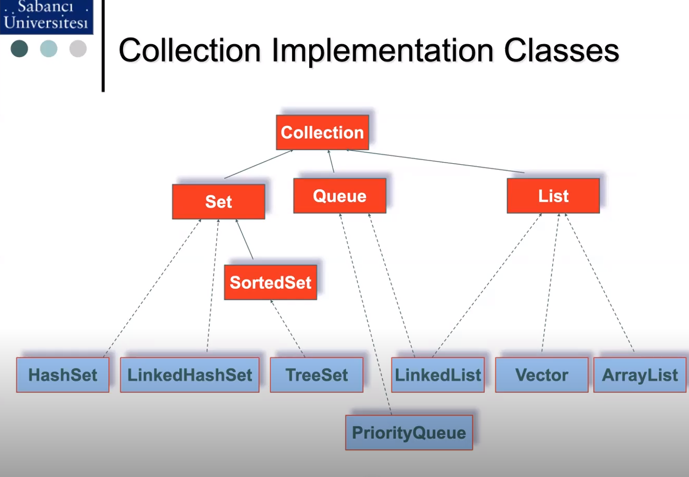

# Last week we left off at polymorphism

> Abstratction: Writing classes
>
> Encapsulation: Hiding mechanisms of a class to the outside world. We basically make them private and force usage of Getter & Setter Methods.   

# Business Requirement List
> 1. Generate Classes
>
> &emsp; &nbsp; &emsp; In Java, we first create our design first.  

# Inheritance
> It has an `IS-A` relation. Say we have animals and group animals, then we can inherit from Animal class to create Cat class (Cat class uses implements / extends from Animal). We can also inherit from Animal class undirectly, so for example we can create another class named Bird and under that we can create Parrot class. Which means Parrot class undirectly implements Animal class.
>
> Animal class is a superclass and remaining are subclasses. 
>
## 2 Things that Ineritance Helps Us With
> 1. Grouping code, which means we get to write less code.
> 2. It helps us in ==Polymorphism==.


---
# Polymorphism
> A reference of a class may point to objects of sub-classes. As Animal class can represent Cat, Dog or Parrot, we can crete instances like: 
```Java
    Animal dog = new Dog();
    Cat cat1 = new Cat();
    Animal cat2 = new Cat();
    // These are examples of Polymorphism. 
    // They work with method Overriding, the function signature is the same.
    // Method overloading: The function name and return type are the same but the parameters are not. Functions with different signatures.
```
> `Polymorphism allows us to create extandable systems.`
>
> If we Override a method and the method is extended from a super-class, we'll have compile/runtime error. If we remove @Override, the error will be gone. 
---
# Abstract Class
> If you define at least one abstract method in a clas, that class must be abstract.
> : Abstract class means it will not have any instance, _We won't write Animal = new Animal()_, this class will have implementations and  instances will be created from them.  


---
&emsp; &nbsp; Say we have a printer class and there is a uses relation with LegalDoc class. At this point the printer class and the LegalDog class are `Tightly Coupled` with each other.
---


---
# Interfaces (All interfaces are abstract)
>  In Java, interface is a collection of method signatures (and somethimes constants) 
that defines a set of requirements for a class. An interface can be thought as a contract
that a class agrees to fulfill.
>
> When a class implements an interface, it agrees to implement all of the methods defined 
in that interface.
> > The class can be then used anywhere that the interface is expected, allowing for greater
flexibility in programming.
>
>  Interfaces in Java only have abstract methods. You can't have any instance methods here.
>
> There's no point in making Interfaces private in Java. Make sure that you make everything public.
```Java
    // Example of an interface in Java.
    public interface Animal{
        void makeSound();
        void move();
    }
    /*
        This interface is called  `Animal`, and defines two methods:
            1. makeSound()
            2. move()

        → Any class that implements the Animal interface must provide the 
        implementation of these methods.

        For example, `Dog` class might implement the `Animal` interface 
        like this:
    */

    public class Dog implements Animal{
        public void makeSound(){
            System.out.println("Woof");
        }
        public void move(){
            System.out.println("Runing");
        }
    }

    // ⟶ Now, anywhere an `Animal` object is expected, a `Dog` object can
    // be used, because the `Dog` class implements the `Animal` interface.
```

> Interfaces have abstract methods by default even if you don't specify it during decleration.
---

> Collections framework provides us a structure, data structures are already implemented.   

# What are generics 
> Generics are similar to the templates in C++.
>
> Types of generics **MUST** be **reference types**. It means that you cannot use primitive data types such as int, long, string, byte, char, bool, float, double.
>

> Wrapper Type
> : For each primitive type, there is also a class version (_a reference version_) of that. It is in capital letter and in full word form such as:
>   : int ⟶ Integer
>   : boolean ⟶ Boolean
>
> Example code:
> ```Java
> String numstr = "5";
> int num = numstr.valueOf(numstr); // This is type-casting
> ```
---
# Collections Framework
> A framework includes abstract classes and interfaces. Usually, there's an implementation set too.
>
> We can have any number of generic types. Usually it is T, E and Z. 
>
> It is a set of super-types.


> All the Collections have some things in common.
> 1. _Being ordered / not ordered._ If you add an element and add another after that, the new element will be added after the previous element. 
> 2. _Can be sorted / not sorted._ You don't need to sort stuff explicitly, Java already has them. Say you have Mehmet, Ahmet and Zeynep (this is the order you add them). If the collection is sorted, they will be displayed as Ahmet, Mehmet and Zeynep.
> 3. _Can have unique elements._ Suppose you have 2 Strings and the Collection accepts unique elements, the second element is not added.

> If the collection keeps keys and values in pairs, that means the collection works like a dictionary. An ordered collection in Python is called a ___List___. Collection that keeps only unique elements in Python is a ___Set___. Similarly key and value pairs in Python are called a ___Dictionary___.

## Collection Interfaces Are Divided Into 2.
1. ___Collection___ (Contains a single dimension of elements)
   1. Queue - `Interface`
<br>
    ⟶ Queue is implemented by: 
        1. Priority Queue
   3. Set   - &nbsp; &nbsp; &nbsp; `Interface`
<br>
    ⟶ Set is implemented by: Tree set 

      1. Sorted Set
   5. List  - &nbsp; &nbsp; &nbsp;`Interface`
        
        ⟶ `All list types are ordered. They can have non-unique elements. They have got a common getIndex() method.`
<br>
<br>
    ⟶ List Interface is implemented by:
        1. Linked List
        2. Vector (Common implemented type for a list is Array List, so if you see Vector somewhere, just use Array.)
        3. Array List
<br>
1. ___Map___ (Two dimension, first is key, second is value)
   1. Sorted Map


---

> Whenever we will run a query the results will come back in a List.

> Pojo Definition:
> : It means Plain Old Java Object. It has some private values, Setters, and Getters.