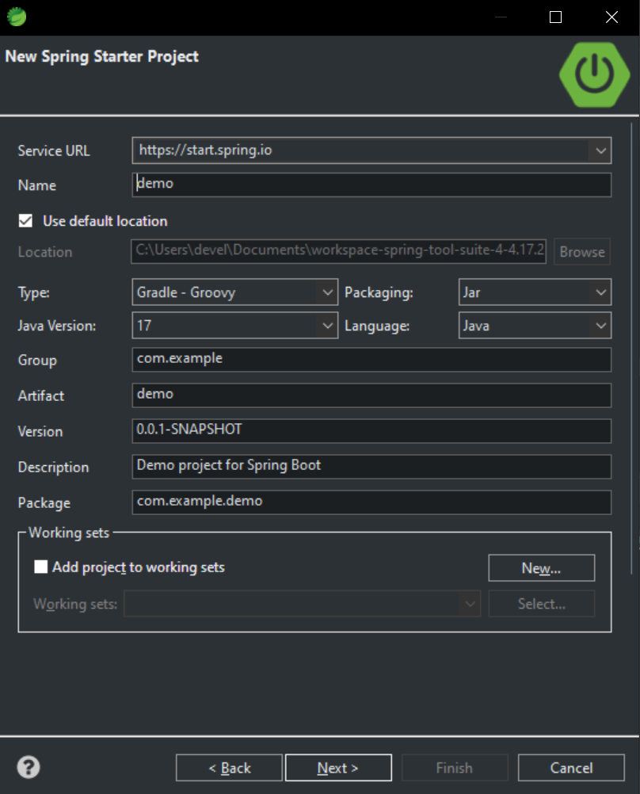
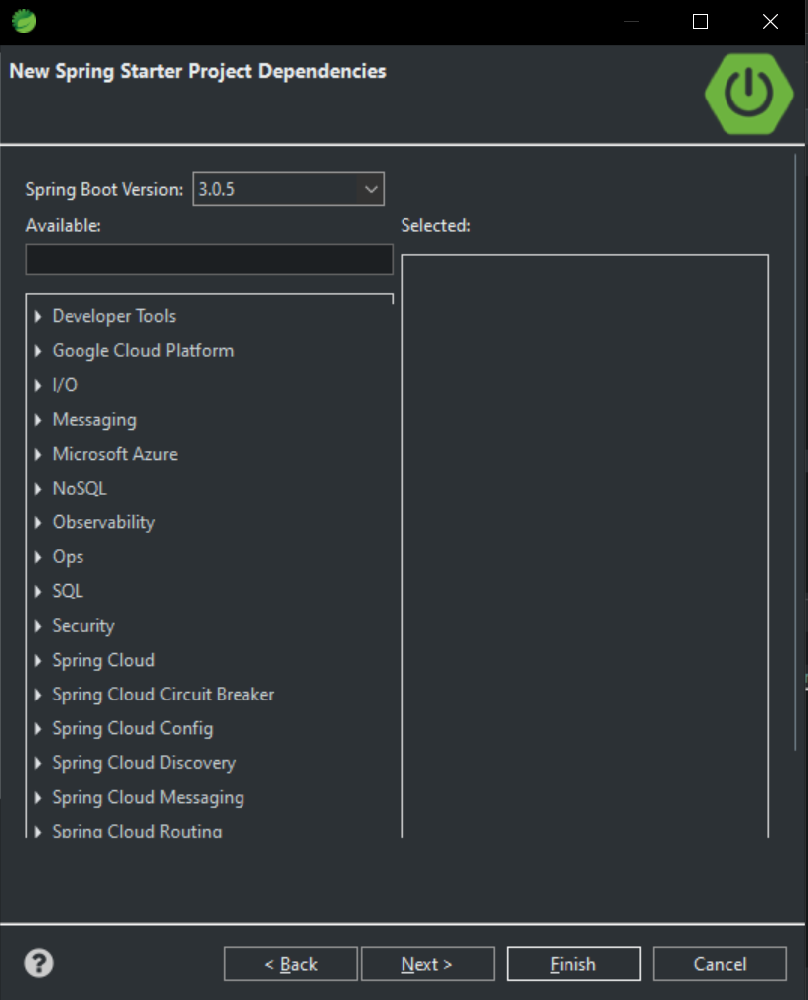

# Framework
> Set of abstract classse and interfaces.

> All Collection types (List⟶ArrayList(Ordered, Set⟶HashSet(Not ordered, Unique elements, override equal and hashCode methods), TreeSet⟶Sorted))are one dimensional and All Map types (has two generic parts called key and value, example is hashMap, different from others, maps have put and get methods.)are two dimensional. Collection and Map are called super types. 

# Inner/Member Classes
> We have some class(es) inside a class.
> 1. Static members
> 2. Non-Static members
>
> _Local Inner Classes_ ⟶ Inner classes in methods.
>
> _Anonymous Inner Classes_ ⟶ Lambda Expressions.
> : Defined	within a method, has no	name and can implement an interface
>

## ___IF YOU USE STATIC WORD WHILE DECLARING AN INNER CLASS, YOU DON'T NEED TO CALL NEW ON THE PARENT CLASS___
> A static class can only access the static members of the outer class.
---
# What is Spring Framework?
> Comprehensive infrastructure support for developing Java applications.
>
> Spring handles the infrastructure so you can focus on your application.
>
> POJO's are used both to build applications and enterprise services.

# Core Container
> It's the critical part of the Spring, and its major component is called the ___Application Context___.
## Core container consists of the Core, Beans, Context, and Expression Language modules.

# Spring Boot 
> Is an application container that is able to Run, Contain and Serve Spring applications. 


> Build tool: Maven
> : Maven and Gradle are the standard build tools for Java.
>
> Group refers to your group name, companies usually use the domain name here.
>
> Version: Used during development
>
> Package is the main package, its for your code. Creates a Spring Starter Class inside.



> Dependencies are external libraries that we're using in our application.

# Example Main Class Code For Spring Boot Application
> Maven is the build tool for building this project. Its the dependency management tool that helps us to add external libraries and deployment tool. It has everything in Java.
>
> Maven has build phases.
> ___Validate___ then ___Compile___
> 
> ___Package___ then ___Verify___ then ___install___
```Java
package com.sabanciuniv.main;

import org.slf4j.Logger;
import org.slf4j.LoggerFactory;
import org.springframework.boot.CommandLineRunner;
import org.springframework.boot.SpringApplication;
import org.springframework.boot.autoconfigure.SpringBootApplication;

@SpringBootApplication
public class SpringIntroApplication implements CommandLineRunner{

	Logger logger = LoggerFactory.getLogger(SpringIntroApplication.class);

	
//	The below line is how we start Spring. We don't touch the main after running it.
	public static void main(String[] args) {
		SpringApplication.run(SpringIntroApplication.class, args);
	}

	@Override
	public void run(String... args) throws Exception {
		
		System.out.println("output with sysout....");
		
		logger.info("Welcome to Spring Boot Application");
		
		
	}

}

```
---
# Beans 
> We'll create beans for everything.

# Autowired
> If you want to add a Bean inside any Spring classes, use the `Autowired` annotation. 

# `All these annotations are declared as interfaces in the background. They don't have methods to overwrite. They define Slacks for the FrameWork.` 
## `Bean annotation says Spring Framework to load that`

# Managed Components
> Special Components to achieve the overall structure of Entities, DAO Objects, and Services.
>

> Controller ⟶ Usually used for Web Interfaces.
---
|Services | DAO   | Entity   |
|-------------- | -------------- | -------------- |
| Service annotation    | Add repository annotation     | Entity annotation, For mangoDB we have Add Document     |
---
> Control, Service and Reposityory Annotations extend from ___Component Annotation___.
>
