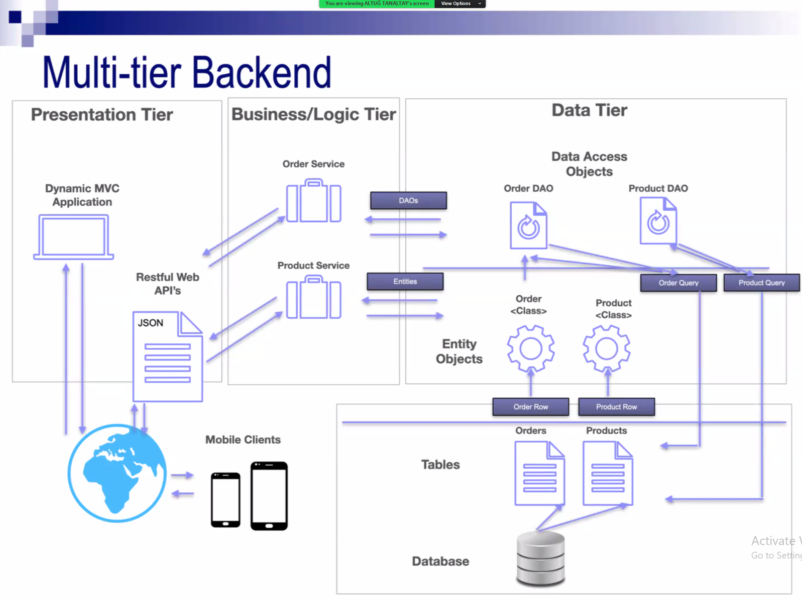
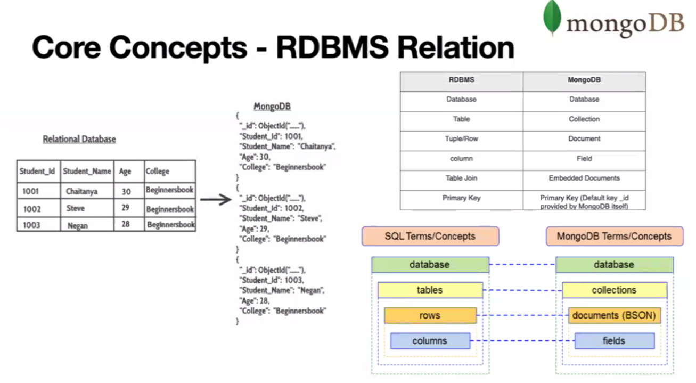
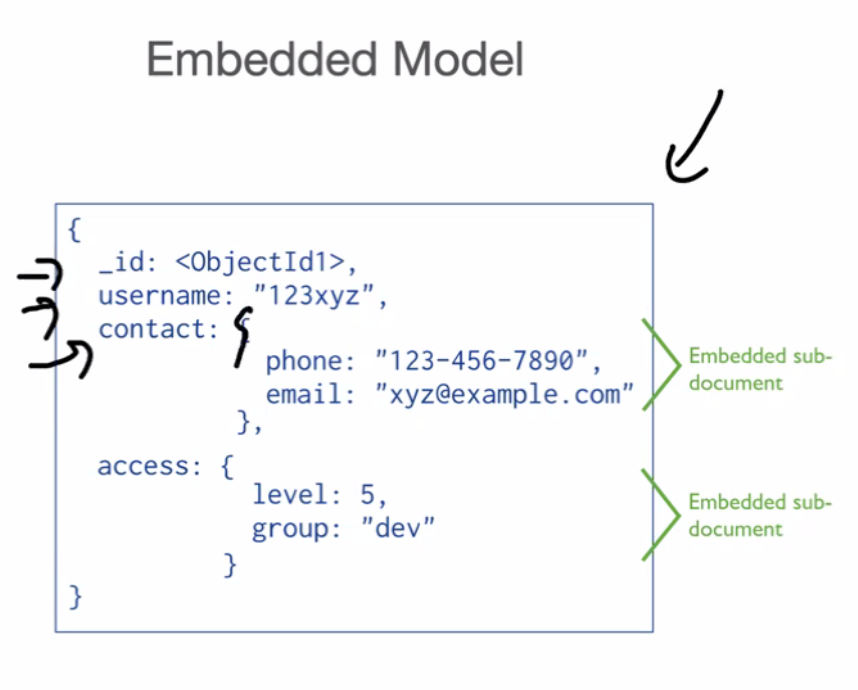
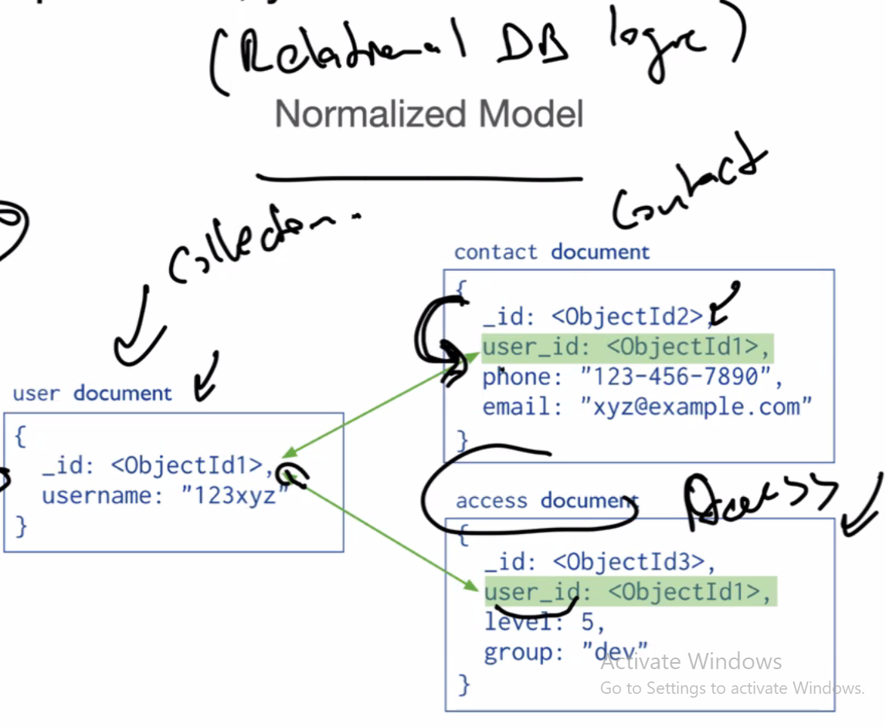
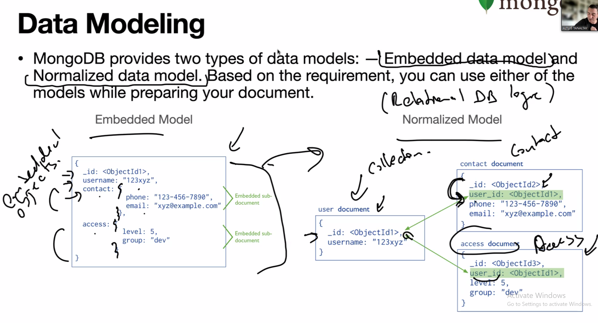
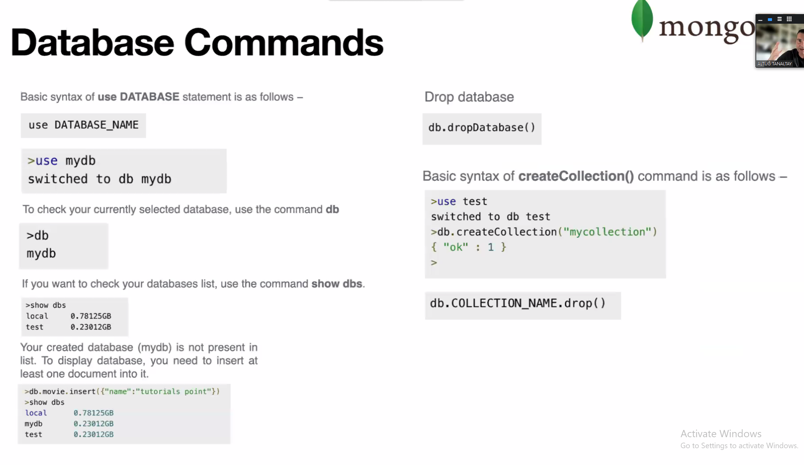

# Spring Framework
> Dependency Injection (DI)
> Inversion of Control (IOC) 
>
> ⟶ IOC Container → Core Container
>
## Spring Boot (Maven⟶(@SpringBootApplication))
> * Looks for the componenent layers
>
## @Bean or Managed Components

> `Data Tier - @Repository`
>
> `Entity Objects - @Entity @Document(For mangoDB)`
>
> `@Autowired Use autowired to inject a bean into another bean, when the container starts, it just loads them`
>

# About The Data Part and MangoDB
> We can use a Relational DB such as MySQL and PostgreSQL. MangoDB is the one that is a No-SQL DB. We don't deal with the standard SQL syntax while dealing with the database.
>

# MongoDB
> Works on the concept of **database**, **collection**, and **document**.
> 
> It's schemaless.
>
> Big Data
> Content Management and Delivery
> Mobile and Social Infrastructure
> User Data Managemment
> Data Hub

# XML
> XML is extensible markup language and Maven uses it. We use it for Android UI codes.
>
> In XML, every data is stored inside a tag.

# JSON
> Short for JavaScript Object Notation.

# BSON
> Binary version of JSON, more advanced than JSON in terms of data types. It's a much more complicated type of JSON.

# Document Model
> Everything is kept as JSON/BSON objects. JSON
>
> MongoDB porovides two types of data models. 
## 1. Embedded Data model: Default model for MongoDB. Logic is to embed the JSON inside the container JSON.
> > 
>
## Normalized Model: It has the Relational DB logic. We keep the information of an objects seperately.
> > 
>
> 
>
> 
>
>  

---
# Spring Data and MongoDB
## Spring Data Access Philosohpy
> DAOs exist to provide a means to read and write data to the database. 
>

---