# Mobile Programming Best Practiced (cont'd)
> Limit use of memory
> : Instead of using objects, use scalar types,
> : Use minimum data type for storing data,
> : Manage garbage collection:
> : - Allocate an object right before it is used
> : - Set all references to it to null after usage
> : - Always reuse objects instead of recreating them
> : - Reduce throwing exceptions
> : - Release all resources after usage (Network, files, etc..)
> : - Use local vars as much as possible
>
> Off-load computations to the server
> : Perform min processing on device
> : Create a client or web service to support intensive processing
> : - For ex, UI on device and data processing  on server
>
> Manage application's use of network connection
> : Keep transmissions short
> : Keep large amounts of data on a server-agent and request them partially
> : Create a mechanism  for recovering from a transmission drop
>
> Don't concatenate strings:
> : Concatenation increases use of memory and amount of processing
> : Every String concatenation creates a copy of Strings
> : Use equals() for comparison
> : Use stringBuffer or stringBuilder for concatenation
> 
>
> Updating data that has changed:
> : 

# Hybrid and Native Apps
> 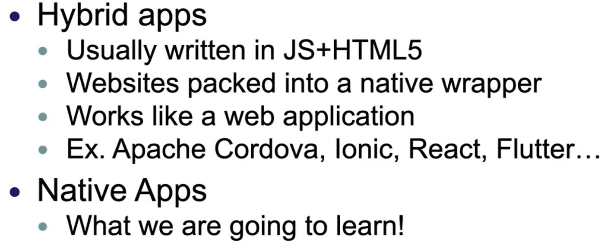
>
> Hybrid apps are slow in response time and do not look like native (menus, components, etc.) - **UI Experience**
>
> Hybrid app development takes less time. Choose if have less than 6 months for production. - **Performance**
>
> Native apps have the best performance, highest security and best user experience.
>
> Hybrid apps don't require user to update the app from the app store.
>
> Native apps require user to update the app from the app store.
>
> If framework is compiled for the target as React Native, then updates depend on the framework provider.

# Differentiations of Native and Hybrid Apps
> 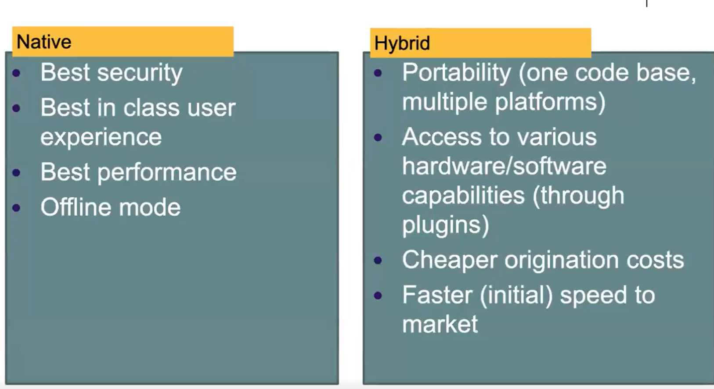

# Cheatsheet for Learning a Framework
> 

# What is Android?
> Android is a software stack for mobile devices that includes an operating system, middleware and key applications.
>
> The Android SDK provides the tools and APIs necessary to begin developing applications on the Android platform using the Java programming language.

# Android Architecture
> 

# Application Fundamentals  
> The Android operating system is a multi-user Linux system in which each application is a different user.
>
> Each process has its own virtual machine (VM), isolated from other applications.

# Android Runtime
> 

# DEX File Format
> 

# .class vs .dex
> 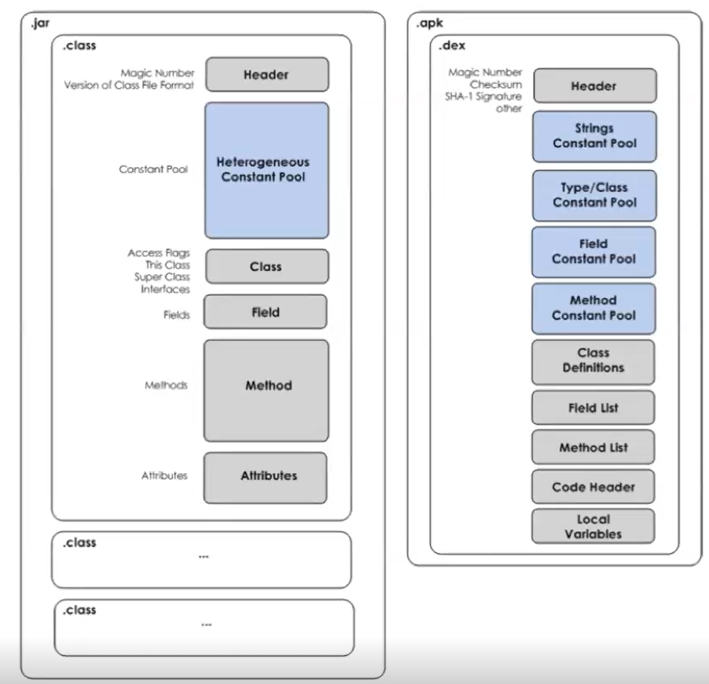

# AOT vs JIT Compilation (Ahead of time vs Just in time)
> 

# The Zygote
> 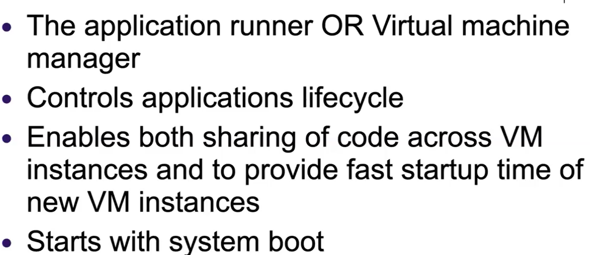

# Application Components
> **Activities**
> - An *Activity* represents a single screen with a user interface (is a subclass of Activity)
>
> **Services**
> - A service is a component that runs in the background to perform long-running operations to perform work for remote processes (eg. Fetch data from network, get location. Is a subclass of Service)
>
> **Content Proiders**
> - A *Content Provider* manages a set of application data. You can store the data in the file system, an SQLite Database, on the web, or any other persistant storage location your application can access. (is subclass of ContentProvider)
>
> **Broadcast Recievers**
> - A *Broadcast Receiver* is a component that responds to system-wide broadcast announcements. (ex. Screen turned off, battery low, is subclass of BroadcastReciever)

# Activating Components
> Activities, services and broadcast recievers are activated by an asynchronous message called ***Intent***
> : For activities and services, an intent defines the action to perform (for example to "view" or "send" something)
>
> : For broadcast recievers, the intent simply defines the announcement being broadcast (eg. a broadcast indicate the device battery is low includes only a known action string that indicates "battery is low")
>
> Content providers are activated by ContentResolver

# Compiler Preferences
> 


# Android Project
___Manifest:___ Contains AndroidManifest.xml

___Java:___ Java source files

___Res:___ All static resources
* ___Drawable:___ Images and background XLMs
* ___Mipmap:___ App icons
* ___Layout:___ XML Files
* ___Values:___ color, String, style resources
* ___Gradle Scripts:___ Contains Gradle wrapper files

`@` means we're referring to the src.

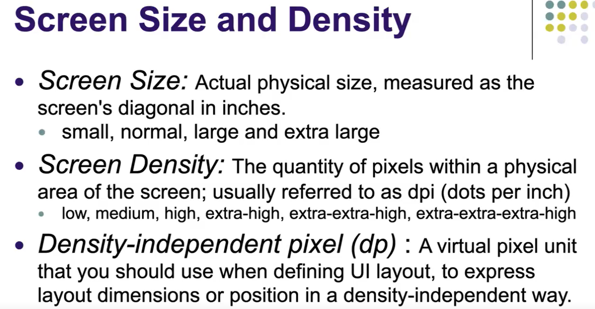
 

# R.java
> This file is directly mapped to the src folder. Name of files are converted into is converted into a public static final integer and put inside the R file.
> , all resources are set-up in the R file

# Activities
> Major visual component
>
> Must be subclass of Activity
>
> Has a lifecycle:
> * `onCreate():` The system calls this when creating your activity. Components MUST be initialized. `setContentView()` must be called to define layout.
>
> 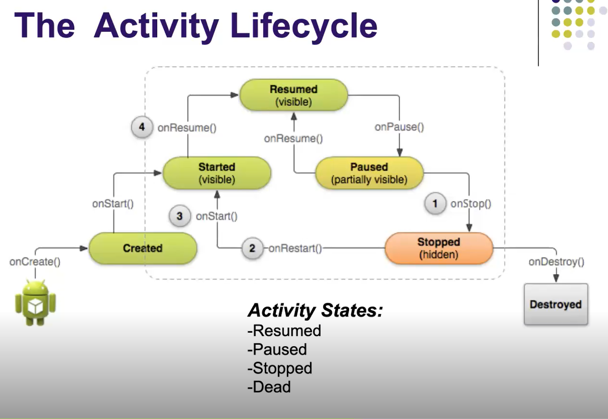

> Intents (located in manifest) are for starting application components.
>
> Activities have a hierarchy of views. Each view is a subclass of *View* class. (Ex. Button, TextView, EditText, RadioButton, ...).
>
> Views are organized in layouts. Layouts are subclasses of ViewGroup class. (Ex. LinearLayout, TableLayout)
>
> 

# Most Common Widgets
> **TextView**
> * A standard readonly text label, supports multiline display, string formatting, and word wrapping.
>
> **EditText**
> * An editable text box. Accepts multiline entry and word wrapping.
>
> **ListView**
> * A view group that creates and manages a group of views used to display the items in a list.
>
> **Spinner**
> Composite control that displays a textview and associated ListView items that lets you select an item.
>
> **Button**
> Classical clickable button
>
> **Checkbox**
> Two-state button: checked, unchecked
>
> **RadioButton**
> List of options, only one selectable at a time.


# Layouts
> **Frame Layout**
> It's basically a blank space on your screen that you can later fill with a single object. Objects put at top left, children will be drawn over.
> 
> **LinearLayout**
> Aligns all children in a single direction, Vertically or horizontally, depending on how you define the orientation attribute. All children are stacked one after the other.
> - If you wrap_content, its width will be according to its content, will resize itself.
> - ___`Margin means the distance between current component and other components, and padding is the space inside this component.`___  
> - DP will adjust itself according to the device's resolution.
>
> **TableLayout**
> Positions its children into rows and columns. TableLayout container displays no display border lines for their rows, columns or cells. The table will have as many columns as the row with the most cells.
>
> **ConstraintLayout**
> Lets child views specify their position relative to the parent view or to each other, specified by ID. So you can align two elements by right border, or  make one below another.
> : 
> 
> 

# Logging
> 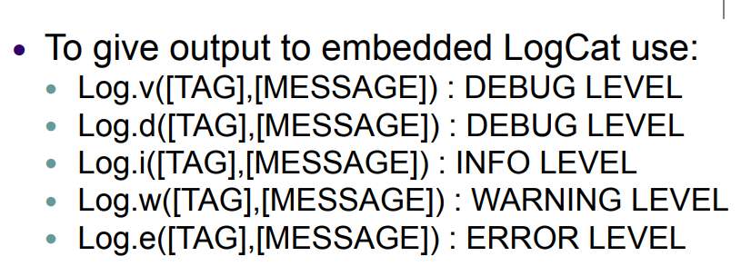
# `Always Make Your Classes Public In Android`
> We extend new activities from the AppCompactActivity in order to support the older versions of Android. 
>
> Whenever you create an application component, remember that SecondActivity java class is an activity component, you need to declare them in the **`Manifest File`**.
> : After adding it into the manifest, we cut and paste the intent from MainAcitivity into SecondActivity and set exported true so that this component will be prepared when the application launches.
>
> 

# The Observer Pattern
> It's a common design pattern for event management in UI's. The Observer Pattern is a software design pattern that establishes a one-to-many dependency between objects. Anytime the state of one of the objects (the "subject" or "observable") changes, all of the other objects ("observers") that depend on it are notified.
>
> ___Button:___ `Subject`, informs that the event has happened, i.e. click.
>
> ___UI, form:___ `Observers`, they're informed by the subject when the event occurs, ie. button clicked display another page.
> :  
>
> 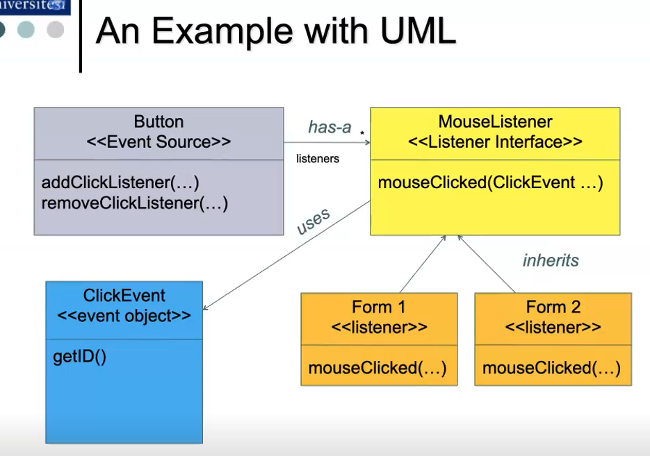

# Events
> Event mechanism in Java follows the principles of the Observer Design Pattern, which has four rules:
> 1. ___Event Source:___ Triggers the event.
> 2. ___Event Listener:___ Is a registered interested party which receives the event (is notified)
> 3. ___Event Listener Interface:___ Forms the contarct between source and listeners (is implemented by listeners) 
> 4. ___Event Object:___  Object representing event (contains information about the event)

# Tasks and Backtrack
> 

# Launch Mode in Manifest
> Setting the "Launch Attribute" in manifest file also defines the task behaviour of Activities,
>
> Possible values are:
> : ___Standard___
> : ___singleTop:___ If activity is at the top of back stack, a new instance is not created, onNewIntent() called.  If the activiy is already on the top of the stack, never restart it again, always just use the one in memory.
>   : **`Set launchMode to singletop in manifest.xml in order to make the onNewIntent's message displayed on logcat.`**


# onNewIntent() - For Refreshing Data
> If the activity is restarting itself, lanuch mode is set to `singleTop()`, then `onNewIntent()` is called.

# Using Flags In Intents
## Controlling Task Behaviour
> On the caller intent use setFlags(), some of flags are:
> : **`FLAG_ACTIVITY_NEW_TASK`**
>   : Start the activity in a new task. If a task is already running for the activity you are now starting, that task is brought to the foreground with its last state restored and the activity receives the new intent in `onNewIntent()`(=singleTask)
> : !! **`FLAG_ACTIVITY_CLEAR_TOP`**
>   : Say we have activities: A, B, C, D. 
> 
>   : If D calls startActivity() with an intent that resolves to the component of the activity B, then C and D will be finished and B receive the given Intent, resulting in the stack now being A, B.
> 
>  : (A starts B, B starts C, C starts D and if you want to start A from D, you set the intent of the creation of A from D to `FLAG_ACTIVITY_CLEAR_TOP`)
>
> ___`We set flags on INTENTS`___


# Intent Is Our Information Carrier
> Put all your stuff inside the Intent and then start the activity, and get the information from there.
>
> Intent type has a inner Bundle type that is able to carry information.
>
> 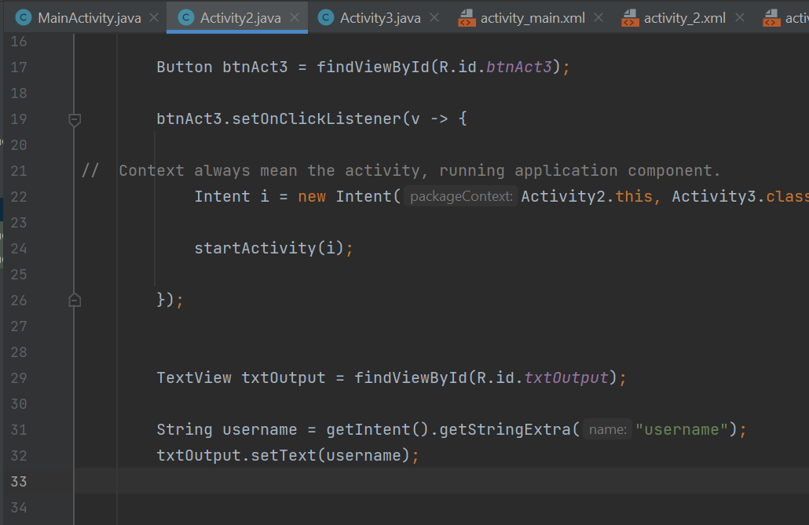
>
> 
>
> So this may work for simple data types such as a String but assume we want to send more complex data structures such as a User object.


 ```Java
package com.example.tasksandbackstack1;

public class User {

    private String username;
    private String city;

    public User(String username, String city) {
        this.username = username;
        this.city = city;
    }

    public String getUsername() {
        return username;
    }

    public void setUsername(String username) {
        this.username = username;
    }

    public String getCity() {
        return city;
    }

    public void setCity(String city) {
        this.city = city;
    }
}
```
> When we simply leave an application, the process is put into the Application Stack of Android.

# Styles and Themes
> Style is applied to components
>
> Theme is applied throughout the program

# Fragments
> A Fragment represents a behavior or a portion of user interface in Activity.
>
> You can combine multiple fragments in a single activity to build a multi-pane UI and reuse a fragment in multiple activities.
>
> Requires min API level 11.
>
> Mostly used in tablets with larger displays.

# Using Fragments 
> 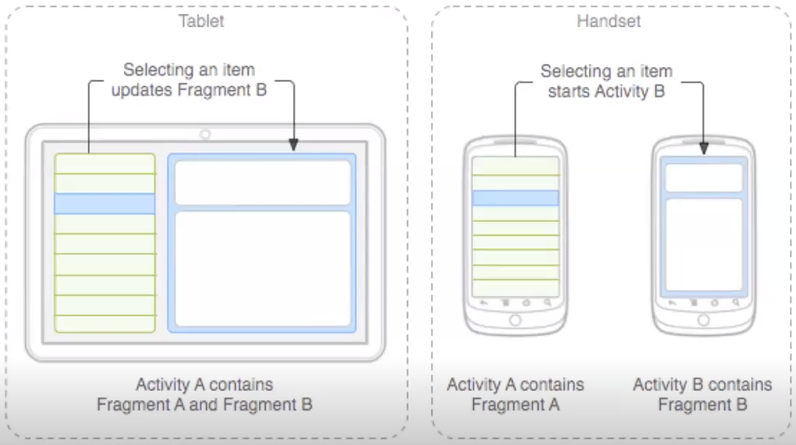
>
> 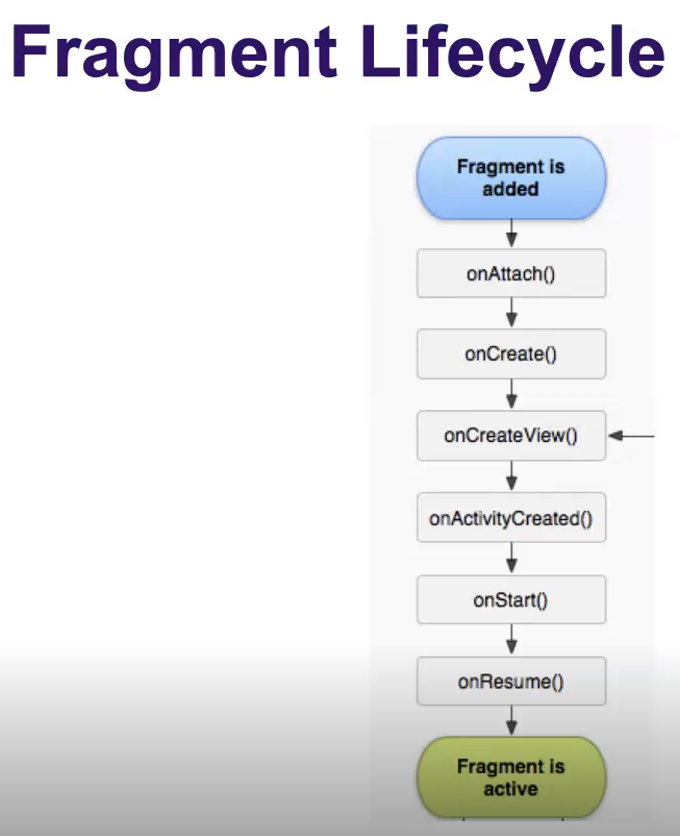  
>
> We need to have classes for Fragments in order to use them.
>
> onAttach() means the activity is alive.
>
> onCreate() means load your layout.
>
> LayoutInflators are special data types in Android Studio that are capable of loading information from XML files, and get them ready.

# Fragment Lifecycle Methods
## onCreateView()
> Here, we **`inflate the layout`** or simply create the view and further if you have to do anything that takes reference to Activity don't do it like creating accessing views of the Activity etc. because this place doesn't ensure that hosting Activity is fully functional.

## onAcivityCreated()
> This place signifies that **`our hosting Activity views are created and hosting Activity is functional`** 

