# Review
## Android Application Fundamentals
> **Default Java**
> - JVM
> - .class (bytecode)
> - a .jar file is created from .class files.
> - Het. constant pool (method/class names, fields, variable names, etc. are are hold in different pools)
>
>
> **Android**
> - Limited envrionment, memory, cpu, ...
> - No JVM, we have ART
> - : Requries .dex files,
> - : .dex files sum up to a .apk file, .apk is the packaged version of an Android Application. dex files are optimized.
> - dex has single pool, much more optimizde then .jar

## Application Structure (.apk)
> **Manifest Folder**
> : Contains AndroidManifest.xml file, which is the main configuration of our application. All security rules and components are in the manifest file. 
>
> **res Folder**
> : All static resources are kept here. 
> : res folder is a representation of the R.java file. We don't see R.java, it was visible but now hidden.
> : Drawable has images, layout is hold in here (it has xml files related with the UI).
> : Values folder has strings.xml (keeping static string resources for ex supporting multilanguage buttons, in chinese and french), colors.xml (keeping static colors), styles.xml(styling the app).

## Building the Projects
> We use Gradle to build projects. Its like Maven.
> : We need to set SDK versions, target, compile and min.
> : For compile, we select the latest SDK.

## Application Components
> **Activity**
> : Related with UI, if you want to display someting, then you need to have an activity for that.
>
> **Services**
> : For long-running background tasks. Location of user.
>
> **Content Providers**
> : As you remember, Android environment is sandboxed. Each environment works as a 
> user and works in its own VM.
> : Content provider is for sharing app data.
>
> **Broadcast Recievers**
> : Catching application-wide evens.
>   : Such as SMS message received, battery level 10%, someone called.
>
> **APP**
> : ART (VM)
> : File System
>
> For each app, a seperate user is present

## The Activity Lifecycle
> **onCreate()**
> : Is called when an activity is to be loaded to the screen. 
>   : After onCreate() is called, the Activity will be in Created state. That means its constructor + onCreate() has been called.  So the class is alive in the memory but not displayed to the user.
>
> **onStart()**
> : It is related with the visibility of the Activity. If you see onStart() being called, that means the activity is being drawn on the screen physically. 
>   : After onStart(), the activity will be in Started state and visible to the users. User will be able to see the activity but won't be able to interact with it.
> : Then, onResume() will be called. 
>   : After onResume() is called, it is a method that you can for example update your Activity new data, refresh your list, etc. The Activity will be in Resumed state.
> : Resumed state means now the user is able to interact with the activity, its when the buttons start doing someting. 
>
> Say a notification will jump in, at that time, the Activity will go into the Paused state, so onPause() will be called, and in this state the Activity will be partially visible. When the user closes the notification, onResume() will be called again and Activity will again be in Resumed state. 
>
> What happens if the user switches to another application?
> : Applications never die in Android, they are just sent to the backround. There's an application stack that stores the applications when user goes into another app. onStop() is called and the Activity will be in Hidden state.
>
> onStart() is for drawing, and onStop() is for clearing from screen.
>
> Suppose the user will switch back to the application, onRestart() will be called, again onStart()  will be called.
>
> If the user kills the app, first onPause(), then onStop(), then onDestroy() method will be called. onDestroy() kills the app, clears it from the memory.
>
> Bundle is like a camel that carries around information around your app.
> : 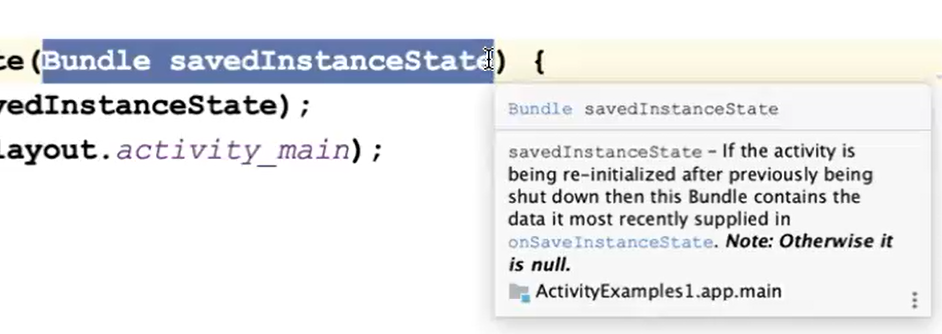

## Activity States
> 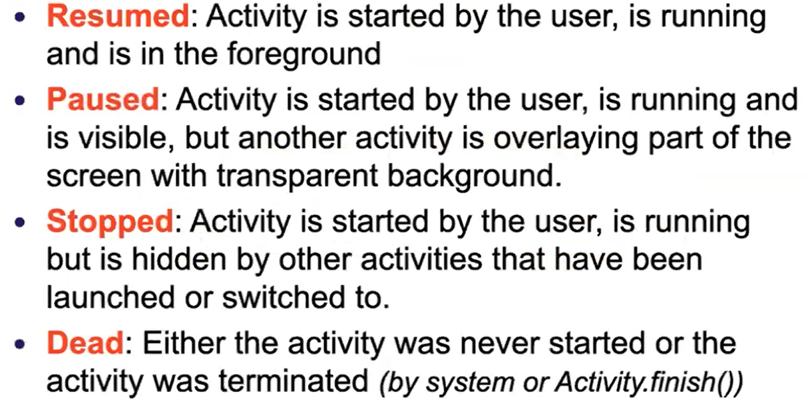

> * match_parent will resize the content according to its root component, and wrap_content will resize the content according to the shape of its content.

## A Sample and Simple Text View XML
> 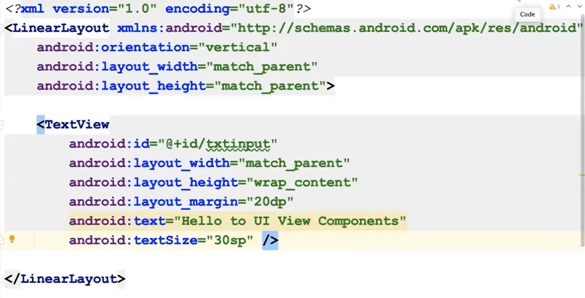

> When pressed on Back button:
> 1. onPause()
> 2. onStop() → The Activity will not be visible anymore
> 3. onDestroy() → Will be called if the app is cleared from the memory.
>
> Views are embedded in ViewGroups, inside a ViewGroup you can embed as many Views as you want.

## Linear Layout
> Organizes components horizontally or vertically, it has got an orientation attribute (which could be set to horizontal or vertical). If you pick horizontal, components will be put side to side and beneath each other in vertical.
> : 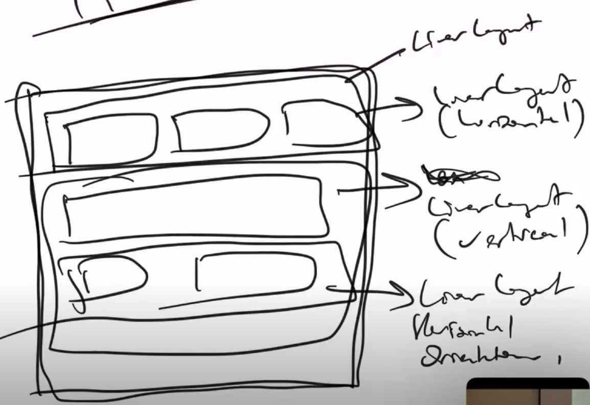
> : 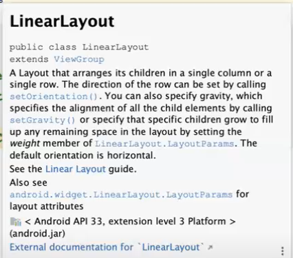

## Constraint Layout
> Newer version for layout, we just anchor a component to another or to the screen. This is the one where we can also use the interface to determine the relative position of a component.
>
> 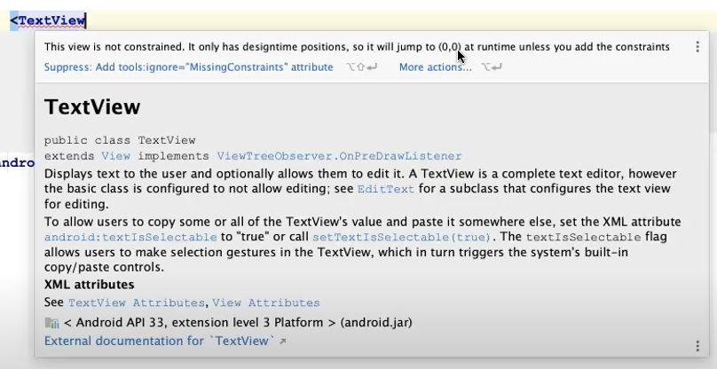
>
> : 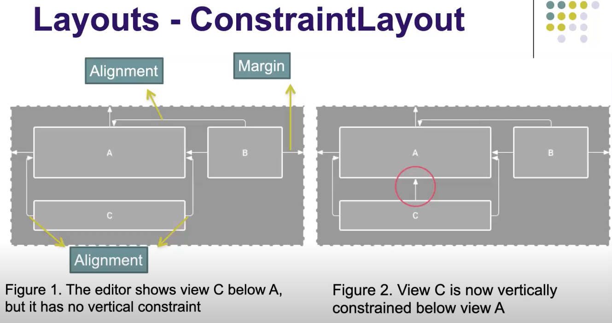

## Table Layout
> Positions its children into rows and columns. TableLayout containers do not display border lines for their rows, columns, or cells. The table will have as many columns as the row with the most cells.

## ___`Margin`___: `Space between neighbors`
## ___`Padding`___: `Space between components inside a container`

> Make all classes public in Android.
>
> 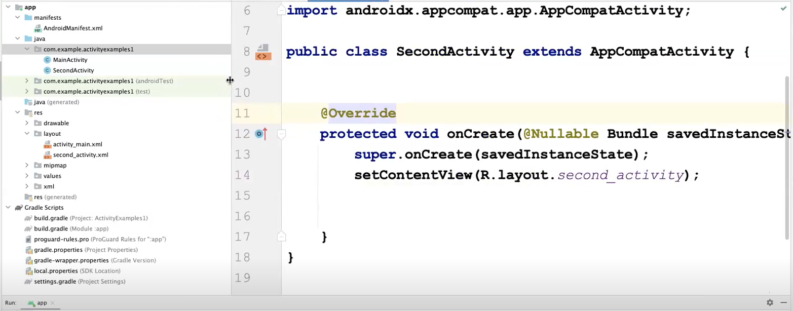

## The Observer Pattern
> 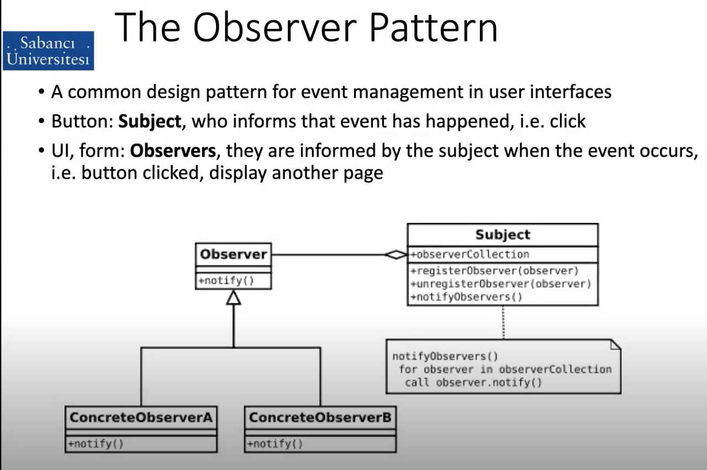
>
> Logic is recall what we did in polymorphism. For example say we've got a mechanic which was able to fix all vehicles. Observer pattern has the same design.
>
> Think that this guy is a mechanic and it knowns about which derieves from vehicle, and it calls the vehicle's common method while dealing with them.
>
> We've gota  ___`Subject`___ for the Observer Pattern.
> : Think about an event, say button click or user drag. Whatever the user action, that's an event action. The events are, naturally, fired by certain components. For example clickEvent is fired by a button. In this sense, the Subject is the button. 
> : ___`Subject`___ is the button, who actually knows the event is being fired, that's the subject. If a button is clicked, then that button is the ___`Subject`___ and it knows that its being clicked, so it will broadcast the message I am being clicked.
>
> This is usually defined as an interface called `Observer`. It has got a public `notify` method. So, whoever derieves from the Observer type, must override the method notifier as it is an interface.
>
> An Activity can be an observer of an event, or you can just create inner classes to make Observers. How are they communicating with the subject?
> : The Subject, in the inside, has a embedded list called ObserverCollection, and all the Observers are added into this arrayList through methods. In the diagram, you can see registerObserver().
>
> As you can see there is a method called notifyObservers(), button knows that its being clicked, when its clicked, it iterates over the Observers and calls their Notify methods. 
>
> We have a Subject which contains a list of Observers. Subject has a list of type Observer inside, and Observer implements the Observer interface.
>
> Say we have a fire alarm. When there is a fire alarm, the fire alarm broadcasts the message, for example you can create firefighters and police that can take action immidiately.
>
> Subject will be Fire Alarm (has a list of Fire Events, it will loop over the Fire Events) and interface will be Fire Event (Firefighters and Polices will be extending from the Fire Event).
>
> This time we make the Subject a Button (has a list of onClick() listeners, and whenever it is clicked, it rolls over the listeners and calls their clicked() methods,an d whoever is a onClick() listener, in our case Forms will be extending from the onClickListener(), and the Forms will be Activities. So when the button is clicked, these Forms will be notified about the click.), we use an interface, usually name them as onClickListener() (has a method clicked())
>
> ___The fireListener() interface___
> : 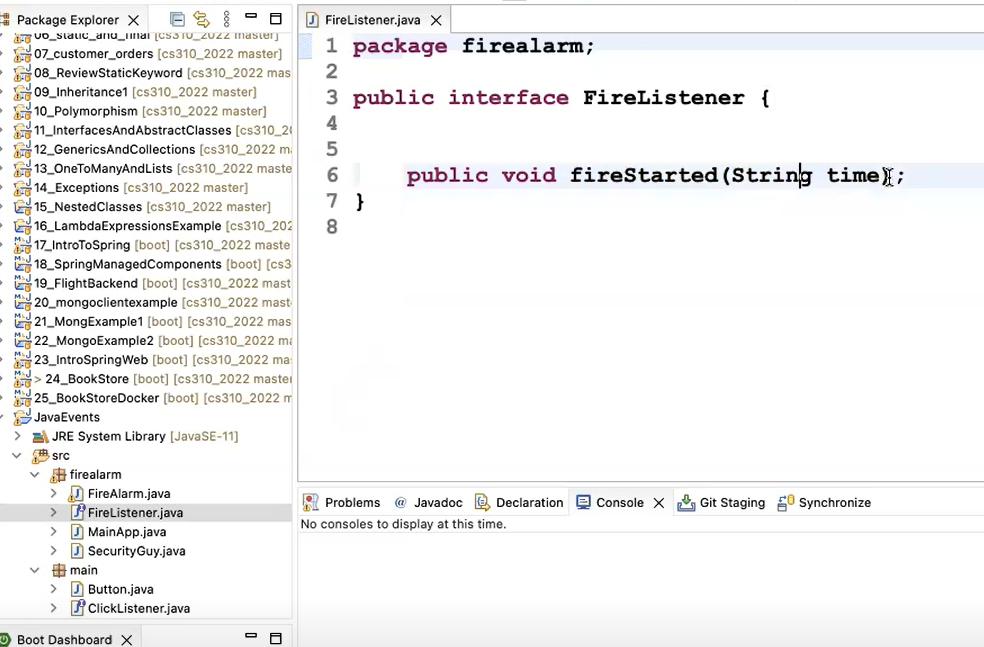
>
> ___This is fireAlarm.java, our Subject___
> : 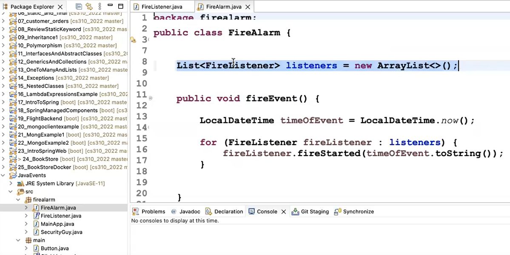
> FireEvent is to stimulate when a fire begins, it will inform the listeners that there is a fire.
> : 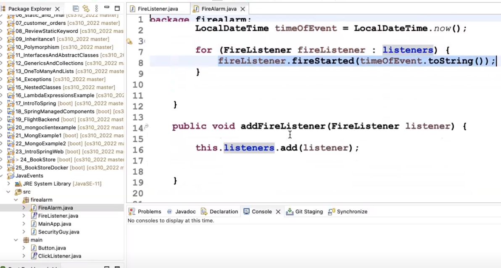
> AddFireListener method adds listeners, so that other people (who wants to be an observer) to the list of this Fire Alarm.
>
> ___Say we have a Security Person___
> : 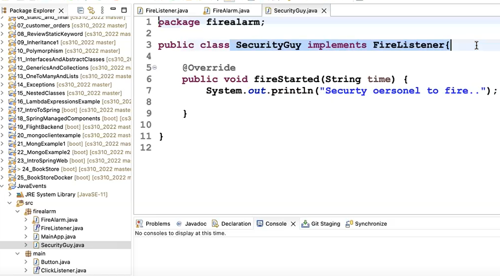
> It needs ti omplement the FireListener interface, and override fireStarted() method.
>
> ___This is the MainApp.java___
> : 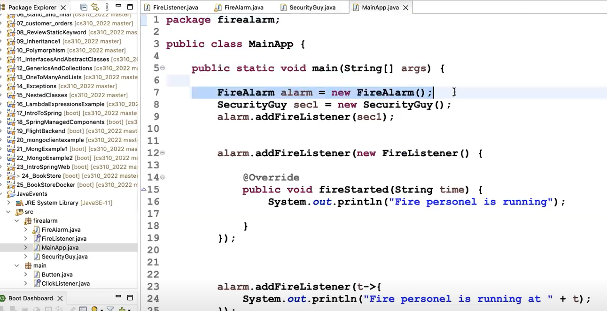
> We add security guy to the alarm as a listener.
>
> : 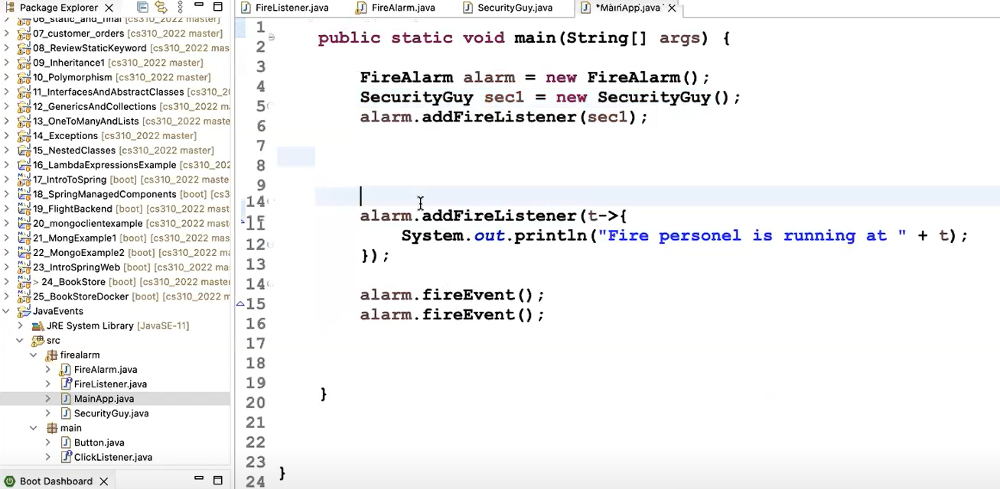
>
> This is the output of these code:
> : 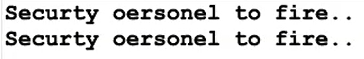
>
> ___For Button, say we have an interface called ClickListener.java___
> 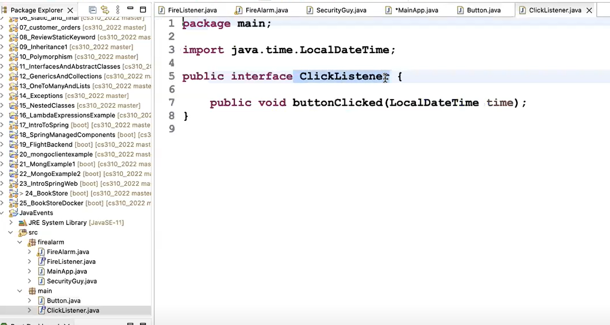
> 
> ___This is the Button.java___
> : 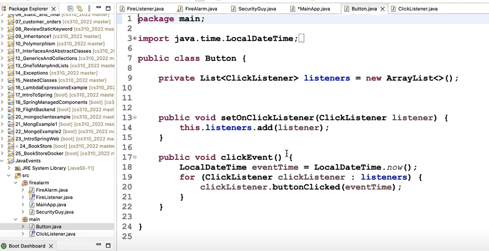
> 
> ___This is the MainClass.java___
> : 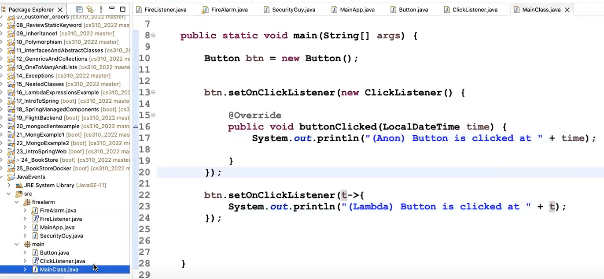
> : 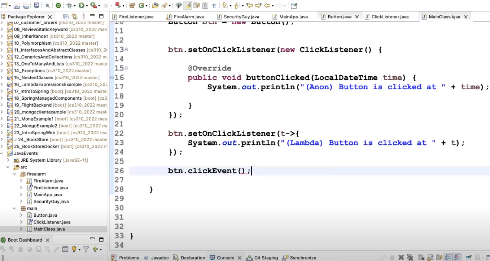
>
> And this is the output for anonymous and lambda ones.
> : 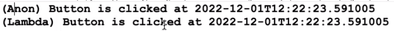

## An Example with UML
> 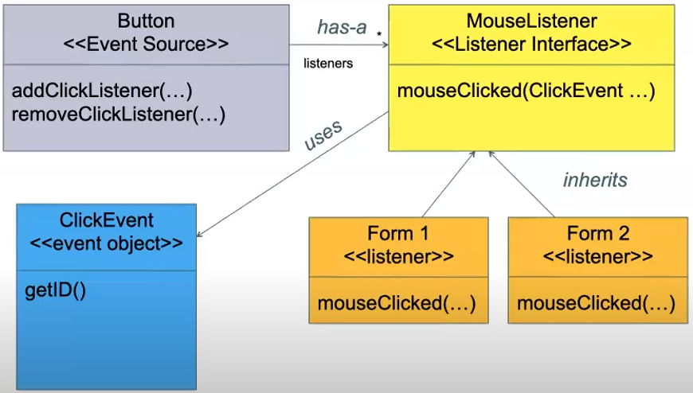
>
> The Subject of the Observer Pattern is the event source in Java events.
>
> The Listener Interface is the Observer Interface. Suppose you want to catch-up mouse events, and there are some forms that actually implements this interface. What they do is they add themselves as the listener of this the button.
>
> When the event is fired, the Button will iterate over the components and call the method mouseClicked(). There's also an Object inside the mouseClicked() method.

> TextView is for displaying static texts, the other ones are called EditText components, for getting input from the users.

## To Add Click Events to Buttons
> 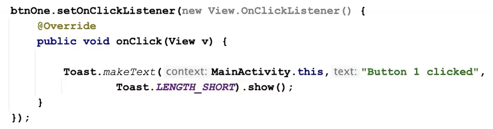
>
> 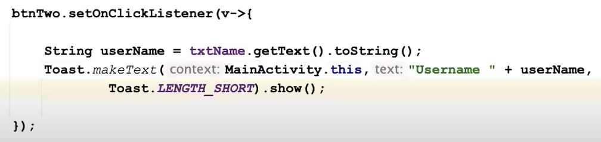


> Toast messages are simple notifications that are displayed as text and they disappear.

## Java Events and Observer Pattern
## Events
> 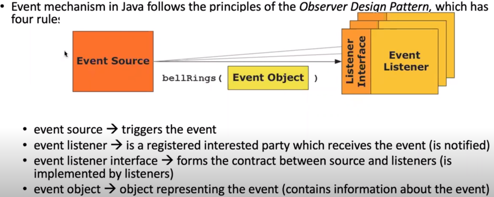
> : Event source fires the event (such as a button, when clicked, the button fires and says to all of its listeners "I am clicked!")
>
> The source triggers the events

## An Example in UML
> 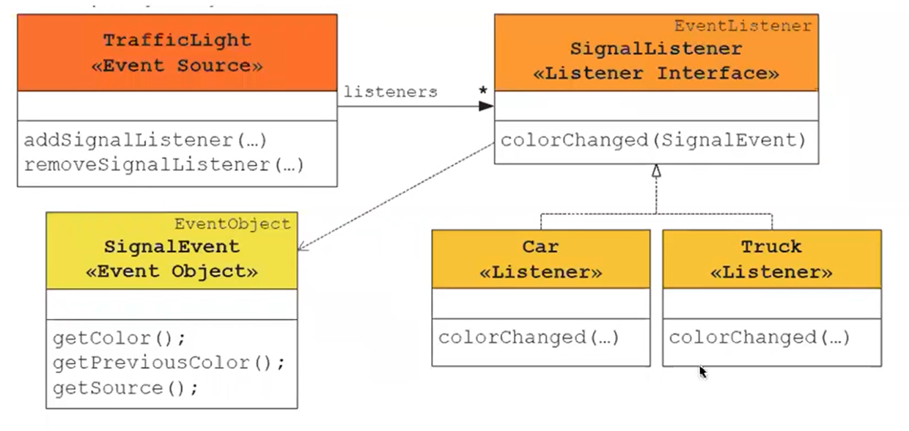
> : When the traffic light changes, it informs the Cars and Trucks about that. 
> : * Here, the Subject is the TrafficLight (the one that fires the event). Observer implementations are Car and Truck (They are called as Conrete Classes). 
> : They use a standard interface (signalListener), which is the Observer here. All the subtypes of the interface (SignalListener subtypes here are Car and Truck), must implement the SignalListener. 
> : * You can also send additional information, here it is SignalEvent.
```Java
// This is the TrafficLight.java, in files like this youc an create at most 1 public class, the rest should not be public be careful about that. If you want to add an inner class,

// TrafficLight is the Subject
public class TrafficLight {

    List<TrafficLightListener> listeners;

    public void addListener(TrafficLightListener listener){
        if (listeners==null){
            listeners = new ArrayList<TrafficLightListener>
        }
        liseners.add(listener);
    }

    public void lightChanged(String color){
        
        Date now = new Date();

        for (TrafficLightListener listener : listeners){
            listener.colorChanged(color, now);
        }
    }

// Inner classes such as this one can access all the fields inside the wrapping class.
// Member inner class 
    class InnerTest{

        void test(){

        }

    }

}

// TrafficLightListener is the Observer
interface TrafficLightListener{
    // Concrete Classes will be classes that implement TrafficLightListener interface.
    public void colorChanged(String color, Date date);
}


// This is the Car.java
// This is the Concrete Class
public class Car implements TrafficLightListener{
    @Override
    public void lightChanged(String color, Date date){
        System.out.println("Light changed to:", color, " Date:", date);
    }
}

// This is the MainClass.java

public class MainClass{

    public static void main (String[] args){
        
        TrafficLight light = new TrafficLight();
// Creating our concrete class objects called car1 and car2.
        Car car1 = new Car();
        Car car2 = new Car();

// Add cars to light's listener list.
        light.addListener(car1);
        light.addListener(car2);

// Say the light changes to yellow
//  The lightChanged will iterate through all the listeners and call lightChanged on each. 
        light.lightChanged("yellow"); 

// Suppose we want to add Truck but don't want to create a class for it, and do it anonymously.
// Anonymous inner class
        light.addListener(new TrafficLightListener() {
// This inner area is a class, same area as car class.

            @Override
            public void colorChanged(String color, Date date){
                 System.out.println("Truck" + color + ", date:" , date);
            }
        });


        light.addListener(new TrafficListener() {
            
            @Override
            public void colorChanged(String color, Date date){
                System.out.println("Motorcycle:", color, ", date:", date);
            }
        })

        light.lightChanged("yellow");
    }
}
// Inner classes are classes inside classes, inside MainClass, we have inner anonynmous classes.
```
> This is the output of the code above: 
> : 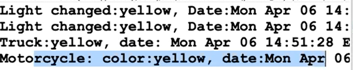 

## Another Example
> 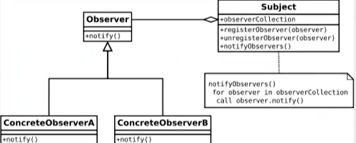
>
> : This is the UML description of Observer Pattern used in Java and Android events, button clicks, long clicks etc.
> : * Subject is the root of the event, so event is fired by the subject (subject is the button here). When the button is clicked, it calls the notifyObservers() method
> : So how does the Observer adds them inside observerCollection (this is a list| )?
> : * It adds them by using a method such as registerObserver(observer) method.
>
> The Observer here is an interface and ConcreteObservers will be the listeners. For example, the ConcreteObserverA will be a Form which is trying to catch the Button clicks inside its content.
>
```Java
// Now suppose you are in an Android system.
// This is Screen.java

public class Screen{

}

// This is Button.java
// Button is the Subject here
public class Button{

    List<ButtonClickListener> listeners = new ArrayList<ButtonClickListener> ();

    public void addListener(ButtonClickListener listener){
        listeners.add(listener);    
    }

// Suppose this method is invoked whenever a user clicks the button.
    public void doButtonClick(){
        Date now = new Date();
// Iterate over the listeners and call buttonClicked on these.  
    for (ButtonClickListener buttonClickListener : listeners){
        buttonClickListener.buttonClicked(date);
    }

    }

}

// Who wants to be listening to the Button events should be implementing ButtonClickListener.
interface ButtonClickListener{
    public void ButtonClicked(Date date);
}

// This is MainClass.java

public class MainClass{
    public static void main( String[] args){

        Button btn = new Button();
        btn.addListener(new ButtonClickListener(){

            @Override
            public void buttonClicked(Date date){
                System.out.println("Listener1 button clicked at:", date);
            }
        });
        
        btn.addListener(new ButtonClickListener(){

            @Override
            public void buttonClicked(Date date){
                System.out.println("Listener2 button clicked at:", date);
            }
        });

        btn.doButtonClick();
    }
}
```
> This is the output of the code above:
> : 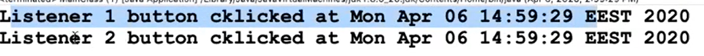