# Topics By GPT
> 
> 
> 
> 

> 

# Questions By GPT
> 
> 
> 
> 
> 
> 
> 

# ___`WEEK 8`___

# Mobile Programming Best Practiced (cont'd)
> Limit use of memory
> : Instead of using objects, use scalar types,
> : Use minimum data type for storing data,
> : Manage garbage collection:
> : - Allocate an object right before it is used
> : - Set all references to it to null after usage
> : - Always reuse objects instead of recreating them
> : - Reduce throwing exceptions
> : - Release all resources after usage (Network, files, etc..)
> : - Use local vars as much as possible
>
> Off-load computations to the server
> : Perform min processing on device
> : Create a client or web service to support intensive processing
> : - For ex, UI on device and data processing  on server
>
> Manage application's use of network connection
> : Keep transmissions short
> : Keep large amounts of data on a server-agent and request them partially
> : Create a mechanism  for recovering from a transmission drop
>
> Don't concatenate strings:
> : Concatenation increases use of memory and amount of processing
> : Every String concatenation creates a copy of Strings
> : Use equals() for comparison
> : Use stringBuffer or stringBuilder for concatenation
> 
>
> Updating data that has changed:
> : 

# Hybrid and Native Apps
> 
>
> Hybrid apps are slow in response time and do not look like native (menus, components, etc.) - **UI Experience**
>
> Hybrid app development takes less time. Choose if have less than 6 months for production. - **Performance**
>
> Native apps have the best performance, highest security and best user experience.
>
> Hybrid apps don't require user to update the app from the app store.
>
> Native apps require user to update the app from the app store.
>
> If framework is compiled for the target as React Native, then updates depend on the framework provider.

# Differentiations of Native and Hybrid Apps
> 

# Cheatsheet for Learning a Framework
> 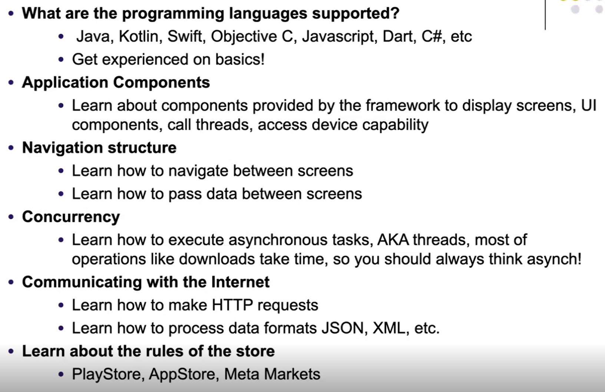

# What is Android?
> Android is a software stack for mobile devices that includes an operating system, middleware and key applications.
>
> The Android SDK provides the tools and APIs necessary to begin developing applications on the Android platform using the Java programming language.

# Android Architecture
> 

# Application Fundamentals  
> The Android operating system is a multi-user Linux system in which each application is a different user.
>
> Each process has its own virtual machine (VM), isolated from other applications.

# Android Runtime
> 

# DEX File Format
> 

# .class vs .dex
> 

# AOT vs JIT Compilation (Ahead of time vs Just in time)
> 

# The Zygote
> 

# Application Components
> **Activities**
> - An *Activity* represents a single screen with a user interface (is a subclass of Activity)
>
> **Services**
> - A service is a component that runs in the background to perform long-running operations to perform work for remote processes (eg. Fetch data from network, get location. Is a subclass of Service)
>
> **Content Proiders**
> - A *Content Provider* manages a set of application data. You can store the data in the file system, an SQLite Database, on the web, or any other persistant storage location your application can access. (is subclass of ContentProvider)
>
> **Broadcast Recievers**
> - A *Broadcast Receiver* is a component that responds to system-wide broadcast announcements. (ex. Screen turned off, battery low, is subclass of BroadcastReciever)

# Activating Components
> Activities, services and broadcast recievers are activated by an asynchronous message called ***Intent***
> : For activities and services, an intent defines the action to perform (for example to "view" or "send" something)
>
> : For broadcast recievers, the intent simply defines the announcement being broadcast (eg. a broadcast indicate the device battery is low includes only a known action string that indicates "battery is low")
>
> Content providers are activated by ContentResolver

# Compiler Preferences
> 


# Android Project
___Manifest:___ Contains AndroidManifest.xml

___Java:___ Java source files

___Res:___ All static resources
* ___Drawable:___ Images and background XLMs
* ___Mipmap:___ App icons
* ___Layout:___ XML Files
* ___Values:___ color, String, style resources
* ___Gradle Scripts:___ Contains Gradle wrapper files

`@` means we're referring to the src.


 

# R.java
> This file is directly mapped to the src folder. Name of files are converted into is converted into a public static final integer and put inside the R file.
> , all resources are set-up in the R file

# Activities
> Major visual component
>
> Must be subclass of Activity
>
> Has a lifecycle:
> * `onCreate():` The system calls this when creating your activity. Components MUST be initialized. `setContentView()` must be called to define layout.
>
> 

> Intents (located in manifest) are for starting application components.
>
> Activities have a hierarchy of views. Each view is a subclass of *View* class. (Ex. Button, TextView, EditText, RadioButton, ...).
>
> Views are organized in layouts. Layouts are subclasses of ViewGroup class. (Ex. LinearLayout, TableLayout)
>
> 
# Most Common Widgets
> **TextView**
> * A standard readonly text label, supports multiline display, string formatting, and word wrapping.
>
> **EditText**
> * An editable text box. Accepts multiline entry and word wrapping.
>
> **ListView**
> * A view group that creates and manages a group of views used to display the items in a list.
>
> **Spinner**
> Composite control that displays a textview and associated ListView items that lets you select an item.
>
> **Button**
> Classical clickable button
>
> **Checkbox**
> Two-state button: checked, unchecked
>
> **RadioButton**
> List of options, only one selectable at a time.


# Layouts
> **Frame Layout**
> It's basically a blank space on your screen that you can later fill with a single object. Objects put at top left, children will be drawn over.
> 
> **LinearLayout**
> Aligns all children in a single direction, Vertically or horizontally, depending on how you define the orientation attribute. All children are stacked one after the other.
> - If you wrap_content, its width will be according to its content, will resize itself.
> - ___`Margin means the distance between current component and other components, and padding is the space inside this component.`___  
> - DP will adjust itself according to the device's resolution.
>
> **TableLayout**
> Positions its children into rows and columns. TableLayout container displays no display border lines for their rows, columns or cells. The table will have as many columns as the row with the most cells.
>
> **ConstraintLayout**
> Lets child views specify their position relative to the parent view or to each other, specified by ID. So you can align two elements by right border, or  make one below another.
> : 
> 
> 

# Logging
> 
# `Always Make Your Classes Public In Android`
> We extend new activities from the AppCompactActivity in order to support the older versions of Android. 
>
> Whenever you create an application component, remember that SecondActivity java class is an activity component, you need to declare them in the **`Manifest File`**.
> : After adding it into the manifest, we cut and paste the intent from MainAcitivity into SecondActivity and set exported true so that this component will be prepared when the application launches.
>
> 

# The Observer Pattern
> It's a common design pattern for event management in UI's. The Observer Pattern is a software design pattern that establishes a one-to-many dependency between objects. Anytime the state of one of the objects (the "subject" or "observable") changes, all of the other objects ("observers") that depend on it are notified.
>
> ___Button:___ `Subject`, informs that the event has happened, i.e. click.
>
> ___UI, form:___ `Observers`, they're informed by the subject when the event occurs, ie. button clicked display another page.
> :  
>
> 

# Events
> Event mechanism in Java follows the principles of the Observer Design Pattern, which has four rules:
> 1. ___Event Source:___ Triggers the event.
> 2. ___Event Listener:___ Is a registered interested party which receives the event (is notified)
> 3. ___Event Listener Interface:___ Forms the contarct between source and listeners (is implemented by listeners) 
> 4. ___Event Object:___  Object representing event (contains information about the event)

# Tasks and Backtrack
> 

# Launch Mode in Manifest
> Setting the "Launch Attribute" in manifest file also defines the task behaviour of Activities,
>
> Possible values are:
> : ___Standard___
> : ___singleTop:___ If activity is at the top of back stack, a new instance is not created, onNewIntent() called.  If the activiy is already on the top of the stack, never restart it again, always just use the one in memory.
>   : **`Set launchMode to singletop in manifest.xml in order to make the onNewIntent's message displayed on logcat.`**

# onNewIntent() - For Refreshing Data
> If the activity is restarting itself, lanuch mode is set to `singleTop()`, then `onNewIntent()` is called.

# Using Flags In Intents
## Controlling Task Behaviour
> On the caller intent use setFlags(), some of flags are:
> : **`FLAG_ACTIVITY_NEW_TASK`**
>   : Start the activity in a new task. If a task is already running for the activity you are now starting, that task is brought to the foreground with its last state restored and the activity receives the new intent in `onNewIntent()`(=singleTask)
> : !! **`FLAG_ACTIVITY_CLEAR_TOP`**
>   : Say we have activities: A, B, C, D. 
> 
>   : If D calls startActivity() with an intent that resolves to the component of the activity B, then C and D will be finished and B receive the given Intent, resulting in the stack now being A, B.
> 
>  : (A starts B, B starts C, C starts D and if you want to start A from D, you set the intent of the creation of A from D to `FLAG_ACTIVITY_CLEAR_TOP`)
>
> ___`We set flags on INTENTS`___


# Intent Is Our Information Carrier
> Put all your stuff inside the Intent and then start the activity, and get the information from there.
>
> Intent type has a inner Bundle type that is able to carry information.
>
> 
>
> 
>
> So this may work for simple data types such as a String but assume we want to send more complex data structures such as a User object.


 ```Java
package com.example.tasksandbackstack1;

public class User {

    private String username;
    private String city;

    public User(String username, String city) {
        this.username = username;
        this.city = city;
    }

    public String getUsername() {
        return username;
    }

    public void setUsername(String username) {
        this.username = username;
    }

    public String getCity() {
        return city;
    }

    public void setCity(String city) {
        this.city = city;
    }
}
```
> When we simply leave an application, the process is put into the Application Stack of Android.

# Styles and Themes
> Style is applied to components
>
> Theme is applied throughout the program

# Fragments
> A Fragment represents a behavior or a portion of user interface in Activity.
>
> You can combine multiple fragments in a single activity to build a multi-pane UI and reuse a fragment in multiple activities.
>
> Requires min API level 11.
>
> Mostly used in tablets with larger displays.

# Using Fragments 
> 
>
>   
>
> We need to have classes for Fragments in order to use them.
>
> onAttach() means the activity is alive.
>
> onCreate() means load your layout.
>
> LayoutInflators are special data types in Android Studio that are capable of loading information from XML files, and get them ready.

# Fragment Lifecycle Methods
## onCreateView()
> Here, we **`inflate the layout`** or simply create the view and further if you have to do anything that takes reference to Activity don't do it like creating accessing views of the Activity etc. because this place doesn't ensure that hosting Activity is fully functional.

## onAcivityCreated()
> This place signifies that **`our hosting Activity views are created and hosting Activity is functional`** 


# ___`WEEK 9`___
# Review
## Android Application Fundamentals
> **Default Java**
> - JVM
> - .class (bytecode)
> - a .jar file is created from .class files.
> - Het. constant pool (method/class names, fields, variable names, etc. are are hold in different pools)
>
>
> **Android**
> - Limited envrionment, memory, cpu, ...
> - No JVM, we have ART
> - : Requries .dex files,
> - : .dex files sum up to a .apk file, .apk is the packaged version of an Android Application. dex files are optimized.
> - dex has single pool, much more optimizde then .jar

## Application Structure (.apk)
> **Manifest Folder**
> : Contains AndroidManifest.xml file, which is the main configuration of our application. All security rules and components are in the manifest file. 
>
> **res Folder**
> : All static resources are kept here. 
> : res folder is a representation of the R.java file. We don't see R.java, it was visible but now hidden.
> : Drawable has images, layout is hold in here (it has xml files related with the UI).
> : Values folder has strings.xml (keeping static string resources for ex supporting multilanguage buttons, in chinese and french), colors.xml (keeping static colors), styles.xml(styling the app).

## Building the Projects
> We use Gradle to build projects. Its like Maven.
> : We need to set SDK versions, target, compile and min.
> : For compile, we select the latest SDK.

## Application Components
> **Activity**
> : Related with UI, if you want to display someting, then you need to have an activity for that.
>
> **Services**
> : For long-running background tasks. Location of user.
>
> **Content Providers**
> : As you remember, Android environment is sandboxed. Each environment works as a 
> user and works in its own VM.
> : Content provider is for sharing app data.
>
> **Broadcast Recievers**
> : Catching application-wide evens.
>   : Such as SMS message received, battery level 10%, someone called.
>
> **APP**
> : ART (VM)
> : File System
>
> For each app, a seperate user is present

## The Activity 
> 
> **onCreate()**
> : Is called when an activity is to be loaded to the screen. 
>   : After onCreate() is called, the Activity will be in Created state. That means its constructor + onCreate() has been called.  So the class is alive in the memory but not displayed to the user.
>
> **onStart()**
> : It is related with the visibility of the Activity. If you see onStart() being called, that means the activity is being drawn on the screen physically. 
>   : After onStart(), the activity will be in Started state and visible to the users. User will be able to see the activity but won't be able to interact with it.
> : Then, onResume() will be called. 
>   : After onResume() is called, it is a method that you can for example update your Activity new data, refresh your list, etc. The Activity will be in Resumed state.
> : Resumed state means now the user is able to interact with the activity, its when the buttons start doing someting. 
>
> Say a notification will jump in, at that time, the Activity will go into the Paused state, so onPause() will be called, and in this state the Activity will be partially visible. When the user closes the notification, onResume() will be called again and Activity will again be in Resumed state. 
>
> What happens if the user switches to another application?
> : Applications never die in Android, they are just sent to the backround. There's an application stack that stores the applications when user goes into another app. onStop() is called and the Activity will be in Hidden state.
>
> **`onStart() is for drawing, and onStop() is for clearing/removing/deleting from screen.`**
>
> Suppose the user will switch back to the application, onRestart() will be called, again onStart()  will be called.
>
> If the user kills the app, first onPause(), then onStop(), then onDestroy() method will be called. onDestroy() kills the app, clears it from the memory.
>
> Bundle is like a camel that carries around information around your app.
> : 

## Activity States
> 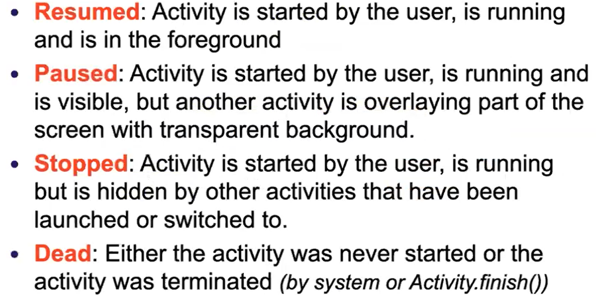

> * match_parent will resize the content according to its root component, and wrap_content will resize the content according to the shape of its content.

## A Sample and Simple Text View XML
> 

> When pressed on Back button:
> 1. onPause()
> 2. onStop() → The Activity will not be visible anymore
> 3. onDestroy() → Will be called if the app is cleared from the memory.
>
> Views are embedded in ViewGroups, inside a ViewGroup you can embed as many Views as you want.

## Linear Layout
> Organizes components horizontally or vertically, it has got an orientation attribute (which could be set to horizontal or vertical). If you pick horizontal, components will be put side to side and beneath each other in vertical.
> : 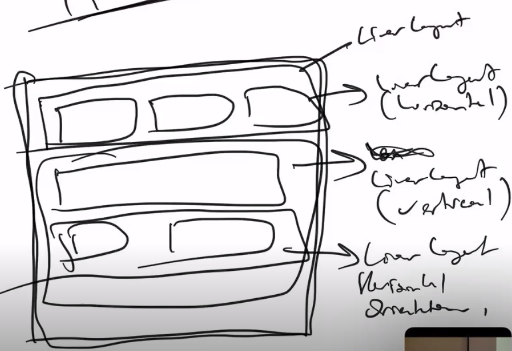
> : 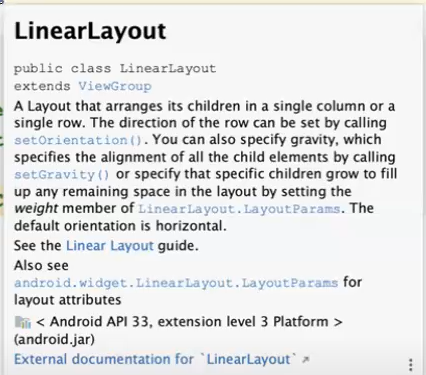

## Constraint Layout
> Newer version for layout, we just anchor a component to another or to the screen. This is the one where we can also use the interface to determine the relative position of a component.
>
> 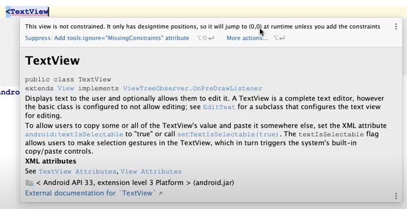
>
> : 

## Table Layout
> Positions its children into rows and columns. TableLayout containers do not display border lines for their rows, columns, or cells. The table will have as many columns as the row with the most cells.

## ___`Margin`___: `Space between neighbors`
## ___`Padding`___: `Space between components inside a container`

> Make all classes public in Android.
>
> 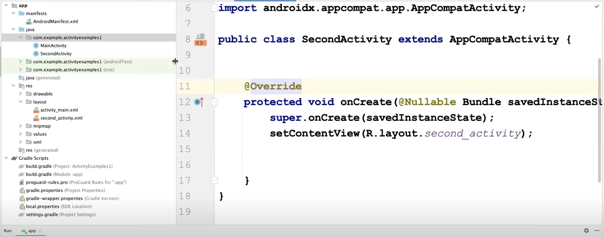

## The Observer Pattern
> 
>
> Logic is recall what we did in polymorphism. For example say we've got a mechanic which was able to fix all vehicles. Observer pattern has the same design.
>
> Think that this guy is a mechanic and it knowns about which derieves from vehicle, and it calls the vehicle's common method while dealing with them.
>
> We've gota  ___`Subject`___ for the Observer Pattern.
> : Think about an event, say button click or user drag. Whatever the user action, that's an event action. The events are, naturally, fired by certain components. For example clickEvent is fired by a button. In this sense, the Subject is the button. 
> : ___`Subject`___ is the button, who actually knows the event is being fired, that's the subject. If a button is clicked, then that button is the ___`Subject`___ and it knows that its being clicked, so it will broadcast the message I am being clicked.
>
> This is usually defined as an interface called `Observer`. It has got a public `notify` method. So, whoever derieves from the Observer type, must override the method notifier as it is an interface.
>
> An Activity can be an observer of an event, or you can just create inner classes to make Observers. How are they communicating with the subject?
> : The Subject, in the inside, has a embedded list called ObserverCollection, and all the Observers are added into this arrayList through methods. In the diagram, you can see registerObserver().
>
> As you can see there is a method called notifyObservers(), button knows that its being clicked, when its clicked, it iterates over the Observers and calls their Notify methods. 
>
> We have a Subject which contains a list of Observers. Subject has a list of type Observer inside, and Observer implements the Observer interface.
>
> Say we have a fire alarm. When there is a fire alarm, the fire alarm broadcasts the message, for example you can create firefighters and police that can take action immidiately.
>
> Subject will be Fire Alarm (has a list of Fire Events, it will loop over the Fire Events) and interface will be Fire Event (Firefighters and Polices will be extending from the Fire Event).
>
> This time we make the Subject a Button (has a list of onClick() listeners, and whenever it is clicked, it rolls over the listeners and calls their clicked() methods,an d whoever is a onClick() listener, in our case Forms will be extending from the onClickListener(), and the Forms will be Activities. So when the button is clicked, these Forms will be notified about the click.), we use an interface, usually name them as onClickListener() (has a method clicked())
>
> ___The fireListener() interface___
> : 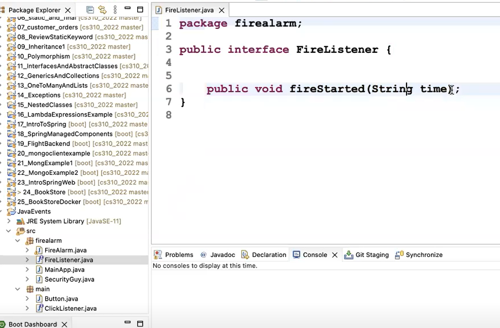
>
> ___This is fireAlarm.java, our Subject___
> : 
> FireEvent is to stimulate when a fire begins, it will inform the listeners that there is a fire.
> : 
> AddFireListener method adds listeners, so that other people (who wants to be an observer) to the list of this Fire Alarm.
>
> ___Say we have a Security Person___
> : 
> It needs ti omplement the FireListener interface, and override fireStarted() method.
>
> ___This is the MainApp.java___
> : 
> We add security guy to the alarm as a listener.
>
> : 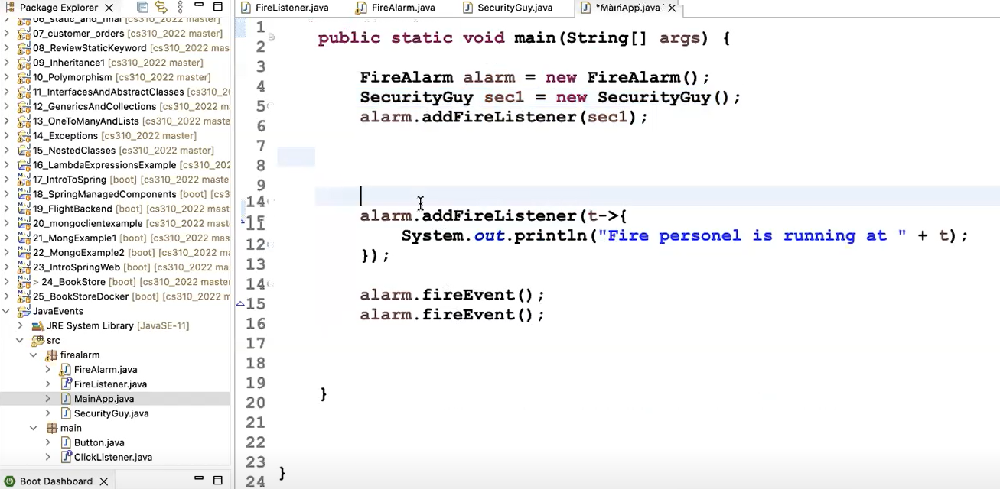
>
> This is the output of these code:
> : 
>
> ___For Button, say we have an interface called ClickListener.java___
> 
> 
> ___This is the Button.java___
> : 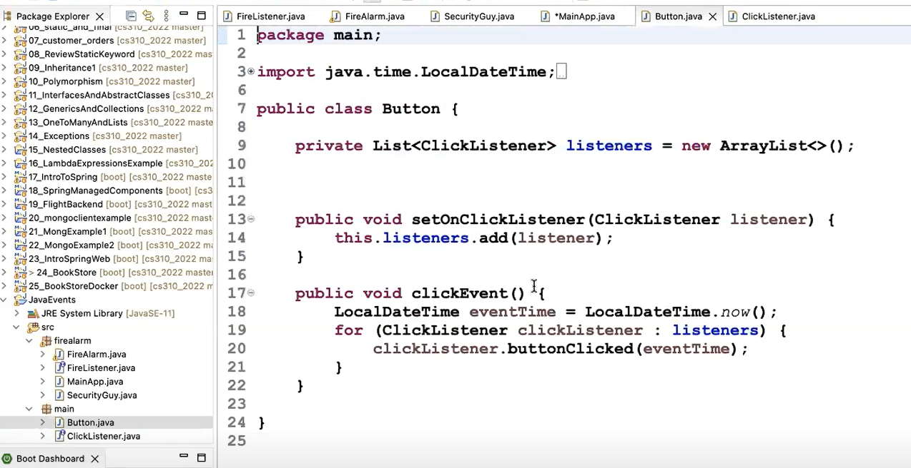
> 
> ___This is the MainClass.java___
> : 
> : 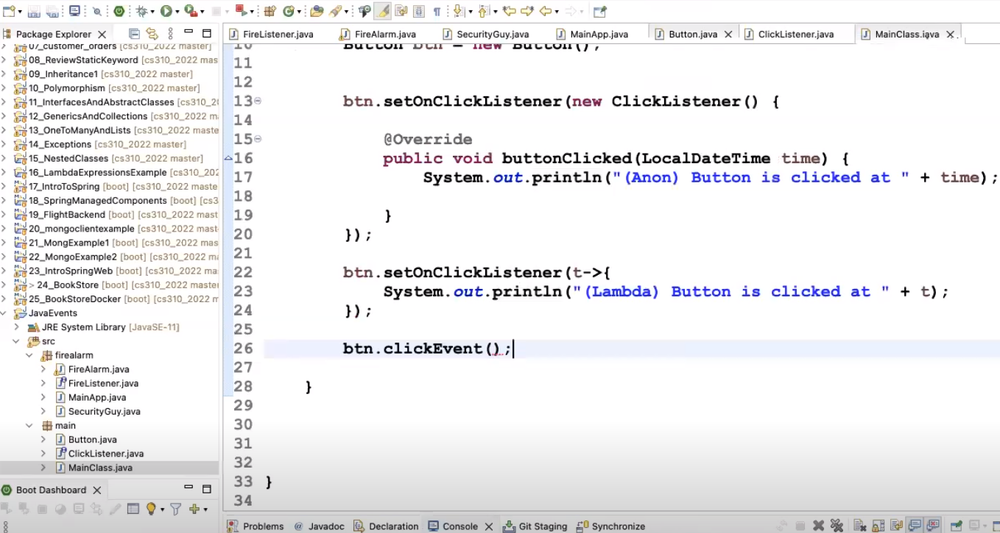
>
> And this is the output for anonymous and lambda ones.
> : 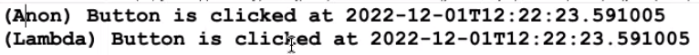

## An Example with UML
> 
>
> The Subject of the Observer Pattern is the event source in Java events.
>
> The Listener Interface is the Observer Interface. Suppose you want to catch-up mouse events, and there are some forms that actually implements this interface. What they do is they add themselves as the listener of this the button.
>
> When the event is fired, the Button will iterate over the components and call the method mouseClicked(). There's also an Object inside the mouseClicked() method.

> TextView is for displaying static texts, the other ones are called EditText components, for getting input from the users.

## To Add Click Events to Buttons
> 
>
> 


> Toast messages are simple notifications that are displayed as text and they disappear.

## Java Events and Observer Pattern
## Events
> 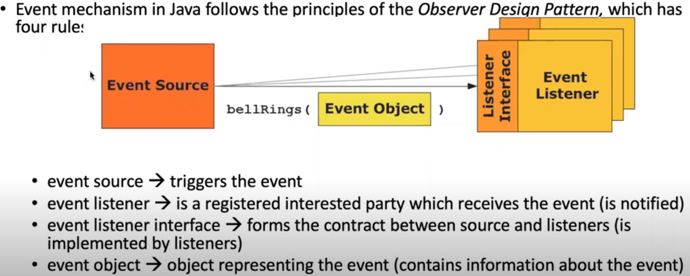
> : Event source fires the event (such as a button, when clicked, the button fires and says to all of its listeners "I am clicked!")
>
> The source triggers the events

## An Example in UML
> 
> : When the traffic light changes, it informs the Cars and Trucks about that. 
> : * Here, the Subject is the TrafficLight (the one that fires the event). Observer implementations are Car and Truck (They are called as Conrete Classes). 
> : They use a standard interface (signalListener), which is the Observer here. All the subtypes of the interface (SignalListener subtypes here are Car and Truck), must implement the SignalListener. 
> : * You can also send additional information, here it is SignalEvent.
```Java
// This is the TrafficLight.java, in files like this youc an create at most 1 public class, the rest should not be public be careful about that. If you want to add an inner class,

// TrafficLight is the Subject
public class TrafficLight {

    List<TrafficLightListener> listeners;

    public void addListener(TrafficLightListener listener){
        if (listeners==null){
            listeners = new ArrayList<TrafficLightListener>
        }
        liseners.add(listener);
    }

    public void lightChanged(String color){
        
        Date now = new Date();

        for (TrafficLightListener listener : listeners){
            listener.colorChanged(color, now);
        }
    }

// Inner classes such as this one can access all the fields inside the wrapping class.
// Member inner class 
    class InnerTest{

        void test(){

        }

    }

}

// TrafficLightListener is the Observer
interface TrafficLightListener{
    // Concrete Classes will be classes that implement TrafficLightListener interface.
    public void colorChanged(String color, Date date);
}


// This is the Car.java
// This is the Concrete Class
public class Car implements TrafficLightListener{
    @Override
    public void lightChanged(String color, Date date){
        System.out.println("Light changed to:", color, " Date:", date);
    }
}

// This is the MainClass.java

public class MainClass{

    public static void main (String[] args){
        
        TrafficLight light = new TrafficLight();
// Creating our concrete class objects called car1 and car2.
        Car car1 = new Car();
        Car car2 = new Car();

// Add cars to light's listener list.
        light.addListener(car1);
        light.addListener(car2);

// Say the light changes to yellow
//  The lightChanged will iterate through all the listeners and call lightChanged on each. 
        light.lightChanged("yellow"); 

// Suppose we want to add Truck but don't want to create a class for it, and do it anonymously.
// Anonymous inner class
        light.addListener(new TrafficLightListener() {
// This inner area is a class, same area as car class.

            @Override
            public void colorChanged(String color, Date date){
                 System.out.println("Truck" + color + ", date:" , date);
            }
        });


        light.addListener(new TrafficListener() {
            
            @Override
            public void colorChanged(String color, Date date){
                System.out.println("Motorcycle:", color, ", date:", date);
            }
        })

        light.lightChanged("yellow");
    }
}
// Inner classes are classes inside classes, inside MainClass, we have inner anonynmous classes.
```
> This is the output of the code above: 
> : 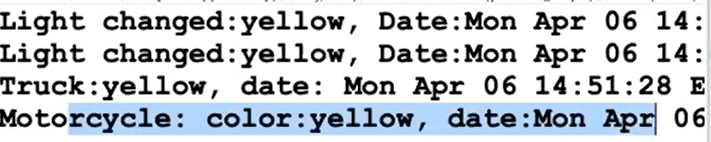 

## Another Example
> 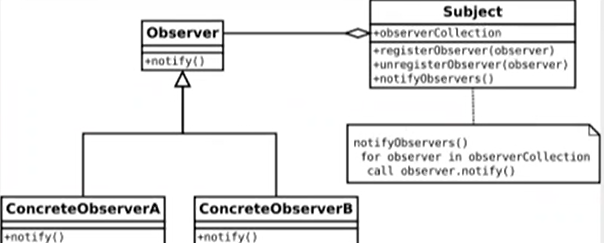
>
> : This is the UML description of Observer Pattern used in Java and Android events, button clicks, long clicks etc.
> : * Subject is the root of the event, so event is fired by the subject (subject is the button here). When the button is clicked, it calls the notifyObservers() method
> : So how does the Observer adds them inside observerCollection (this is a list| )?
> : * It adds them by using a method such as registerObserver(observer) method.
>
> The Observer here is an interface and ConcreteObservers will be the listeners. For example, the ConcreteObserverA will be a Form which is trying to catch the Button clicks inside its content.
>
```Java
// Now suppose you are in an Android system.
// This is Screen.java

public class Screen{

}

// This is Button.java
// Button is the Subject here
public class Button{

    List<ButtonClickListener> listeners = new ArrayList<ButtonClickListener> ();

    public void addListener(ButtonClickListener listener){
        listeners.add(listener);    
    }

// Suppose this method is invoked whenever a user clicks the button.
    public void doButtonClick(){
        Date now = new Date();
// Iterate over the listeners and call buttonClicked on these.  
    for (ButtonClickListener buttonClickListener : listeners){
        buttonClickListener.buttonClicked(date);
    }

    }
}


// Who wants to be listening to the Button events should be implementing ButtonClickListener.
interface ButtonClickListener{
    public void ButtonClicked(Date date);
}

// This is MainClass.java

public class MainClass{
    public static void main( String[] args){

        Button btn = new Button();
        btn.addListener(new ButtonClickListener(){

            @Override
            public void buttonClicked(Date date){
                System.out.println("Listener1 button clicked at:", date);
            }
        });
        
        btn.addListener(new ButtonClickListener(){

            @Override
            public void buttonClicked(Date date){
                System.out.println("Listener2 button clicked at:", date);
            }
        });

        btn.doButtonClick();
    }
}
```
> This is the output of the code above:
> : 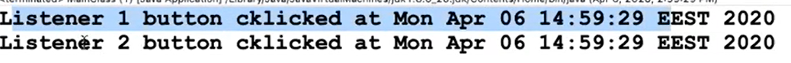

# ___`WEEK 10`___
# Review
## Activity
> Activity must have a Layout. Inside the layout, we've got View components. We talked about LinearLayout (the basic one), and ConstraintLayout(which is the default layout system right now, what's important about ConstraintLayout is `whatever you put on the screen must be anchored at least to two points.`)
>
> 
>
> We interact with the user using Observer Pattern (it is the default pattern for user interactions, for example click events or selection events)
>
> Observer Pattern is really similar to Polymorphism.
>
> **Subject**
> : Has a list of listeners.
> : List < Observer > listeners;
> : foreach listener:
>   : listener.notify();
>
> **Observer<interface>**
> : This is usually an interface, has a method called notify() 
>
> **Concrete Observers**
> : Must implement Observer type, so they have to Override notify() method. 
>
> Example:
> - An Activity can be a Concrete Observer, or
> - You can do it anonymously (use lambda logic)  
>
> **All Views**
> : Has a View.onClickListener()  

## Not Important But Android Spinner Example
> 

## Tasks and Backtrack
> Whenever you see context somewhere, it means the Activity, running application component. To refer to the context:
> : MainActivity.this
> :     
>
> A task is a collection of activities that users interact with when performing a certain job.
>
> The activities are arranged in a stack (called the `back stack`), which is in the order that activities are opened:
> : 
>
> So if you start an application, it is added into the application stack. The apps live until the user exists them. As the user starts an application, it lives in the memory as long as the user or the system exists (kills) the app. 

## Intent 
> In Java, an intent is a messaging object that is used to communicate with other components of an Android application. It is used to request an action to be performed by another component, such as starting a new activity or broadcasting a message. Intents can be used to perform a variety of tasks, such as starting a new activity to display a list of items, sending a message to another component to update its data, or starting a service to perform a background task. Intents are typically used in conjunction with activities, services, and broadcast receivers to create a complete application architecture.
>
> Sure, here's an example of how to use an intent in Java to start a new activity:

```Java
// Create an intent to start a new activity
Intent intent = new Intent(this, MyActivity.class);

// Add any additional data to the intent
intent.putExtra("key", "value");

// Start the new activity
startActivity(intent);
```
> In this example, we create an intent to start a new activity called 
> MyActivity
> . We then add any additional data to the intent using the 
> putExtra()
>  method. Finally, we start the new activity using the 
> startActivity()
>  method. When the new activity is started, it will receive the data that was added to the intent and can use it to display information or perform some other action.

## Controlling Task Behavior
> On the caller intent use setFlags(), some of flags:
> : 
>
> **FLAG_ACTIVITY_CLEAR_TOP**
> : 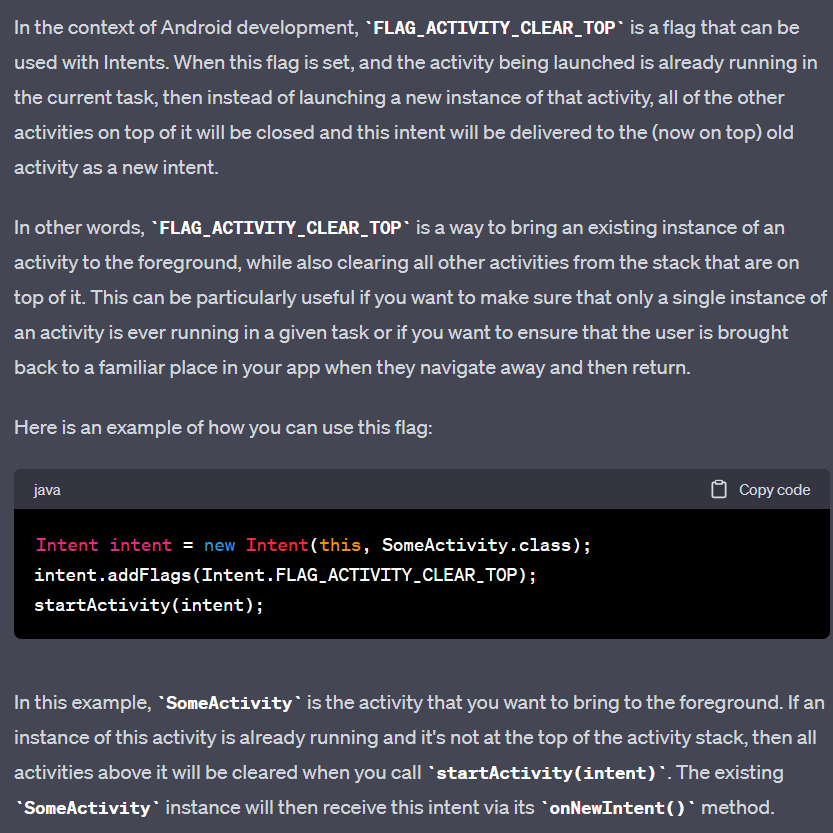

## Styles & Themes
> 
> : Style means what you apply to a single component, such as a Button or a Text View.
> : Theme is a set of styles applied to the entire Activity or application.

## Fragments
> 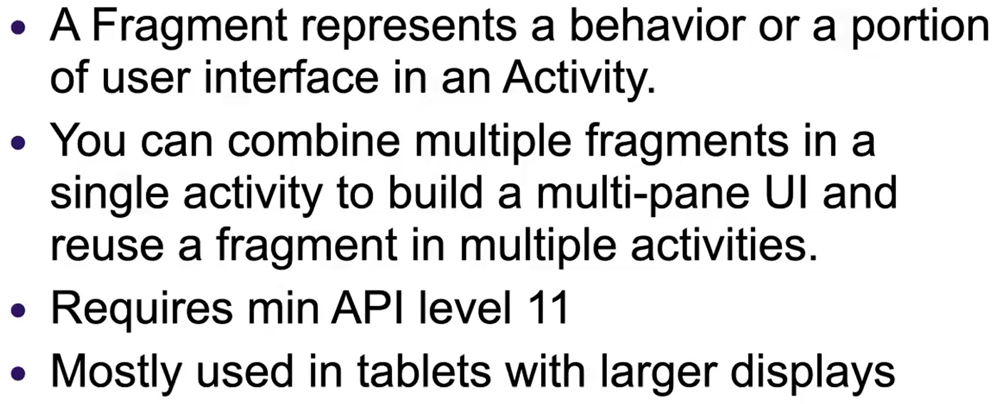

## Fragment  Lifecycle
> 
>  : onAttach() means the Fragment is attached to the activity. 

# ___`WEEK 11`___
# Review
> Fragments are for filling out a partial part of the screen with views, and we can use several Fragments with an Activity.
>
> Activity is still alive and only the Fragments are changing.
>
> Say Activity has-A Fragment. How can an Activity send information to a Fragment?
> : If you're send a message to an Object, you're making a method/function call. So how can an Activity send a message to a Fragment (Activity has the control of the Fragment, so it has control over all of Fragment's methods, getters, setters, etc...)?
>
> 
> : Here, the Activity has a Fragment instance. You can send the Activity's instance to the Fragment shown with the arrow. Activity is the parent of a Fragment and the Fragment has an instance of Activity (this is called cross referencing). **NEVER DO THIS, if you do so when one exists, the other won't and it would not be possible to clear them from memory, so this is a bad logic.**
>
> If you want to manage the communication from Fragment to the Activity, then you shouldn't keep a reference in the Fragment. Correct way of doing is to use the **`Observer Pattern`**. ___USING OBSERVER PATTERN PREVENTS CROSS REFERENCING___ In this case, Subject (Subject is the one get the idea of the event is being fired)

## Observer Pattern Review
> We've got a **Subject**, **Observers, have notify() method, whoever extends from an Observer will become an Observer**, `Subject HAS Observers.`
>
> Say Fragment A is a Subject and we have FragmentListener(s), so when an event occurs, the Fragment A will go over its listeners and call theor notify() methods. Who implements the FragmentListener interface will be able to listen to the event firing of Fragment A. 
> : The Activity of any other Fragment could implement the FragmentListener and become an Observer. You don't actually need to create classes for this because you can also use anonymous expressions.
>   : _GPT_ ⟶ An anonymous expression is a short-hand way of defining a lambda expression or a method reference. Inner types are types defined within a class and have access to the private members of the class.

> FragmentExample2, a Fragment is able to communicate with the other Fragment, and we can use this exact pattern to send information to the Activity too.
>
> Mutable stuff can change,
> * In programming, "mutable" refers to a characteristic of a variable that can be changed after it has been initialized. 
> * This means that the value of a mutable variable can be changed during the execution of a program, whereas an immutable variable cannot be changed once it has been initialized.

## Fragment Top

## Fragment Bottom
> 

## ViewModel for Fragment  Communication
> 

## Binding
> Binding means binding the user interface components to the code behind.
>
> ___GPT___
> : Data Binding in Android allows you to bind UI components in your layouts to data sources in your app using a declarative format rather than programmatically. This greatly simplifies your code, reduces boilerplate, and helps to prevent common programming errors.
> 
> It's a key part of Model-View-ViewModel (MVVM) architecture, where the Model is the data, the View is the UI, and the ViewModel is the interface between the Model and View.
> 
> With data binding, you can create an observable data object that holds the data, and when that data changes, the UI elements that are bound to the data will automatically update to reflect the changes.
> 
> Here's a very simple example of how to use data binding:

Enable data binding in your build.gradle file:

Andriod.content.ActivityNotFoundException


```java
android {
    ...
    dataBinding {
        enabled = true
    }
}
```
> Wrap your XML layout with a <layout> tag and declare a variable for your data:
```xml
<layout xmlns:android="http://schemas.android.com/apk/res/android">
    <data>
        <variable
            name="user"
            type="com.example.User" />
    </data>
    <LinearLayout
        android:orientation="vertical"
        android:layout_width="match_parent"
        android:layout_height="match_parent">
        <TextView
            android:layout_width="wrap_content"
            android:layout_height="wrap_content"
            android:text="@{user.firstName}" />
        <TextView
            android:layout_width="wrap_content"
            android:layout_height="wrap_content"
            android:text="@{user.lastName}" />
    </LinearLayout>
</layout>
```
> In your activity, set the content view using the generated binding class and set the data:
```java
@Override
protected void onCreate(Bundle savedInstanceState) {
    super.onCreate(savedInstanceState);
    ActivityMainBinding binding = DataBindingUtil.setContentView(this, R.layout.activity_main);
    User user = new User("John", "Doe");
    binding.setUser(user);
}
```
> In the above example, the User class would be a simple POJO (Plain Old Java Object) with firstName and lastName properties. When the User object is set on the binding, the TextViews in the layout will automatically update to display the user's first and last names. If the User object is changed, the TextViews will automatically update with the new data.

> Boilerplate means repeated code sections throughout a program or software.

## Displaying Lists On Screen
> List displaying really problematic performance issues. For example if you're browsing an app and it frozes, that's how much significant the impact of list displaying performance is.
>
> Smooth lists are important.
>
> **Legacy ListView**
> : This directly displays a simple list.
> : 
> **Recycler View**
> : The new version of the Android supports this.
> : Provides data updates etc. automatically.
> 
> : The critical thing is the **`Holder Pattern`**, and Holder Pattern is used by the Recycler View
>
> Suppose you have a Recycler Class View
> : 
>
> RecyclerView is a more advanced and flexible version of ListView. It is a container for displaying large data sets that can be scrolled very efficiently by maintaining a limited number of views. This is achieved by recycling the views that scroll off of the screen for reuse for the views that will then appear on screen.
> 
> RecyclerView alone is not enough. You need to use it along with RecyclerView.ViewHolder, RecyclerView.Adapter and RecyclerView.LayoutManager.
> 
> Here are the components that make up a RecyclerView:
> 
> **RecyclerView.Adapter:** This is the bridge between the RecyclerView and the data for that view. The Adapter provides access to the data items. It also makes a View for each item in the data set.
> 
> **RecyclerView.ViewHolder:** Each ViewHolder provides an access to the views in a data item. It stores the references to the individual views within the item layout for fast access.
> 
> **RecyclerView.LayoutManager:** This is responsible for arranging the individual elements on the screen. It also handles the efficient removal or addition of elements as the user scrolls.
> 
> Here is an example of how these are used:
```Java
public class MyAdapter extends RecyclerView.Adapter<MyAdapter.MyViewHolder> {

    private List<String> myData;

    public static class MyViewHolder extends RecyclerView.ViewHolder {
        public TextView textView;
        public MyViewHolder(TextView v) {
            super(v);
            textView = v;
        }
    }

    public MyAdapter(List<String> myData) {
        this.myData = myData;
    }

    @Override
    public MyAdapter.MyViewHolder onCreateViewHolder(ViewGroup parent, int viewType) {
        TextView v = (TextView) LayoutInflater.from(parent.getContext())
                .inflate(R.layout.my_text_view, parent, false);
        MyViewHolder vh = new MyViewHolder(v);
        return vh;
    }

    @Override
    public void onBindViewHolder(MyViewHolder holder, int position) {
        holder.textView.setText(myData.get(position));
    }

    @Override
    public int getItemCount() {
        return myData.size();
    }
}
```
> Then in your Activity, you would set the RecyclerView's adapter:
```Java
RecyclerView recyclerView = findViewById(R.id.my_recycler_view);
recyclerView.setHasFixedSize(true);
RecyclerView.LayoutManager layoutManager = new LinearLayoutManager(this);
recyclerView.setLayoutManager(layoutManager);
List<String> myData = Arrays.asList("data1", "data2", "data3", "data4");
RecyclerView.Adapter mAdapter = new MyAdapter(myData);
recyclerView.setAdapter(mAdapter);
```
> The "Holder Pattern" is basically the same as using a RecyclerView.ViewHolder. The ViewHolder holds the reference to the id of the view resource and is used to avoid the expensive findViewById method. Instead of calling findViewById every time we run onBindViewHolder, we store a reference to the view in a ViewHolder to speed up its access in the future.

## ___`GPT ON WEEK 11`___
> Sure, these notes seem to cover a few different topics related to User Interface design in Android applications, primarily around using AdapterViews and building custom lists. Here's a summary:
> 
> ___AdapterView:___ AdapterView is a ViewGroup that displays items loaded into an adapter. Subclasses of  AdapterView include ListView, GridView, Spinner and so on. The adapter provides a bridge between the AdapterView and the underlying data. It retrieves data from an external source and populates the AdapterView with this data.
> 
> ___Filling the Layout with Data:___ This is about how to populate your AdapterView with data. For instance, if you have a ListView, you'll bind it to an Adapter which fetches the data from a source (like an array or a database) and inflates each row of the ListView with this data.
> 
> ___Handling User Selection in ListView:___ ListView is an AdapterView that displays a list of scrollable items. The items are provided by an Adapter. You can handle user selections in the ListView by listening for click events on the list items.
> 
> ___ListActivity:___ This is a subclass of Activity that includes a ListView. It provides some utility methods for handling a ListView, like onListItemClick() which is called when a list item is clicked.
> 
>___Custom Layout for Lists:___ You can create custom layouts for each row in your AdapterView. This allows you to have more control over the appearance of each item in the list.
> 
> ___Creating Custom Adapters:___ For more complex list items, you might need to create a custom Adapter. This involves extending the BaseAdapter or ArrayAdapter class and overriding methods like getView(). The getView() method is responsible for inflating the layout for each item and populating it with data.
> 
> ___Holder Pattern:___ This is a pattern used to increase the efficiency of your Adapter. It involves creating a static class inside your Adapter that holds references to the important views in your layout. This way, you don't have to call findViewById() each time getView() is called.
> 
> ___ScrollView:___ This is a View that provides a scrollable area in your layout. It can contain multiple children, but only one child can be scrolled.
> 
> ___DatePickerDialog and TimePickerDialog:___ These are dialog boxes that allow the user to select a date and a time, respectively.
> 
> ___ViewFlipper:___ This is a ViewAnimator that switches between two or more views that have been added to it. It can be used to animate between views.
> 
>___SlidingDrawer:___ This is a widget that slides out from the edge of the window to reveal more content. It contains a handle and content, and can be used for things like hidden menus.
> 
> Remember that these are Android-specific concepts, so they all relate to Java programming for Android applications. You'll need to understand these concepts to create dynamic and interactive Android applications.

## Recycler View Is For Displaying Lists
> We need to acces the View Components coming from the layout and fill the related row with data. 
> : In order to manage that, a special pattern is used called **`Holder Pattern`**
>
> Holder Pattern is for holding something, actually holding interface components in each row. 
> : Holder Pattern is for holding UI Components. It creates the binding between layout and the call.
>
> RecyclerView is a class, which needs an adapter. Its adapter is called RecyclerViewAdapter, and is a generic type that accepts holder type.
> : A generic type is a class or interface that is parameterized over types.  
>
> The Adapter holds the data and UI elements, and information about rows.

## ___`WEEK 12`___
# GPT ON THREADS
> Sure, the information you provided covers a broad range of topics within Java multithreading. Here's a more detailed breakdown:
> 
> ___Multitasking:___ It's the concept that a system can perform multiple tasks simultaneously. It is of two types:
> 
> ___Process-based:___ Multiple independent programs run concurrently, like Spotify and Word running at the same time.
> 
> ___Thread-based:___ A single program performs multiple tasks simultaneously, like a text editor printing while also formatting text. This is referred to as multithreading.
> 
> ___Main Thread:___ When a Java program starts, the main thread begins running immediately. It's usually the last to finish execution, and when it stops, the program terminates.
> 
> ___Threads:___ In programming, a thread is a single flow of control. It's like a unique path a program follows during execution. You can create and control multiple threads in a program, which can improve performance by doing multiple things at once.
> 
> ___Multithreading:___ This is the concept of a single program executing multiple tasks simultaneously by using multiple threads. Each thread represents a separate flow of control.
> 
> ___Creating Threads___: Threads can be created by extending the Thread class or implementing the Runnable interface. The latter is usually preferred as Java does not support multiple inheritance.
> 
> ___Thread Sleep:___ The Thread.sleep() method is used to pause the current thread for a specified amount of time. This can be useful for simulating operations that take a certain amount of time.
> 
> ___Daemon Threads:___ These are threads that do not prevent the JVM from exiting when the program finishes but the thread is still running. They are useful for background tasks.
> 
> ___Thread Synchronization:___ Synchronization in Java is an important feature which allows only one thread to access the shared resource at a time. This is mainly used to prevent thread interference and consistency problems.
>
> ___Synchronized Methods & Blocks:___ These are tools for achieving thread synchronization in Java. A synchronized method ensures that only one thread at a time can access the method. Synchronized blocks are used to mark a specific section of the code as synchronized.
>
> ___Thread Interruption:___ The isAlive() and isInterrupted() methods are used to check if a thread is still running and if it has been interrupted, respectively.
> 
> ___Pausing and Suspending Threads:___ Threads can be paused or suspended by using Object.wait() and Object.notify() methods. The Thread.suspend() and Thread.resume() methods are deprecated due to safety issues.
> 
> ___java.util.concurrent Package:___ This package contains a set of classes that are useful in concurrent programming, including concurrent collections, synchronization utilities, thread pools, and others.
> 
> ___ExecutorService:___ This is a higher-level replacement for working with threads directly. Executors are capable of managing a pool of threads, so the developer does not have to manually manage thread lifecycles.
> 
> ___Callable and Future:___ Callable is similar to Runnable, except it can return a result and throw a checked exception. The Future interface represents the result of a computation that may not have completed yet.
> 
> The concept of multithreading is essential for creating efficient and effective Java programs, especially for tasks that are CPU-intensive or that require performing several tasks at once. However, it requires careful implementation to avoid issues like deadlocks, race conditions, and thread interference.

## Android Threads
> Application
> : Has ExecutorService
> - Threads cannot affect UI thread, so we need to use a Handler instead.
>
> What is a Handler?
> : Handler is a component that is used to schedule and execute tasks in the future. It allows you to communicate from a background thread to the main thread, which is very useful because Android UI operations are not thread-safe and can only be executed from the main thread.
> When you instantiate a Handler, it's bound to the thread / message queue of the thread that's creating it — from that point on, it'll deliver messages and runnables to that message queue and execute them as they come out of the message queue.
> 
> This mechanism is typically used to schedule tasks that need to interact with the user interface, ensuring they are executed on the main thread. However, it can also be used with worker threads to schedule tasks off the main thread.
> 
> For example, if you're performing a computationally expensive operation like loading data from the network, you could use a Handler to schedule the UI-updating code to be executed on the main thread once the data is ready, while keeping the expensive operation on a background thread.


## Multitasking
> 
> : All operating system are Process Based, two or more processes can be run concurrently.

## Main Thread 
> The Main Method in Java is the Main Thread.

## Real Life Examples
> 

## Multi Threading
> Why do we need threading for Android?
> - Services are for background tasks, this is an app component. Services have threads running in the background, such as location updates.
>
> Creating HTTP request and updating the UI
> - If you want to create an HTTP request, you have to have a thread, so for all HTTP requests, you need to have a thread.
> - Second constraint is, when you create a thread and make a request, you'll have a response. If you want to update the UI from a thread, you have to follow the Observer Pattern, or you have to use special binding types to update the UI from threads.
>
> Main is the main thread for your application.a nd main controls all other threads and waits for them to finish.
>
> ___2 ways to create a thread:___
> 1. Extending from Thread type
> 
>
> If you run the threads like the following using the run() method, they won't run parallely as they did with start(), they will run sequantially:
> : 
> 
> : Thread static class decleration inside Main.
> 
> : This creates threads and runs the for loop in them
> 2. Implementing the Runnable interface
> : If you need to extend from a seperate class and make your class also a Thread, you implement the Runnable.
>
>  In Step 1 which was Extending from Thread type, we created threads as a standard Java class. Now we're going to do do it differently.
> : 
> : * The only difference here is we wrap our Runnable instance with the Thread.
> 
> For declaring Thread 3, we can declare it using lambda expression.
> : 
>
> Following Java 5, we've got an Executor Service in order to call, implement and create and control a thread so we can access them through the executor service such as stopping them completely.
> : To do that, we create an Executor Service
> : - First way is using .newCachedThreadPool(), it can accept unlimited number of threads, or use .newFixedThreadPool(), for limited thread number. 
> 
> Using the Executor Service, we can Submit Threads. Submit accepts two types:
> 1. Callable 
> 2. Runnable: A new type of thread that's a kind of thread that returns you an information. We'll use this one.
>
> 
> CountThread is the name of our static class declared inside the Main class.
> 
```Java
public static void main (String[] args){

    ExecutorService srv = Executors.newCachedThreadPool();

    srv.submit(new CountThread("Thread-1"));
}
```
> If you don't want to accept any new threads inside srv, you call srv.shutDown(). After doing so, the service will not accept any more threads, the service will run them and your main application will exit when running these threads are finished, and then your code will end.
>
> If you don't use srv.shutDown(), your application won't exit. JVM will keep running the application. After threads are done after their invocation, JVM will stop running as it seet srv.shutDown(). 
> 
> ___Java I/O (Input/Output):___ In Java, Input and Output operations are performed via streams. Stream is a sequence of data. In Java, a stream is composed of bytes. It's called a stream because it's like a stream of water that continues to flow.
> 
> ___Reader - Writer vs InputStream - OutputStream:___ In Java, there are two types of streams. Byte streams (InputStream and OutputStream) and Character streams (Reader and Writer). Byte streams are used to perform input and output of 8-bit bytes, while Reader/Writer are used for 16-bit unicode.
> 
> ___BufferedReader - BufferedWriter:___ These are used for reading and writing text (character data). They buffer characters so as to provide efficient reading and writing of characters, arrays, and lines.

> 1. What is the difference between a Reader and an InputStream in Java?
>       * Reader is character-oriented and InputStream is byte-oriented. Reader is meant for reading streams of characters. For internationalization support, we use Reader. InputStream is meant for reading streams of raw bytes such as image data.
> 
>
> 2. How would you use a BufferedReader to read a file in Java? Give a code snippet.
```Java
try (BufferedReader br = new BufferedReader(new FileReader("file.txt"))) {
   String line;
   while ((line = br.readLine()) != null) {
       System.out.println(line);
   }
} catch (IOException e) {
   e.printStackTrace();
}
```
> 3. Write a Java method that takes a String (let's call it name) as a parameter and prints "Hello, name". What would this method look like?
```Java
public void sayHello(String name) {
    System.out.println("Hello, " + name);
}
```

```Java
class 
```
> 4. If you're using HttpURLConnection to send a POST request in an Android app, how would you include data in the request body?
```Java
URL url = new URL("http://example.com");
HttpURLConnection conn = (HttpURLConnection) url.openConnection();
conn.setRequestMethod("POST");
conn.setDoOutput(true);
DataOutputStream out = new DataOutputStream(conn.getOutputStream());
out.writeBytes("key=value");
out.flush();
out.close();
```
> 5. Explain how you would use a ListView and an ArrayAdapter to display a list of strings in an Android app, in your activity:
> 
```Java
String[] items = new String[] {"Item 1", "Item 2", "Item 3"};
ArrayAdapter<String> adapter = new ArrayAdapter<String>(this, android.R.layout.simple_list_item_1, items);
ListView listView = (ListView) findViewById(R.id.listView);
listView.setAdapter(adapter);
```
> In your layout (xml):
```xml
<ListView
    android:id="@+id/listView"
    android:layout_width="match_parent"
    android:layout_height="match_parent" />
```

## Java I/O
> Read and write from memory, files, etc..
>
> ___Char Based Operations___
> : Reader and Writer types, these are interfaces
>
> ___Binary Operations___
> : We've got InputStream and OutputStream, these are the supertypes for reading and writing character based or binary.
>
> So if you're just going to deal with characters, you need to use Char based operation types. For binary operations, you need to use InputStream and OutputStream types

## Stream
> In order to manage these read and write operations we need to create Streams. Reader/Writer and Input/Output Stream types are for creating Streams for us. 
>
> Stream is like a highway of data coming/going from/to a resource. Java will convert binary/character data to 1's and 0's automatically.

## Useful Java I/O Classes
> 

## Reader and Writer
> FileReader & FileWriter (these won't support UTF-8 characters such as Turkish, you'll just be able to process English.)
>
> InputStreamReader & OutputStreamWriter (supportse encoding, use this if you're dealing with UTF-8)
>
> Both these read everything one by one, so they are quite slow. 
> : We've got `BufferedReader` & `BufferedWriter` to make things faster. These types accept a fileReader/InputStream (another reader), and caches them and increases its performance. 
> : So while making read and write operations, use buffered ones.

## Binary Operations
> If you're going to read from a stream, we've got InputStreamReader/OutputStreamWriter, which actually does the operations one by one - byte by byte -, if you want to make them faster, we use the BufferedInputStream and BufferedOutputStream.
>
> ObjectInputStream/ObjectOutputStream is for reading/writing Java objects.
>
> If we're going to deal with character based operations, we're going to use BufferedReader & BufferedWriter wrapped with a file writer (if we're dealing with a file), or wrapped with another type if we're reading from the web.
```Java
public class MainClass{
    public static void main(String[] args){
        // Basic char write operation with files, write to file
        try {
            // Writer will be automatically closed after this try block because of writer.close().
            BufferedWriter writer = new BufferedWriter(new FileWriter("test.txt"));
            writer.write("some text some text \n some more text..");

            writer.flush(); // Release any system resource.
            writer.close();
        } catch (IOException e){
            e.printStackTrace();
        }
    }

    // Read from file, character based data 


        try {
        // Writer will be automatically closed after this try block because of writer.close().
        BufferedReader reader = new BufferedReader(new FileReader("test.txt"));

        String line = "";

        while ((line == reader.readLine()) != null){

            // When you add up strings using +/concatenation, all the old strings will be in memory and it will get exponential. Use StringBulder instead.
            StringBuilder buffer = newStringBuilder();
            buffer.append(line + '\n');
        }
        System.out.print(buffer.toString());
        } catch (IOException e){
            e.printStackTrace();
        }

}
```
```java
// This will copy image into another file.
public class ByteBasedImageCopy(){
    
    public static void main(String[] args){
        
        try (            
            BufferedInputStream reader = new BufferedInputStream(new FileInputStream('test.jpg'));
            BufferedOuputStream writer = new BufferedOuputStream(FileOutputStream('test.png'));
        ) {
            int b = 0;
            while ((b = reader.read() != -1 )){
                writer.write(byte(b));
            }
            writer.flush();

        } catch (IOException e){
            e.printStackTrace();
        } catch (FileNotFoundException e1){
            e1.printStackTrace();
        }


    }
}
```

# Review
## Threads
> Why do we need Threads in Android?
> : We need threads in order to make any HTTP call, we need to write that code in a thread, because Android does not let us to write HTTP codes for anything that returns an async task. For example Web Request is an async task, so we need to use threads for it.
>
> ___Ways to create a thread___
> 1. Extending the Thread type
>       - We @Override the run() method. 
> 2. Implement Runnable Interface
>       - We Implement the run method. 
> 3. Use Executor Service
>       - We need to Submit a Runnable Type with run() method implemented.
>
> If you call .start() on `1` and `2`, the threads will call .run() method on these objects. Or you can Submit them to the ExecutorService, so it will start them automatically and when all the threads are done, the ExecutorService may stop executing new threads. You can also add a certain number of threads to the ExecutorService and then may not let any more threads by using .shutDown(), so ExecutorService provides control over the threads.
>
> Firstly, if we call .run() method directly, it will not run as a thread. Secondly, when .run() method finishes its execution, the Object that is created from this thread is dead. You cannot restart it, you should reinitialize it and call it again.
>
> **`Threads die after the .run() method finishes so you need to reinitialize them, and resubmit them to the ExecutorService.`**
> : 

## I/O
> Our aim is to access a source, might be a file, an API returning an HTTP request, a memory reosurce. To read/send data with this resource, we need to get use of Streams. 
>
> Streams are flow of binary data. Java provides an NIO API, valid after Java 8. From the Java side, we need to create a stream to read and write from that resource. For that task, Java divides this reading and writing process into two.
>
> _Input is for reading and output is for writing._
>
> 1. Character Based Operations
>       - We've got Reader and Writer types. 
>       - For Readers, we've BufferedReader, and writer has BufferedWriter.
> 2. Byte Based Operations
>       - This is useful when dealing with image, audio files etc.
>       - We've InputStream and OutputStream types.
>       - We've BufferedInputStream and BufferedOutputStream


> To use ViewBinding, you add buildFeatures{viewBinding true} into build.gradle. 
> : 
>
> **What Is ViewBinding?**
> : If you enable ViewBinding, your layout files are automatically converted into classes, so you can access your components without .findByViewId().

> If you write a Thread and try to update the UI, Android will block you. What Android requires us is we need to use a `Handler` if we want to update the UI from threads.
> : So the Activity or the component will have some Handlers. The Thread will be aware of the Handlers, and Thread should update the Handler, and whenever you update the Handler, the UI will be informed about the update.
>   : 
>
> Handler is a supertype that you need to create your own implementation
>
```Java
public class MainActivity extends AppCompactActivity{
    
    ActivityMainBinding binding;

    // This is how you create a Handler
    Handler progressHandler = new Handler(new Handler.Callback()){
        @Override
        public boolean handleMessage(@NonNull Message msg){

            // Update the progressBar
            binding.progressBar.setProgress(msg.what);


            return true;
        }
    };


    @Override
    protected void onCreate(Bundle savedInsanceState){
        super.onCreate(savedInsanceState);
        
        // Binding is how we are going to access to our UI components
        binding = ActivityMainBinding.inflate(getLayoutInflater());

        setContentView(R.layout.activity_main)
    }
}
```
> UI Layer (Activity, Fragment) speaks with the Data Layer (Repository Layer).
> : Data Layer contains classes with threads that create HTTP Requests and parses responses.

> Manifest file contains all configurations.

## Get Hello Message
> 
> 

# ___`WEEK 13`___
> JSON is faster than XML
>
> First we write the repository code and then switch the the UI part.
>
> We need to enable the internet connections in Android.
> : 
> 
> : Here we set cleattexttraffic to true because we don't want to use HTTPS traffic.
>
> 
> : Use log.e to display error, throw is problematic.

> Polymorphism in Java is one of the core concepts of Object Oriented Programming (OOP). It describes the ability of an object to take on many forms. The most common use of polymorphism in OOP occurs when a parent class reference is used to refer to a child class object. Polymorphism can be of two types in Java: compile-time polymorphism (also known as static polymorphism) and runtime polymorphism (also known as dynamic polymorphism).
```Java

View root;
@Override
protected void onCreate(@Nullable Bundle savedInstanceState) {
    super.onCreate(savedInstanceState);

    root = new View(this);
    root.setBackgroundColor(getResources().getColor(android.R.color.white));

    setContentView(root);
}
    
import androidx.fragment.app.Fragment;

public class FooFragment extends Fragment {
    interface FooFragmentListener {
        void userFooded(String message);
    }
    FooFragmentListener listener;

    public FooFragment(FooFragmentListener listener) {
        this.listener = listener;
    }
}

@Override
public View onCreateView(LayoutInflater inflater, ViewGroup container, Bundle savedInstanceState) {
    Button btn = new Button(getActivity());
    btn.setText("Click Me!");
    btn.setOnClickListener(new View.OnClickListener() {
        @Override
        public void onClick(View v) {
            // Your code to execute when the button is clicked
            // For example, you can show a Toast message:
            Toast.makeText(getActivity(), "Button clicked!", Toast.LENGTH_SHORT).show();
        }
    });

    // Add the button to the container and return it
    container.addView(btn);
    return container;

    
}


public class HomeActivity extends AppCompatActivity [D]{
    @Override
    protected void onCreate(Bundle savedInstanceState) {
        super.onCreate(savedInstanceState);
        setContentView(R.layout.activity_home);
        getSupportFragmentManager().beginTransaction().replace(R.id.container, new FooFragment(this)).commit();
    }
}

