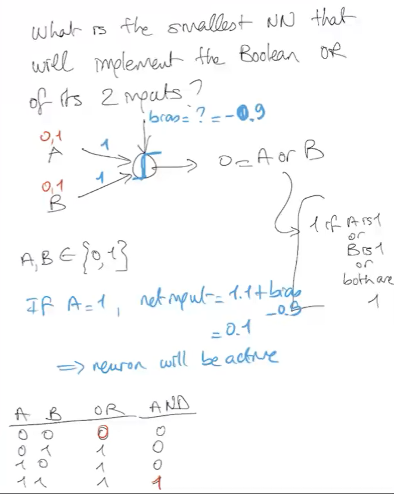

## Backpropagation Review
> You have a single neuron, with multiple inputs, a bias and output. 
>
> Net input of a neuron is: **Net input = wᵗx+b**
>
> The output node adds non-linearity.

# What is the smallest NN that will implement the Boolean OR if its 2 inputs?
> Say you're using a threshold activation (hardlimiting activation) function, and for values greater than 0 the activation function will output 1 and 0 if the value is smaller than 0. 
> 

## Sigmoid Saturation
> Transfer function derivative is 1 × (1-a) and when the input is very small or very large, the value converges to 0 or 1 because the gradient comes out really small.
> 

## Different Activation Functions
> **Sigmoid**
> - Saturated neurons kill the gradient
> - Sigmoid outputs are not zero-centered
> - exp() is a bit compute expensive
>
> **tan(h)**
> - Squashes the number between [-1, 1]
> - Zero centered which is nice
> - Still kills the gradient when saturated
>
> **ReLu** (Rectified Linear Activation Unit)
> - Computes **`f(x) = max(0, x)`**
> - Does not saturate
> - Computationally efficient
> - Converges very fast
> - Not zero-centered
>
> **`Dead ReLu Problem:`** If the activation is 0 or negative, the neuron won't contribute the classficiation.
> 
>
> **`Leaky ReLu`**
> - Does not saturate
> - Computationally efficient
> - Converges much faster
> - The neuron **`WILL NOT DIE`**
>
> **Summary**
> For hidden layers, use `ReLu` or derivatives which result in much faster learning.

## Deep Neural Networks
> They're deep neutral networks with several hundred of layers.
>
> 