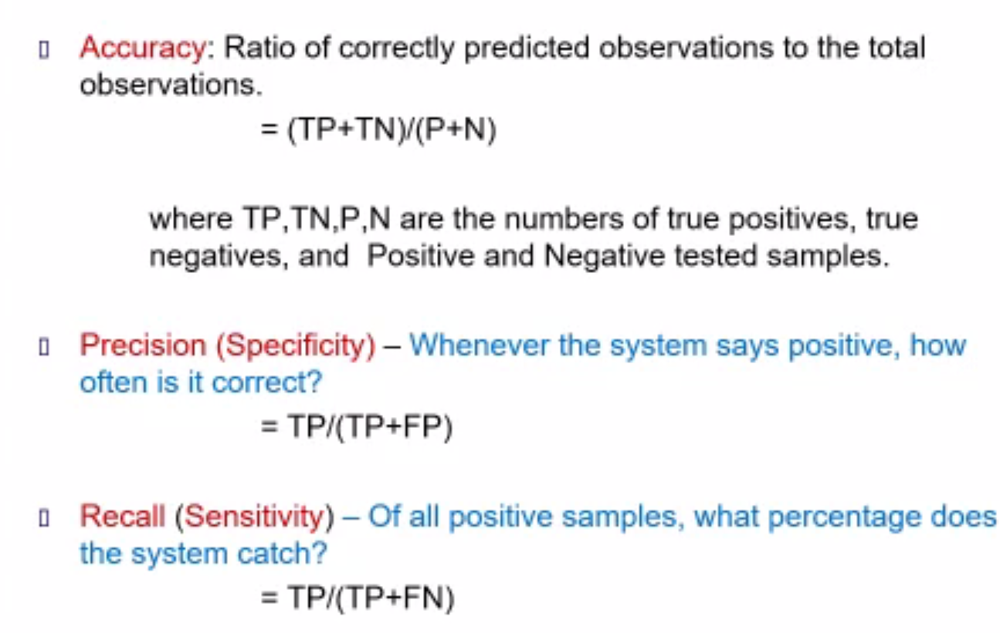
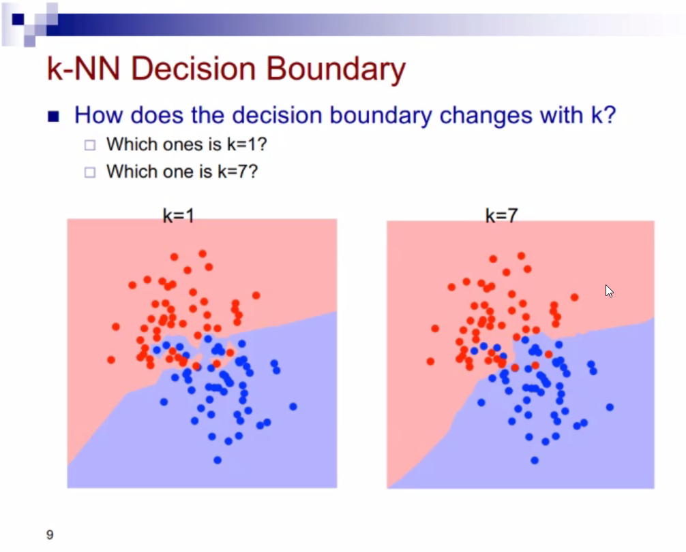
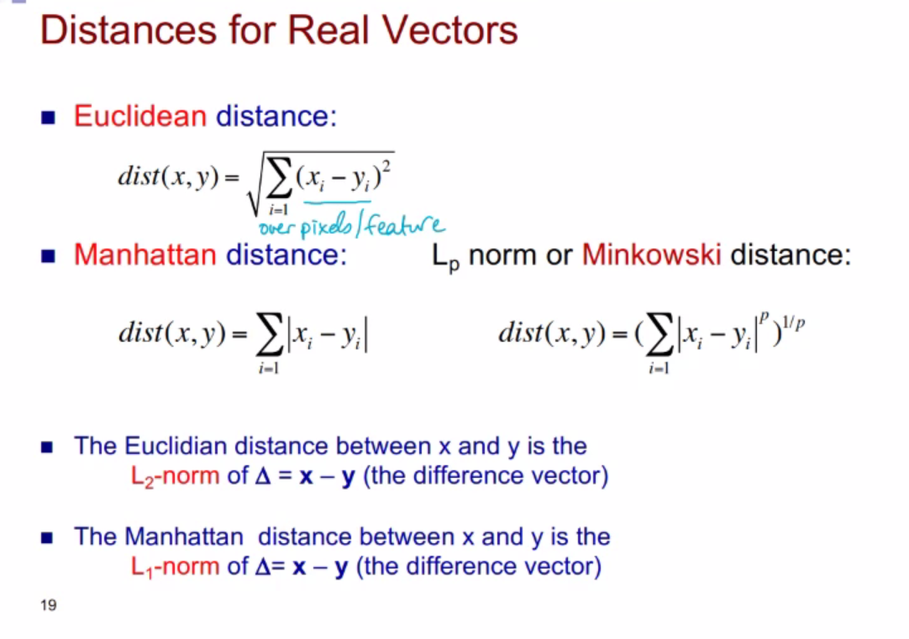

# Error Term

# What is Regression?
> A supervised ML technique used to predict

# Regression: Sales and  Ad Budget 


# Linear Regression (Bağlanım Doğrusu)

> We have yᵢ and we are guessing the value for y(x).
> > The pink part represents the error.
>
> Linear Regression:
> : Linear regression is a type of supervised learning algorithm in machine learning that is used to model the relationship between a dependent variable (also called the target variable) and one or more independent variables (also called the features). The goal of linear regression is to find a linear relationship between the independent variables and the dependent variable, which can be used to predict the value of the dependent variable for new values of the independent variables.
> 

# Too Few Features?
> Intrinsic Error:
> : Given Feature is not sufficient to determine the taret value. {: #important}

# Adding Attributes in Classification
    
---
# Overfitting / Underfitting
> Exact Fit: Exactly fits the data.
> .png)

# Generalization vs Train Error
>  
> 
> Generalization Error(True Error) {: #important}
> 
> &emsp; We're not interested in how well the system does on the training data, but focus on how well it performs in general (say if we deployed the system.) {: #important}
---

# Performance Metrics
> 
> Misclassification Rate
> : #mistakes / #test samples
>
> Mean Squared Error
> 
> $$Mean Squared Error = {\frac{1}{N} \sum_{i=1}^{c}} (y(x_i) - t_i))^2, $$
>
> $$Missclassification Rate = {\frac{1}{N}} \sum_{i=1}^NI(tⁱ ≠ y(xⁱ))$$
> > $$Number of Mistakes / Number of test samples$$ 


---
Updated at: Thursday 03-09-2023 | 14:43:14
---
# Generalization vs Training Error
## Generalization error (True error)
> We aren't interested in **how well a system does on the training data but how well does it perform in the general**.
>
> **Training set performance is likely irrevelant**, but:
> : → If too low, model's complexity might not be sufficient.
> : → If too high, it doesn't tell us what we are doing well.
> : 1. Maybe model is too flexible and overfit to training data.
> : 2. Maybe problem is very simple.
>
> Underfitting
> : → Model is unable to catch the relationship between input and output variables accurately.
>
> Overfitting
> : → Machine gives accurate predictions for training data but not new data.


# Measuring Performance 
> 1. Accuracy
> 
> &emsp; &emsp; a) **Misclassification rate**
> 
> &emsp; &emsp; b) **Mean Squared Error**
> 
> &emsp; &emsp; c) **General Loss Functions**
> 
> &emsp; &emsp; d) **Precision, Recall, Area under the ROC curve.**
> 
>
> If target is not equal to our prediction, we increment the error. Indicator function does that.
>
> 
# Train - Validation - Test
> **Having a low training set error is important, butt wat is omst important is ==having low generalization(true) error.==**
> > One can memorize the training data perfectly, but the result may *==overfit==* to the training data and result in poor generalization performance.
>
> If there is a parameter for tuning such as deciding on the parameter of the k-nearest neighbor on how complex the decision tree should be, we can use a validation test.
> * Split the data into two:
>   * Validation (hold-out-set)
>   * Development set
> * Train different models with different parameters using samples from the develpoment.
> Mesaure performance them on the validation set to select the best parameters.
> 
> The test set refers to the sequestered (kept away) data that is used as the ninicator of generalization performance (e.g. Kaggle)
> > We need to choose our validation set first, seal it and them perform the test on it.

# Hold-out Set For Validation
> If training set is not very large
> : → If develpoment, also called training portion, is kept larger, the learning imporves.
> : → If the validation is larger, generzalization error estimate is more reliable.
>
> For this reason, we often use cross-validation for model selection. So picking the model is another problem to solve.
> : → Choose your model by testing on validation test.
> : → Test on test.

# What is Cross-Validation?
> Cross-validation is a statistical technique used to evaluate the performance of a machine learning model on a given dataset. It involves dividing the data into two parts: 
> : 1. Training set used to build the model
> : 2. Validation set used to assess its performance.
>
> 
# k-fold Cross Validation
> Split the training set into k folds (random or ==stratified==)
```Python
    for each fold f:
        Train the learner with the otherf olds
        Test the learner on the f fold, giving err,
    Average error = Average(err)
```
> Split the training data into folds, and train on the folds. We make k iterations of the 1/k proportion  of training data as validation. 
> 
> 
> If we're not satisfied with the result:
> : Estimate the validation performance. Combine all 5 folds into 1 develpoment set and train with all, so you're 100% trained on the data. Combine them all and train again, but this has one assumption. 
>   : Say one of them is the best, has thehi ghestv validation performance. 
>

# Other Performance Measures/ Indicators
> So far we have seen ==Mean Squared Error== for regression and .....

# Confusion Matrix
> 
> Majority Classifier aklinizda tutun dedi{: #important}

# Confusion Matrix - True Positive - True Negative
>  
>
> Don't memorize these but know:
> : 
>
>  Precision(Specifity): Whenever the system says positive, how often is it correct?
>
> Recall(Sensitivity): How many of the cancers could the model pull out/catch? Out of all positive samples, what percentage does the system catch?

# F1 Score
> 

Missclassification, confusion matrix, precision, recall bir sey daha bileceksiniz dedi {: #important}

# Multi-class Case
> 

# Intrinsic (Irreducible Error)
> ## When does Intrinsic Error Occur?
> ###  &emsp; → It happens when the input data you have has large spread over values for either x or y. Because of the spread, the approximation function will produce irreducable error. Using more attributes could help explain a relationship between x and y so widening the input data set ceratinly helps.
>  
> Not an issue of your model, issue of what features I give so is a matter of x and y.
>
> Using more attributes helps with the issue.
> 


# Base(line) Error
> Assume 90% of patients have cancer, but 10% really does.
>
> ==**Majority Classifier**==
> : An AI system that guessses that everyone is healthy will have an accuracy of 90% on this population.
>   : This should be the ==baseline accuracy== we need to improve when designing an ML system.
>       : ==Baseline error rate== is the error obtained with a majority classifier (here it is 10%).
>
> Majority Classifier is a type of classification model that predicts the class label on new sample depending on the most frequently ocucring class label in the training set.


# Bayes Error
> 
> Looking at this image, what is the probability of 1 and probabilty of 7?


# k-Nearest Neighbor Classifiers


# HOMEWORK
> Write a python program on google colab that will reads the training set mnist. Split it into development & train validation (80%dev elopmenta nd 20% validation). Train a knn model with different k values. Pick one k value and report results on mnist set. {: #big}

> k is a metaparameter. Parameters of a model are learned thorugh the ML algorithm.

# Nearest (k=1) Neighbor Algorithm

# K-Nearest Neighbor (kNN)
> 
>
# k-NN Decision Boundary
>  
> Input space dimension here is 2.
> 
> Increasing ksm smoothends the decision boundry.
> : Smoother predictions, sincew ea verage over more data.
> : Majority voting means less emphasis onind ividual points
>
> But could also be too smooth.
> Say k = N, where N is the number of training examples. What happens then?
> 
> If k is set to N, where N is the number of training examples, then the K-Nearest Neighbors (KNN) algorithm would become a 1-Nearest Neighbor (1-NN) algorithm.

>In this case, for each new observation, the algorithm would select the single closest data point from the training set as the nearest neighbor and assign it to the class of that nearest neighbor. This means that the output of the algorithm would be the same as the class label of the closest training example.
>
>This approach is called the "nearest neighbor" method and it has both advantages and disadvantages. On the one hand, it can be very accurate in certain situations, especially when the training set is very large and diverse. On the other hand, it can be very sensitive to noisy or irrelevant features in the training data, as well as the presence of outliers.
>
>In summary, setting k to N in KNN would result in a 1-NN algorithm, which can be very accurate in some cases, but can also be sensitive to noisy or irrelevant features and outliers.
>
> 


# Effect of k
> 
>

# Classification - Decision Boundry


# 1 - NN Decision Boundary
> The decision boundaries oorm a subset of the Voronoi diagram for the training data.
>
> Nearest-neighbor classifier produces ==piece-wise== linear decision boundaries.
> 

# Choice of k
> 
>

# Selecting k
> 
> Training accuracy for k=1, what happens if k=1 on the training set? 
>
> **⟶ Pick the k that gives the best generalization performance on the validation set.**
``` Python
for all sample xᵢ in set
     find closest 
```

# Important Decisions
> * Value of k (usually odd)

#  Distance 


# Distance Metric

# Distances for Real Vectors



# Example of Distances


<style>
    #important{
        color: red;
    }
    #big{
        color: red;
        font-size:40px;
        font-weight: bold;
    }
</style>