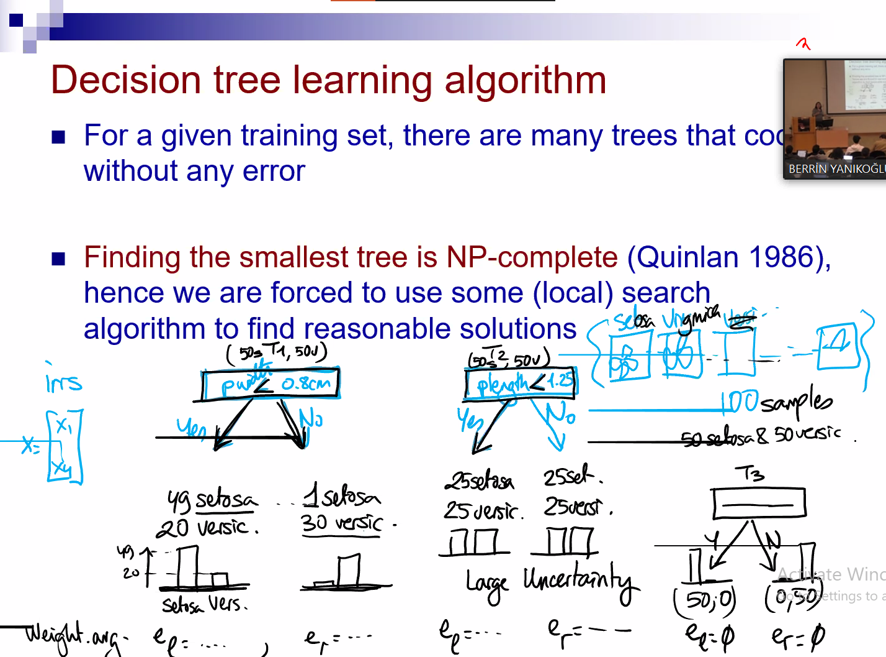
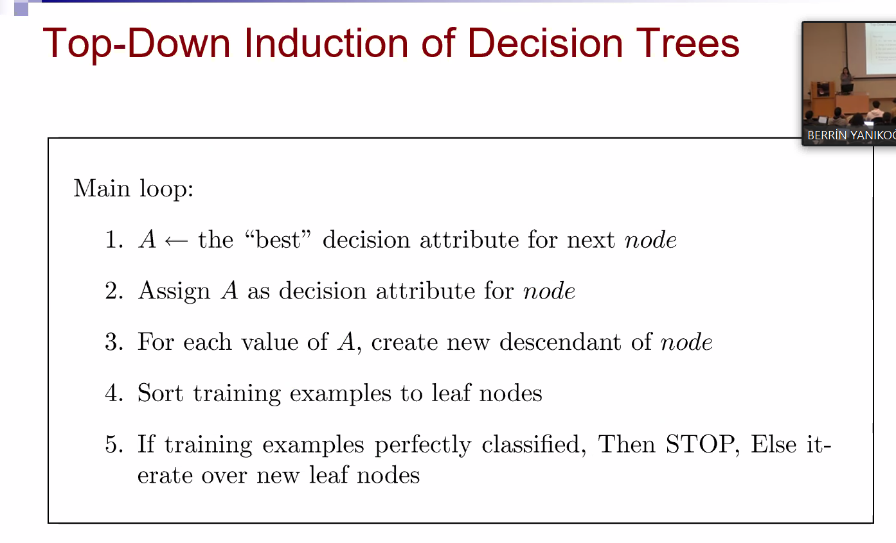
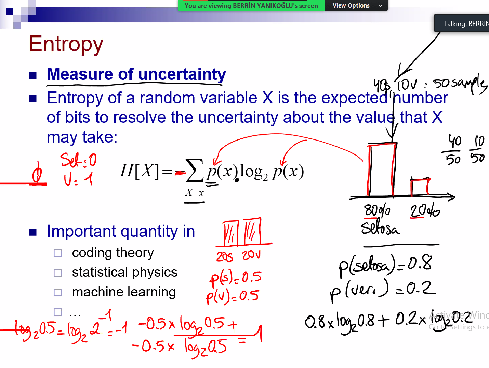
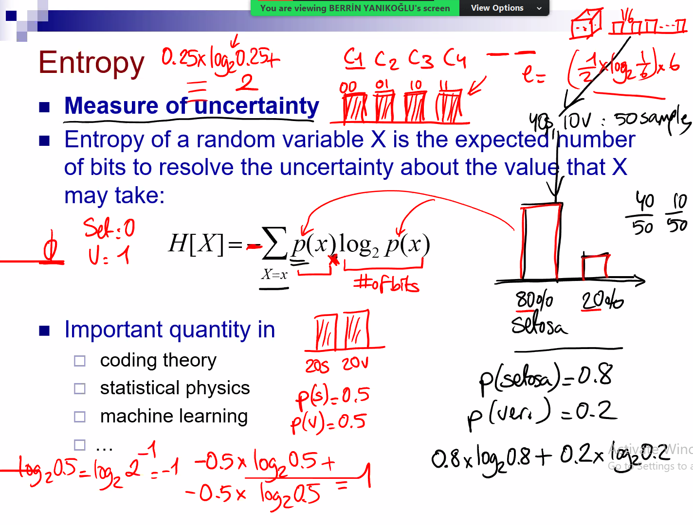
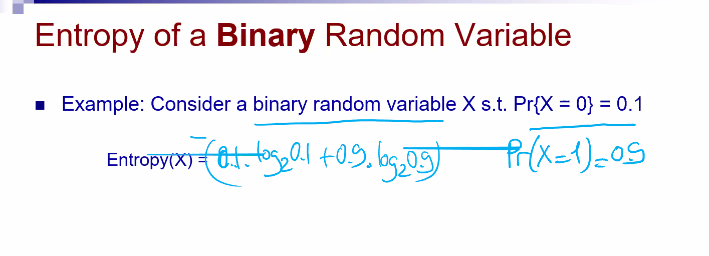
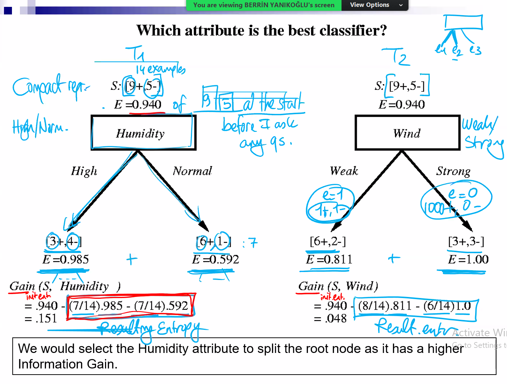

> Mean square error
> 
> Euclidian distance
>
> What happens when k gets larger and smaller
>
> Find the closes in terms of x. Then we predict the y of the query based on the nearst element(s).

---
# Decision tree learning algorithm
> For a given training set, there are many trees that code it w/o any error.

> **Finding the smallest tree is NP-complete** {: #important} 
> : Hence we are forced to use some local search algorithm to find reasonable solutions.

## Information about NP-complete
> In computer science, NP-complete is a complexity class of decision problems. A problem is in NP (nondeterministic `In computer programming, a nondeterministic algorithm is an algorithm that, even for the same input, can exhibit different behaviors on different runs, as opposed to a deterministic algorithm` polynomial time) if its solutions can be verified in polynomial time, meaning that given a solution, one can verify it in a reasonable amount of time. A problem is NP-complete if it is in NP and any problem in NP can be reduced to it in polynomial time.
>
> "Finding the smallest tree is NP-complete" means that finding the smallest tree that connects all the vertices in a given graph (known as the minimum spanning tree problem) is an NP-complete problem. 
> : This means that there is no known polynomial-time algorithm that can solve this problem for all instances, and it is believed that such an algorithm does not exist. 
> > Therefore, it is considered a computationally hard problem. The best known algorithms for this problem have exponential worst-case time complexity, meaning that as the size of the input increases, the time required to find the solution grows exponentially.

> # What happens when k is large/small?
> In machine learning k-Nearest Neighbor (k-NN) algorithm, the value of k determines the number of nearest neighbors to consider for making a prediction.
> 
> When k gets larger:
> 
> 1. The decision boundary becomes smoother as the predictions are based on more neighbors.
> 2. The model becomes less sensitive to noise in the data.
> 3. The model becomes less complex, which may reduce the risk of overfitting.
> 4. The model may become less accurate as it becomes more biased towards the majority class in the neighborhood.
> 5. The computational cost of making a prediction increases as more neighbors need to be considered.
> 
> When k gets smaller:
> 
> 1. The decision boundary becomes more complex as the predictions are based on fewer neighbors.
> 2. The model becomes more sensitive to noise in the data.
> 3. The model becomes more complex, which may increase the risk of overfitting.
> 4. The model may become more accurate as it becomes less biased towards the majority class in the neighborhood.
> 5. The computational cost of making a prediction decreases as fewer neighbors need to be considered.
> 6. The choice of k depends on the problem at hand and the characteristics of the data. A larger k may be more appropriate for datasets with smooth decision boundaries, while a smaller k may be more appropriate for datasets with complex decision boundaries. Cross-validation techniques can be used to determine the optimal value of k for a given problem.
 

> Entropy
> : A measure of uncertainty.
> 
>
> We call the creation of the tree greedy algorithms because they do what seems the best, not the optimal one.

# ID3 Decision Tree learning Algorithm
> **Learning is greedy, find the best split recursively**

> 

# Entropy
> 
> 
> You should be able to calculate the entropy of a random variable.
> 
>
> $$IG(S, A) = H(S) - \sum_{v\in{0,1}} \frac{|S_v|}{|S|}H(S_v)$$

    

Entropy is a measure of the impurity or uncertainty in a dataset. In machine learning, it is commonly used as a splitting criterion for decision tree algorithms.

Suppose we have a dataset of animals that we want to classify as either "mammals" or "birds". Each animal has two features: whether they have fur (F) and whether they can fly (F). The dataset contains 10 animals, with 6 mammals and 4 birds:

| Animal | Fur (F) | Fly (F) |
|--------|---------|---------|
| A1     | 1       | 1       |
| A2     | 1       | 1       |
| A3     | 1       | 0       |
| A4     | 1       | 0       |
| A5     | 0       | 1       |
| A6     | 0       | 1       |
| A7     | 0       | 1       |
| A8     | 0       | 0       |
| A9     | 0       | 0       |
| A10    | 0       | 0       |

To split the dataset into subsets based on the features, we can use entropy as a measure of the impurity or uncertainty of each subset. The formula for entropy is:

$$H(S) = -\sum_{i=1}^{c} p_i \log_2(p_i)$$

where $S$ is the dataset, $c$ is the number of classes, and $p_i$ is the proportion of instances in class $i$.

For example, the entropy of the entire dataset is:

$$H(\text{Animals}) = -\frac{6}{10} \log_2 \frac{6}{10} - \frac{4}{10} \log_2 \frac{4}{10} = 0.971$$

Now, we can calculate the information gain (IG) for each feature by subtracting the weighted sum of the entropy of each subset from the entropy of the entire dataset. The formula for information gain is:

$$IG(S, A) = H(S) - \sum_{v\in{0,1}} \frac{|S_v|}{|S|}H(S_v)$$

where $A$ is the feature being considered, $v$ is the value of the feature, $S_v$ is the subset of instances in $S$ with value $v$ for feature $A$, and $|S_v|$ and $|S|$ are the number of instances in $S_v$ and $S$, respectively.

For the feature "fur", the information gain is:

$$IG(\text{Animals}, \text{Fur}) = H(\text{Animals}) - \frac{6}{10} H(\text{Mammals}) - \frac{4}{10} H(\text{Birds}) = 0.271$$

where $H(\text{Mammals})$ and $H(\text{Birds})$ are the entropy of the subsets of instances with fur as 1 (mammals) and 0 (birds), respectively.

Similarly, for the feature "fly", the information gain is:

$$IG(\text{Animals}, \text{Fly}) = H(\text{Animals}) - \frac{5}{10} H(\text{Mammals}) - \frac{5}{10} H(\text{Birds}) = 0.020$$

Based on the information gain, we can see that "fur" is a better feature for splitting the dataset

In this case, information gain refers to the reduction in entropy achieved by splitting the dataset based on a particular feature. The greater the information gain, the more useful the feature is for distinguishing between the classes in the dataset.

For example, in the animal classification problem, we calculated the information gain for the "fur" and "fly" features. The information gain for "fur" was higher than for "fly", indicating that "fur" is a more useful feature for distinguishing between mammals and birds.

## What does information gain mean in this case?
Information gain is used as a criterion for feature selection in decision tree algorithms, where the goal is to split the dataset into subsets that are as homogeneous as possible with respect to the target variable. By selecting features with high information gain, we can split the dataset in a way that maximizes the reduction in entropy and improves the accuracy of the resulting decision tree model.

$$Gain = Entropy of dataset - (Branch/AllSample) x $$
---

