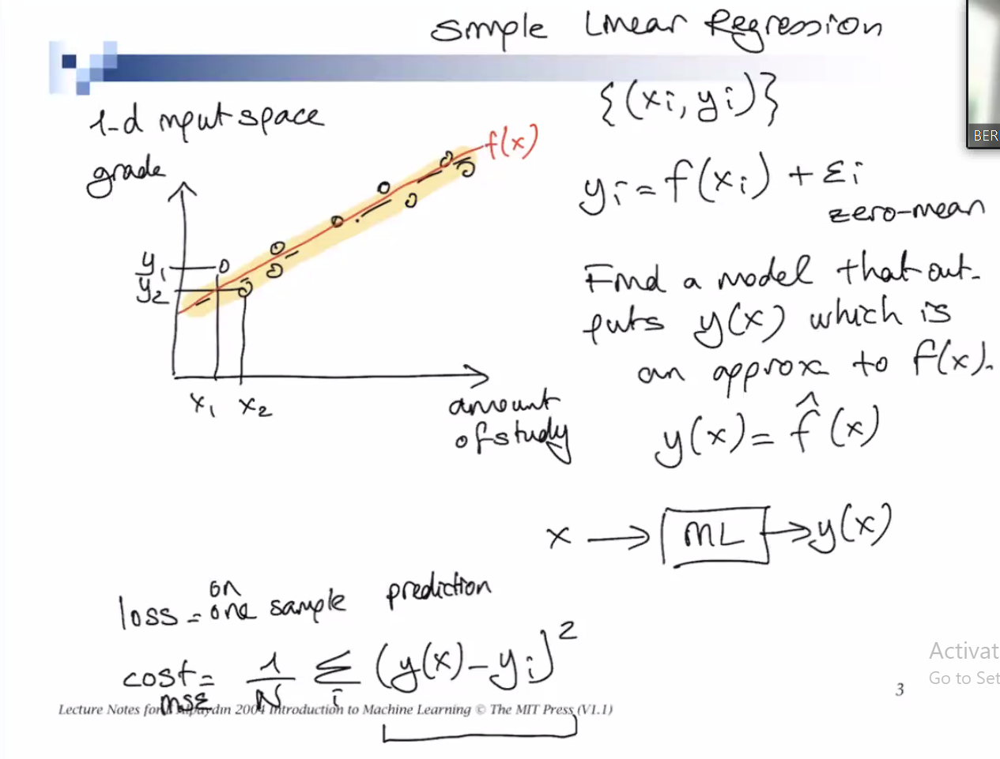
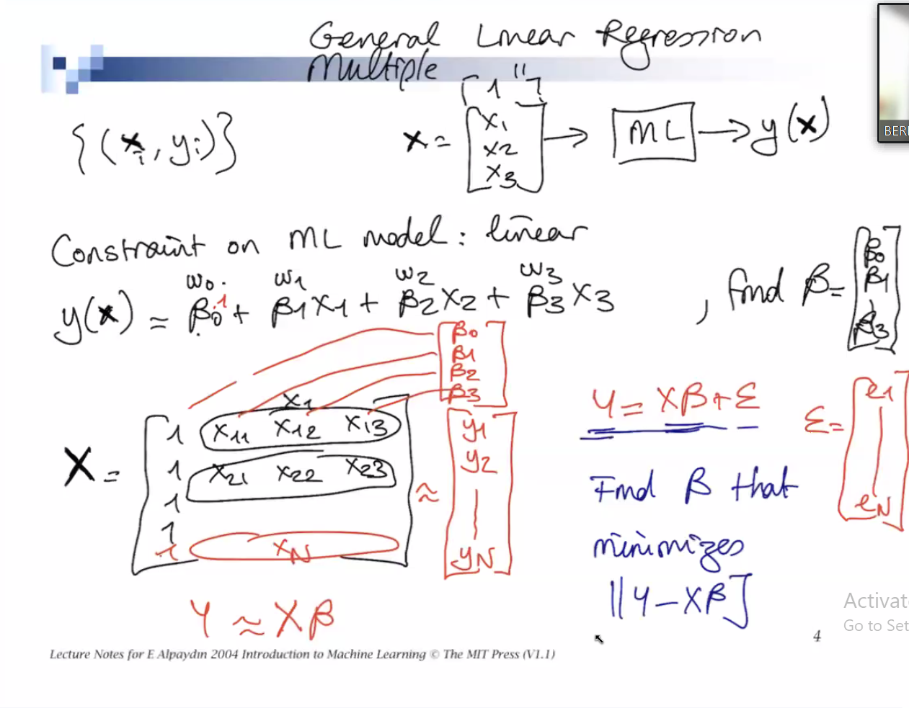
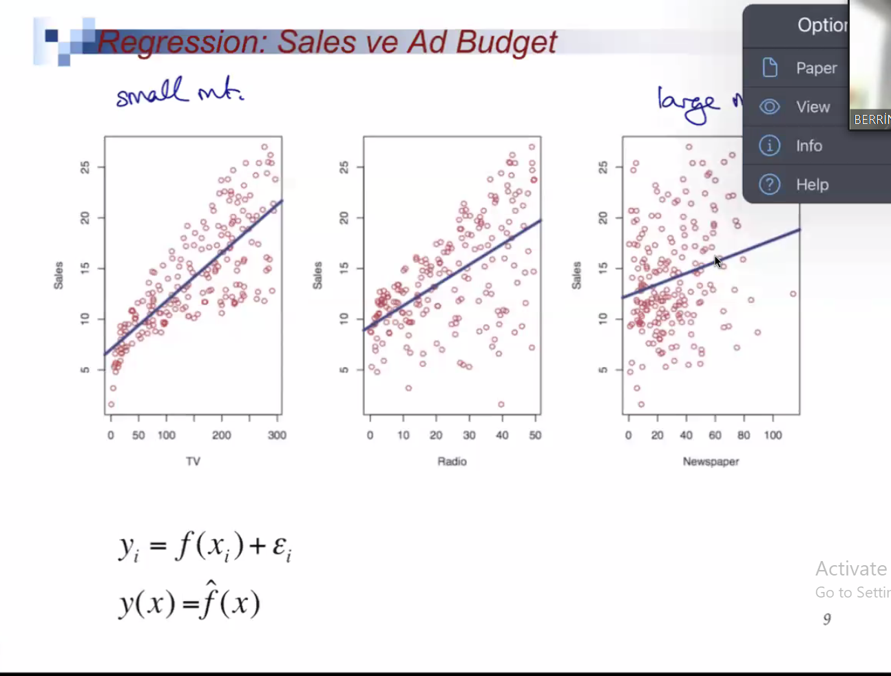
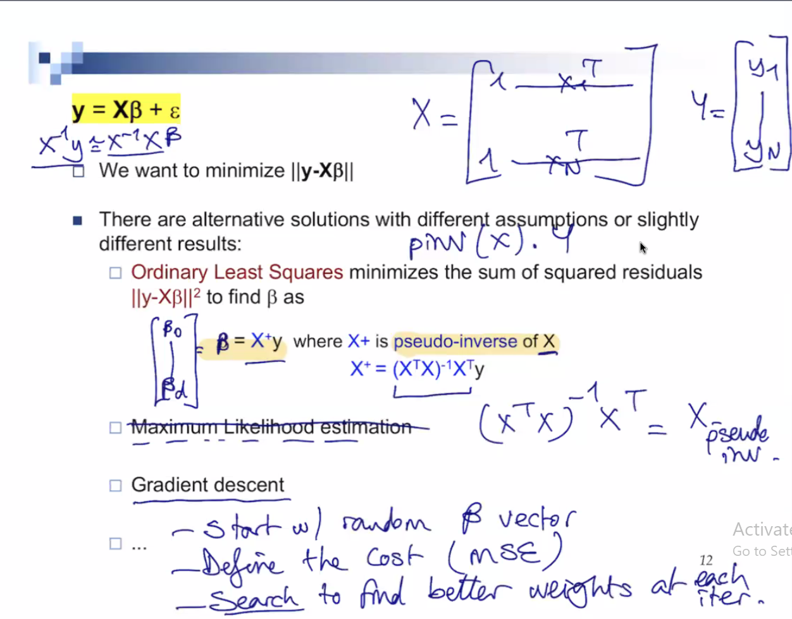
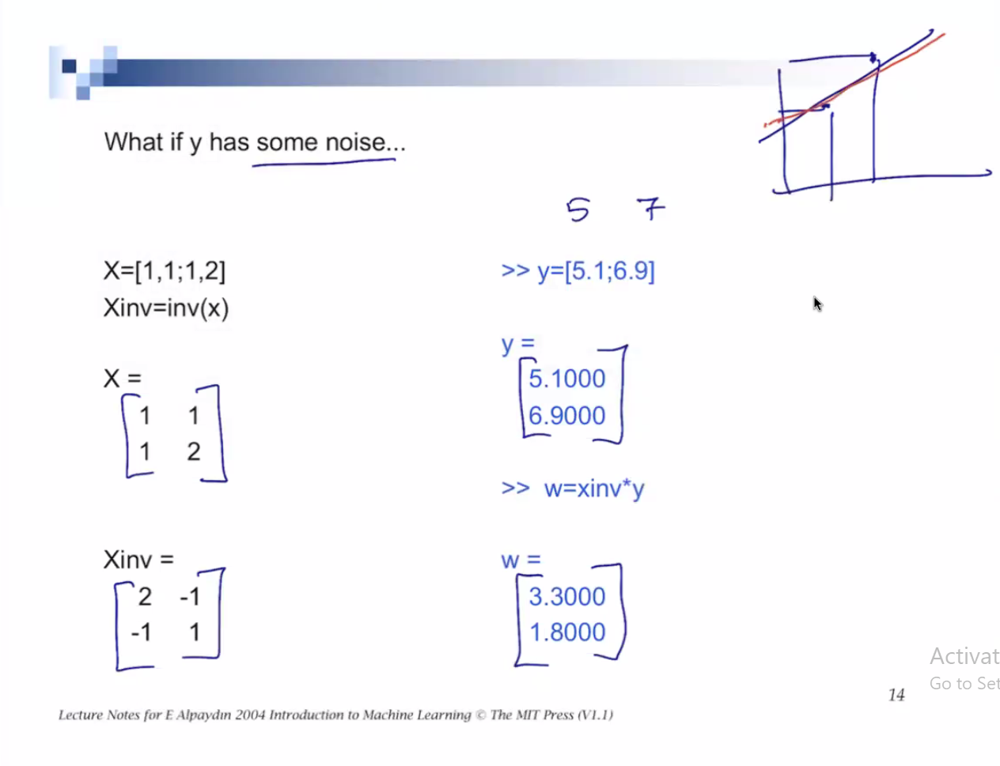
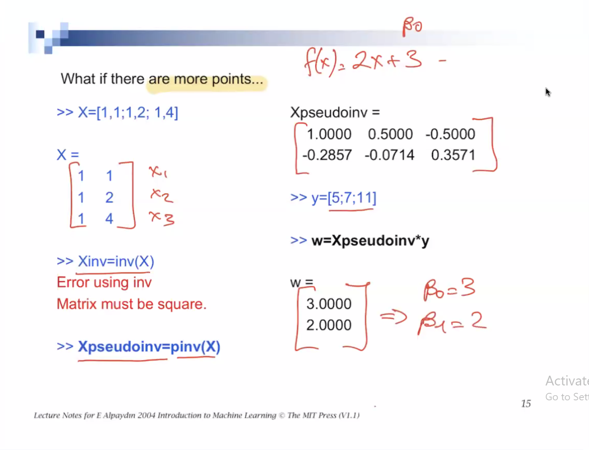
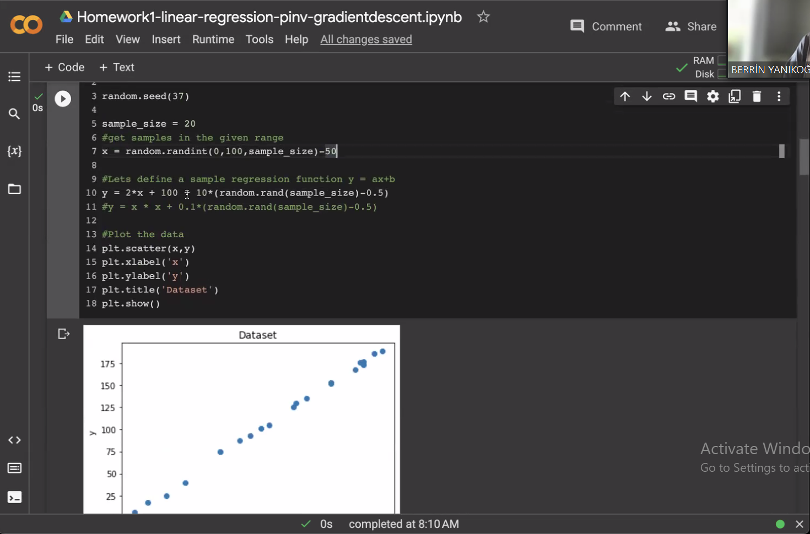
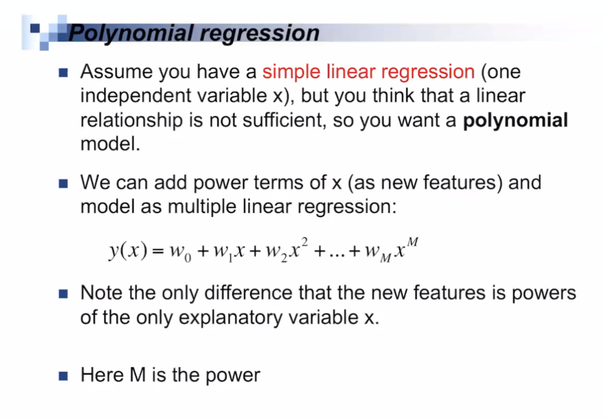
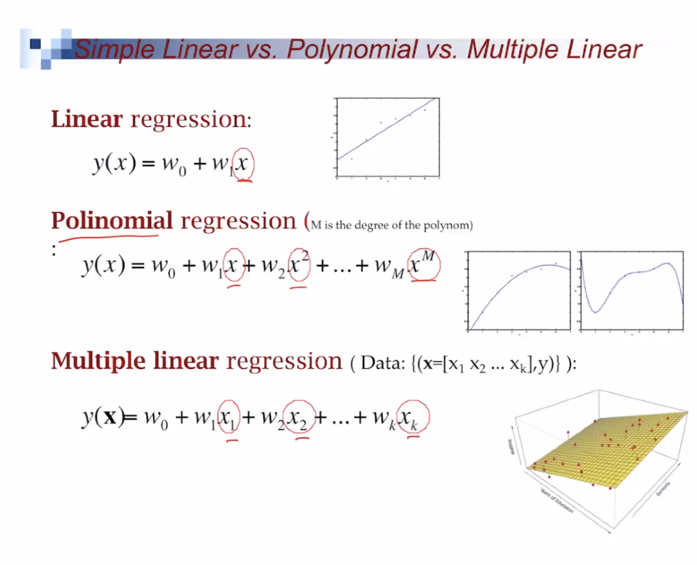
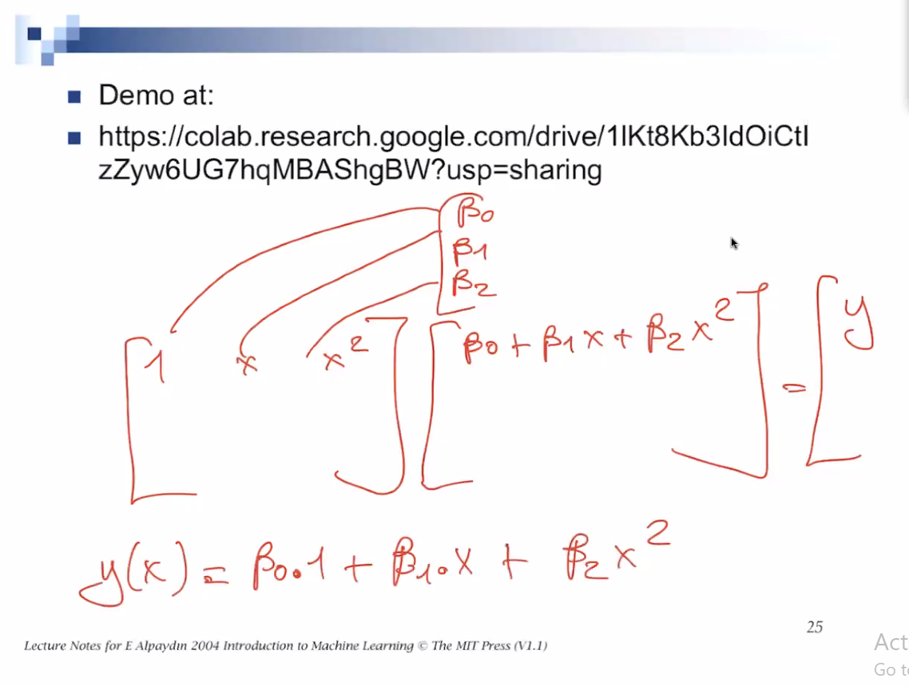

# Linear Regression
> !

# Linear Regression With Multiple Variables
>  
>

> ** WEMAY ASK YOU WHAT LOSS IS**
> 
> 
>
> 
>

# Gradient Descent
> How Beta affects cost and update beta accordingly in several iterations.

> 
> The red line is the best fitting line here.
>

---
## What is Gradient descent?
 
 &emsp; Gradient descent is a widely used optimization algorithm in machine learning, and deep learning to minimize a given objective function. The function is typically a loss or cost function. The main goal is to find the best model parameters that lead to the lowest possible value for the loss function, which results in optimal model performance.
 : Here's a step by step explanation of gradient descent:
    1. __Initialization:__ Start with an initial set of parameters (weights and biases) for the model. These can be chosen randomly or with some other initialization method.
    2. __Calculate Loss:__  Pass the input data through the model using the current set of parameters and compute the loss function value. The loss function measures the difference between the model's predictions and the actual taret values.
    3. __Compute Gradident:__ Calculate the gradient (gradient also means derivative) of the loss function with respect to the parameter. `The  gradient is a vector that points in the direction of the steepest increase in the loss function.` ==__It helps us to understand how the loss function will change as we adjust each parameter.__==
    4. __Update Parameters:__ Update the model's parameters by taking a step proportional to the negative of the gradient. This means we move the parameters in the opposite direction of the gradient. The size of this step is determined by the learning rate, a hyperparameter that controls how quikcly the algorithm converges, while a larger learning rate might cause the algorithm to overshoot the optimal parameters and diverege.
    5. __Iterate:__ Repeat steps 2-4 until the loss function converges (`reaches a minimum value`) or a predefined stopping criterion is met, such as a maxumum number of iterations or a minimum change in the loss function.

## Gradient Vector
&emsp; Each dimension of the gradient vector is the `partial derivative of the funciton with respoect to each of the dimensions.`

---
