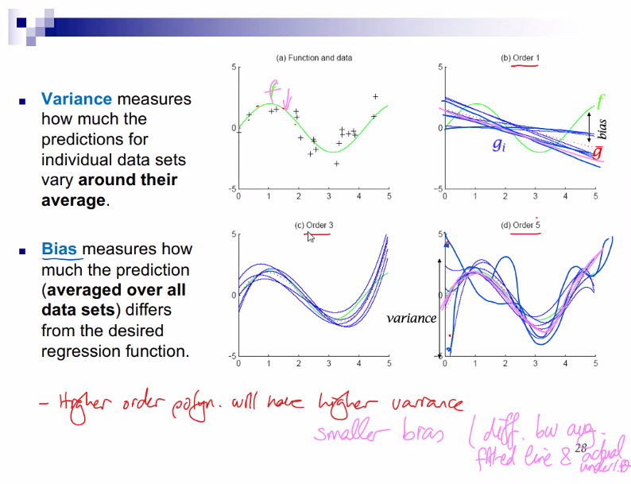

# QUIZ QUESTION
> 

Validation and test can be fixed because they are both telling about generalization

> Here, N is the # of data points.

FLEXIBILITY IS IMPORTANT

# Bias - Variancein  Regression 
> If we had 100 seperate training sets, each with 25 data point from the sinusoidal h(x)=sin(2px), **to which we fit the models,w e would see a `variance` in the resulting models.
>
> The concepts of `bias` and `variance` are very important in discussing the model complexity.

## What is variance?
> `Variance` measures how much the preductions for individual datasets vary around the **average**.

## What is bias?
> `Bias` measures how much the prediction **(averaged pver all data sets)** differs from the desired regression function

> Higher order polynomials will have higher variance. 
> 
> Higher order polynomials will have smaller bias. {: #important}

> : _Smaller bias:_ Difference between average fitted line and actual underlying function.

### We can do 2 thing to prevent overfitting
> 1. Use regularization
> 2. Obtain more data

### How can we avoid over-fiting? There are 2 approaches.
> 1. __Early Stopping:__ Stop growing the tree before it perfectly classifies the training data.
> 2. __Pruning:__ Grow full tree, then prune. Cut some and see how it affects our validaton set. _Pruning approach is found more useful in practice._

### ⟶ What if we don't have enough data? We use Cross-Validation. 

