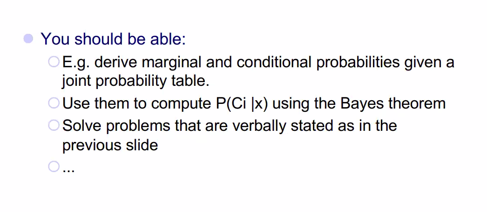
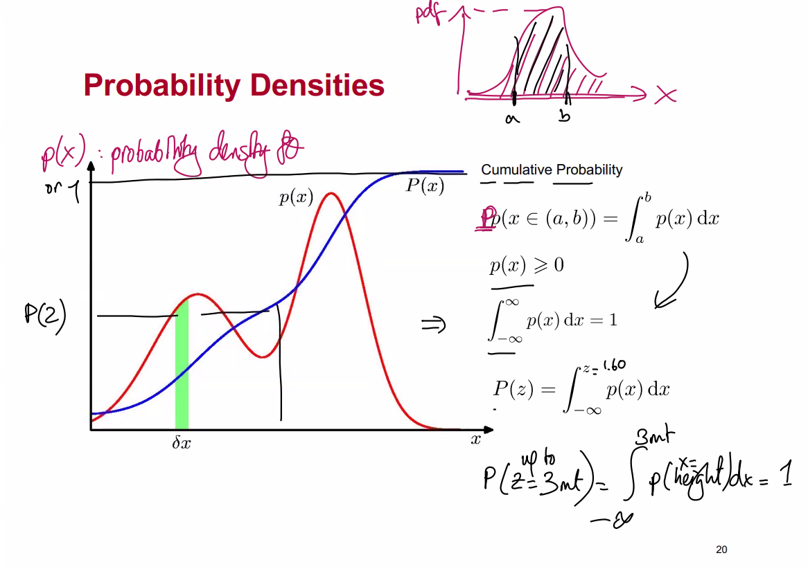
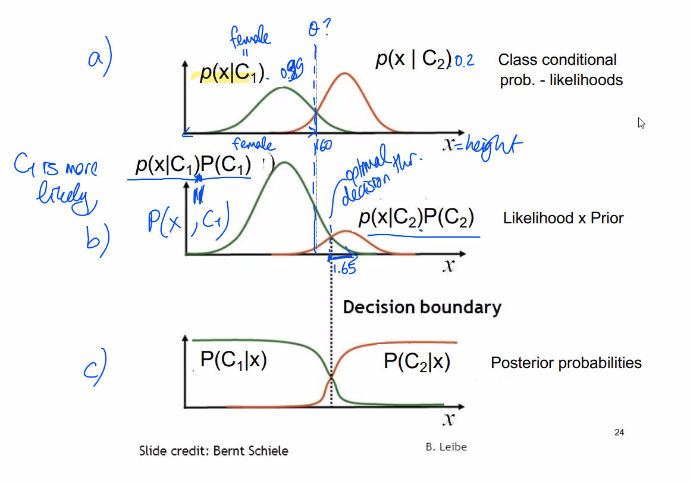
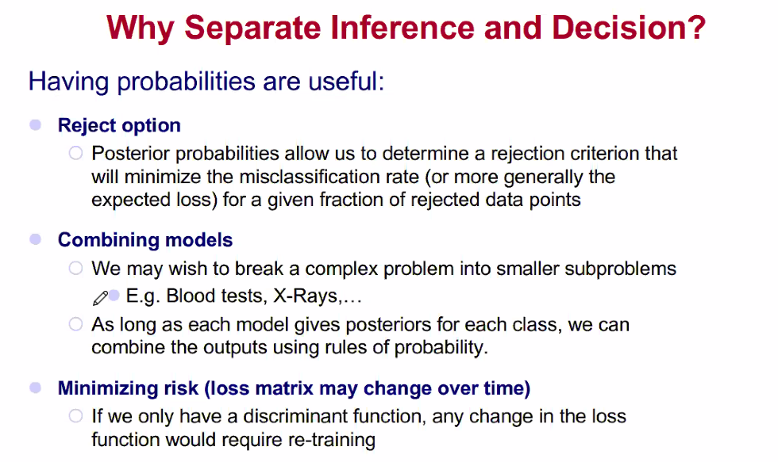

# Bayes' Theorem
## Bayesian Decision
> We're looking for higher posterior probability.
> : 
>
> Review for single dimension probability distribution
> : 
>
> 

# Discriminant Functions

# Why Sepearate Interface and Decision
> 

# Naive Bayes Classifier
>