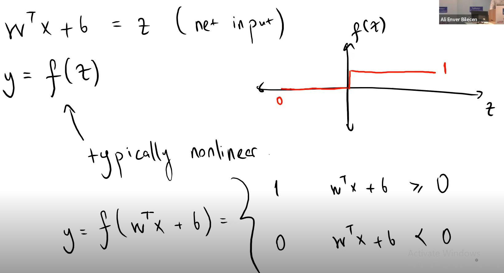
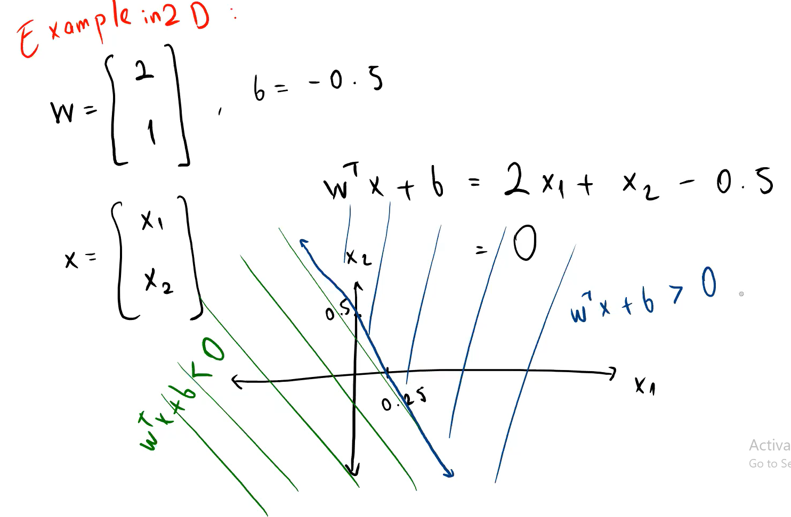
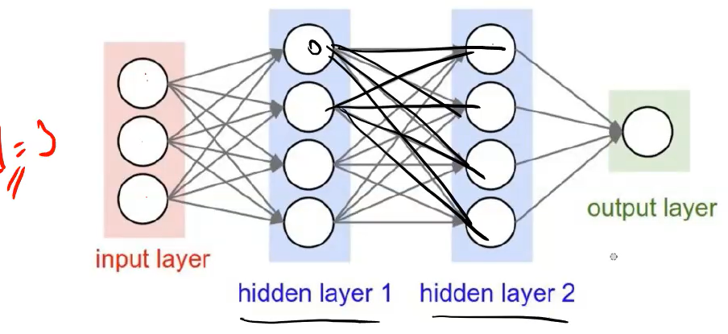
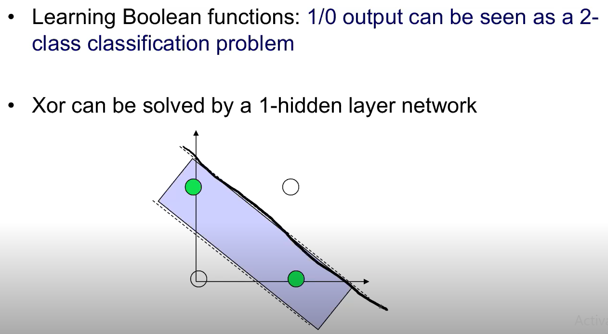
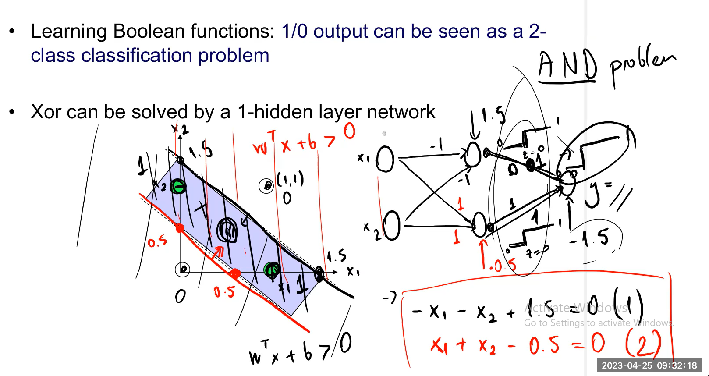
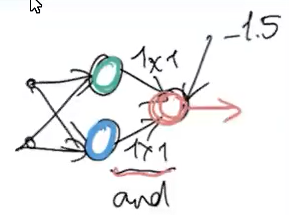
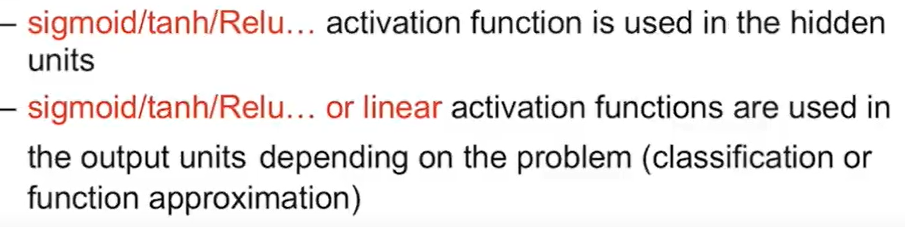
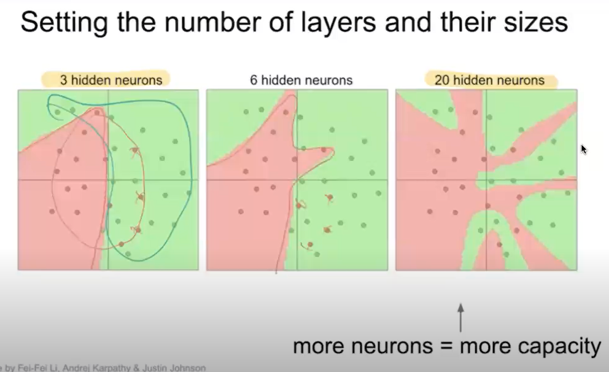

# Multilayer Perceptrons - Feed Forward Networks
> The network has an input, and output and the layers in between are called as hidden layers. Hidden layers are not observed from the outside.
>  **Perceptron**
> Takes a weighted sum of inputs, adds a bias term and resulting of this weighted sum is called the `net input`.
> $$ z = ∑ w_i x_i + b, \space\space w^tx+b$$
>
> In the perceptron, we pass this net input `z`, through an activation function.
> : This activation function can be `linear` or `non-linear`, but is generally **`non-linear`**.
>
> **This is how a perceptron decides the boolean value of its output will be:**
> 
>
> 
>
> In multilayer perceptrons, there could be more than one hidden layer(s) which are called `hidden` since they are not observed from the outside.
>
> Activations are passed only from one layer to the next
> 

## XOR Problem
> It is not linearly possible to distinguish between XOR values. It means that drawing a line to sepearate XOR values is simply not possible.
> : Therefore, single-layer perceptron neural network is not sufficient to solve it. 
> 
> : **`To solve the XOR problem, we need to use a Multi-Layer Perceptron Neural Network, with at least one hidden layer and a non-linear activation function.`**

## How Does MLP Solve The XOR Problem?
> 
> 
> Here, the circled part solved the AND problem, if any input comes out as 0, the -1.5 bias pushes it to the negative side. You can also add an additional node to solve the AND problem such that the two outputs will come into this node.
>
> This is an AND network:
> 
>
> Each layer in a Multilayer Perceptron can have various number of nodes and different activation functions.
> - Commonly, same activation function is used on a layer.
> - 
>
> In feedforward networks, activations are passed only from one layer to the next.

## Different Network Topologies
> **Multi-layer Feed-forward Networks**
> - One or more hidden layers.
> - Input projects only from previous layer onto a layer, **`typically`** only from one layer to the next.

## Backward Propagation
> `Backpropagation` is based on **gradient descent**.

> Hyperplane is a plane where the plane's content has dimension degree is 1 higher than its contents, such as plotting 2d shapes on a 3d plane.

## Hidden Layer Size
> 

## Network Topology (Architecture) and Loss Function For Regression
> **Linear Regression**
> : Single Layer Network and a single output node with linear activation and `MSE Error Loss`.
>
> **Non-Linear Regression**
> : Multilayer Network and a single output node with non-linear regression and `MSE Error Loss`.
>
> Loss function for linear regression is standard, and it is the `MSE Error`
>
> Cost is the whole thing, loss is for a single thing. 
> : Cost function is the sum of all things and loss function works per item.

## Network Topology (Architecture) and Loss Function For 2-Class Classification
> Use a single output node with `sigmoid activation function` and `binary-cross-entropy loss (BCE)`.

## Multi-Class Classification
> `K-nodes` with `softmax activation` and `cross entropy loss`

## Softmax (Logits to probability distribution)
> It's like a maximum but a softer version.
>
> Converts logits from a model into a probability distribution, and it represents the probability distribution of a list of potential outcomes.

## Categorical Cross Entropy
> When we have more than one output node representing K classes, we have `categorical cross-entropy` which is also called `multi-class cross entropy`.

## Properties of ANNs
> **Learning From Examples**
> : Labeled or unlabeled
>
> **Adaptivity**
> : Changing the connection strengths to learn things
>
> **Non-linearity**
> : The non-linear activation functions are essential
>
> **Fault Tolerance**
> : If one of the neurons of the connection is damaged, the whole network still performs quite well.
>
> **Thus, they might be better alternatives than classiacal solutions for the problems characterised by**:
> - `Noisy or imperfect data`, high dimensionality
> - a lack of a clearly stated mathematical solution or algorithm

## Multilayer Perceptrons Backpropagation
> `How does the backpropagation work?`
> 1. We initialize the network with random weights.
> 2. Compute forward and observe the loss
> 3. Observe loss for each of them, collect hte gradients overall these samples and update weights accordingly.
>
> Backpropagation uses gradient descent.

## Performance Learning (Loss Learning)
> Performance learning is a learning paradigm where the network adjusts its parameters (weights and biases) so as to `optimize its performance`
>
> We use a `performance index (cost function)`
>
> **Search the parameter space** to minimize the loss with respect to the weights.