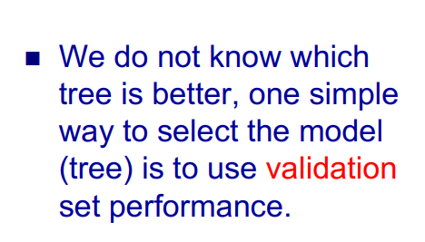
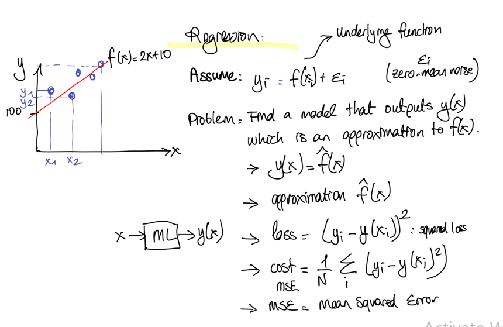
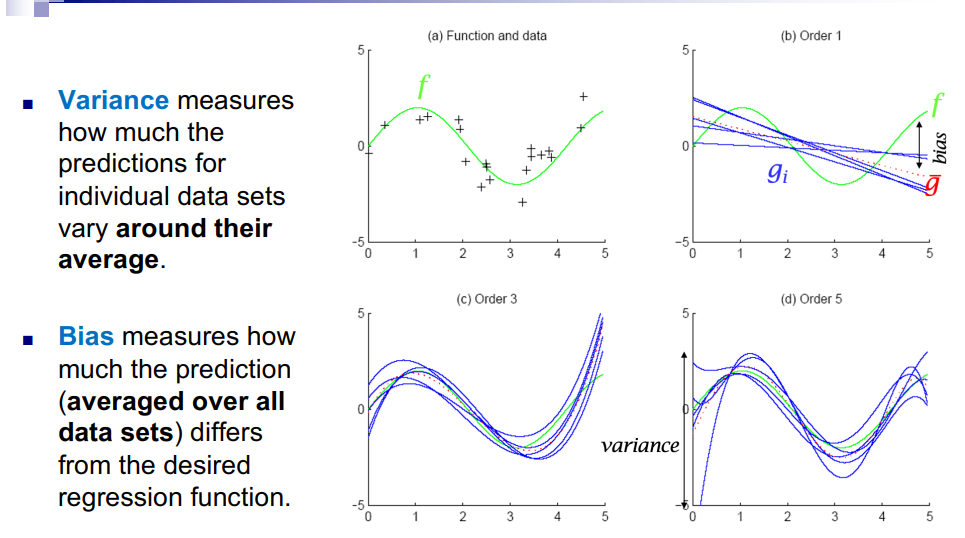
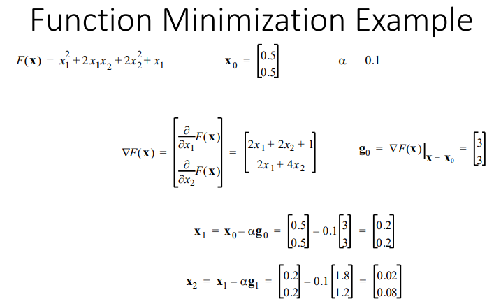
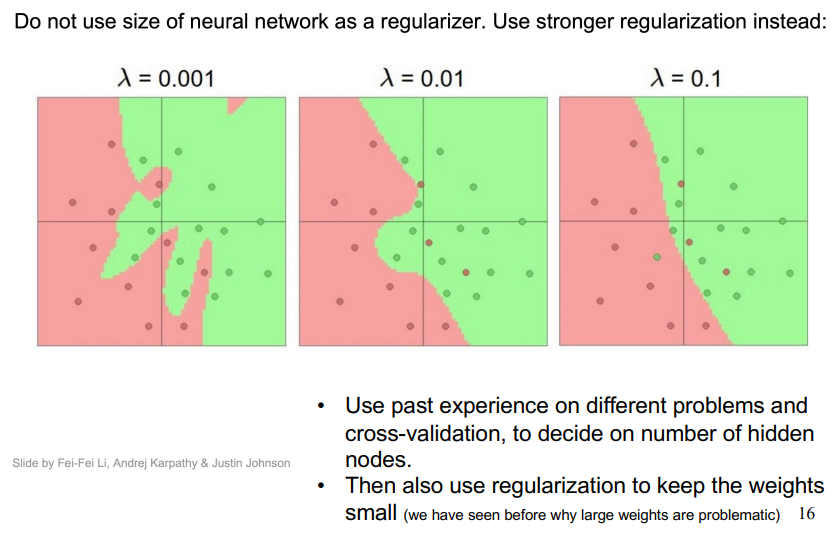
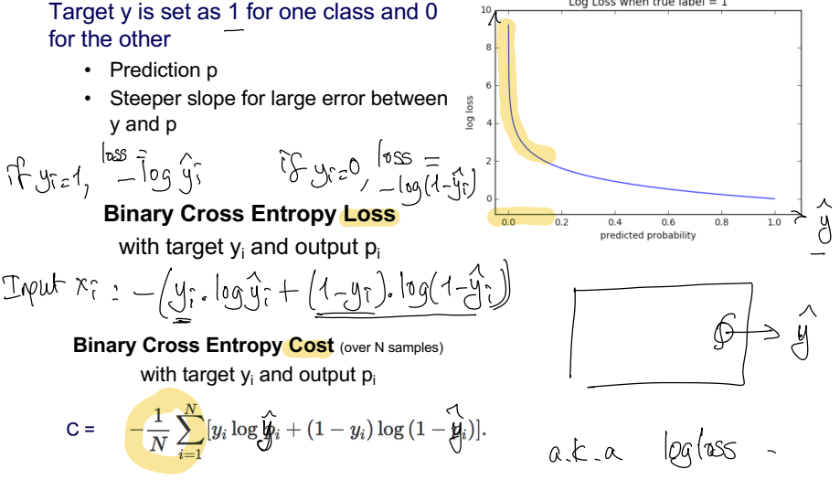
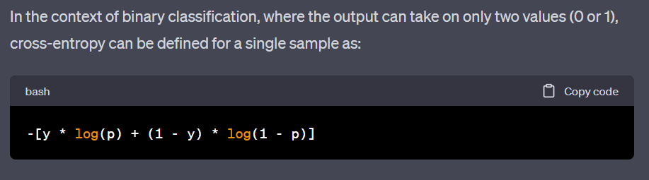

# ___`WEEK 1`___
# Different Learning Paradigms 
## - Supervised Learning
## - Unsupervised Learning
## - Semi-Supervised Learning
## - Reinforcement Learning

# Supervised Learning
> Learning from `given labelled` samples to build a model that can `make predictions` about `future instances`
> : The `model is trained` with `labeled data.`
>   : Labeled data is called `training set.`
>
> `Training Set`
>  : (x, y) pairs where y is the desired `target label` given by the `teacher.`
>
> : Learn the `unknown mapping` y=f(x) so the model can predict any unseen x value.
>
> `Classification`: Label y is true or false, such as gender or spam classification.
> `Regression`: Label y is a scalar such as credit scoring or sales prediction.
---
## Types of Supervised Learning
# Regression
> It is a statistical method used to model the relationship between a dependent variable and one or more dependent variables. It helps to predict values, understand trends, and identifying the significance of variables in the relationship.

# Error Term
> Say sales = 5 × ad_budget + 100.000 + ϵ  
> : ϵ is the error term here, it adds some noise here.
>
> Why the error term?
> : We add the error term because it helps us to 'consider some of the unaccounted attributes', such as sales does not directly depend on ad_budget.
>
> Why zero mean?
> : Sometimes its +, sometimes -, on average it's 0.

# Regression: Sales vs Ad Budget
> `When asked for a prediction of market sales, we return y(x).`
>
> `What is the error that the system makes?`
> : It's the difference between `actual sales, yᵢ` and `predicted sales, y(xᵢ)`:
>   : Error = yᵢ - y(xᵢ)
>


# Linear Regression
> Errors are the `vertical bars between the predicted value, y(x), and the actual output, yᵢ`

# Intrinsic / Irreducible Error
> `Too few features?`
> : Given just one feature, say advertisement budget, we may see different sales per year because there are other underlying reasons.
>
> If we simply have too few too few features which is not sufficient to determine a target value, then it means we have ___`Intrinsic (Esas, yaradışıltan) Error`___
> : We can add `more features`, in this case such as economic sitaution, the demand for goods, ..., and that will `decrease the Intrinsic Error.`

# ___`WEEK 1 ENDS`___
--- 

---
# ___`WEEK 2`___
# Generalization vs Train Error
> ___Generalization Error (True Error)___
> : We don't really care how well a model does on the training data, we care about how it performs in general.
>
> ___Training set performance is mostly irrevelant, but:___
> : If the training set performance is way too low, then the model's complexity may not be sufficient.
>
> : If the performance is too high, it doesn't tell us that we did an awesome job:
>   * Maybe the model is too flexible and overfit the training data.
>   * Maybe the the problem is very simple (so there is a possibility that it can perfrom a spectecular job).

# Measuring Performance
> ___Accuracy___
> : `Misclassification Rate, in classification problems`
> : `Mean Squared error, in regression problems`
> : `General Loss Funcitons, taking into account different costs for different mistakes`
>
> ___Training Duration___
>
> ___Test Duration___
>
> ___Model Size___

# Performance Metrics
## Mean Squared Error
> $$ \dfrac{1}{N} \sum_{i=1}^{N} (y(xᵢ) - tᵢ)²$$

## Misclassification Rate
> It's the `Number of Mistakes / Number of Test Samples`
> $$ \dfrac{1}{N} \sum_{i=1}^{N} (tⁱ ≠ y(xⁱ))$$

==___NOTE___== 
1. Train Set
2. Validaiton Set (Hold-out Set)
3. Test Set (used at the very end to obtain unbiased results.)


# Train - Validation - Test
> Having low training error is important but having low generalization(true) error is more important.
>
> If, there is a need for parameter tuning (such as deciding on the parameter of the k-NN or how complex the decision tree should be), we can use a validation set.
>   : Split the data into two
>   : 1. `Validation (hold-out-set)` 
>   : 2. `Development Set`
>
> It helps to train the models with different parameters using samples from the development set, and measure the performance on the validaiton set to find out which parameters performed the best.
>
> The `test set` refers to the sequestered(kept away) data that is used as the indicator of generalization of performance.

# Hold-out Set For Validation
> If our training set is not very large
> : If the development, which means the training portion, is kept larger, then the learning will improve.
>
> : If the validaiton is kept longer, then the generalization error estimation is more reliable.

> If you want to obtain an unbiased test performance, you need to seperate a subset as test, and another for validation.
> * Choose your model by testing on validation test.
> * Test on test set.


# k-fold cross-validation
> Split the training set into k-folds (random or stratified(katmanlı))
    

# Test Set
> If you have access to the test data during training, you are not supposed to use it or even peek at it during the model building, `or the test performance of the model becomes biased!

# Other Performance Measures/Indicators
> So far we have seen `Mean Squared Error` for regression and `Misclassification Rate Or Accuracy`for classificaiton.

## Confusion Matrix
> 
> Confusion matrix is the table representation that is used to describe the performance of a model on a set of data. It shows true positive, false positive yada yada.

### Formulas
> `Accuracy`: Ratio of correctly identified cases over all cases.
>   : = (TP + TN) / (P + N)
>
> 
> `Precision(Specifity)`: Whenever the system says positive, how often is it correct?
> : = TP / (TP + FP)
>
> `Recall (Sensivity)`: Of all positive samples, what percentage does the system catch?
> : = TP / (TP + FN)


# F1 Score
> Precision and recall are inversely proportional, so we can increase one at the risk of decreasing the other.
> : `F1 Score` is the weighted average of Precision and Recall, that intends to summraize the system performance in a single number.
>   : F1 Score = 2 * (Recall * Precision) / (Recall + Precision) 
>
> F1 is more useful than accuracy, especially with `imbalanced data.`
>
> F1 is not symmetric - unless stated explicitly, it needs to be calculated for the positive cases. 

# Intrinsic (Irreducable) Error & Base (Baseline) Error
## Intrinsic (Irreducible) Error
> Only way to reduce this is to add more attributes, that more fully explains the relationship between the input and the label. 
> 

## Base(line) Error
> Assume 90% of patients don't have cancer but 10% actually has.
>
> `Majority classifier:` AI system that everyone is healthy will have 90% accuracy on this population.
> : This should be the `basline accuracy` we need to improve while designing the ML system.
>   : `Baseline error rate` is the error obtained with a majority classifier, in this case it's 10.
>
> When dealing with imbalance in a dataset, where one class has a significantly larger number of instances than the other class, `a majority classifier can perform better than a random guesser.`
> : Yani kanser örneğinde majortiy classifier %90 olasılıkla hastaya doğru teşhis koyacak.  
> : Ama bunun yanında random guessing %50 ihtimalle doğru teşhis koyacak. Bunun nedeni de herhangi bir mantıklı düzen veya bilgi yokken randomly guessing yolu %50 şekilde yanlış bilgi verecek.
>
> Note that in case of class imbalance, majority classifier improves over `random guessing` which would only achieve 50%.
> : Burda demek istediği imbalanced datan varsa major classifier kullanacaksın kardeşim, bu sayede daha iyi bir performans elde edersin.


# Bayes Error
## Bayes Classifier
> Assign an observation  **x₀** to the **most likely class:**
> $$Pr(Y = j | X= x_0)$$
>
> Bayes Classifier is **`optimal`** in the sense that it minimizes the probability of error. 
> : Corresponding error rate is called the `Bayes error rate` which is the minimum possible error.


# **`WHAT YOU NEED TO KNOW`**
> 

# K-Nearest Neighbor (k-NN)
> Basic Idea
> : Label a given test sample according to the labels of the k nearest neighbors.
> 1. Compute the distance from the test sample to all observations.
> 2. Find k of the `nearest` samples.
> 3. Classify according to the majority label of these nearest neighbors.
>
> `**Special case with k = 1**`

## Nearest (k=1) Neighbor Algorithm
> The training data D = {(x₁, y₁), ... , (xₙ, yₙ)}
> Learning rate:
> - Store training examples
> - Called a `lazy algorithm` for this reason
>
> Prediction step:
> - Classify a new example **x** by finding the training example (xᵢ,y ᵢ) that is the nearest to **x**.
> - Predict the class y as yᵢ.

> The k-NN algorithm requires a `meta-parameter k ` and a `distance function` to compute similarities between x and training samples.
>
> Special case: 1-NN

## Important Decisions
> `Value of k`
> Distance measure
> Voting mechanism

## k-NN Decision Boundary
> How does the decision boundary changes with k?
> : Increasing k smmothens the decision boundary.
>   : Smoother predicitons because we average more data.
>   : Majority voting means less emphasis on individual points.
>
> But it could also be be too smooth, if k=N (`this is a special case.)
> : When it happens, the decision boundaries form a subset of the Voronoi diagram for the training data.
>
> Nearest-neighbor classifier produces `piecewise linear decision boundaries.`
> 

## Effect of k
> `Very large value of k`
> : Everything is classified as the most probable class.
>
> `Small value`
> : Highly varibale, small change to the training data will lead to large changes in the classifier.


## Selecting k
> Set aside a portion of your training set as validation set.
>
> Vary k and observe the `validation error.`
>
> Pick the k that gives the best generalization performance as measured on the validation set.

## Important Decisions
> Value of k
> `Distance measure`
> Voting mechanism

## Distance Measure
> `It's the key component of k-NN algorithm`
> - Defines which examples are similar and which are not.
> - Can have strong effect on preformance.

## Distance - d(x,y)
> `Numerical measure of **different (dissimilar)** two datasets x, y are.`
> - A function that maps pairs of objects to real values.
> - Lower when objects are more alike
>
> Minimum distance is 0, when comparing an object with itself.

## Distance Metric 
> A distance function `d` is a `distance metric` if it is a function from pairs of objects to real numbers.
>
> 
>
> 
>
> 
>
> 
>
> 
>
> 

## Scaling Issues
> Attributes may have to be `scaled/normalized` to prevent distance measures from being dominated by one of the attributes.
>
> 

## Important Decisions
> Value of k
> Distance measure
> `Voting mechanism`

## Combining of Neighbor Labels
> There are 2 options for determining the class from the nearest neighbor list.
> * Take **majority** vote of class labels among the k-nearest neighbors.
>
> * **Weight** the votes accordig to distance
> : example: Weight factor w = 1/d²

# SUMMARY OF k-NN
> 

## k-NN For Regression
> 
>
> 

# ___`WEEK 2 ENDS`___
---

---
# ___`Week 3 BEGINS`___

# Decision Tree Learning
> One of the most widely used and practical methods for inductive referance.
>
> Can be used for classificaiton or regression problems.

## Decision Tree: Good Applicant?
> Each `internal node` corresponds to a `test`
>
> Each `branch` corresponds to a `result of the test`
>
> Each `leaf node`  assigns to a classification.

## Divide and Conquer
> `Internal decision nodes`
> : `Univariate ( A univariate internal decision node, in the context of decision trees or binary trees, refers to a node that represents a decision based on a single feature or variable. )`
>   : ___Discrete xᵢ___: n-way split for n possible values.
>   : ___Continious xᵢ___: Binary split: xᵢ > wₘ
>
> : `Multivariate (A multivariate internal decision node, in the context of decision trees or binary trees, refers to a node that represents a decision based on multiple features or variables simultaneously. )`
>   : Uses more than one variable.

## Leaves
> `Classification` 
> : Class labels, or proportions.
>
> `Regression`
> : Numeric value, or local fit.
>
> Once the tree is trained, a new instance is classified by starting at the root and following the paths way down to leaves depending on each node's result.

## Decision Boundaries with Univariate Variables
>

## Decision Boundaries with Multivariate Variables
> 

## Decision Tree
> 

## Decision Tree Learning Algorithm
> `Finding the smallest tree is NP-complete, hence we are forced to use some local search algorithm to find reasonable solutions`
>
> `The height of a decision tree depends on the order  attributes that are considered.`
>
> &emsp; &emsp; Here, A2 is a better option, because it yields a higher value for information gain.
> 

## Entropy
> Entropy is the measure of uncertainty.
>
> Entropy of a random variable X is the expected number of bits to resolve the unceratiny about the value that X may take:
>
> 
>
> We will use the entropy of the remainig tree as our measure to prefer one attribute over another.
>
> 
>
> We will then choose the attribute that gives the bigger `information gain`, or equivalently, results in a tree with the lower weighted entropy.


## We Aim For Obtaining the Tree With Smaller Entropy!
>
>
>


## Regression With Decision Trees
> Decision tree regression
>
> 
>
> 
>
> 

## Ways To Avoid Overfitting In Decision Trees
> 1. `Early Stopping:` Stop growing the tree before it perfectly classifies the training data.
> 2. `Pruning:` Grow full tree, then prune. `Pruning approach is found more useful in practice.`
>
> 

## Summary Of Decision Trees
> ___Strengths and Advandages of Decision Trees___
> : `Interpretability:` Human experts may verify or discover pattterns.
>
> ___Rule Extraction From Trees___
> : A decision tree can be used for feature extraction, such as seeing which features are useful.
>
> `It is a compact and fast classification method.`
>
> ___`Not affected by scale differences or correlations among attributes.`___

> ___In its simplest form, they are not the most advanced machine learning model___
>
> ___Decision trees are prone to overfitting___
>
> ___Not a very robust (they are not a stable learning algorithm)
> : A small change in the training data can result in a large change in the tree.

# ___`END OF WEEK 3`___
---

---
# ___`WEEK 4 BEGINS`___

# Regression
> We've seen how to perform regression with decision trees and k-NN algorithms, these are `non-parametric methods.`
>
> There are also `parametric methods`, such as linear regression, where you assume a parametric form (such as a line) ahead of time and then search for the best fitting line.

## Hoca's Explanation Of Regression
> 

## Hoca's Explanation of Linear Regression
> 

> Assume we have a dataset D = {xᵢ, yᵢ} where:
> $$ yᵢ = f(xᵢ) + ϵᵢ \text {We assume that ϵᵢ is zero-mean noise}$$

## Simple Linear Regression - One Dimension Example
> 

## Error At Each Training Sample
> 

## Simple Linear Regression
> `Definition:`
> : The data matrix **X**, row i contains the extended input vector data sample **xᵢ** of dimension d+1.
>
> : The target vector **y** (row i contains the target yᵢ for the data sample **xᵢ**)
>   : It is N dimensional, N = Number of data points
>
> : Weight vector is **β** is d+1 dimensional.
>
> 
>
> 
>
> 

## Multiple Linear Regression
> 

## Polynomial Regression
> We use it when linear regression underperforms.
>
> Simpler models with similar performance to complex models are preferred.
>
> As the data increases, the polynomial is further bounmd reducing wild changes:
> : 

## Sum Of Squares Error Function
> 

## Overfitting
> `Formal Definition`:
> : A hypothesis `h is said to overfit the data if there exists another hypothesis h', such that h has smaller error on the training data but h' has smaller error on the test data than h.`

## Regularization (L₂ kare, L₁ toplar)
> It means to use complex models, but penalize large coeeficient values: 
> 
>
> For small values of penalty, it may have no affect and similary for large values of penalty, regularization may dominate the fitting function.


# SUMMARY
> What you must know:
> : Concept of overfitting
> :      dimensionality
>   : Refers to the challenges and limitations that arise when working with high-dimensional data, including increased computational complexity and sparsity of data.
> : Regularization
> : Formal definition and understanding of overfitting.
# ___`WEEK 4 ENDS`___
---

---
# ___`WEEK 5 BEGINS`___
# Bias and Variance
## Bias Variance Of Regression Models
> `Variance (predictionlarin ortalama degerlerden sapmasi)`
> : Variance measures how much the predictions vary `around their average`
> : Variance tells you the degree of spread in your data set.
> `Bias (predictionlarin regression fonksiyonundan uzaklasmasi)`
> Bias measures how much the prediction (`averaged over all data sets`)
differs from the desired regression function.
>
> 
>
> ## - ___As the model complexity increases, `bias tends to decrease, and variance tends to decrease.`___
>
> ## - ___Large regularization coefficient ⟶ low variance, large bias___
>
> ## - ___Too little regularization coefficient ⟶ high variance, low bias___
>
> ## - ___Right amount regularization coefficient ⟶ some variance, low bias___
>
> ## What you should know 
> Concepts of bias and variance
>
> Relationship between the degree of polynomial, complexity, flexibility, bias, and variance.
> : **`Same applies for small/large decision trees, small/large neural networks.`**


> 

## Linear Regression GPT
> 

## Cost Function GPT
> 

## Gradient Descent GPT
> 

## Multiple Features GPT
> 

## Gradient Descend - A General Iterative Optimization Algorithm
> Say you have a function J(θ₀, θ₁),
>
> And you want to minimize J(θ₀, θ₁).
>
> Outline:
> `Start with random θ₀, θ₁,`
>
> `Keep changing θ₀, θ₁ to reduce J(θ₀, θ₁).`
> : By taking `a small step` against `gradient`, until we hopefully end up in a minimum.

## Gradient Vector
> Each dimension of the `gradient vector` is the `partial derivative of the function with respect to each of the dimensions.`
> 
> 
>
> 
>
> The `gradient of a funcition is a vector with the dimension w that points toward the direction of maximum change, with a magnite equal to the slope of the tangent of the performance surface.` 
>
> 
> >
> > Moving parallel to one axis does not change the error.
>
> > Diagonal movement through the axies cause the biggest error.

## Function Minimization Example
> 

## Learning Rate
> 

> We repeat the gradient descend until it converges.

## Batch Gradient Descend
> `Batch:` Each step of gradient descend uses all the examples.

> 

# ___`WEEK 5 ENDS`___
---

# ___`WEEK 6 BEGINS`___
## Pribability Theory
> 
>
> 
>
> 

## Bayes' Theorem
> $$P(C | X) =  P(X | C) × P(C) / P(X)$$
>
> 
>
> `You would minimize the number of misclassifications` if you choose the class that has the `maximum posterior probability`
>
> 
>
> 


# FROM BAYES, YOU SHOULD BE ABLE TO:
> Derive marginal and conditional probabilities given a joint probability table.
>
> Use them to compute P(Ci |x) using the Bayes theorem.
>
> Solve problems that are verbally stated as in the
previous slide.

## Bayes Theorem with Probability Densities
> 

## Bayes Error
> The classifier that assigns a vector **x** to the class with the highest posterior is called the `Bayes Classifier.`
>
> `Bayes Classifier's` error rate is called as `Bayes Error, and it means the probability of misclassification.`
> : Bayes Error is the `lowest possible error.`

## Decision Regions and Discriminant Functions
> 
> : Burda contigious dediği unitterrupted, yani sürekli alan.
>
> Discriminant functions work by computing a score for each class, given the features of a data point. The class with the highest score is then selected as the predicted class for that data point.


## Classification Paradigms
> Bayesian approaches form a paradigm called the `generative approach`
>
> 
>
> Discriminant models are easier to train
>
> Generative models are potentially more useful/informative

## Bayesian Approaches
> Two of them:
> 1. ___Gaussian Bayes Classifier (Joint Bayes classifier) for
continuous features___
>
> 2. ___Naive Bayes Classifier for discrete features (binary or
categorical or multinomial)___


## Naive Bayes Classifier
> The "naïve" part of the name comes from the assumption that the features of the data are independent of each other, given the class label. 

## Curse of Dimensionality
> ==Curse of dimensionality means as the dimension increases, the amount of data needed exponentially with it. Therefore computations could become exponentially complex.==

## Independance
> X and Y are `indepentent` if `P(X, Y) = P(X) × P(Y)`

## Conditional Independance
> X is `conditionally independent` of Y given Z if the probability distribution governing X is independent of the value of Y given Z. 
> : `P(X, Y|Z) = P(X|Z) × P(Y|Z)`

# `Two random variables can be conditionally independent, but NOT _independent_ and vice versa.`
> **In Laplace smoothing, we assume each attribute value is observed in one
added virtual instance and add as many virtual instances as there are attribute
values to the denominator**

## Little Info About Laplace Smoothing
> The main idea behind Laplace smoothing is to prevent the model from making overly confident predictions based on limited data. By incorporating a small constant, the model assigns a non-zero probability to unseen feature-class combinations, which allows the classifier to generalize better to new, unseen data.

> In summary, Laplace smoothing is a technique used to handle zero frequencies in probability estimation, especially in the context of Naïve Bayes and other probabilistic models. It prevents zero probabilities by adding a small constant to observed frequencies, resulting in a more robust and generalizable model.

## Naïve Bayes subleties
> 1. Naive Bayes posteriors often unrealistically close to 1 or 0.
> 2. ___`NAIVE BAYES IS NOT AFFECTED BY MISSING ATTRIBUTE VALUES`___
# ___`WEEK 6 ENDS`___
---

---
# ___`WEEK 7 BEGINS`___
> ___`Two random variables can be conditionally dependent but NOT independent, and vice versa.`___

## Bayes Classifier with Multivariate Normal Distirbution
> Here's how it works:
> 1. ___`Training Phase`___
> * Given a labeled dataset, the algorithm estimates the parameters of the multivariate normal distribution for each class
> * For each class, it estimates the mean vector (representing the central tendency of each feature values) and the covariance matrix (representing the spread and correlations between different features.)
>
> 2. ___`Classification Phase`___
> * Given an unlabeled instance with a feature vector, the algorithm calculates the posterior probability of the instance belonging to each class using Bayes' theorem.
> * It calculates the likelihood of the feature vector given each class's multivariate normal distribution, taking into account the estimated mean vectors and covariance matrices.
> * It also incorporates the prior probabilities of each class (the overall probability of the feature vector.)
> * The algorithm assigns the test instance to the class with the highest posterior probability, assuming that the instance is most likely to belong to that class.
>
> The assumption of multivariate distribution allows the model to model complex relationships between multiple features. 
> : `It assumes the features are normally distributed and that the features are jointly normally distributed.`__This assumption can be a limitation if the data does not follow a multivariate normal distribution.__
> 
> That's what a multivariate normal distribution looks like:
> : 
>
> For d-dimensions, we need:
> : The d-dimensional **mean vector**
> : dxd dimensional **covariance matrix**
>
> For variables with higher dimensions μ becomes a d-dimensional vector.

## Understanding The Multivariate Normal Distribution
> ___Multivariate Parameters___
> : Mean, Covariance

## Variance
> `Measures how much X varies around the expected value.`

## Covariance
> `Measures the ` ___`strength of the linear relationship`___ `between two random variables.` 
> : Covariance becomes more positive for each pair of values which differ from their mean in the same direction.
> : Becomes more negative with each pair of values which differ from their mean in opposite directions.
>
> ___If two variables are independent, then their covariance/correlation is zero but the opposite is not true.___
>
> Correlation is a dimensionless measure of linear dependance, that ranges between -1 and +1.

## How To Characterize Differences Between Distributions?
> 
>
> 

## Mahalanobis Distance
> It's a statistical method used to calculate the distance between a point and a distribution in a multivariate space.

## Why Use Mahalanobis Distance?
> Because it takes into account the covariance of the data. 
> : By calculating the distance of a point to different dimensions in a multivariate space, we can determine which class the point can belong to.

## Maximum Likelihood Estimates For 1-D Or Multivariate Gaussian Distributions
> Gaus Bayes Classifier
> : It's a Bayesian Classifier that assigns the input **x** to the class Cⱼ to for which P(Cⱼ | x) is the largest.
>   : It assumes that **x** is a multivariate normal.
>
> It computes p(**x** | Cⱼ) by `estimating the parameters of the multivariate Normal distribution from the data.`

## Maximum Likelihood
> ML seeks for the parameter theta that maximizes the likelihood of the observed data. 
> : 

## Covariance Matrix
>: It provides a summary of the relationships 


# ___`WEEK 7 ENDS`___
---

# ___`WEEK 8 BEGINS`___
## Artificial Neural Networks - Introduction
### Artifical Neuron Model
> 
>
> An artifical neuron:
> - Computes the weighted sum of its input (called **`net input`**),
> - Adds it **`bias`**,
> - Passes this value through an **`activation function`**, such as a threshold function.
> : 
>
> 

## Artifical Neural Networks
> Computational models **`inspired by the human brain`**:
> - Massively parallel, distributed system, made up of simple processing units (artifical neurons)
> - Synaptic connection strenghts among neurons are used to store the acquired knowledge.
> - Knowledge is acquired by the network from its environment through a learning process.

## Properties of ANNs
> **Learning from examples**
> - Labeled or unlabeled
> **Adaptivity**
> - Changing the connection strengths to learn things
> **Non-linearity**
> - The non-linear activation functions are essential
> **Fault tolerance**
> - If one of the neurons or connections is damaged, the whole system still works quite well.
>
> Thus, there might be better alternatives than classical solutions for problems characterised by:
> - High dimensionality, **`noisy`**, **`imprecise or imperfect data`**,
> - Lack of a clearly stated mathematical solution or algorithm.

## Artifical Neural Networks - Perceptron
### What is a perceptron?
> A perceptron is a fundamental unit of the network that takes weighted inputs, processes it and is capable of performing binary classifications.
> : 
## Two Equvalent View/Notation
> 

## Activation Functions
> Activation functions are also called squashing function as it **`limits the amplitude of the output`** of the neuron.
>
> Many types of activation functions are used:
> - **`Linear`**: 
> : a = f(n) = n
>       
>   :
> - **`Threhsold`**: 
> $$
f(x)=
\begin{cases}
1 & \quad \text{if n ≥ 0}\\ 
0 & \quad \text{if n < 0}
\end{cases}
> $$
> **`Sigmoid`**
> $$\text {a =} 1/(1+e^{-n})$$
> : 

## Perceptron
> A single artifical neuron computes its weighted input and passes its **`net input`** through an **`activation function`**.
> : 
>
> Perceptron is one of the two artifical neuron models.
>
> **`Uses hardlimiting (it means threshold) activation function.`**
>
> It effectively `seperates the input space into two categories by the hyperplane:`
> : $$ \boldsymbol{w^T} × x + b = 0$$

## Two Input Case
> 

## Decision Boundary
> All points in the decision boundary have the same `dot product` with the weight of the vector.
>
> Therefore they have the same **`projection`** onto the weight vector
>
> So they must lie `a line orthagonal to the weight vector`
>
> The weight vector is **`orthogonal to the decision boundary`**
>
> `The weight vector points in the direction of the vector which should produce an output of 1`:
> - So that the vectorsw ith the positive output are on the right side of the decision bonudary.
>
> `The bias determines the position of the boundary`
> - Solve for **wᵀp**+b=0 using one point on the decision boundary to find b (bias).
>   : 

## Perceptron Learning Rule (Summary)
> How do we find the weight of the learning procedure?
> 1. Choose initial weights randomly
> 2. Present a randomly chosen pattern x
> 3. Update weights using the Delta rule:
>       - $$w_{ij}(t+1) = w_{ij}(t) + \boldsymbol{err_i × x_j}$$
> 4. Repeat steps 2-3 until the stopping criterion (convergence, max number of iterations) is reached.

## Perceptron Convergence Theorem
> The perceptronr rule will always converge to weights which accomplish the desired classification, assuming such weights exist.

## Learning Rule Illustration
> **`Input-Output`
> $$ \{p_1, t_1\}, \{p_2, t_2\}, ... , \{p_Q, t_Q\}  $$
>
> $$
p_1 = 
\begin{bmatrix}
1 \\
2 
\end{bmatrix}, t_1 = 1, 
\quad p_2 = 
\begin{bmatrix}
œ1 \\
2,  
\end{bmatrix}, t_2 = 0,
\quad p_3 = 
\begin{bmatrix}
0 \\
œ1,  
\end{bmatrix}, t_3 = 0
> $$

## Starting Point
> 

## Learning Rule Intuition
> 

## Second Input Vector
> 

## Third Input Vector
> 

## Unified Learning Rule
> 

## Multiple Neuron Perceptron
> 
> 

## Perceptron Limitations
> A single layer perceptron can only learn **`linearly seperable`** problems. 
> - Boolean AND functions is linearly seperable, whereas Boolean XOR function **`is not`**.
>   - 
>
> 
>
> For a linearly not seperable problem:
> - Would it help if we use `more layers of neurons?`
> - What could be the learning rule of each neuron? 
>
> ___Solution:___ Multilayer networks and the back propogation learning algorithm.
>
> 
>
> More than one layer of perceptrons (with a hardlimiting, it means threshold, activation function) can learn `any` Boolean function.
> - However, a learning algorithm for multi-layer perceptrons has not been developed until much later.
>   - `Backpropogation algorithm`
>   - Replacing the hardlimiter (threshold) in the perceptron with a `sigmoid` activation function.
>       - This is a sigmoid activation function: 

## What To Know Overall For Here
> What are weights, biases, matrix notation
>
> What a single neuron can do
>
> Basic history - when it all started
> -  
>
```An artificial neuron computes the weighted sum of its inputs (referred to as the net input), adds a bias, and then passes this value through an activation function, such as a threshold function.

Artificial Neural Networks (ANNs) are computational models inspired by the human brain. They are massively parallel, distributed systems made up of simple processing units (artificial neurons). The strength of the connections among these neurons, referred to as synaptic connection strengths, are used to store the acquired knowledge.

Properties of ANNs include:

Learning from examples, which could be labeled or unlabeled.
Adaptivity, which involves changing the connection strengths to learn.
Non-linearity, due to the essential non-linear activation functions.
Fault tolerance, where the system works well even if one of the neurons or connections is damaged.
A perceptron is a fundamental unit of the network that takes weighted inputs, processes it, and is capable of performing binary classifications. It uses a hardlimiting (threshold) activation function, and it effectively separates the input space into two categories by a hyperplane defined by w^T * x + b = 0.

Activation functions, also known as squashing functions, limit the amplitude of the output of the neuron. They include linear, threshold, and sigmoid activation functions.

The perceptron learning rule involves choosing initial weights randomly, presenting a randomly chosen pattern x, updating weights using the Delta rule (w_ij(t+1) = w_ij(t) + err_i * x_j), and repeating these steps until a stopping criterion is reached.

However, a limitation of a perceptron is that a single layer perceptron can only learn linearly separable problems. A problem like the Boolean XOR function, which is not linearly separable, can't be solved with a single layer perceptron. A solution to this limitation is the use of multilayer networks and the backpropagation learning algorithm. These allow more than one layer of perceptrons to learn any Boolean function.

Weights, Biases, and Matrix Notation:
In the context of neural networks, weights and biases are parameters of the model. Weights are associated with the connections between neurons in different layers of the network. They are used to weight the importance of the corresponding input values. Biases, on the other hand, are added after the weighted sum of inputs to introduce an offset. This allows the neuron to fit the data better.
Matrix notation is commonly used to describe the operations in a neural network due to the high dimensionality of the data and parameters. For example, the weights between two layers of neurons can be represented as a matrix, where each entry corresponds to the weight from one neuron in the previous layer to another neuron in the next layer.

What a Single Neuron Can Do:
A single neuron in a neural network takes a set of input values, multiplies each input by its corresponding weight, sums up these weighted inputs, adds the bias, and passes the result through an activation function. The activation function introduces non-linearity and decides whether a neuron should be activated based on the input it receives. A single neuron can perform binary classification tasks where the data is linearly separable.

Basic History - When It All Started:
The concept of a neuron in artificial intelligence comes from the biological neuron present in human brains. This idea was first proposed in the late 1940s and early 1950s by neurophysiologist Warren McCulloch and mathematician Walter Pitts.

The term "perceptron" was introduced by Frank Rosenblatt in the late 1950s, who developed an algorithm for learning the weights of a single-layer network.

However, the initial excitement about perceptrons faded due to their limitations, as pointed out by Marvin Minsky and Seymour Papert in their 1969 book "Perceptrons".

The concept of a multi-layer neural network was proposed in the 1980s, which led to the resurgence of interest in neural networks. The development of the backpropagation algorithm, which could train multi-layer networks, played a crucial role in this.

In the last decade, due to the availability of large amounts of data and powerful computing resources, deep learning (neural networks with many layers) has become very popular and is the state of the art for many machine learning tasks.
```
# ___`WEEK 8 ENDS`___

# ___`WEEK 9 BEGINS`___

## Artificial Neural Networks - MultiLayer Perceptrons Backpropogation
> First of all, Propogation here refers to the process of transmitting or spreading something.
> 
> Backpropogation is the short for 'Backward propogation of errors'. It's a widely used algorithm in training feedforward neural networks for supervised learning tasks. It's a method used to calculate the gradient of the loss function with respect to the weights in the network.
>
> It works in 4 main steps, Forward Pass, Computing the gradient, Updating the weights and iterating the steps 1-3.

## Multilayer Perceptron
> In `Multilayer Perceptrons`, a.k.a. `Feed Forward Neural Networks`, there may be more than one hidden layer(s) which are called `hidden` since they are not observed from outside.
>
> Activations are passed only from one layer to the next.
> 
> 

## Different Network Topologies
> **Multi-layer feed-forward networks**
> - One or more hidden networks
> - Input projects only from previous layer onto a layer
>   - **Typically,** only from one layer to the next

## Convolutional (Evrişimsel)
> - Each neuron receives input from a small receptive field

## Multilayer Perceptron
> `Each layer` may have different number of nodes and different activation functions:
> - Commonly, `same activation function` with one layer.
> - Typically, 
>   - `sigmoid/tan(h)/Relu...` activation function is used in hidden units.
>   - `sigmoid/tan(h)/Relu... or linear` activation functions are used in the output units depending on the problem (classification or function approximation) 
>
> In feedwordard networks, activations are passed only from one layer to the next.

## Backpropogation | (Propogation -> Yayılma)
> Backpropogation is a learning algorithm used for training neural networks, specifically multi-layer perceptrons (MLPs). The name "backpropogation" is a short for "backward propogation of errors"
>
> Neural networks consist of layers of interconnected nodes or "neurons". Each connection has a weight, which determines the influence of one neuron to another. When you feed data into a neural network for training, each layer processes the data and passes it on the next, and the final layer produces the network's output.
>
> But at first, network's weights are usually initialized randomly, so the output is likely to be quite far from the expected result. The goal of training the network is to adjust these weights based on the error of prediction. And this is where the backpropogation comes in.

### Backpropagation works in two steps:
> 1. **Forward Pass:** Inputs are passed through the network. The network makes a prediction based on its current weights. 
> 2. **Backward Pass(backpropagation):** After the output is obtained, it is compared with the correct output. The difference between the network's output and the actual output is the `error`. Backpropagation takes this error, and starting from the output layer, it propagates it back through the layers of the network. 
>       - During this process, the weights are adjusted to minimize the error. This is usually done using a method called gradient descend.
>
> This process is repeated with many inputs, and over many iterations or `epochs (epoch means one complete pass through the entire dataset. Increasing the number of epochs means increasing the number of times the learning algoritm will work)`. Gradually the network gets to make better predictions.
>
> Increasing the number of epochs means increasing the number of times learning algorithm will work through the entire training dataset, which can lead to a more accurate model. However, training for too many epochs can also lead to overfitting, where the model learns the training data too well and performs poorly on new, unseen data.
>
> So the number of epochs is a hyperparmeter that you need to set before training a model. The optimal number of epochs is usually determined through trial and error, based on the performance of the model validation on data.


> Backrpopogation is based on **`Gradient Descent`**
>
> 
>
> 
>
> 
>
> 

## Hidden Layer Size
> 
>
> 

## Network Topology and Lsss Function for `Regression`
> **Linear Regression**
> - Single layer network and a single output node with linear activation & `MSE Loss`
>
> **Non-Linear Regression**
> - Multilayer network and a single ouput node with linear regression & `MSE Loss`

## Network Topology and Lsss Function for `2-Class Classification`
> Use a single output node with `sigmoid activation` and **`binary cross-entropy loss (BCE)`**
> - ```Python
>   keras.layers.Dense(1, activation="sigmoid")
>  Convex for `logitsic regression classifier:`
>  *A one-layer network with a single output node*
>
> Do **NOT USE** `MSE loss` - which is what was used historically
> - The cost function is non-convex, so we may end up in a local maxima
> :

## Binary Cross Entropy
> 

## Multi-class Classification
> 

## Softmax
> Softmax is a function used in machine learning, particularly in the field of neural networks. It's often used in the final layer of a neural network that is meant for multi-class classification, where it helps outputting probabilities for each class.
> : It takes a vector of real numbers and "squashes" them into a vector of values between 0 and 1 that add up to 1.
>   : These properties make it useful for converting the output of a neural network into probability distribution.
>
> `Softmax is particularly useful when we want to identify the most likely class, but we're also interested in the relative likelihood of other classes.`
> : In other words, it gives us a sense of not just which class is most likely, but also how much more likely it is compared to the second most likely class, third most likely, etc.
>
> 

## Categorical Cross Entropy
> When we have more than one output representing K classes, we have **`categorical corss-entropy`** which is also called **`multi-class cross entropy`**.
> : 

> 
>
> 

## Properties of ANNs
> 

## Gradient Descent for a Single Linear Neuron
> Along with perceptron, another historically important model was the **`Adaline`** where the only difference was the use of a linear activation function.
>
> Gradient descent for Adaline is historically called the **`Delta Rule`**


## Stochastic/Approximate Gradient Descent
> Normally, in gradient descend, we would need to compute `the error over all input samples (true gradient) changes` with respect to a small change in a given weight.
>
> But the common form of the gradient descent algorithm takes `one input pattern`, **compute the error of the network on that pattern only,** and updates the weights using only that information.
> - Notice that the new weight may not be good/better for all patterns, but we expect that if we take a mall step, we will average and approximate the true gradient.
>
> Instead of updating every weight until all examples have been observed, **`we update on every example.`**
>
> **Remarks:**
> - Speeds up learning significantly when data sets are large
>   - `Use a smaller learning step!`
> - When there are multiple local minima, stochastic gradient descent may avoid the problem the problem of getting stuck on a local minimum.

## Gradient Descent Backpropagatioon Algorithm
### Derivation for General Activation Functions
### Stochastic Backpropogation With a General Activation Function
> 

## Transfer Function Derivatives
> After a `forward pass` where a neron obtains activation `a`, we use backpropogation for training the network.
>
> So we need to compute the derivative of the loss wrt. that node's weights, which involve computing the derivative of the acvtivtion function of tht node.
> - Computing the derivative is **very easy after the forward pass**
> - But Sigmoid nodes **`saturate`** when output is large in magnitude.
>
> The situation is more complex with a hidden node, because:
> - While we know what the output of an output node should be, `we don't know what the output of a hidden node should be.`

## Backpropagation - Hidden Nodes
> Understand the basic idea:
> 
>
> 

## Different Activation Functions
> **Sigmoid** Activation functions:
> - Squashes the number to the range [0, 1],
> - Historically popular since they have a nice interpretation as a saturating "fire rate" of a neuron.
>
> __3 problems__
>
> `1. Saturated neurons "kill" the gradients`
> 
> `2. Sigmoid outputs are not zero-centered`
> 
> `3. exp() is a bit compute expensive`
>
> **tan(h) Activatioon Function**
> - Squashes numbers to range [-1, 1]
> - Zero centered (nice)
> - Still kills gradients when saturated (a saturated activation function means that its input is in a range where the function's output doesn't chjange much or changes very slowly even for large changes in the input. This is usually towards the extremes of the function.).
> 
> 
>
> 
>
> 

## Summary
> For hidden nodes, use ReLU or derivatives which results in much faster learning.
> - People often use RELU
> - You can also try Leaky ReLU / ELU...

# ___`WEEK 9 ENDS`___
---

# ___`WEEK 10 BEGINS`___
## Backpropagation Review
> You have a single neuron, with multiple inputs, a bias and output. 
>
> Net input of a neuron is: **Net input = wᵗx+b**
>
> The output node adds non-linearity.

# What is the smallest NN that will implement the Boolean OR if its 2 inputs?
> Say you're using a threshold activation (hardlimiting activation) function, and for values greater than 0 the activation function will output 1 and 0 if the value is smaller than 0. 
> 

## Sigmoid Saturation
> Transfer function derivative is 1 × (1-a) and when the input is very small or very large, the value converges to 0 or 1 because the gradient comes out really small.
> 

## Different Activation Functions
> **Sigmoid**
> - Saturated neurons kill the gradient
> - Sigmoid outputs are not zero-centered
> - exp() is a bit compute expensive
>
> **tan(h)**
> - Squashes the number between [-1, 1]
> - Zero centered which is nice
> - Still kills the gradient when saturated
>
> **ReLu** (Rectified Linear Activation Unit)
> - Computes **`f(x) = max(0, x)`**
> - Does not saturate
> - Computationally efficient
> - Converges very fast
> - Not zero-centered
>
> **`Dead ReLu Problem:`** If the activation is 0 or negative, the neuron won't contribute the classficiation.
> 
>
> **`Leaky ReLu`**
> - Does not saturate
> - Computationally efficient
> - Converges much faster
> - The neuron **`WILL NOT DIE`**
>
> **Summary**
> For hidden layers, use `ReLu` or derivatives which result in much faster learning.

## Deep Neural Networks
> They're deep neutral networks with several hundred of layers.


## Deep Learning Approaches
> ___Supervised Learning___
> - `Convolutional Networks`
> - Recurrent Networks (RNN, LSTM, ...)
>
> ___Unsupervised Learning___
> - Auto Encoders
> - Restricted Boltzmann Machines (RBMs)
> - Deep Belief Nets
> - Generative Adversial Networks
>
> 
>
> **ImageNET**
> - Lots of images with lots of classes, 1000 classes. 
>
> **CIFAR-10**
> - Sort of like the subset of the ImageNET, only 10 classes.
>
> AlexNET dropped the error rate significantly. The deeper the layer gets, the performance will slow down but the error rate decreases significantly. 
>
> ResNET is doing better than humans on images with 152 layers.

## Convolutional Neural Networks
> This is what a convulution is:
> 
> Convulution meaning:
> - A convulution converts all pixels in the receptive field into a single value.
> 
> CNNs are a type of neural network that are especially effective for processing grid-like data, such as images. They are built on the idea of "convulation" operations, hence the name.
>
> Here's a breakdown of how they work:
>
> 1. **Input layer:** This is where the network takes in the image. In a color image, each pixel is represented by three numbers (red, green and blue intensity valus), so this is a three-dimensional input (height, widt and color channels.)
>
> 2. **Convolutional Layer:** The first layer in a CNN is usually a convulational layer.
> 
> Convolutional Network Architecture
> - Receptive field, feature map, convolution, local/global response, weight sharing, stride, zero-padding, max pooling.
> : 
>
> 3. **ReLU Layer:** After the convolutional layer, there is usually a layer that applies an activation function to introduce non-linearlity. This is usually the ReLU (Rectified Linear Unit) function, which changes all negative values to zero. 
> ```Python 
> f(x) = max(0, x) # This is the ReLU function
> ReLU(-1) = max(0, -1) = 0
> ReLU(0) = max(0, 0) = 0
> ReLU(2) = max(0, 2) = 2
> ```
> 
> 4. **Pooling Layer:** next is usually a pooling (subsampling) layer. This further reduces the size of the data, making the network faster and reducing overfitting. A common type of pooling is `max pooling`, which just takes the maximum value in each small patch of the image. Out of a pool of numbers, max pool returns the maximum among them.
> 5. **Fully Connected Layer:** After several cycles of convolution, ReLU, and pooling layers,the data (which has hopefully had useful features extracetd by now) is flattened into a one-dimensional array, and passed into one or more fully connecetd layers (like a standard neural network). These layers learn to make predictions based on the features identifed by the convolutional layers.
> 6. **Output Layer:** Finally, there is an oputput layer which makes the final prediction. For example, in a classification problem, this would output the propbabilities of the input belonging to each class.
>
> Remember that the filters in the convulational layers are learned during training, just like the weights in a fully connected layer.

## What is a Convulational Layer?
> In the context of a CNN, a convolutional layer can be thought of as a layer that applies many filters to the input. A filter (or kernel) is a small matrix of weights. This filter slides over the input data such as an image and performs elementwise multiplication followed by a sum, which results in a single value int he  output feature map.
>
> Here's stepsby step how a convulational network works:
>
> 1. **`Convulation Operation:`** Suppose we have an image as an input.We  apply a filter by sliding it accross the image. At every position, the filter's values are multiplied elementwise with the underlying pixels (covering the same sized area as the filter), and these products are summed to give a single number. This operaton is repeated accross the entire image.
> 2. **`Feature Map:`** The result of the convolution operation is called a `feature map`. It represents where certain features appear in the input. For example, a filter might be designed to detect edges in an image, and so the feature map would be bright where there are edges.
> 3. **`Multiple Features:`** Usually, a  convulational layer applies multiple` filters to its input. Each filter produces a different feature map, so the output of the layer is a stack of these maps, one for each filter.
> 4. **`Non-Linearity (Activation Function):`** After the convolution oepration, an activation function (like ReLU), is  often applied elementwise to the output. Thisi ntroduces non-linearity, which is crucial for learning complex problems.
> 5. **`Stride and Padding:`** The stride is the number of pixels around the input image. A larger stride will produce smaller output feature maps. Padding refers to adding extra pixels around the input image to control the size of the input feature maps.
> 6. **`Trainable Parameters (These trainable parameters are optimized with backpropagation):`** The values in the filters are trainable parameters of the layer. During training, backpropagation is used to adjust these values to minimize the output error.
>
> Each convulational layer in a deep learning model serves to extract and then transform an input into a representation that's useful for the layers that follow. The early layers of a CNN typically learn to detect low-level features like edges and textures, while deeper layers often learn to detect more compelx, abstract features.
# ___`WEEK 10 ENDS`___
---
---
# ___`WEEK 11 BEGINS`___
> AlexNET is the first deep network with 8 layers.
>
> VGG Network has 19 layers in its most standard form. 
>
> 

## VGGNet
> On the input layer, we have the image.
>
> `#` of channels = depth
> : Number of channels for color input is 3, which are RGB
>
> **What are feature maps?**
> : Feature maps are layers of neurons. Each layer has a `width` and a `depth` value.
>
> Receptive field is where a neuron is taking the input. At the 1ˢᵗ layer which is the Convulutional Layer, a neuron looks at a specific portion of the image. Neurons may overlap or not.
>
> **Why do we narrow receptive fields down?**
> : Because we are looking at big images tha tmay contain several objects with higher resolutions.
>
> Neurons are responsible for detecting the pattern in their own receptive field.
>
> Second convulutional layer also has feature maps.
>
> We narrow down in the VGGNet in order to reduce the number of parameters and translation achieve translation in variance.
>
> **Shared Weights**
> - Neurons in the same layer have shared weights in order to form a feature map (these weights are correlated with the features in the input).
>
> 

## AlexNet
> First network.
>
> Is a 2 hidden layer shallow network.
> : Shallow network can be dense. One neuron will take all of the outputs from previous layer as input.

## Stride and Zero-Padding
> **Stride**
> : If I'm looking at the center of a receptive field vs another one, stride is the difference between both centers, or how much you shift the center along the image.
>
> **Formula For Convulation Layer Size**
> 
> ==((Input Height - Filter Height + 2 * Padding) / Stride) + 1==
>
> **Zero-Padding**
> : How many zero pixels are padded to the image to have a good/matching size of output filters.

## Transfer Learning
> Transfer Learning is a machine learning technique where a model trained on one task is re-used on a second related task. 
> : Taking a pretrained network and using it on another related model.

> Common application of MaxPool is done on a 2x2 region with a stride of 2.
> : Stride is given, it is how much to shift the center of the receptive field.


## Fine Tuning
> Take a pretrained network, cut-off and replace last layer, `fine-tune` the network using backpropagation.
>
> Bottom n layers can be `frozen`
> - **`Frozen`** means that the layers are not updated during backpropagation.

## Cross Entropy / Log Loss
> Updates the parameters in a way that the distrubiton of the predicted probability closer to the true distirbution, minimizing their cross entropy.
> 
> 

> Loss is per input, and cost is for per batch.
>
> `Binary cross entropy` is used for binary classifications and `Categorical cross entropy` is used for multiclassification tasks.

## Data Augmentation
> Say you have a huge network with lots of parameters. How do you train so many parameters?
>
> Data augmentation is performed in order to increase the training data size and is very effective in reducing `overfitting.`
>
> The transformations we perform on the image does not change the label.

## Dropout
> If we don't have `sufficiently many training examples to constrain the network`, the neurons can learn the noise in the data.
>
> **`Regularization`** puts constraints on a learning system to reduce overfitting (`Regularization` was punishing large weight magnitudes in NNs).
>
> **`Dropout`** is the action of dropping out some of then nodes during the network `training`.
> - That way, the network learns to perform the task of the dropped node, so the network learns to cope up with failures.
> - Dropout puts more constraints on the network.
>
> Other neurons cope up with the drop out's task because they are sort of doing their best.

## Max Pooling Shape
> We've seen 2x2 and 3x3, no more. If you do too much, The reduction will be huge, which is unwanted.

> Hyperparemeters are parameters that we decide, the algorithm does not set them by itself.
>
> Parameters are what the network automatically learns.

## Summary
> 1. **Deep and Shallow Networks**
> Deep networks have lots of layers in them and shallow networkd have 1 or 2 hidden layers. The most well-known type of a shallow network is a perceptron
> 2. **Distinguishing and Training Deep Networks**
> Deep networks are capable of modeling complex things. They do this by using non-linear modules. Since they use non-linear models, they are capable of performing complex things more efficiently.
>
> Techniques such as ReLu, Weight initialization, Normalization, Regularization (such as dropout) are used to train deep networks.
>
> 3. **Architecture and Training of Convolutional Layers - CNNs use Stocasthic Gradient Descent with loss functions to optimize filter values**
> CNNs are used for working with data such as images. CNNs have one more convulational layers, and these layers use:
> - Activation functions,
> - Pooling layers,
>
> The convulational layer applies a filter to the input. Each filter is capable of determining a specific feature of the input. The result is passed into a non-linear activation function such as ReLu.
>
> Training of a CNN includes optimizing the filter values by using a loss function, and using techniques such as Stochastic Gradient Descent (SGT).
>
> 4. **Transfer Learning, Freezing, Fine-Tuning**
> Transfer learning includes using a pretrained model related with a similar task. 
>
> Freezing occurs when its not possible to update the parameters during model training. 
>
> Fine-tuning refers to slightly updating the parameters of a pretrained network.
>
> 5. **Latent Representation, Embedding, Deep Features**
> Latent Representation is the representation of the input data that is learned by the model.
>
> Embedding is a learned representation in which similar inputs have similar representations.
>
> Deep features are features learned by the deep learning model. These features are learned during the training process.

> **Training Set:** The data algorithms use to learn and understand the relationship between the features and target variable and to make predictions.
>
> **Validation Set:** Used to provide evaluation of a model fit on the training dataset while tuning model hyperparameters. Validation set is used to protect against overfitting. 
> : Validation set is a check to see how well the model is generalizing during training but it can't be used to train the model.
>
> **Test Set:** It's the final check on model performance on general and see how well it performs on unseen data after we decide on our parameters in the validation step. Test data is not used during the training/learning stage. It provides a measurement on how well the algorithm performs with validation set's hyperparameters on unseen data/general.
>
> - **`Trainig is for learning, `**
> - **`Validation is for tuning,`**
> - **`Test is for evaluation of the final model.`**

# ___`WEEK 11 ENDS`___
---
---
# ___`WEEK 12 BEGINS`___
> **What to know**
> **Types of commitee machines are static structures and dynamic structures.**
> 1. **Effect of Depth and Progress Over Time**
> 
> Depth refers to the number of layers in a network. Deeper networks are capable of learning more complex things.
>
> As the network gets deeper, some problems begin to occur such as gradient vanishing/exploding. We use batch normalization, residual connection to deal with the issues.
>
> _Batch Normalization_
> - It standardizes inputs to a layer for each mini batch, improving the stability and performance of NNs.
>
> 2. **Residual Connections**
> It's also called as skipping connections, and is a part of the ResNet models. Helps with gradient vanishing.
>
> 3. **1x1 Convulutions**
> Also referred as pointwise convulutions. It is a way of performing a convulution (a convulution converts all the pixels in its receptive field into a single value) operation to each pixel seperately, chaning its depth dimension.
> : They are used to reduce dimensionality and computational cost.
>
> 4. **Ensemble Averaging (static) - Average of predictions**
> 
> Multiple independently trained models make predictions, and the final output is the average of these predictions. 
>
> 5. **Bagging (static) - Randomly sampled tombala**
> 
> Bagging combines multiple trained models that are differentiated by randomly sampled training sets.
>
> 
> 
> 6. **Random Forest - Tree**
>
> Improved method over simple simple bagged trees where a subset of all available features are used at each node of the tree.
>
> 7. **Stacking - Combines decision of base learners**
> 
> Stacking learns how to combine decisions of base learners.
>
> 8. **Boosting - Trains weak models**
>
> Sequantially trains multiple weak models that focus on predictions made by previous models
>
> 9. **Dynamic Structures**
>
> Dynamic structures involve models where the model structure can adapt based on the inputs.
>
> 10. **Mixture Of Experts (MOE) (dynamic)**
>
> Idea is to have some `expert` models where each are spectacular on a specific task. For each input, a network decides how much to weight the output of each expert when making the final prediction. The weights of both the experts and the network are learned from the data.
>
> 11. **Hierarchical Mixture of Experts (dynamic) (HME)**
>
> HME is an extension of the MOE and the network in the MOE is replaced by hieararchy. It forms a tree structure. It can allow a model to make more complex decisions about how to weight the different experts.

> Ensemble averaging is better than voting because ensemble averaging can reduce noise and outliers while making predictions.
> : Additionally, `error of combination is guaranteed to be lower than the` ___`average error`.___
# ___`WEEK 11 ENDS`___
---

---
# ___`WEEK 12 BEGINS`___
## Unsupervised, Self-Supervised, Semi-Supervised Learning
> **Supervised Learning**
> - Learn a model based on some given label data. 
> - We always have the label of the images.
>
> **Unsupervised Learning**
> - We don't have labeled data.
>
> - Say you're trying to do gender classification and  have an archive where gender is not labeled, can you use this? If possible then it will be named unsupervised learning.
>
> Clustering is looking at your unlabeled data and seeing what kind of information you can gather from there.
> 
> **Clustering Pixels - Image Segmentation**
> - Goal is to break up image into meaningful or perceptually similar regions

## Clustering Applications
> **Anomaly Detection**
> - `Detect samples that are far from learned clusters to detect anomaly`
>   : Credit card fraud, event detection, etc..
>
> **Customer Segmentation**
> - `See what kind of customers there are and possibly target them seperately etc.`
> - Even if we don't have labels for customer groups, we can group similar customers in a group.
>
> A cluster is defined by `center` & `shape/spread`
>
> **k-means Clustering Algorithm**
> : `Randomly choose k cluster points as the initial centeroids (the center locations are called centroids).`
>
> Assume that you have 5 clusters and don't know their locations, that's why you begin by picking the center locations randomly at first.
>
> Loop until convergence.
> - Assign each point to the cluster of the closest point
> - Reestimate the cluster centroids based on each data.
>
> 
>
> 

## Problems With K-means
> **Sensitive To Initial Points**
> - Where we pick as the centroid matters
>
> **We Must Manually Choose k**
> - Could result in over-clustering
>
> Clustering and dimensionality reducing are both forms of Unsupervised Learning since they don't require any labels with the data.

## Self Supervised Approaches
> If a model can learn good embdedded representations, then we can make use of it. 
>
> Assume a baby in China and always hears Chinese sounds without knowing what they mean but it can develop some good representations of these sounds. 

## Consistency Regularization
> Say you have an image and augment it and the augmented images should have similar representations. This is called consistency regularization.

## Pretext Task
> The model is trained to generate labels with unlabeled data.

# ___`WEEK 14 ENDS`___
