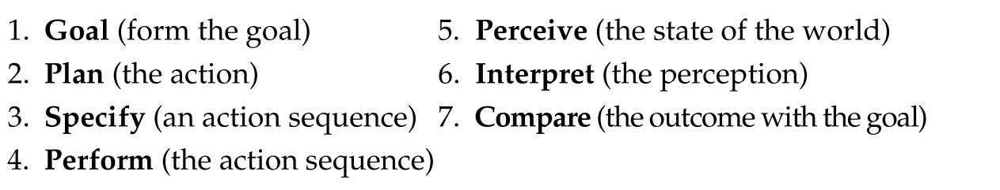

# Week 1 (Friday)
## What Is Human Computer Interaction?
Inter/Transdisiciplinary study of the design and use of interactive technologies.
: Computer Science, Ergonomics, Cognitive Psychology, Graphical and Industrial Design, Sociology/Antrophology, Education, Software Engineering, Organizational Psychology.
Aims to support the development of more usable and humany acceptable systems.
- Interaction
- Task based
- User cognition
- The nature and the process of design
- The nature of use
- Communication
- Organizational/social impact (e.g. Computational social science)

## HCI and SW Engineering
> 80% of total maintenance costs are related to user's problems with thte system and not technical bugs. 
> : 64% are usability problems.
>
> IN developing interactive software, most ___software engineering methologies___ do not propose mechanisms for:
> - Explicitly and empirically identifying annd specifying ___user needs___ and ___usability requirements___
> - Testing and validating requirements with end-users ___before, during and after___ the development.
> - So, the developed systems are generally meet all ___functional___ requirements, and yet are ___difficult to use___ with effectiveness, efficicency and satisfaction.

## Usability Of Interactive Systems: Ben Shneiderman. Reading-4
> Shneiderman is called as the father of HCI.
>
> ___Interdisciplinary___ design science of human-computer interaction by applying the methods of experimantal psychology to the powerful tools of computer science.
>
> Go beyong vague notions of "user friendliness", "intuitive"
> : Study evidence-based guidelines.
>
> Interface almost disappears, enabling users to concentrate on their work, exportaion, or pleasure.
>
> They are "in the flow"
>
> Usability Measures
> 1. Time to learn
> 2. Speed of performance
> 3. Rate of error 
> ...
>
> 

## Week 2 (Friday)
> Technical Design X User Experience Design

## Four Principles Of An HCI System 
> 1. User
> 2. Tool
> 3. Task/Goal
> 4. In the middle of all three, In Context

## Norman's 7 Principles Of Good Design
> **`Discoverability: `** State and action alternatives should be visible
> 
> **`A good conceptual model: `** with a consistent system image
> 
> **`Good mappings: `** for the relationship between stages
>
> **`Feedback: `** Continious
>
> **`Affordances: `** Possible interactions between peoplea nd the environment, Low / High
>
> **`Signifiers: `** What actions are possible and how
>
> **`Constraints: `** Physical, logical, semantic, and cultural

## Usability Of Interactive Systems: Ben Schneiderman: Ch-1
> Interface should disappear, enabling users to concentrate on their wokr, exploration, or pleasure.
>
> They are "in the flow"
>
> **`Usability Measures`**
> 1. Time to learn
> 2. Speed of performance
> 3. Rate of errors by users
> 4. Retention over time
> 5. Subjective satisfaction

# Week 4 (Tuesday)
## ... Usability Engineering

| Civil Engineer  | Usability Engineer   |
|-------------- | -------------- |
| Design, construction and maintenance | Design, Develop and maintenance |     
| Better living| Better Interaction |     
| Efficient, Effective, Satisfactory| Efficient, Effective, Satisfactory |     
| With Scientific Principles | With Scientific Principles |     

### Usability Engineering:
> Is an engineering *process*
>
> Is well established and applies equally to all user interface/interaction designs.
>
> Each project is different.
>
> But the activities needed to arrive at a good result are fairly constant.

## ... Usability
> Defining usability
> : Semantic, Feature, and Operational
>
> Usability engineering
> : Criteria
> : contextual variables

## ... Attribution Fallacy
> 